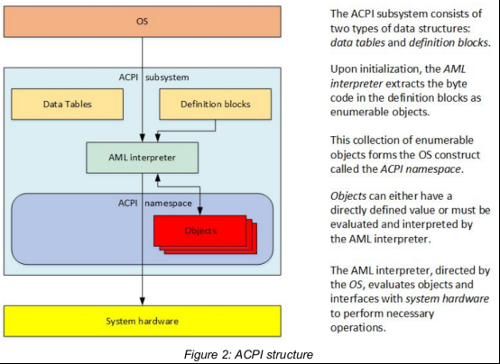
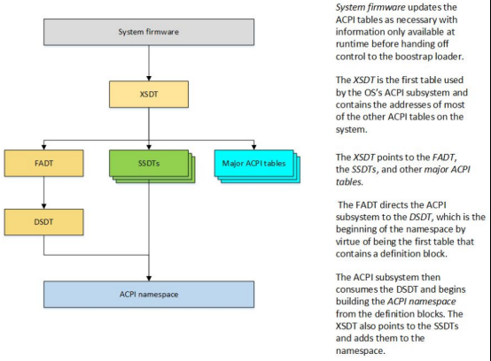
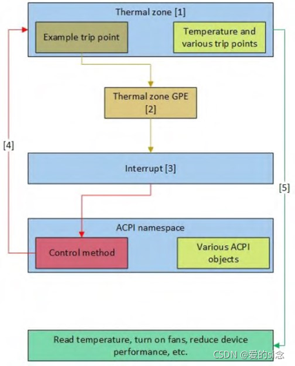

<!-- @import "[TOC]" {cmd="toc" depthFrom=1 depthTo=6 orderedList=false} -->

<!-- code_chunk_output -->

- [1. ACPI 历史](#1-acpi-历史)
- [2. 什么是ACPI?](#2-什么是acpi)
- [3. ACPI 初始化](#3-acpi-初始化)
- [4. 运行时模型](#4-运行时模型)
- [5. 热事件的例子](#5-热事件的例子)
- [6. 总结](#6-总结)
- [7. reference](#7-reference)

<!-- /code_chunk_output -->

本章提供了高级配置和电源接口 ACPI (Advanced Configuration and Power Interface)的概述. 为了更容易理解ACPI本节重点讨论关于ACPI的广泛和一般的陈述而不是讨论每个可能的异常或关于ACPI的细节. ACPI规范的其余部分提供了关于ACPI内部工作的更多细节建议使用ACPI的开发人员阅读.

# 1. ACPI 历史

ACPI的历史ACPI是在20世纪90年代中期由 `Intel`, `Microsoft*` `Toshiba*` `HP*` 和 `Phoenix*` 合作开发的.

在**开发 ACPI之前**操作系统主要使用**BIOS** (`Basic Input/Output System`)**接口**进行**电源管理**、**设备发现**和**配置**. 电源管理的方法是利用**操作系统调用系统BIOS**的能力来进行电源管理. BIOS还用于根据**探测输入/输出**(`I/O`)来**发现系统设备**和**加载驱动程序**并尝试将**正确的驱动程序**匹配到**正确的设备**(即插即用). 设备的位置也可以在BIOS中硬编码因为平台本身是不可枚举的. 这些解决方案在三个关键方面存在问题.
* 首先操作系统应用程序的行为可能会受到bios配置的电源管理设置的负面影响导致系统在演示期间或其他不方便的时间进入睡眠状态.
* 第二电源管理接口是每个系统的专有接口. 这要求开发人员了解如何为每个单独的系统配置电源管理.
* 最后各种设备的默认设置也可能相互冲突导致设备崩溃、行为不稳定或变得无法发现.

ACPI的开发就是为了解决这些问题和其他问题.

# 2. 什么是ACPI?

ACPI首先可以理解为一个**独立于体系结构**的**电源管理和配置框架**它在**主机OS**中形成一个**子系统**. 该框架建立**一个硬件寄存器集**来定义**电源状态**(休眠、hibernate、唤醒等). 硬件寄存器集可以容纳**专用硬件**和**通用硬件**上的**操作**.

标准ACPI框架和硬件寄存器集的主要目的是**启用电源管理和系统配置****无需操作系统来直接调用固件**.

ACPI作为**系统固件**(`BIOS`)和**操作系统**(OS)之间的接口层如图1和图2所示有一定的限制和规则.

Figure 1: ACPI overview

从根本上说ACPI定义了**两种数据结构**它们通过**ACPI子系统**在系统固件和操作系统之间共享: **数据表**和**定义块**.

这些数据结构是固件和操作系统之间的主要通信机制.
* 数据表存储**原始数据**并**由设备驱动程序使用**
* 定义块由解释程序**可执行的字节码**组成.

Figure 2: ACPI structure

**初始化**时**AML解释器**将**定义块**中的**字节代码**提取为**可枚举对象**. 这个**可枚举对象集合**形成了一个称为**ACPI名称空间**的操作系统结构. ACPI名称空间中的对象可以有一个**直接定义的值**也可以由AML解释器计算. 由操作系统指导(direct)的**AML解释器**对对象进行评估然后与系统硬件进行接口以执行必要的操作.

这个**定义块字节代码**是从**ACPI源语言**(`ASL`)代码编译而来的. ASL是用来定义ACPI对象和编写控制方法的语言. **ASL编译器**将ASL翻译成**ACPI机器语言**(AML)**字节码**. AML是ACPI AML解释器处理的语言如图3所示.

Figure 3: ASL and AML

ACPI Source Language (ASL)代码用于定义对象和控制方法. 然后**ASL编译器**将`ASL`转换为包含在ACPI定义块中的ACPI机器语言(`AML`)字节码. **定义块**由**标识表头**(identifying table header)和**字节码**(byte code)组成由**AML解释器执行**(AML interpreter).

AML解释器执行字节码并计算定义块中的对象以允许字节码执行循环构造、条件计算、访问已定义的地址空间以及应用程序所需的其他操作. AML解释器对**已定义的地址空间**具有读/写访问权包括系统内存、I/O、PCI配置等等. 它通过定义称为**对象的入口点**来访问这些地址空间. 对象可以具有直接定义的值也可以由AML解释器计算和解释.

这个**可枚举对象集合**是一个OS结构称为**ACPI名称空间**. 名称空间是**系统上ACPI设备的层次表示**. **系统总线**是这些**ACPI设备枚举的根**. 在**其他总线上可枚举的设备**(如PCI或USB设备)通常**不在名称空间中枚举**. 相反它们**有自己的总线来枚举设备**并**加载驱动程序**. 然而**所有可枚举的总线都有一种编码技术**允许**ACPI对设备的总线特定地址进行编码**这样就可以**在ACPI中找到它们**(这些设备)尽管**ACPI通常不为这些设备加载驱动程序**.

通常枚举具有`_HID`对象(**硬件标识对象**)的**设备**并**由ACPI加载其驱动程序**. 具有`_ADR`对象(**物理地址对象**)的设备通常**不由ACPI枚举**通常也**不由ACPI加载驱动程序**. `_ADR`设备通常可以在**不涉及ACPI**的情况下执行所有必要的功能但是在**设备驱动程序不能执行某个功能**的情况下或者如果驱动程序需要与系统固件通信**ACPI可以评估对象来执行所需的功能**.

作为一个例子**PCI不支持本地热插拔**. 然而**PCI可以使用ACPI**来评估对象和定义方法这些方法允许**ACPI填充在PCI上执行热插拔所需的函数**.

ACPI的另一个方面是**运行时模型**它处理在**系统运行期间发生的任何ACPI中断事件**. ACPI将继续评估处理这些事件所需的对象. 这个基于中断的运行时模型将在下面的运行时模型一节中进行更详细的讨论.

# 3. ACPI 初始化

**了解ACPI工作原理的最佳方法是按时间顺序排列**.

当用户**启动系统**时**系统固件**就完成了**设置、初始化和自我测试**.

然后在将控制传递给**引导加载程序**之前**系统固件**使用在固件初始化期间获得的**信息**根据需要使用各种平台配置和电源接口数据**更新 ACPI表**. **扩展的根系统描述表**(`XSDT`)是 ACPI 子系统使用的第一个表它包含系统上**大多数其他ACPI表的地址**. XSDT指向**固定的 ACPI 描述表**(`FADT`)以及**操作系统在初始化期间**处理的**其他主要表**. 在**操作系统初始化之后**, `FADT`将 ACPI 子系统定向到**差分系统描述表**(`DSDT`). DSDT 是名称空间的开始因为它是**包含定义块的第一个表**.

然后 **ACPI 子系统**处理 DSDT 并开始从 **ACPI 定义块**构建**名称空间**. XSDT 还指向**辅助系统描述表**(`SSDTs`)并将它们添加到名称空间.

**ACPI 表**向操作系统提供**关于系统硬件的原始数据**.

当**操作系统**从 **ACPI表**构建了**名称空间**后它开始**遍历命名空间**并为它在命名空间中遇到的所有 `_HID` 设备**加载设备驱动程序**.

Figure 4: ACPI initialization

在上面的 ACPI 初始化图中在将控制权移交给引导加载程序之前, **系统固件**根据需要**使用仅在运行时可用的信息**更新 ACPI 表. XSDT 是操作系统的ACPI子系统使用的第一个表它包含系统上大多数其他ACPI表的地址. XSDT指向FADT、ssdt和其他主要ACPI表. FADT将ACPI子系统定向到 DSDT, DSDT是名称空间的开始因为DSDT是包含定义块的第一个表. ACPI子系统然后使用 DSDT 并开始从定义块构建ACPI名称空间. XSDT还指向 ssdt并将它们添加到名称空间.

# 4. 运行时模型

在**系统启动并运行之后****ACPI**与**操作系统**一起处理**通过中断发生的任何 ACPI 事件**. 此中断以两种一般方式之一调用ACPI事件: **固定事件**和**通用目的事件(GPEs)**.

固定事件是在 ACPI 规范中**具有预定义含义的 ACPI 事件**. 这些固定事件包括按下电源按钮或 ACPI 计时器溢出等操作. 这些事件由**操作系统处理程序**直接处理.

GPEs 是 **ACPI 规范没有预定义的ACPI事件**. 这些事件通常通过评估控制方法来处理这些方法是名称空间中的对象可以访问系统硬件. 当ACPI子系统使用**AML解释器**评估控制方法时GPE对象根据操作系统的实现来处理事件. 通常这可能涉及向设备发出通知以**调用设备驱动程序**来执行某个函数.

下一节讨论运行时模型的一个例子

# 5. 热事件的例子

ACPI包含一个热模型允许系统主动控制系统温度(通过执行打开风扇等操作)或通过减少系统使用的电量(通过执行控制处理器等操作)被动控制系统温度. 我们可以使用图5所示的通用热事件示例来演示ACPI运行时模型是如何工作的.

ACPI热区包括读取当前系统温度和跳闸点的控制方法.

当操作系统最初在名称空间中找到一个热区域时它加载热区域驱动程序该驱动程序评估热区域以获得当前温度和跳点.

当系统组件的温度升高到足以触发跳闸点时就会出现一个热区GPE.

GPE导致中断. 当ACPI子系统接收到中断时它首先检查是否发生了任何固定的事件. 在本例中热区事件是一个GPE因此没有固定的事件发生.

ACPI子系统然后在命名空间中搜索与中断的GPE号匹配的控制方法. 一旦找到它ACPI子系统就会评估控制方法然后可能访问硬件和/或通知热区处理程序.

操作系统的热区域处理程序然后采取任何必要的操作来处理事件包括可能的访问硬件.

ACPI是一个非常健壮的接口实现. 热区跳点可以根据需要通知系统开启风扇、降低设备性能、读取温度、关闭系统或这些操作和其他操作的任何组合.

在整个系统中使用此运行时模型来管理在系统操作期间发生的所有ACPI事件.

# 6. 总结

ACPI可以被描述为概念和接口的框架这些概念和接口被实现来形成主机操作系统中的子系统. ACPI表、处理程序、解释器、名称空间、事件和中断模型共同构成ACPI的这个实现在主机操作系统中创建ACPI子系统. 从这个意义上说ACPI是系统硬件/固件与操作系统和操作系统应用程序之间的接口用于配置和电源管理. 这为各种操作系统提供了通过ACPI名称空间支持电源管理和配置的标准化方法.

ACPI名称空间是系统上所有ACPI设备的可枚举的层次表示用于查找和加载系统上ACPI设备的驱动程序. 通过评估对象和实时发送中断命名空间可以是动态的所有这些都不需要操作系统调用本机系统固件代码. 这使得设备制造商能够将他们自己的指令和事件编码到设备中. 它还通过实现标准化的电源管理接口减少了不兼容性和不稳定性.

# 7. reference

https://uefi.org/specs/ACPI/6.4/Frontmatter/Overview/Overview.html