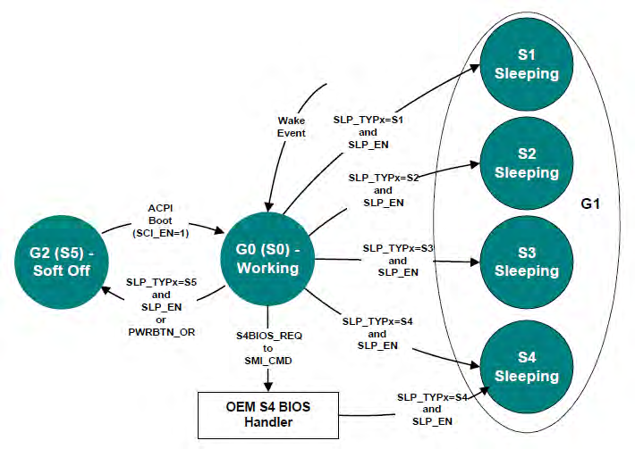

下图显示了**工作状态**、**休眠状态**和**软关闭状态**之间的转换.

SLP_EN

ACPI 定义了四种休眠状态的属性: S1、S2、S3 和 S4. (请注意, 从硬件的角度来看, S4 和 S5 非常相似. 与 ACPI 兼容的平台可以支持多种休眠状态. ACPI 指定将 **3 位二进制数**与每个**休眠状态相关联**(这些数字在 ACPI 的根命名空间中给定对象: (`\_S0`、`\_S1`、`\_S2`、`\_S3`、`\_S4` 和 `\_S5`).

进入系统休眠状态时, OSPM 将执行以下操作:

1. 选择平台和已启用的唤醒设备支持的最深休眠状态.

2. 执行 `_PTS` 控制方法(将预期**休眠状态的类型**传递给 **OEM AML 代码**)

3. 如果操作系统策略决定进入 S4 状态并选择使用 **S4BIOS** 机制, 并且平台支持 S4BIOS, OSPM 将通过将 `S4BIOS_REQ` 值写入 `SMI_CMD` 端口将控制权传递给平台运行时固件软件.

4. 如果不使用 S4BIOS 机制, OSPM 将从关联的休眠对象 (`\_S1`、`\_S2`、`\_S3`、`\_S4` 或 `\_S5`)获取 `SLP_TYPx` 值.

5. 用所选休眠对象中包含的值对 `SLP_TYPx` 字段进行编程.

> 兼容性 — `_GTS` 方法在 ACPI 5.0A 中已弃用. 对于早期版本, 执行 `_GTS` 控制方法, 传递一个参数, 指示要进入的休眠状态(1、2、3 或 4 表示 S1、S2、S3 和 S4).

6. 如果进入 S1、S2 或 S3, 请刷新处理器缓存.

7. 如果不进入 S4BIOS, 设置 `SLP_EN` 位以启动**休眠串行**. (这实际上发生在对 `PM1_CNT` 寄存器中的 `SLP_TYPx` 字段进行编程的**同一写入操作上**). 如果进入 S4BIOS, 请编写 `S4BIOS_REQ` 值到 SMI_CMD 端口.

8. 如果缺少硬件, 则使用 HWreduce ACPI 休眠类型值(从上述步骤 4 中的休眠状态对象检索)并将 `SLP_EN` 位设置为 1, 对 `SLEEP_CONTROL_REG FADT` 字段指示的寄存器进行编程.

9. 在包含没有硬件机制的处理器的系统上, 处理器处于低功耗状态, 执行适当的本机指令, 使处理器处于低功耗状态.

`_PTS` 控制方法为平台**运行时固件**提供了一种**执行某些内务处理**的机制, 比如在进入系统休眠状态之前, 将休眠类型值写入嵌入式控制器. 控制方法执行发生在**进入休眠状态**的 "**之前**", 并且**不是**与写入 `PM1_CNT` 寄存器同步的事件. 执行可以在系统实际进入休眠状态之前几秒钟进行. 因此, 不会通过执行 `_PTS` 控制方法进行硬件电源平面排序.

> 兼容性 — `_BFS` 方法在 ACPI 5.0A 中已弃用. 在早期版本中, 唤醒时, 将执行 `_BFS` 控制方法. 然后, OSPM 执行 `_WAK` 控制方法. 此控制方法执行特定于 OEM 的 ASL/AML 代码, 该代码可以搜索在休眠状态期间添加或删除的任何设备.
> 这是多执行的一个 函数

# S1 休眠态

S1 状态定义为低唤醒延迟休眠状态. 在此状态下, 将保留除 CPU 缓存之外的所有系统上下文. 在进入 S1 之前, OSPM 将刷新系统缓存. 如果平台支持 WBINVD 指令(如 FADT 中的 WBINVD 和 WBINVD_FLUSH 标志所示), OSPM 将执行 WBINVD 指令. 硬件负责维护所有其他系统上下文, 其中包括 CPU、内存和芯片组的上下文.

以下是 S1 休眠状态实现替代方案的示例.

##

# S2 休眠态

# S3 休眠态

S3 状态定义为**低唤醒延迟**(low wake-latency)**休眠状态**(sleep state). 从软件的角度来看, 此状态在功能上与 S2 状态相同. 操作差异在于, 某些可能处于 S2 状态的电源资源可能不适用于 S3 状态. 因此, 当系统处于 S3 状态时, 某些设备可能处于比系统处于 S2 状态时更低的功耗状态. 同样, 某些设备唤醒事件可以在 S2 中起作用, 但不能在 S3 中起作用.

下面是 S3 休眠状态实现的示例.

## 示例:S3 休眠态实现

当 `SLP_TYPx` 寄存器编程为 S3 值(在 `\_S3` 对象中找到)并设置 `SLP_EN` 位时, 或者将 S3 的硬件降低 ACPI 休眠类型值和 `SLP_EN` 位写入休眠控制寄存器时, 硬件将通过执行以下操作实现 S3 休眠状态转换:

1. 将**内存**置于**低功耗自动刷新**(`low-power auto-refresh`)或**自刷新状态**(`self-refresh state`).
2. 维护内存的设备将自己与系统中的其他设备隔离.
3. 断开系统电源. 此时, **只有支持内存的设备通电**(可能部分通电). 系统中**运行的唯一时钟**是 **RTC 时钟**.

从 S3 休眠状态开始, 唤醒事件会重新为**系统供电**并**重置大多数设备**(具体取决于实施). 执行控制从 CPU 的 **boot vector** 开始. **平台启动固件**(是 BIOS, 不是 boot loader)需要:

1. 对 CPU 的初始引导配置(如 MSR 和 MTRR 寄存器)进行编程.
2. 将缓存控制器初始化为其初始启动大小和配置.
3. 使内存控制器能够接受内存访问.
4. 跳转到 waking vector.

请注意, 如果缓存控制器的配置在系统休眠时丢失, 则需要平台**引导固件**将其重新配置为休眠前状态或初始引导状态配置. 平台启动固件可以将缓存控制器的配置存储到保留的内存空间中, 然后在唤醒后可以在其中检索值.  OSPM 将在每个会话(休眠之前)调用一次 `_PTS` 方法.

**平台启动固件**还负责恢复**内存控制器**(`memory controller`)的配置. 如果此**配置数据**在 S3 休眠状态期间**被破坏**, 则**平台启动固件**需要将**休眠前状态**或**初始启动状态**配置存储在**非易失性存储区**(与 RTC CMOS RAM 一样)以使其能够恢复清醒过程中的值.

当 OSPM **重新枚举**退出 S3 休眠状态的**总线**时, 它会发现任何**已插入或移除的设备**, 并在设备打开时对其进行配置.

# S4 休眠态

S4 休眠状态是 ACPI 支持的功耗最低、唤醒延迟最长的休眠状态。为了将功耗降至最低，假设硬件平台已关闭所有设备的电源。由于这是休眠状态，因此将维护平台上下文。根据转换到 S4 休眠状态的方式，维护系统上下文的责任会发生变化。S4 支持两种入口机制：操作系统启动和平台运行时固件启动。OSPM 启动的机制类似于进入 S1-S3 休眠状态; OSPM 驱动进程写入 SLP_TYPx 字段并设置 SLP_EN 位，或将 S3 的硬件减少 ACPI 睡眠类型值和 SLP_EN 位写入睡眠控制寄存器。平台运行时固件启动的机制是通过 OSPM 通过将 S4BIOS_REQ 值写入 SMI_CMD 端口将控制权转移到平台运行时固件而发生的，并且在硬件减少的 ACPI 平台上不受支持.

在 OSPM 启动的 S4 休眠状态下，OSPM 负责保存所有系统上下文。在进入 S4 状态之前，OSPM 将保存系统地址映射接口中指定的所有内存的上下文。

唤醒后，OSPM 应恢复系统上下文。当 OSPM 重新枚举从 S4 休眠状态出来的总线时，它将发现任何进出的设备，并在设备打开时对其进行配置。

在平台运行时固件启动的 S4 休眠状态中，OSPM 负责与 S3 休眠状态中所述相同的系统上下文（平台运行时固件还原内存和某些芯片组上下文）。S4BIOS 转换将控制权转移到平台运行时固件，允许它将上下文保存到非易失性内存（如磁盘分区）。

## 操作系统启动的 S4 过渡

> Operating System-Initiated S4 Transition

如果 OSPM 支持 **OSPM 启动的 S4 转换**(`OSPM-initiated S4 transition`)，则**不会**生成**平台固件启动的 S4 转换**(`platform firmware-initiated S4 transition`)。支持**平台固件启动的 S4 转换**的平台**也支持** OSPM 启动的 S4 转换。

# S5 软关闭态

# 从工作状态转换成休眠状态

在系统从工作状态转换到休眠状态时, 将发生以下情况:

一. OSPM 决定(通过策略方案)将系统置于休眠状态. 可以通过用户指定，也可以通过程序指定。比如用户要进入待机，而选择待机键。

二. OSPM 调用 ACPI Drvier 去执行ACPI 的 `_TTS` 方法来**指示**系统将转换到的**最深的** sleep 状态(以数字形式, 1,  2, 3 或 4 表示 S1、S2、S3 和 S4).

三. OSPM 会检查所有启用了**能够唤醒系统**的**设备**, 确定系统**可以进**入的**最深休眠状态**, 从而支持唤醒功能. 检查每个设备下的 `_PRW` 命名对象, 以及它指向的电源资源对象.

> 为了确保系统最起码能被一个设备真正唤醒

四. OSPM 将所有设备驱动置于各自的 Dx 状态. 如果设备支持唤醒功能, 它将进入**与唤醒功能关联的 Dx 状态**. 如果不支持, 它将进入 D3 状态.

五. OSPM 执行 `_PTS` **控制方法**, 传递一个参数, 该参数指示所需的休眠状态(1、2、3、或 4 代表 S1、S2、S3 和 S4).

六. OSPM 将所有其他处理器的上下文(**本地处理器除外**)保存到内存中.

七. OSPM 将**唤醒向量**(`waking vector`)写入内存中的 FACS 表中.

> 注意: 兼容性 — `_GTS` 方法在 ACPI 5.0A 中已弃用. 对于早期版本, OSPM 执行 _GTS **控制方法**, 传递一个参数, 指示要进入的休眠状态(1、2、3 或 4 表示 S1、S2、S3 和 S4).
> 在早期版本, 需要多执行这一步

八. 如果**不是硬件降低**的 ACPI 平台, OSPM 将**清除** `PM1a_STS` 和 `PM1b_STS` 寄存器中的 `WAK_STS`. 在**硬件降低**的 ACPI 平台上, OSPM 清除休眠状态寄存器中的 `WAK_STS` 位.

九. OSPM 将**本地处理器的上下文**保存到内存中.

十. OSPM 刷新缓存(仅当进入 S1、S2 或 S3 时).

十一. OSPM 设置 **GPE 使能寄存器**或**启用可唤醒中断**, 以确保所有可以 wake 的信号已经设定好.

十二. 如果是进入 S4 状态，可以有 S4BIOS 机制和 System-Initial S4 机制. 如果使用 S4BIOS 机制进入 S4 状态, OSPM 将 `S4BIOS_REQ` 值(来自 FADT)写入 `SMI_CMD` 端口. 这会使进入 SMI, 从而将控制权传递给平台运行时**固件**(`BIOS`), 然后系统进入 S4BIOS 状态.

十三. 如果**不进入** S4BIOS 状态, 也**不是硬件减少**的 ACPI 平台, 则 OSPM 将 `SLP_TYPa`(来自关联的休眠对象) 的 `SLP_ENa bit` **置位**, 再将其值写入 `PM1a_CNT` 寄存器.

> 虚拟化情况下, 这里会触发 VM-exit(**MMIO** 或者 **port I/O**)

十四. OSPM 将 `SLP_TYPb` 中 `SLP_EN bit` **置位**后 写入 `PM1b_CNT` 寄存器, 或将 HW-reduced ACPI **休眠类型值**和 `SLP_EN` 位写入**休眠控制寄存器**.

> OVMF 也有一个写 PM1_CNT 的动作, 需要搞清楚之间的关系

十五. 在包含没有硬件机制将处理器置于低功耗状态的处理器的系统上, OSPM 会执行适当的本机指令以将处理器置于低功耗状态.

十六. **OSPM** 在 `WAK_STS` 位上循环, 无论是在 `PM1a_CNT` 和 `PM1b_CNT` 寄存器中, 还是在 `SLEEP_STATUS_REG` 中, 如果是硬件降低的 ACPI 平台.

> 也就是检测是否有唤醒事件发生。如果有就可以唤醒系统.
> 虚拟化情况下, 需要置位

十七. 系统进入指定的休眠状态.

> 注意: 这是在上述步骤 14 或 15 之后完成的.

# 从工作状态转换成软关闭状态

在系统从工作状态转换到软关闭状态时, 将发生以下情况:

一. OSPM 执行_PTS 控制方法, 传递参数 5.

二. OSPM 准备其组件以关闭(刷新磁盘缓存).

> 注意: 兼容性 — _GTS 方法在 ACPI 5.0A 中已弃用. 对于早期版本, OSPM 执行_GTS 控制方法, 传递参数 5.

三. 如果不是硬件减少的 ACPI 平台, OSPM 将, 并将 `SLP_ENa` 位置位后的 `SLP_TYPa`(来自 `\_S5` 对象)写入 `PM1a_CNT` 寄存器.

四. OSPM 将 `SLP_ENb` 位置位后的 `SLP_TYPb`(来自 `\_S5` 对象)写入 `PM1b_CNT` 寄存器, 或将 S5 的硬件降低 ACPI 睡眠类型值和 SLP_EN 位写入睡眠控制寄存器.

五. 系统进入软关闭状态.

