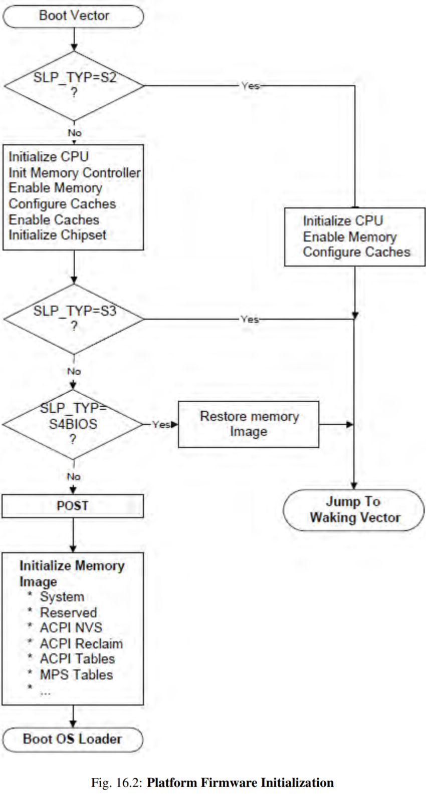
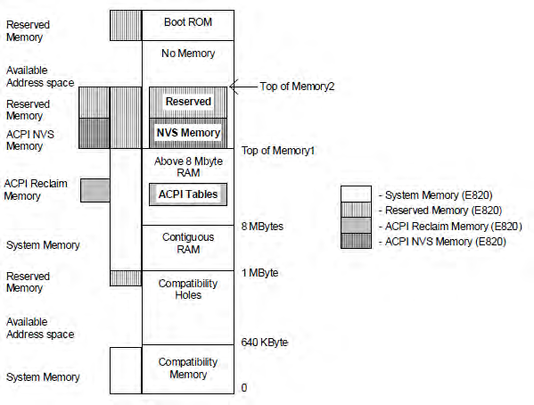
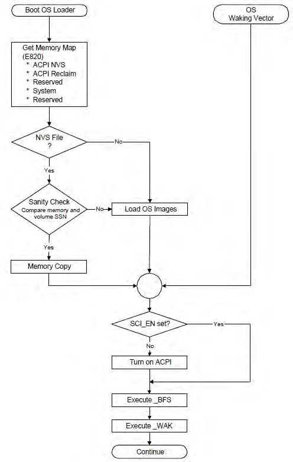

本节介绍 ACPI 平台的**初始化顺序**. 

从 `S2`、`S3` 或 `S4` **休眠状态**（由 ACPI 休眠状态定义）**唤醒**或在 **reset** 后, CPU 将从其 **boot vector** 开始执行. 此时, 初始化软件有很多选项, 具体取决于硬件平台支持的内容. 本节简要介绍应针对这些不同选项执行的操作. 下图说明了启动软件的流程. 

# 从 boot vector 开始

> The processor will start executing at its power-on reset vector when waking from an S2, S3, or S4 sleeping state, during a power-on sequence, or as a result of a hard or soft reset

当 1. 从 S2、S3 或 S4 休眠状态唤醒, 或者 2. 在上电串行顺序期间(power-on sequence) 或者 3. 作为一个 hard 或 soft reset 的结果, 处理器将在其开机复位向量(power-on reset vector)处开始执行.

> 这里的 power-on reset vector 其实就是 boot vector?

## 完整硬件初始化

> Boot Vector -> boot loader

作为 1. **上电串行顺序**(power-on sequence), 或者 2. **一个 hard 或者 soft reset**, 或者 3. 从 **S4** 休眠状态唤醒 的结果, 处理器从**开机复位向量**(power-on reset vector)开始执行时, **平台固件**执行**完整的硬件初始化**; 将**系统**置于**引导配置**中. 

然后, 固件将控制权传递给**操作系统引导加载进程**(`boot loader`). 

## 必要硬件初始化

> S2/S3: Boot Vector -> Waking Vector

作为从 S2 或 S3 睡眠状态唤醒 的结果, 处理器从**开机复位向量**(power-on reset vector)开始执行时, 平台固件**仅执行**必要的硬件初始化, 从而恢复系统到要么是**初始操作系统启动之前**(initial operating system boot)**平台所处的状态**, 要么是**睡眠前配置的状态**(pre-sleep configuration state). 

在多处理器系统中, **非引导处理器**应被置于与**初始操作系统启动之前**(initial operating system boot)**相同**的状态. 

然后, **平台固件**通过跳转到 FACS(见 Firmware ACPI Control Structure 部分)中的 `Firmware_Waking_Vector` 或 `X_Firmware_Waking_Vector` 将控制权交给 OSPM. 

在 S2 或 S3 睡眠状态期间, 操作系统**内存内容**的内容**不得更改**. 

## 固件初始化

> legacy BIOS 或者 UEFI BIOS

首先, **平台运行时固件**通过**检查**在休眠会话之间保留的 `SLP_TYP` 寄存器值来确定这是从 S2 还是 S3 唤醒. 如果这是 S2 或 S3 唤醒, 则**平台运行时固件**会在跳转到 waking vector **之前**还原系统的**最小上下文**. 这包括：

* **CPU 配置**. 平台运行时固件还原每个 CPU 的睡眠前配置或初始启动配置（MSR、MTRR、固件更新、SMBase 等）. 必须禁用中断（对于 IA-32 处理器, 由 CLI 指令禁用）. 

* **内存控制器配置**. 配置会在休眠状态期间丢失, 平台运行时固件将内存控制器初始化为其睡眠前配置或初始启动配置. 

* **缓存配置**. 如果配置在休眠状态期间丢失, 平台运行时固件会将缓存控制器初始化为其睡眠前配置或初始引导配置. 

* **功能性设备**配置. 平台运行时固件不需要配置/恢复功能设备的上下文, 例如网络接口（即使它物理包含在芯片组中）或中断控制器. OSPM 负责恢复这些设备的所有上下文. 硬件和平台运行时固件的唯一要求是确保在 control 被 pass 给 OS 时, 中断不会被设备 assert.

* **ACPI 寄存器**. 在 non-HW-reduced 的 ACPI 平台上, `SCI_EN` 必须被置位, 并且所有的事件 状态/启用位（`PM1x_STS`、PM1x_EN、GPEx_STS 和 GPEx_EN）不得通过平台运行时固件进行更改. 

**平台固件初始化**:

> 注意: 平台运行时固件可以将 CPU、内存控制器和高速缓存控制器重新配置为**睡眠前配置**或者**初始启动配置**. OSPM 必须同时满足这两种配置. 

从 **S4BIOS** 休眠状态唤醒时, 平台启动固件**初始化最少数量的设备**, 例如 CPU、内存、缓存、芯片组和启动设备. 初始化这些设备后, 平台启动固件从非易失性存储器（如硬盘）恢复内存上下文, 并跳转到 **waking vector**. 

如前所述, 从 S4 状态唤醒与冷启动(cold boot)相同：平台启动固件运行开机自检(POST), 然后初始化内存以包含 ACPI 系统描述符表. 完成此操作后, 它可以调用 OSPM loader, 并将控制权传递给 OSPM. 

从 S4（S4OS 或 S4BIOS）唤醒时, 平台启动固件可以选择在将控制权传递给 OSPM 之前设置 `SCI_EN` 位. 在这种情况下, 必须禁用中断（对于 IA-32 处理器, 禁用 CLI 指令）直到将控制权传递给 OSPM, 并且 chipset 芯片组必须被配置为 ACPI 模式. 

# 将系统置于 ACPI 模式

当平台从 code boot(机械关闭或从 S4 或 S5 状态)初始化时, 硬件平台可能会在 legacy configuration 中配置, 如果不是在 HW-reduced ACPI 平台. 从这些状态开始, 平台启动固件软件会初始化计算机, 就像初始化一个 legacy 操作系统一样. 当控制权传递给操作系统时, OSPM 将检查 SCI_EN 位, 如果**未设置**, 则通过首先查找 ACPI 表, 然后生成对 SMI_CMD 端口的 `ACPI_ENABLE` 值的写入来**启用 ACPI 模式**（如 FADT 中所述）. 硬件平台将设置 `SCI_EN` 位, 以向 OSPM 指示硬件平台现在已针对 ACPI 配置. 

注意: 

当平台从 S1、S2 或 S3 状态以及 hw-reduced 的 ACPI 平台上的 S4 和 S5 唤醒时, OSPM **假定**硬件已处于 **ACPI 模式**, 并且**不会**向 `SMI_CMD` 端口发出 `ACPI_ENABLE` 命令

# 平台启动固件初始化内存

在**开机复位**(power-on reset)、**退出 S4 休眠状态**或**退出 S5 软关闭状态**期间, **平台启动固件**需要**初始化内存**. 

本节说明平台启动固件应**如何配置内存**以供许多功能使用, 包括:

* ACPI 表

* 平台固件内存想要在 S4 休眠会话中保存且应缓存. 

* 平台固件内存不需要保存且应缓存

例如, 平台**缓存控制器**(cache controller)的配置需要**一个内存区域**来**存储配置数据**. 在唤醒串行期间, **平台启动固件**将重新启用**内存控制器**(memory controller), 然后可以使用其配置数据重新配置**缓存控制器**(cache controller). 为了支持这三个项目, 基于 IA-PC 的系统包含返回以下内存范围类型的**系统地址映射接口**(`System Address Map Interfaces`)：

* ACPI Reclaim Memory. **ACPI 回收内存**. 由**包含 ACPI 表**的**平台启动固件**标识的**内存**. 此内存可以是 **8 MB 以上**的任何位置, 并**包含 ACPI 表**. OSPM 使用 ACPI 表后, 可以**自由回收此内存**以供系统软件使用（应用进程空间）. 

* ACPI Non-Volatile-Sleeping Memory(NVS). **ACPI 非易失性休眠内存**. 由 **BIOS 标识**为由**平台启动固件保留**供其使用的内存. 需要 OSPM 将此内存标记为**可缓存**, 并在进入 S4 状态之前保存和还原其映像. 除非按照**控制方法**(`control method`)的指示, 否则**不允许** OSPM **使用**此物理内存. **OSPM** 会在**进入休眠状态前**一段时间调用 `_PTS` 控制方法, 以允许平台的 **AML** 代码在进入休眠状态之前**更新此内存映像**. 系统从 S4 状态唤醒后, OSPM 将恢复此内存区域并调用 `_WAK` 控制方法, 使平台启动固件能够回收其内存映像. 

注意: 在 S4 休眠前后, 从系统地址映射报告接口返回的**内存信息**应相同. 

当**系统首次启动**时, **OSPM** 将调用基于 IA-PC 的 **legacy 系统**上的 **E820** 接口或**启用 UEFI** 的系统上的 `GetMemoryMap()` 接口以**获取系统内存映射**(第 15 章获取更多信息）. 例如, 以下内存映射表示典型的基于 IA-PC 的传统平台的物理内存映射

下面列出了不同内存区域的名称和属性：

* 0 - 640 KB. 兼容性内存. 8086 系统的应用可执行内存. 

* 640 KB - 1 MB. 兼容孔 holes. 内存空间中的孔, 允许将访问定向到 PC **兼容帧缓冲区**（PC-compatible frame buffer, A0000h-BFFFFh）、适配器 ROM 空间（adapter ROM space, C0000h-DFFFFh） 和系统平台固件空间（system platform firmware space, E0000h-FFFFFh）. 

......

**平台启动固件**应确定不同内存结构所属的位置, 然后**配置 E820 handler** 以**返回适当的值**. 

在当前示例中, 

启动后配置的内存:

此外, 从 Top of Memory1 到 Top of Memory2, 平台启动固件已留出一些内存供自己使用, 并将 ACPI NVS 内存和保留内存标记为保留. legacy 操作系统将丢弃 ACPI NVS 内存, 并将其正确标记为保留内存（从而防止将此内存范围分配给任何加载项设备）. 

# OS 加载

此时, **平台启动固件**已通过使用 **OSPM boot loader**（从 S4/S5 或启动条件唤醒的结果）或 **OSPM waking vector**（从 S2 或 S3 状态唤醒的结果）将**控制权**传递给 **OSPM**. 

对于 **Boot OS Loader** 路径. OSPM 将通过系统地址映射接口章节中描述的机制之一**获取系统地址映射**. 如果 OSPM 从 S4 状态启动, 它将使用 FACS 表（由平台启动固件构建）中的硬件签名检查 **NVS 映像文件**的硬件签名, 以确定自进入休眠状态以来它是否已更改（指示平台基本硬件配置已更改）在当前睡眠状态下）. 如果签名已更改, OSPM 将不会还原系统上下文, 并且可以**从头开始启动**（从 S4 状态）. 接下来, 对于 S4 唤醒, OSPM 将检查 NVS 文件以查看它是否有效. 如果**有效**, 则 OSPM 会将 NVS 映像加载到系统内存中. 

接下来, 如果不是硬件降低的 ACPI 平台, OSPM 将检查 `SCI_EN` 位, 如果未设置, 则将 `ACPI_ENABLE` 值写入 `SMI_CMD` 寄存器以切换系统进入 ACPI 模式, 然后从 NVS 文件重新加载内存映像. 

如果 NVS image 文件不存在, 则 OSPM loader 将**从头开始**加载 OSPM. 

此时, OSPM 将生成一个 `_WAK` 调用, 向平台运行时固件指示其 ACPI NVS 内存映像已成功且完全更新. 

# 退出 ACPI 模式

对于不在 ACPI 模式下启动的计算机, ACPI 提供了一种机制, 使操作系统能够禁用 ACPI. 发生以下情况：

OS 初始化:

