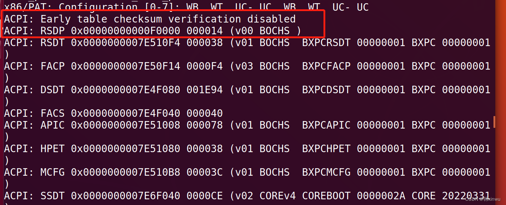

acpi(Advanced Configuration and Power Interface)是一个电源管理以及硬件设备记录, 是在系统启动阶段由 BIOS/UEFI 收集系统各方面信息并创建的


acpi 的规范和结构大概是这样的:


尽管 ACPI 访问了软、硬件并且阐述了它们必须如何工作, 但是 ACPI 既不是一个软件规范, 也不是一个硬件规范, 而是一个由软、硬件元素组成的接口规范.

关于上述这幅图, acpi规范是这么定义的:

ACPI包含三个运行组件.

* **ACPI 系统描述表** —— 描述**硬件的接口**. 表的格式限制了在表中可以创建的内容(例如, 一些控制内嵌在固定寄存器块中, 而此表指定了寄存器块所在的地址).

然而, **大多数系统描述表**允许按照任何方式来**创建硬件**并且可以描述**硬件工作时**所需的任意**操作序列**. 包含**定义块**的 **ACPI 表**可以使用**伪代码类型的语句**. **OS** 负责对这些代码进行解释和执行. 也就是说, **OSPM** 包含和使用了一个**解释器**, 它执行采用**伪代码**语言编码并保存**在 ACPI 表中**的程序. 被称为 **AML**(`ACPI Machine Language`).

* **ACPI 寄存器** —— **硬件接口**中**受限制的部分**, 通过 **ACPI 系统描述表**进行描述(至少描述 ACPI 寄存器的**位置**).

* **ACPI 系统固件** —— **此代码启动机器**(与遗留 BIOS 所实现的功能相同)以及实现**睡眠**、**唤醒**和**重启**等操作所需的接口. 与遗留 BIOS 相比, 它很少被调用. ACPI 系统固件也提供了 **ACPI 系统描述表**.

所以 ACPI 系统描述表很重要, 那它有些什么表然后怎么去访问这些表以及表的目录结构是什么样的

有哪些表:

* Generic Address Structure (GAS)
* Root System Description Pointer (RSDP)
* System Description Table Header
* Root System Description Table (RSDT)
* Extended System Description Table (XSDT)
* Fixed ACPI Description Table (FADT)
* Firmware ACPI Control Structure (FACS)
* Differentiated System Description Table (DSDT)
* Secondary System Description Table (SSDT)
* Multiple APIC Description Table (MADT)
* GIC CPU Interface (GICC) Structure
* Smart Battery Table (SBST)
* Extended System Description Table (XSDT)
* Embedded Controller Boot Resources Table (ECDT)
* System Locality Information Table (SLIT)
* System Resource Affinity Table (SRAT)
* Corrected Platform Error Polling Table (CPEP)
* Maximum System Characteristics Table (MSCT)
* ACPI RAS Feature Table (RASF)
* Memory Power State Table (MPST)
* Platform Memory Topology Table (PMTT)
* Boot Graphics Resource Table (BGRT)
* Firmware Performance Data Table (FPDT)
* Generic Timer Description Table (GTDT)
* NVDIMM Firmware Interface Table (NFIT)
* Heterogeneous Memory Attribute Table (HMAT)
* Platform Debug Trigger Table (PDTT)
* Processor Properties Topology Table (PPTT)

在最新的 ACPI 规范中, 一共可以看到这么多表, 学习了一下常见的表: RSDP、RSDT、XSDT、FACS、FADT(FACP)、DSDT、SSDT

首先是 RSDT 和 XSDT, 

RSDT 表全称 Root System Description Table, 它存放了许多的指针, **指向其它的描述系统信息的表**. RSDT 的结构如下:

```cpp
typedef struct {
 EFI_ACPI_DESCRIPTION_HEADER Header;
 UINT32                      Entry;
} RSDT_TABLE;
```

它实际上是一个可变数组, 后面可以接很多的表项. 而该结构的前面部分又被定义为 `EFI_ACPI_DESCRIPTION_HEADER`:

```cpp
typedef struct {
  UINT32  Signature;
  UINT32  Length;
  UINT8   Revision;
  UINT8   Checksum;
  UINT8   OemId[6];
  UINT64  OemTableId;
  UINT32  OemRevision;
  UINT32  CreatorId;
  UINT32  CreatorRevision;
} EFI_ACPI_DESCRIPTION_HEADER;
```

XSDT 表全称 Extended Root System Description Table, 它的作用于 RSDT 一样, 区别在于两者包含的指针地址一个是 32 位的, 一个是 64 位的. XSDT 中包含的描述表头部物理地址可以大于 32 位, XSDT 表结构如下:

```cpp
typedef struct {
 EFI_ACPI_DESCRIPTION_HEADER Header;
 UINT64                      Entry;
} XSDT_TABLE;
```

XSDT(RSDT)指向的第一张表都是FADT, Fixed ACPI Description Table. 这个表里面包含了OS需要知道的所有ACPI硬件相关寄存器(ACPI Hardware Register Blocks也就是GPx_BLK等), 还包含DSDT, Differentiated System Description Table, 该表包含大量的硬件信息. SSDT是DSDT的附加部分. SSDT是DSDT的附加部分, 二级表可以不断增加. 

而FACS在可读、可写内存中的一个数据结构. BIOS使用此结构来实现固件和OS之间的握手. 

FACS通过FADT传递给ACPI兼容OS;

最后是RSDP, Root System Description Pointer. 它是一个结构体, 其结构如下:

```cpp
typedef struct {
  UINT64  Signature;
  UINT8   Checksum;
  UINT8   OemId[6];
  UINT8   Revision;
  UINT32  RsdtAddress;
  UINT32  Length;
  UINT64  XsdtAddress;
  UINT8   ExtendedChecksum;
  UINT8   Reserved[3];
} EFI_ACPI_6_1_ROOT_SYSTEM_DESCRIPTION_POINTER;
```

其中提供了两个主要的物理地址, 一个是 RSDT 表的, 另一个是 XSDT 表的. os 系统怎么找到 acpi 表呢, 就是取决于 rsdp 这个指针, 而刚好这个指针可以通过 efi system table 进行调用. 

最后, 一个较为完整的 OS 访问 acpi 的图如下:


在虚拟机里面进一步得到了确认.



