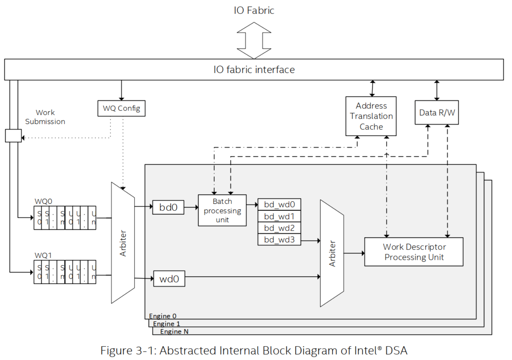

# 概述

英特尔® DSA 是一款高性能**数据复制和转换加速器**, 将**集成**到未来的**英特尔®处理器**中, 旨在优化**高性能存储**、**网络**、**持久内存**和各种数据处理应用常见的**流数据移动和转换操作**.

英特尔® **DSA** 取代了英特尔® **QuickData** 技术, 后者是英特尔® **I/O 加速技术**的一部分. 目标是为**数据移动和转换操作**提供更高的整体系统性能, 同时释放 CPU 周期的资源以用于更高级别的功能.

## 数据移动和内存转换

英特尔® DSA 支持高性能**数据移动**功能, 使其能够往返于**易失性内存**、**持久内存**、**内存映射 I/O**, 并通过**非透明桥接**(NTB)**设备**与集群中**另一个节点**上的**远程易失性**和**持久内存**之间来回移动. **枚举**和**配置**是通过与操作系统 (OS) 兼容的 **PCI Express 编程接口**完成的, 并且可以通过**设备驱动程序**进行**控制**.

除了基本的数据移动操作外, 英特尔® DSA 还支持**内存转换**. 例如：

* **数据移动**: 生成和测试 CRC 校验和或数据完整性字段 (DIF) 以支持存储和网络应用程序.
* **内存转换**: 内存比较和增量生成/合并, 以支持 **VM 迁移**、VM 快速检查指向和软件托管内存重复数据删除用法.

## 物理部件

**每个 SoC** 可以支持**任意数量**的英特尔® **DSA 设备实例**. 多插槽服务器平台可能支持**多个此类 SoC**.

从软件的角度来看, **每个实例**都公开为 **PCI-Express Root Complex 集成端点**.

每个实例都在 **DMA 重新映射硬件单元** [也称为输入-输出内存管理单元 (**IOMMU**)] 的**范围内**. 根据 SoC 设计, 不同的实例可以位于相同或不同的 DMA 重新映射硬件单元后面.

## 多种服务

英特尔® DSA 支持各种 **PCI-SIG** 定义的服务, 以提供高度可扩展的配置, 包括：

* 地址转换服务
* 进程地址空间 ID (PASID)
* 页面请求服务
* 消息信令中断扩展 (MSI-X)
* 高级错误报告

上述功能使英特尔® DSA 能够支持**共享虚拟内存**(SVM) 操作, 允许**设备**直接在应用程序的**虚拟地址空间中运行**, 而**无需固定内存**.

> 即设备直接使用 CPU 地址(virtual address)

英特尔® DSA 还支持英特尔®**可扩展 I/O 虚拟化** (英特尔® Scalable IOV) 以支持超大规模虚拟化. 除了传统的 `MSI-X` 之外, 它还支持**特定于设备**的**中断消息存储** (**IMS**).

上图在概念层面上说明了器件中的高级模块。I/O 结构接口用于接收来自客户端的下游工作请求以及上游读取、写入和地址转换操作。

# reference

https://zhuanlan.zhihu.com/p/518157278

