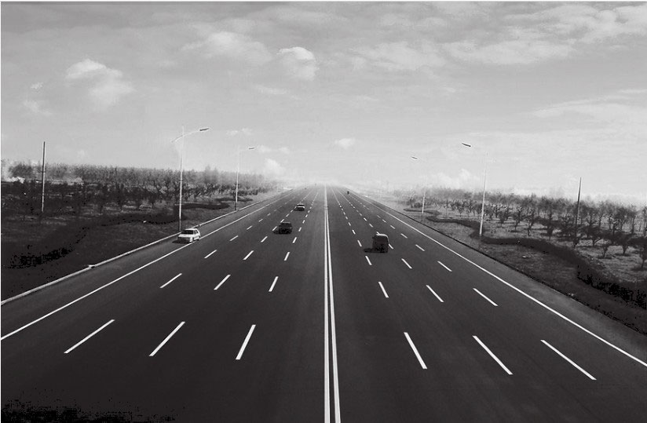
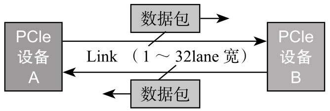

为什么 SSD 要使用 PCIe 接口? 因为比 SATA 快.

PCIe各代的带宽：

# Lane 和 Link

PCIe3.0 x1、x2、x4 指的是 PCIe 连接的**通道数**(Lane). 类似于**单车道**、**2车道**、**4车道**. PCIe 最多可以有 32 个 Lane.

> 这里单/2/4车道是指一侧的, 因为PCIe 中**发送通道和接收通道是分开的**, 类似于**高速公路的左右两侧分开**
> 
> x1(**一条 lane**) 对应 (**来向的一条路** + **去向的一条路**)

PCIe Lane类比高速公路通道:

**两个设备之间的 PCIe 连接**, 叫作**一个 Link**.

PCIe Link的概念:

> 一个 link 可能有 1 ~ 32 lane, 每个 lane 包含了上图中一条向左的和一条向右的
>
> 类比到高速公路, x1(**一条 lane**) 对应 (**来向的一条路** + **去向的一条路**)

## 

两个 PCIe 设备之间，有**专门的发送通道和接收通道**(类比到高速公路对应的是**左右两侧**, 而**两侧分别是单行的**)，数据可以**同时**往两个方向传输(**左侧车道和右侧车道可以同时跑**).

PCIeSpec 称这种工作模式为**双单工模式**（`Dual-Simplex`），可以理解为**全双工模式**。

SATA工作模式:

和 PCIe 一样，SATA 也有**独立的发送通道和接收通道**，但与 PCIe 工作模式不一样，**同一时间**，**只有一条通道(高速公路只有一侧可用)可以进行数据传输**。也就是说，对一个节点而言, 在**一条通道上发送数据**，**就不能在另外一条通道上接收数据**，反之亦然。这种工作模式称为**半双工模式**。

> 两个设备之间的 link 同时只能有一个 lane 在工作
>
> PCIe 犹如我们的手机，双方可以同时讲话; 而SATA就是对讲机了，一个人在说话，另外一个人就只能听不能说。

为什么 SSD 要使用 PCIe 接口? 因为比 SATA 快.

PCIe各代的带宽：

> 本章内容仅限于 PCIe 3.0 或更早

> x1(**一条 lane**) 对应 (**来向的一条路** + **去向的一条路**)

所以表中的带宽，比如 `PCIe3.0×1`，带宽为 `2GB/s`，是指**双向带宽**，即**读写带宽**。如果单指读或者写，该值应该减半，即` 1GB/s` 的**读速度**或者**写速度**。

# 带宽的计算

PCIe是串行总线，PCIe1.0的线上比特传输速率为2.5Gbps，物理层使用8/10编码，即8bit的数据，实际在物理线路上是需要传输10bit的，多余的2bit用来校验。因此：

