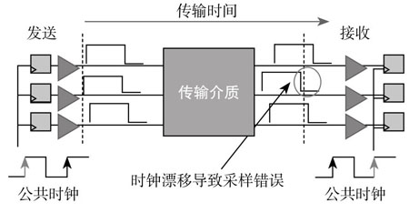

<!-- @import "[TOC]" {cmd="toc" depthFrom=1 depthTo=6 orderedList=false} -->

<!-- code_chunk_output -->

- [1. Lane](#1-lane)
- [2. Link](#2-link)
- [3. 工作模式](#3-工作模式)
  - [3.1. 全双工模式](#31-全双工模式)
  - [3.2. 半双工模式](#32-半双工模式)
- [4. 带宽](#4-带宽)
  - [4.1. 带宽的计算](#41-带宽的计算)
    - [4.1.1. PCIe1.0](#411-pcie10)
    - [4.1.2. PCIe2.0](#412-pcie20)
    - [4.1.3. PCIe3.0](#413-pcie30)
  - [4.2. 速度和成本](#42-速度和成本)
  - [4.3. IOPS](#43-iops)
- [5. 并口和串口](#5-并口和串口)
- [todo](#todo)

<!-- /code_chunk_output -->

# 1. Lane

Lane: A set of differential signal pairs, one pair for transmission and one pair for reception. A by-N Link is composed of N _Lanes_. **一组不同的信号对**, **一对**用来**传送**, **一对**用来**接收**. 由于 PCIE 使用差分信号传输, **一条lane四条线**, 两条线组成一对, 供发送. 另外两条接收!

PCIe3.0 x1、x2、x4 指的是 PCIe 连接的**通道**(Lane)数目. 类似于**单车道**、**2车道**、**4车道**. PCIe 最多可以有 32 个 Lane.

> 因为PCIe 中**发送通道和接收通道是分开的**, 所以这里**单/2/4车道**是指**发送通道的数目**或**接收通道的数目**,  类似于**高速公路的左右两侧分开**. **总通道数目 = 2/4/8**
>
> x1(**一条 lane**) 对应 (**来向的一条路** + **去向的一条路**)

PCIe Lane类比高速公路通道:


# 2. Link

Link: The collection of two Ports and their interconnecting Lanes. A Link is a dual-simplex communications path between two components. 两个 Ports 之间所连接的 Lanes 的集合. 一个 Link 是在两个部件之间的一个双工通信通道.

**两个设备之间的 PCIe 连接**, 叫作**一个 Link**.

PCIe Link的概念:


> 一个 link 可能有 1 ~ 32 lane, 每个 lane 包含了上图中一条向左的和一条向右的
>
> 类比到高速公路, x1(**一条 lane**) 对应 (**来向的一条路** + **去向的一条路**)

# 3. 工作模式

## 3.1. 全双工模式

两个 PCIe 设备之间, 有**专门的发送通道和接收通道**(类比到高速公路, 分别对应的是**左右两侧**, 而**两侧分别是单行的**), 数据可以**同时**往两个方向传输(**左侧车道和右侧车道可以同时跑**).

PCIe Spec 称这种工作模式为**双单工模式**(`Dual-Simplex`), 可以理解为**全双工模式**.

## 3.2. 半双工模式

SATA 工作模式:


和 PCIe 一样, SATA 也有**独立的发送通道和接收通道**, 但与 PCIe 工作模式不一样, **同一时间**, **只有一条通道(高速公路只有一侧可用)可以进行数据传输**. 也就是说, 对一个节点而言, 在**一条通道上发送数据**, **就不能在另外一条通道上接收数据**, 反之亦然.

这种工作模式称为**半双工模式**.

> 两个设备之间的 link 同时只能有一个 lane 在工作
>
> PCIe 犹如我们的手机, 双方可以同时讲话; 而SATA就是对讲机了, 一个人在说话, 另外一个人就只能听不能说.

# 4. 带宽

为什么 **SSD 要使用 PCIe 接口**? 因为比 SATA 快.

PCIe各代的带宽:


> 本章内容仅限于 PCIe 3.0 或更早

> 因为接收通道和发送通道是分开的, x1(**一条 lane**) 对应 (**来向的一条路** + **去向的一条路**)

所以表中的带宽, 比如 `PCIe3.0×1`, 带宽为 `2GB/s`, 是指**双向带宽**, 即**读写带宽**. 如果单指读或者写, 该值应该减半, 即` 1GB/s` 的**读速度**或者**写速度**.

## 4.1. 带宽的计算

PCIe 是串行总线

### 4.1.1. PCIe1.0

PCIe1.0 的**线上比特传输速率**为 `2.5Gbps`, 物理层使用 **8/10 编码**, 即 8bit 的数据, 实际在物理线路上是需要**传输 10 bit**的, 多余的 2bit 用来校验. 

> Gbps, bit per second; 1 Byte(B) = 8 bit(b)

因此:

```
PCIe1.0 ×1 的带宽 = (2.5Gbps × 2(双向通道) x (8bit / 10bit)) / 8(1B=8b) = 0.5GB/s
```

> 这里也提到了: **一条 lane 是双向通道**

这是**单条 Lane 的带宽**, 有几条 Lane, 那么**整个带宽**计算就是用 **0.5GB/s 乘以 Lane 的数目**.

### 4.1.2. PCIe2.0

PCIe2.0 的线上比特传输速率在 PCIe1.0 的基础上翻了一倍, 为 **5Gbps**, 物理层同样使用 8/10 编码, 所以:

```
PCIe2.0×1 的带宽 = (5Gbps × 2(双向通道) x (8bit / 10bit)) / 8(1B=8b) = 1GB/s
```

同样, 有多少条Lane, **带宽**就是 **1GB/s 乘以Lane的数目**.

### 4.1.3. PCIe3.0

PCIe3.0 的线上比特传输速率没有在 PCIe2.0 的基础上翻倍, 不是 10Gbps, 而是 8Gbps, 但物理层使用的是 `128/130` 编码进行数据传输, 所以:

```
PCIe3.0×1 的带宽 = (8Gbps × 2(双向通道) × (128bit / 130bit)) / 8(1B=8b) ≈ 2GB/s
```

同样, 有多少条Lane, **带宽**就是 **2GB/s 乘以Lane的数目**.

由于采用了 128/130 编码, 每 128bit 的数据, 只额外增加了 2bit 的开销, 有效数据传输比率增大, 虽然线上比特传输率没有翻倍, 但有效数据带宽还是在 PCIe2.0 的基础上实现翻倍.

## 4.2. 速度和成本

和 SATA 单通道不同, PCIe 连接可以**通过增加通道数扩展带宽**, 弹性十足. 通道数越多, **速度越快**. 不过, 通道数越多, **成本越高**, **占用更多空间**, **还有就是更耗电**. 

因此, 使用多少通道, 应该在性能和其他因素之间进行一个综合考虑. 单考虑性能的话, PCIe最高带宽可达 64GB/s, 即 PCIe 3.0×32 对应的带宽, 这是很恐怖的一个数据. 不过, 现有的 PCIe SSD 一般最多使用4通道, 如 PCIe3.0x4, 双向带宽为 8GB/s, 读或者写带宽为 4GB/s.

Intel PCIe SSD 750 规格书:


## 4.3. IOPS

在此, 顺便来算算 PCIe3.0×4 理论上最大的 4KB IOPS.

`PCIe3.0×4` 理论**最大读或写的速度**为 4GB/s, 不考虑协议开销, 每秒可以传输 4GB/4KB 个 4KB 大小的IO, 该值为1M, 即理论上最大IOPS为1000k.

因此, 一个SSD, 不管底层用什么介质, 闪存还是 3D XPoint, 接口速度就这么快, 最大IOPS是不可能超过这个值的.

# 5. 并口和串口

PCIe 是从 PCI 发展过来的, PCIe 的“e”是 express 的简称, 表示“**快**”. 

PCIe 怎么就能比 PCI(或者PCI-X)快呢？那是因为 PCIe 在物理传输上, 跟 PCI 有着本质的区别:

* **PCI** 使用 **并口传输** 数据
* **PCIe** 使用 **串口传输** 数据

PCI 并行总线, **单个时钟周期**可以传输 **32bit** 或 **64bit**, 怎么比不了**单个时钟周期**传输 **1个bit** 数据的串行总线呢？

并行传输时序在**实际时钟频率比较低**的情况下, 并口因为可以同时传输若干比特, 速率确实比串口快, 如图所示.

并行传输时序:



随着技术的发展, 要求数据传输速率越来越快, 要求时钟频率也越来越快, 但是, 并行总线时钟频率不是想快就能快的.

在发送端, 数据在某个时钟沿传出去(左边时钟第一个上升沿), 在接收端, 数据在下个时钟沿(右边时钟第二个上升沿)接收. 因此, 要在接收端能正确采集到数据, 要求时钟的周期必须大于数据传输的时间(从发送端到接收端的时间, Flight Time), 受限于数据传输时间(该时间还随着数据线长度的增加而增加), 因此时钟频率不能做得太高. 另外, 时钟信号在线上传输的时候, 也会存在相位偏移(Clock Skew ), 影响接收端的数据采集. 由于采用并行传输, 接收端必须等最慢的那个bit数据到了以后, 才能锁住整个数据.

PCIe使用串行总线进行数据传输就没有这些问题. 它没有外部时钟信号, 它的时钟信息通过8/10编码或者128/130编码嵌入在数据流, 接收端可以从数据流里面恢复时钟信息, 因此, 它不受数据在线上传输时间的限制, 导线多长、数据传输频率多快都没有问题. 没有外部时钟信号, 自然就没有所谓的相位偏移问题. 由于是串行传输, 只有一个bit传输, 所以不存在信号偏移(Signal Skew)问题. 但是, 如果使用多条Lane传输数据(串行中又有并行), 这个问题又回来了, 因为接收端同样要等最慢的那个Lane上的数据到达才能处理整个数据. 不过, 你不用担心, PCIe自己能解决好这个问题.


# todo

bus 0 的设备是没有 hot-plug 功能, 必须通过 root port 连接 endpoint 或者 switch


switch 的 upstream port 不是 endpoint, 注意 end 这个概念, 这个 upstream port 是有 hot-plug 功能的, 所以上面必须接 root port

switch 中的 upstream port 有路由转发功能, 往下的 switch 内部线只有一根, 数据都会往下发, 下面的 downstream port 会判断包是不是自己的.


memory controller 是 host bridge 的一个 function, 而不是一个独立的 device.


rc 可以包含多个 root port


