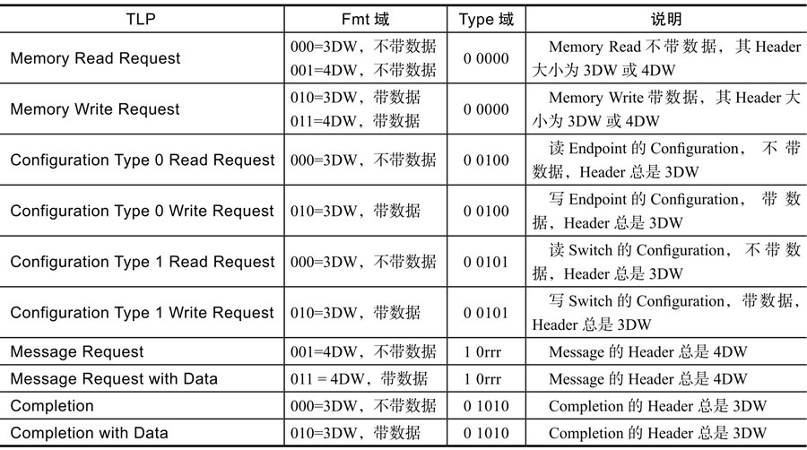
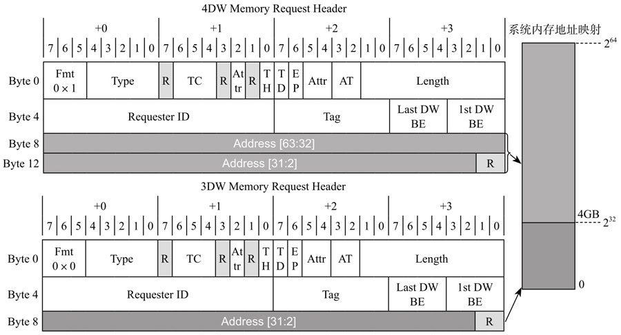

Request TLP 和作为响应的 Completion TLP 格式差不多, 如图.

TLP 数据格式:

TLP 主要由三部分组成：**Header**、**Data**(可选, 取决具体 TLP 类型)和 **ECRC**(可选). TLP 都是始于发送端的事务层(Transaction Layer), 终于接收端的事务层.

每个 TLP 都有一个 Header, 跟动物一样, 没有头就活不了, 所以 TLP 可以没手没脚, 但不能没有头. 事务层根据上层请求内容, 生成 TLP Header. Header 内容包括**发送者的相关信息**、**目标地址**(该 TLP 要发给谁)、**TLP 类型**(诸如前面提到的 Memory Read、Memory Write)、**数据长度**(如果有的话)等.

Data Payload 域, 用以放有效载荷数据. 该域不是必需的, 因为并不是每个 TLP 都必须携带数据, 比如 Memory Read TLP, 它只是一个请求, 数据是由目标设备通过 Completion TLP 返回的. 后面我们会整理哪些 TLP 需要携带数据, 哪些 TLP 不带数据. 前面也提到, 一个 TLP 最大载重是 4KB, 数据长度大于 4KB 的话, 就需要分几个 TLP 传输.

ECRC (End to End CRC) 域, 它对之前的 Header 和 Data(如果有的话)生成一个 CRC, 在接收端根据收到的 TLP 重新生成 Header 和 Data(如果有的话)的 CRC, 与收到的 CRC 比较, 一样则说明数据在传输过程中没有出错, 否则就有错. 它也是可选的, 可以设置不加 CRC.

Data 域和 CRC 域没有什么好说的, 有花头的是 Header 域, 我们要深入其中看看.

**一个 Header 大小**可以是 3DW, 也可以是 4DW.

> DW, double word, 一个双字, 4 字节, 32 位

以 4DW 的 Header 为例, TLP 的 Header 如下所示(见图 5-20).

深色区域为所有 TLP Header 公共部分, 所有 Header 都有这些; 其他则跟具体的 TLP 相关.

稍微解释一下：

* Fmt: Format, 表明该 TLP 是否带有数据, Header 是 3DW 还是 4DW.
* Type: TLP 类型, 上一节提到的, 包括 Memory Read、Memory Write、Confi guration Read、Confi gurationWrite、Message 和 Completion 等.
* R: Reserved, 等于 0.
* TC: **Traffic Class**, TLP 也分三六九等, 优先级高的先得到服务. TC:3bit, 说明可以分为 8 个等级, 0～7, TC 默认是 0, **数字越大**, **优先级越高**.
* Attr: Attrbiute, 属性, 前后共三个 bit.
* TH: TLP Processing Hints.
* TD: TLP Digest, 之前说 ECRC 可选, 如果这个 bit 置起来, 说明该 TLP 包含 ECRC, 接收端应该做 CRC 校验.
* EP: Poisoned Data, “有毒” 的数据, 远离.
* AT: Address Type, 地址种类.
* Length: Payload 数据长度, 10 个 bit, 最大为 1024, **单位为 DW**, 所以 TLP 最大数据长度是 4KB; 该长度总是 DW 的整数倍, 如果 TLP 的数据不是 DW 的整数倍(不是 4Byte 的整数倍), 则需要用到 Last DW BE 和 1st DW BE 这两个域.

到目前为止, 对于 Header, 我们只需知道它大概有什么内容, 没有必要记住每个域是什么. 这里重点讲讲 Fmt 和 Type, 看看不同 TLP(这里所列为精简版的, 仅为 Native PCIe 设备所支持的 TLP)的 Fmt 和 Type 应该怎样编码(见表 5-5).

TLP 格式和类型域编码:

如表 5-5 所示, Configuration 和 Completion 的 TLP(以 C 打头的 TLP)的 Header 大小总是 3 字节; Message TLP 的 Header 总是 4 字节. 而 Memory 相关 TLP 的 Header 取决于地址空间的大小, 地址空间小于 4GB 的, Header 大小为 3DW; 大于 4GB 的, Header 大小则为 4DW.

上面介绍了几个 TLP Header 的通用部分, 下面分别介绍具体 TLP 的 Header.

1. Memory TLP

有两个重要的内容在前面没有提到, 那就是 TLP 的源和目标. 即该 TLP 是哪里产生的, 它要到哪里去, 这些信息都是包含在 Header 里面的. 因为不同的 TLP 类型, 寻址方式不同, 因此要结合具体 TLP 来看.

Memory TLP 的 Header:

对一个 PCIe 设备来说, 它开放给主机访问的**设备空间首先会映射到主机的内存空间**, 主机如果想访问设备的某个空间, TLPHeader 当中的地址应该设置为**该访问空间在主机内存的映射地址**. 如果主机内存空间小于 4GB, 则 Memory 读写 TLP 的 Header 大小为 3DW; 大于 4GB, 则为 4DW. 对 4GB 内存空间, 32bit 的地址用 1DW 就可以表示, 该地址位于 `Byte 8-11`; 而 4GB 以上的内存空间, 需要用 2DW 表示地址, 该地址位于 `Byte 8-15`.

该 TLP 经过 Switch 的时候, Switch 会根据地址信息, 把该 TLP 转发到目标设备. 之所以能唯一地找到目标设备, 是因为**不同的 Endpoint 设备空间**会映射到**主机内存空间的不同位置**.

关于 TLP 路由, 后文还会详细介绍.

Memory TLP 的**目标**是通过**内存地址**告知的, 而**源**则是通过 “**Requester ID**” 告知的. 每个设备在 PCIe 系统中都有唯一的 ID, 该 ID 由总线(Bus)、设备(Device)、功能(Function)三者唯一确定. 这个后面也会专门讲, 这里只需知道一个 PCIe 组成有唯一的一个 ID, 不管是 RC、Switch 还是 Endpoint.

2. Configuration TLP

**Endpoint** 和 **Switch** 的配置(Configuration)格式不一样, 分别由 Type 0 和 Type 1 来表示. 配置可以认为是一个 Endpoint 或者 Switch 的**标准空间**, 这段空间在**初始化时需要映射到主机的内存空间**. 与设备的其他空间不同, 该空间是标准化的, 即不管是哪个厂家生产的设备, 都需要有这段空间, 而且哪个地方放什么东西, 都是**协议规定好的**, 主机按协议访问这部分空间. **主机软件访问 PCIe 设备的配置空间**, **RC** 会**生成 Configuration TLP** 与 **Switch** 或 **EP 交互**.

如表 5-22 所示是访问 Endpoint 的配置空间的 **TLP Header**(`Type 0`).

Type 0 Configuration TLP 的 Header:

**Bus Number + Device + Function 就唯一决定了目标设备**; **Ext Reg Number + Register Number 相当于配置空间的偏移**. 找到了设备, 然后指定了配置空间的偏移, 就能找到具体想访问的配置空间的某个位置(寄存器).

3. Message TLP

Message TLP 用于传输中断、错误、电源管理等信息, 取代 PCI 时代的边带信号传输. Message TLP 的 Header 大小总是 4DW, 如图 5-23 所示.

Message TLP 的 Header:

Message Code 指定该 Message 的类型, 具体如下图 5-24 所示.

Messagecode 域解释:

不同的 Message Code, 最后两个 DW 的意义也不同, 这里不再展开.

4. Completion TLP

有 Non-Posted Request TLP, 才有 Completion TLP, 有因才有果. 前面看到, Requester 的 TLP 当中都有 Requester ID 和 Tag, 来告知接收者、发起者是谁. 那么响应者的目标地址就很简单, 照抄发起者的源地址就可以了. Completion TLP 的 Header 如图 5-25 所示.

Completion TLP 的 Header:

Completion TLP 一方面, 可以返回请求者的数据, 比如作为 Memory 或 Configuration Read 的响应; 另一方面, 还可以返回该事务(Transaction)的状态. 因此, 在 Completion TLP 的 Header 中有一个 Completion Status, 用以返回事务状态(见图 5-26).

Completion Status Code:

