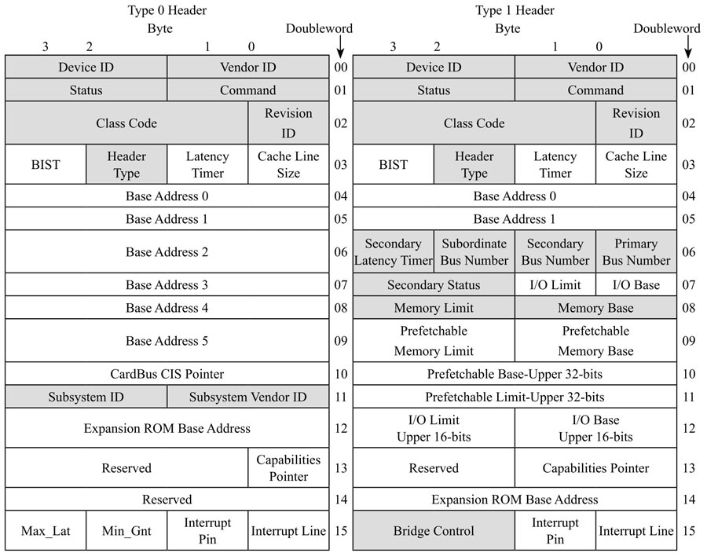

每个PCIe设备都有这样一段空间，主机软件可以通过读取它获得该设备的一些信息，也可以通过它来配置该设备，这段空间就称为PCIe的配置空间。不同于每个设备的其他空间，PCIe设备的配置空间是协议规定好的，哪个地方放什么内容，都是有定义的。PCI或者PCI-X时代就有配置空间的概念，具体如图5-27所示。

PCI设备的256B配置空间:

整个配置空间就是一系列寄存器的集合，由两部分组成：64B的Header和192B的Capability数据结构。

进入PCIe时代，PCIe能耐更大，192B不足以罗列它的绝活。为了保持后向兼容，又要不把绝活落下，怎么办？很简单，扩展后者的空间，把整个配置空间由256B扩展成4KB，前面256B保持不变（见图5-28）。

PCIe设备的4KB配置空间:

PCIe有什么能耐（Capability）我们不看，先看看只占64B的Configuration Header（见图5-29）

配置空间的Header:

其中，Type 0 Header是Endpoint的Configuration Header,Type 1 Header是Switch的Configuration Header。

像Device ID、Vendor ID、Class Code和Revision ID是只读寄存器，PCIe设备通过这些寄存器告诉主机软件，这是哪个厂家的设备、设备ID是多少以及是什么类型的（网卡、显卡、桥）设备。

其他的我们暂时不看，我们看看重要的BAR（Base AddressRegister）。

对Endpoint Configuration（Type 0）提供了最多6个BAR，而对Switch（Type 1）来说只有2个。BAR是做什么的？

每个PCIe设备，都有自己的内部空间，这部分空间如果开放给主机（软件或者CPU)访问，那么主机怎样才能往这部分空间写入或者读数据呢？

我们知道，CPU只能直接访问主机内存（Memory）空间（或者IO空间），不能对PCIe等外设进行直接操作。怎么办？记得前文提到的RC吗？它可以为CPU分忧。

解决办法是：CPU如果想访问某个设备的空间，由于它不能亲自跟那些PCIe外设打交道，因此叫RC去办。比如，如果CPU想读PCIe外设的数据，先叫RC通过TLP把数据从PCIe外设读到主机内存，然后CPU从主机内存读数据；如果CPU要往外设写数据，则先把数据在内存中准备好，然后叫RC通过TLP写入到PCIe设备。

图5-30的最左边的虚线表示CPU要读Endpoint A的数据，RC则通过TLP（经历Switch）数据交互获得数据，并把它写入到系统内存中，然后CPU从内存中读取数据（深色实线箭头所示），从而CPU间接完成对PCIe设备数据的读取。

