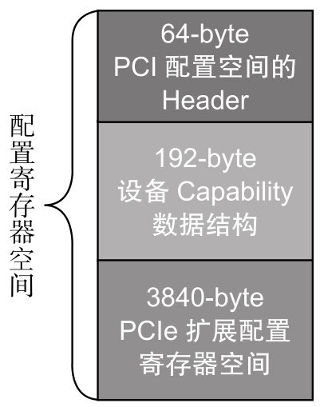

每个PCIe设备都有这样一段空间，主机软件可以通过读取它获得该设备的一些信息，也可以通过它来配置该设备，这段空间就称为PCIe的配置空间。不同于每个设备的其他空间，PCIe设备的配置空间是协议规定好的，哪个地方放什么内容，都是有定义的。PCI或者PCI-X时代就有配置空间的概念，具体如图5-27所示。

PCI设备的256B配置空间:

整个配置空间就是一系列寄存器的集合，由两部分组成：64B的Header和192B的Capability数据结构。

进入PCIe时代，PCIe能耐更大，192B不足以罗列它的绝活。为了保持后向兼容，又要不把绝活落下，怎么办？很简单，扩展后者的空间，把整个配置空间由256B扩展成4KB，前面256B保持不变（见图5-28）。

PCIe设备的4KB配置空间:

PCIe有什么能耐（Capability）我们不看，先看看只占64B的Configuration Header（见图5-29）

配置空间的Header:

其中，Type 0 Header是Endpoint的Configuration Header,Type 1 Header是Switch的Configuration Header。

像Device ID、Vendor ID、Class Code和Revision ID是只读寄存器，PCIe设备通过这些寄存器告诉主机软件，这是哪个厂家的设备、设备ID是多少以及是什么类型的（网卡、显卡、桥）设备。

其他的我们暂时不看，我们看看重要的BAR（Base AddressRegister）。

对Endpoint Configuration（Type 0）提供了最多6个BAR，而对Switch（Type 1）来说只有2个。BAR是做什么的？

每个PCIe设备，都有自己的内部空间，这部分空间如果开放给主机（软件或者CPU)访问，那么主机怎样才能往这部分空间写入或者读数据呢？

我们知道，CPU只能直接访问主机内存（Memory）空间（或者IO空间），不能对PCIe等外设进行直接操作。怎么办？记得前文提到的RC吗？它可以为CPU分忧。

解决办法是：CPU如果想访问某个设备的空间，由于它不能亲自跟那些PCIe外设打交道，因此叫RC去办。比如，如果CPU想读PCIe外设的数据，先叫RC通过TLP把数据从PCIe外设读到主机内存，然后CPU从主机内存读数据；如果CPU要往外设写数据，则先把数据在内存中准备好，然后叫RC通过TLP写入到PCIe设备。

图5-30的最左边的虚线表示CPU要读Endpoint A的数据，RC则通过TLP（经历Switch）数据交互获得数据，并把它写入到系统内存中，然后CPU从内存中读取数据（深色实线箭头所示），从而CPU间接完成对PCIe设备数据的读取。

CPU与EP通信示例:

具体实现就是上电的时候，系统把PCIe设备开放的空间（系统软件可见）映射到内存地址空间，CPU要访问该PCIe设备空间，只需访问对应的内存地址空间。RC检查该内存地址，如果发现该内存空间地址是某个PCIe设备空间的映射，就会触发其产生TLP，去访问对应的PCIe设备，读取或者写入PCIe设备。

一个PCIe设备，可能有若干个内部空间（属性可能不一样，比如有些可预读，有些不可预读）需要映射到内存空间，设备出厂时，这些空间的大小和属性都写在Configuration BAR寄存器里面，上电后，系统软件读取这些BAR，分别为其分配对应的系统内存地址空间，并把相应的内存基地址写回到BAR（BAR的地址其实是PCI总线域的地址，CPU访问的是存储器域的地址，CPU访问PCIe设备时，需要把总线域地址转换成存储器域的地址）。

如图5-31所示，Native PCIe Endpoint（Switch右下）只支持Memory Map，它有两个不同属性的内部空间要开放给系统软件，因此，它可以分别映射到内存（Memory，不是DRAM区域）地址空间的两个地方；还有一个Legacy Endpoint，它既支持Memory Map，还支持IO Map，它也有两个不同属性的内部空间，分别映射到系统内存空间和IO空间。

Memory映射和I/O映射示例:

下面，我们来看一下，对于PCIe设备，系统软件是如何为其分配映射空间的（见图5-32）。

BAR0设置示例:

上电时，系统软件首先会读取PCIe设备的BAR0，得到数据（见图5-33）

设备初始BAR0值:

然后系统软件往该BAR0写入全1（见图5-34）。

系统软件往BAR0写入全1后的值:

BAR寄存器有些bit是只读的，是PCIe设备在出厂前就固定好的bit，写全1进去，如果值保持不变，就说明这些bit是厂家固化好的，这些固化好的bit提供了这块内部空间的一些信息：

如何解读？低12位没变，表明该设备空间大小是4KB（2的12次方字节），然后低4位表明了该存储空间的一些属性（IO映射还是内存映射？32bit地址还是64bit地址？能否预取？做过单片机的人可能知道，有些寄存器只要一读，数据就会清掉，因此，对这样的空间，是不能预读的，因为预读会改变原来的值），这些都是PCIe设备在出厂前都设置好的，提供给系统软件的信息。

然后系统软件根据这些信息，在系统内存空间找到这样一块地方来映射这4KB的空间，把分配的基地址写入到BAR0（见图5-35）。从而完成了该PCIe空间的映射。一个PCIe设备可能有若干个内部空间需要开放出来，系统软件依次读取BAR1、BAR2……直到BAR5，完成所有内部空间的映射。

主机软件为该空间分配地址空间后BAR0的值:

