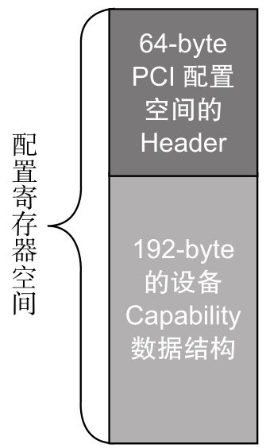
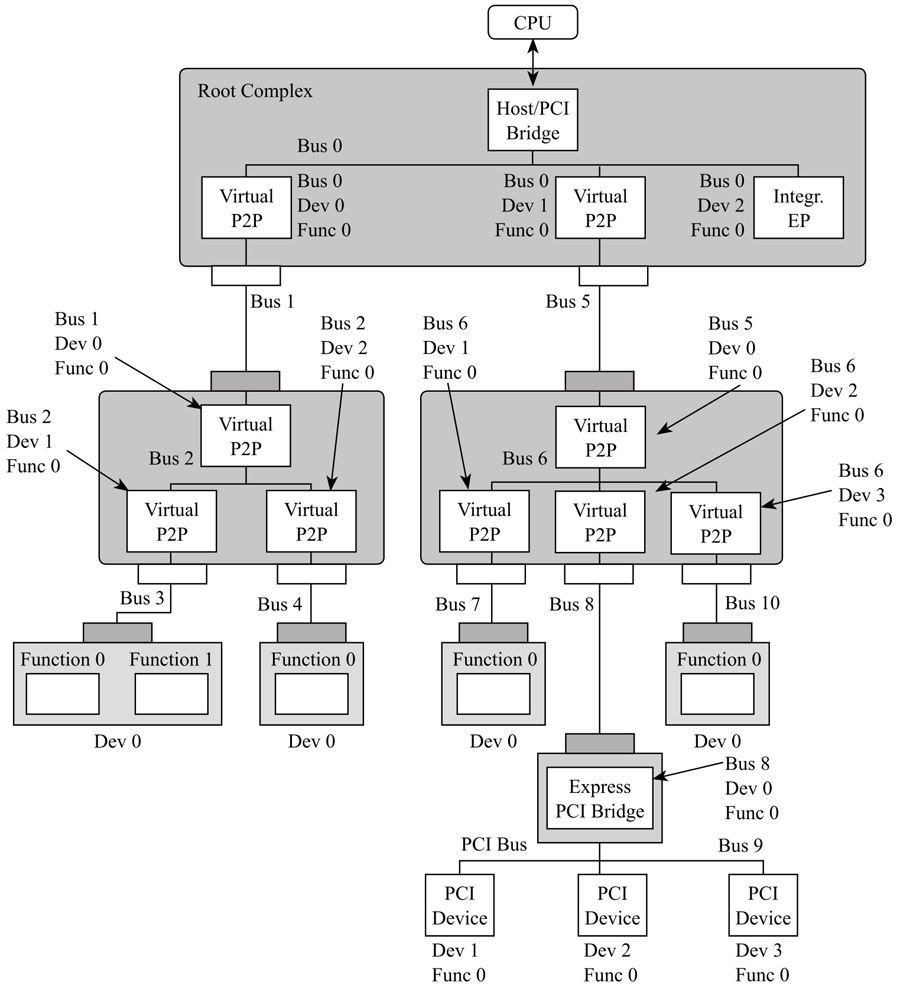

**每个 PCIe 设备**都有这样一段空间, 主机软件可以通过读取它获得该设备的一些信息, 也可以通过它来配置该设备, 这段空间就称为 **PCIe 的配置空间**. 不同于每个设备的其他空间, PCIe 设备的配置空间是**协议规定好的**, 哪个地方放什么内容, 都是有定义的.

PCI 或者 PCI-X 时代就有配置空间的概念, 具体如图 5-27 所示.

**PCI 设备**的 256B 配置空间:

整个配置空间就是**一系列寄存器的集合**, 由两部分组成: 64B 的 Header 和 192B 的 Capability 数据结构.

进入 PCIe 时代, PCIe 能耐更大, 192B 不足以罗列它的绝活. 为了保持后向兼容, 又要不把绝活落下, 怎么办? 很简单, 扩展后者的空间, 把整个配置空间由 256B 扩展成 4KB, 前面 256B 保持不变(见图 5-28).

PCIe 设备的 4KB 配置空间:

PCIe 有什么能耐(Capability)我们不看, 先看看只占 64B 的 Configuration Header(见图 5-29)

配置空间的 Header:

其中, Type 0 Header 是 Endpoint 的 Configuration Header,Type 1 Header 是 Switch 的 Configuration Header.

像 Device ID、Vendor ID、Class Code 和 Revision ID 是只读寄存器, PCIe 设备通过这些寄存器告诉主机软件, 这是哪个厂家的设备、设备 ID 是多少以及是什么类型的(网卡、显卡、桥)设备.

其他的我们暂时不看, 我们看看重要的 BAR(Base AddressRegister).

对 Endpoint Configuration(Type 0)提供了最多 6 个 BAR, 而对 Switch(Type 1)来说只有 2 个. BAR 是做什么的?

每个 PCIe 设备, 都有自己的内部空间, 这部分空间如果开放给主机(软件或者 CPU) 访问, 那么主机怎样才能往这部分空间写入或者读数据呢?

我们知道, CPU 只能直接访问主机内存(Memory)空间(或者 IO 空间), 不能对 PCIe 等外设进行直接操作. 怎么办? 记得前文提到的 RC 吗? 它可以为 CPU 分忧.

解决办法是: CPU 如果想访问某个设备的空间, 由于它不能亲自跟那些 PCIe 外设打交道, 因此叫 RC 去办. 比如, 如果 CPU 想读 PCIe 外设的数据, 先叫 RC 通过 TLP 把数据从 PCIe 外设读到主机内存, 然后 CPU 从主机内存读数据; 如果 CPU 要往外设写数据, 则先把数据在内存中准备好, 然后叫 RC 通过 TLP 写入到 PCIe 设备.

图 5-30 的最左边的虚线表示 CPU 要读 Endpoint A 的数据, RC 则通过 TLP(经历 Switch)数据交互获得数据, 并把它写入到系统内存中, 然后 CPU 从内存中读取数据(深色实线箭头所示), 从而 CPU 间接完成对 PCIe 设备数据的读取.

CPU 与 EP 通信示例:

具体实现就是上电的时候, 系统把 PCIe 设备开放的空间(系统软件可见)映射到内存地址空间, CPU 要访问该 PCIe 设备空间, 只需访问对应的内存地址空间. RC 检查该内存地址, 如果发现该内存空间地址是某个 PCIe 设备空间的映射, 就会触发其产生 TLP, 去访问对应的 PCIe 设备, 读取或者写入 PCIe 设备.

一个 PCIe 设备, 可能有若干个内部空间(属性可能不一样, 比如有些可预读, 有些不可预读)需要映射到内存空间, 设备出厂时, 这些空间的大小和属性都写在 Configuration BAR 寄存器里面, 上电后, 系统软件读取这些 BAR, 分别为其分配对应的系统内存地址空间, 并把相应的内存基地址写回到 BAR(BAR 的地址其实是 PCI 总线域的地址, CPU 访问的是存储器域的地址, CPU 访问 PCIe 设备时, 需要把总线域地址转换成存储器域的地址).

如图 5-31 所示, Native PCIe Endpoint(Switch 右下)只支持 Memory Map, 它有两个不同属性的内部空间要开放给系统软件, 因此, 它可以分别映射到内存(Memory, 不是 DRAM 区域)地址空间的两个地方; 还有一个 Legacy Endpoint, 它既支持 Memory Map, 还支持 IO Map, 它也有两个不同属性的内部空间, 分别映射到系统内存空间和 IO 空间.

Memory 映射和 I/O 映射示例:

下面, 我们来看一下, 对于 PCIe 设备, 系统软件是如何为其分配映射空间的(见图 5-32).

BAR0 设置示例:

上电时, 系统软件首先会读取 PCIe 设备的 BAR0, 得到数据(见图 5-33)

设备初始 BAR0 值:

然后系统软件往该 BAR0 写入全 1(见图 5-34).

系统软件往 BAR0 写入全 1 后的值:

BAR 寄存器有些 bit 是只读的, 是 PCIe 设备在出厂前就固定好的 bit, 写全 1 进去, 如果值保持不变, 就说明这些 bit 是厂家固化好的, 这些固化好的 bit 提供了这块内部空间的一些信息: 

如何解读? 低 12 位没变, 表明该设备空间大小是 4KB(2 的 12 次方字节), 然后低 4 位表明了该存储空间的一些属性(IO 映射还是内存映射? 32bit 地址还是 64bit 地址? 能否预取? 做过单片机的人可能知道, 有些寄存器只要一读, 数据就会清掉, 因此, 对这样的空间, 是不能预读的, 因为预读会改变原来的值), 这些都是 PCIe 设备在出厂前都设置好的, 提供给系统软件的信息.

然后系统软件根据这些信息, 在系统内存空间找到这样一块地方来映射这 4KB 的空间, 把分配的基地址写入到 BAR0(见图 5-35). 从而完成了该 PCIe 空间的映射. 一个 PCIe 设备可能有若干个内部空间需要开放出来, 系统软件依次读取 BAR1、BAR2…… 直到 BAR5, 完成所有内部空间的映射.

主机软件为该空间分配地址空间后 BAR0 的值:

上面主要讲了 Endpoint 的 BAR, Switch 也有两个 BAR, 这里不展开讲, 下节讲 TLP 路由的时候再回过头来讲. 下面我们继续说配置空间.

前面说每个 PCIe 设备都有一个配置空间, 其实这样的说法是不准确的, 而是每个 PCIe 设备至少有一个配置空间. 一个 PCIe 设备可能具有多个功能(Function), 比如既能当硬盘, 还能当网卡, 每个功能对应一个配置空间.

在一个 PCIe 拓扑结构里, 一条总线下面可以挂几个设备, 而每个设备可以具有几个功能, 如图 5-36 所示.

PCIe 中的 Bus、device 和 function:

因此, 在整个 PCIe 系统中, 只要知道了 Bus No.+DeviceNo.+Function No., 就能找到唯一的 Function.

寻址基本单元是功能, 它的 ID 由 Bus+Device+Function 组成(BDF). 一个 PCIe 系统, 可以最多有 256 条 Bus, 每条 Bus 上最多可以挂 32 个设备, 而每个设备最多又能实现 8 个 Function, 每个 Function 对应 4KB 的配置空间. 上电时, 这些配置空间都需要映射到主机的内存地址空间(PCIe 域, 非 DRAM 区域). 这块内存地址映射区域大小为: 256×32×8×4KB = 256MB. 注意, 这只是内存空间的某个区域, 不占用 DRAM 空间.

系统软件如何读取 Configuration 空间呢? 不能通过 BAR 中的地址, 为什么? 别忘了 BAR 是在 Configuration 中的, 你首先要读取 Configuration, 才能得到 BAR. 系统不是为所有可能的 Configuration 空间做了内存映射吗? 系统软件想访问哪个 Configuration, 只需指定相应 Function 对应的内存空间地址, RC 发现这个地址是 Configuration 映射空间, 就会产生相应的 Configuration Read TLP(映射地址→BDF)去获得相应 Function 的 Configuration.

再回想一下前面介绍的 Configuration Read TLP 的 Header 格式(见图 5-37).

Confi gurationRead TLP 的 Header:

Bus Number + Device + Function 就唯一决定了目标设备; Ext Reg Number + Register Number 相当于配置空间的偏移. 找到设备, 然后指定配置空间的偏移, 就能找到具体想访问的配置空间的某个位置(寄存器).

请注意, 只有 RC 才能发起 Configuration 的访问请求, 其他设备是不允许对别的设备进行 Configuration 读写的.