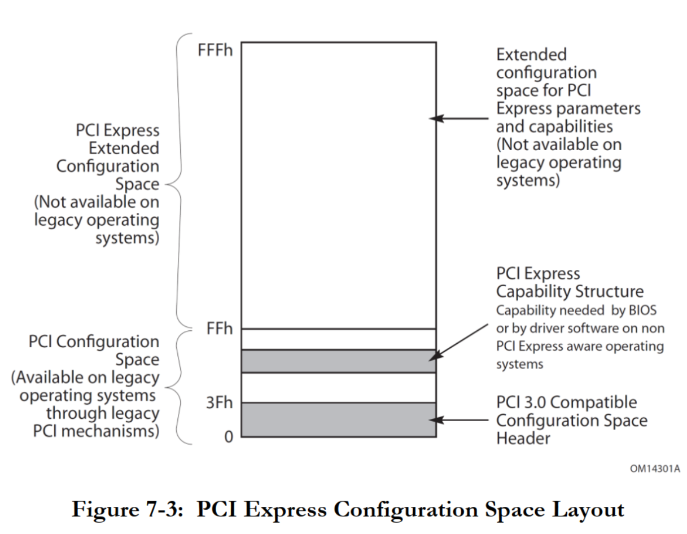
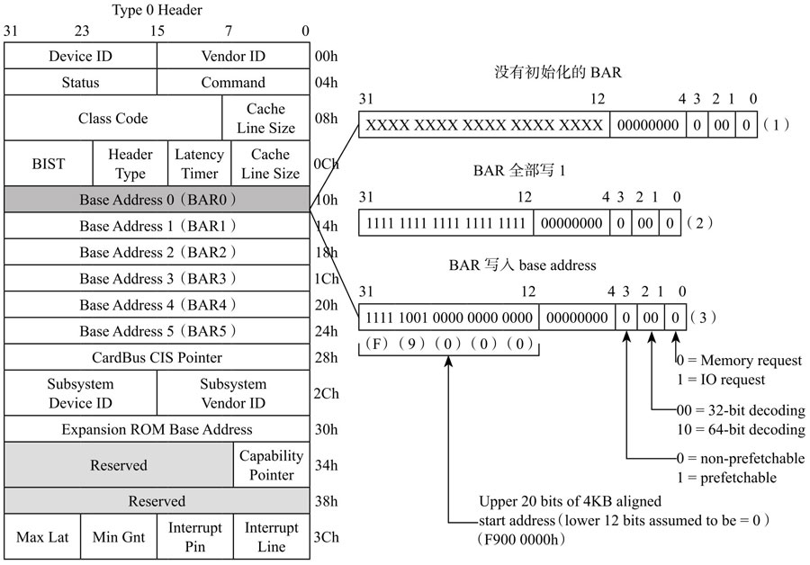

<!-- @import "[TOC]" {cmd="toc" depthFrom=1 depthTo=6 orderedList=false} -->

<!-- code_chunk_output -->

- [1. 设备的配置空间](#1-设备的配置空间)
  - [1.1. PCI 设备的 256B 配置空间](#11-pci-设备的-256b-配置空间)
  - [1.2. PCIe 设备的 4KB 配置空间](#12-pcie-设备的-4kb-配置空间)
- [2. 配置空间的 Header](#2-配置空间的-header)
- [3. PCIe 设备的内部空间 BAR](#3-pcie-设备的内部空间-bar)
  - [3.1. CPU 访问设备内部空间](#31-cpu-访问设备内部空间)
    - [3.1.1. 访问具体实现](#311-访问具体实现)
    - [3.1.2. BAR 空间初始化](#312-bar-空间初始化)
  - [3.2. PCIe 设备 BAR 空间的分配](#32-pcie-设备-bar-空间的分配)
    - [3.2.1. 上电读取](#321-上电读取)
    - [3.2.2. 写入全 1](#322-写入全-1)
    - [3.2.3. 信息解读](#323-信息解读)
    - [3.2.4. 分配地址空间](#324-分配地址空间)
    - [3.2.5. 其他 BAR 处理](#325-其他-bar-处理)
- [4. 访问配置空间](#4-访问配置空间)
  - [4.1. 配置空间是 per function](#41-配置空间是-per-function)
  - [4.2. BDF](#42-bdf)
  - [4.3. 映射到内存地址空间](#43-映射到内存地址空间)
  - [4.4. 读取配置空间](#44-读取配置空间)

<!-- /code_chunk_output -->

# 1. 设备的配置空间

**每个 PCIe 设备**都有这样一段空间, **主机软件**可以通过读取它**获得该设备的一些信息**, 也可以通过它来**配置该设备**, 这段空间就称为 **PCIe 的配置空间**.

不同于**每个设备的其他空间**, PCIe 设备的**配置空间**是**协议规定好的**, 哪个地方放什么内容, 都是有定义的.

一共有 **4K** 空间:

* **配置空间Header**(`Configuration Space Header`), `0x00 ~ 0x3F`, 有 64 字节空间
* **设备Capability结构**(`Capability Structure`), `0x40 ~ 0xFF`, 从第 64 字节开始, 有 192 字节空间, 前面两个统称 **PCI Configuration Space**
* **扩展Capability空间**(`PCI Express Extended Configuration Space`), `0x100~0xFFF`, 从第 256 字节开始, 有 **3840** 字节空间

## 1.1. PCI 设备的 256B 配置空间

> B = byte, 字节

PCI 或者 PCI-X 时代就有配置空间的概念, 具体如图.

**PCI 设备**的 **256B** 配置空间:

整个配置空间就是**一系列寄存器的集合！！！**, 由两部分组成: **64B 的 Header** 和 **192B 的 Capability** 数据结构.

## 1.2. PCIe 设备的 4KB 配置空间

进入 PCIe 时代, 扩展了后者的空间, 把**整个配置空间**由 **256B** 扩展成 **4KB**, **前面 256B 保持不变**.

**PCIe 设备**的 **4KB** 配置空间:

# 2. 配置空间的 Header

先看看只占 64B 的 Configuration Header

配置空间的 Header:

**Type 0 Header** 是 **Endpoint** 的 Configuration Header, **Type 1 Header** 是 **Switch** 和 **Root Ports** 的 Configuration Header.

**Device ID**、**Vendor ID**、**Class Code** 和 **Revision ID** 是**只读寄存器**, **PCIe 设备**通过**这些寄存器**告诉主机软件, 这是**哪个厂家的设备**、**设备 ID** 以及是**什么类型**的(**网卡**、**显卡**、**桥**)设备.

其他的我们暂时不看, 我们看看重要的 **BAR**(`Base Address Register`).

> 注意看 BAR 的定义, 是 **地址寄存器**, 存放的是 **BAR 空间的地址**.

# 3. PCIe 设备的内部空间 BAR

对 **Endpoint** Configuration(`Type 0`)提供了**最多 6 个 BAR**, 而对 **Switch**(`Type 1`)来说只有 **2 个**.

BAR 是做什么的?

每个 PCIe 设备, 都有自己的**内部空间**, 这部分空间如果**开放给主机** (`软件或者 CPU`) **访问**, 那么**主机**怎样才能往这部分空间写入或者读数据呢?

> 这里的内部空间有别于 PCIe 设备的配置空间, 这里的内部空间是真正的空间, 能存放设备的真实数据, 类似于 RAM 中的空间.

## 3.1. CPU 访问设备内部空间

> BAR 内部空间

我们知道, **CPU 只能直接访问主机内存地址空间(Memory Map)或者 IO 地址空间(IO Map)**, **不能对 PCIe 等外设进行直接操作**. 怎么办? 记得前文提到的 **RC** 吗? 它可以为 CPU 分忧.

解决办法是: **CPU** 如果想访问**某个设备的空间**, 由于它**不能亲自跟那些 PCIe 外设打交道**, 因此叫 **RC** 去办. 比如:

* 如果 **CPU** 要**读外设的数据**, 先叫 **RC 通过 TLP 把数据从 PCIe 外设读到主机内存！！！**, 然后 **CPU 从主机内存读数据**;

* 如果 **CPU** 要**往外设写数据**, 则**先把数据在内存！！！中准备好**, 然后叫 **RC 通过 TLP 写入到 PCIe 设备**.

下图的最左边的虚线表示 **CPU** 要**读 Endpoint A 的数据**, **RC** 则通过 **TLP**(经历 Switch)数据交互**获得数据**, 并把它**写入到系统内存**中, 然后 **CPU** 从**内存**中**读取数据**(深色实线箭头所示), 从而 CPU 间接完成对 PCIe 设备数据的读取.

### 3.1.1. 访问具体实现

具体实现就是

> 这里是 BAR 内部空间 

1. **上电**的时候, 系统把 **PCIe 设备开放的空间**(系统软件可见)**映射**到**内存地址空间**;

2. **CPU** 要**访问该 PCIe 设备空间**, **只需访问对应的内存地址空间**;

3. **RC 检查该内存地址**, 如果发现该内存空间地址是**某个 PCIe 设备空间的映射**, 就会**触发其产生 TLP**;

4. RC 发出 TLP 去访问对应的 PCIe 设备, **读取或者写入 PCIe 设备**.

### 3.1.2. BAR 空间初始化

> 下面会具体讲到.

**一个 PCIe 设备**, 可能有**若干**个**内部空间**(属性可能不一样, 比如有些可预读, 有些不可预读)需要映射到**内存空间**.

**设备出厂时**, **这些空间的大小和属性都写在 Configuration BAR 寄存器里面**.

设备**上电**后, 系统软件**读取这些 BAR**, 分别为其**分配对应的系统内存地址空间**, 并**把相应的内存基地址写回到 BAR**(BAR 的地址其实是 PCI 总线域的地址, CPU 访问的是存储器域的地址, CPU 访问 PCIe 设备时, RC 需要**把总线域地址转换成存储器域的地址**).

> 应该是把存储域地址转换成总线域地址

如下图所示:

> 这里是 BAR 内部空间

* **Native PCIe Endpoint**(Switch 右下)**只支持 Memory Map**, 它有两个**不同属性的内部空间**要开放给系统软件, 因此, 它可以分别映射到**内存**(Memory, 不是 DRAM 区域)**地址空间**的两个地方; 

* 还有一个 **Legacy Endpoint**(Switch 左下), 它既支持 **Memory Map**, 还支持 **IO Map**, 它也有**两个不同属性的内部空间**, 分别映射到系统**内存空间**和 **IO 空间**.

## 3.2. PCIe 设备 BAR 空间的分配

下面, 我们来看一下, 对于 PCIe 设备, 系统软件是如何为其分配映射空间的.

BAR0 设置示例:

### 3.2.1. 上电读取

**上电**时, **系统软件**首先会**读取 PCIe 设备的 BAR0**, 得到设备初始的 BAR0 值.

### 3.2.2. 写入全 1

然后**系统软件**往该 BAR0 **写入全 1**. 值成为:

BAR 寄存器**有些 bit 是只读的**, 是 PCIe 设备在出厂前就固定好的 bit, 写全 1 进去, 如果**值保持不变**, 就说明这些 bit 是厂家**固化好的**, 这些**固化好的 bit** 提供了**这块内部空间的一些信息**:

### 3.2.3. 信息解读

如何解读? **低 12 位没变**, **表明该设备 BAR0 空间大小是 4KB**(`2^12`), 然后**低 4 位**表明了该存储空间的一些**属性**(IO 映射还是内存映射? 32bit 地址还是 64bit 地址? 能否预取? 做过单片机的人可能知道, 有些寄存器只要一读, 数据就会清掉, 因此, 对这样的空间, 是不能预读的, 因为预读会改变原来的值), 这些都是 PCIe 设备在**出厂前都设置好的**, 提供给系统软件的信息.

### 3.2.4. 分配地址空间

然后系统软件根据这些信息, 在**系统内存空间**找到这样一块地方来**映射**这 4KB 的**空间**, 把**分配的基地址**写入到 **BAR0**(见下图). 从而完成了该 PCIe 空间的映射. 

主机软件**为该空间分配地址空间**后 BAR0 的值:

> BAR 空间是设备中真正存储数据的地方, 而在配置空间的 BAR Address 只是存放设备内部空间映射在主机内存地址空间的地址.

### 3.2.5. 其他 BAR 处理

一个 PCIe 设备可能有若干个内部空间需要开放出来, 系统软件依次读取 BAR1、BAR2、...... 直到 BAR5, 完成所有内部空间的映射.

上面主要讲了 Endpoint 的 BAR, Switch 也有两个 BAR, 这里不展开讲, 下节讲 TLP 路由的时候再回过头来讲. 下面我们继续说**配置空间**.

# 4. 访问配置空间

> 上面说的是 PCIe **内部开放空间**, 这里说的是 PCIe **配置空间**.

## 4.1. 配置空间是 per function

前面说每个 PCIe 设备都有一个配置空间, 其实这样的说法是不准确的, 而是**每个 PCIe 设备至少有一个配置空间**. **一个 PCIe 设备可能具有多个功能(Function)**, 比如既能当硬盘, 还能当网卡, **每个功能对应一个配置空间**.

> 这里说的是配置空间BAR 是某个 fn 的内部空间可能有多个

## 4.2. BDF

在一个 PCIe 拓扑结构里, **一条总线**下面可以挂**多个设备**, 而**每个设备**可以具有**多个功能**, 如图.

PCIe 中的 Bus、device 和 function:

> 这个图很重要:
> 1. 每个黑色的都是一个 Switch, 里面每个端口都有一个 BDF
> 2. 新 bus 号的产生, switch 中也会占用一条 bus

因此, 在整个 PCIe 系统中, 只要知道了 Bus No. + DeviceNo. + Function No., 就能找到**唯一的 Function**.

**寻址基本单元**是**功能**, 它的 ID 由 `Bus+Device+Function` 组成(**BDF**).

一个 PCIe 系统, 可以**最多有 256 条 Bus**, 每条 Bus 上**最多可以挂 32 个设备**, 而每个设备最多又能实现 **8 个 Function**, **每个 Function 对应 4KB 的配置空间**.

8:5:3

## 4.3. 映射到内存地址空间

上电时, **这些配置空间**都需要**映射到主机的内存地址空间**(PCIe 域, 非 DRAM 区域).

> CPU 只能访问内存地址空间或IO地址空间. 配置空间都是 memory map
> 
> 所以 PCIe 设备的所有地址空间都是要 map 到内存地址空间

这块**内存地址映射区域大小**为: `256 × 32 × 8 × 4KB` = **256MB**. 注意, 这**只是内存空间的某个区域, 不占用 DRAM 空间**.

> 这里是指设备的配置空间不包括设备的内部空间
> 
> 并不占用真实物理内存. 整个内存地址空间有 `2^48`(x86_64), 物理内存有4G就占用4G的地址空间, 这 256MB 占用其他的 256M 内存地址空间

## 4.4. 读取配置空间

> 只有 RC 才能发起 Configuration TLP

**系统软件如何读取 Configuration 空间**呢? **不能通过 BAR 中的地址**, 为什么? 别忘了 BAR 是在 Configuration 中的, 你**首先要读取 Configuration, 才能得到 BAR**. 系统不是为所有可能的 Configuration 空间做了内存映射吗?

**系统软件**想访问哪个 Configuration, **只需指定相应 Function 对应的内存空间地址**, **RC** 发现这个地址是 Configuration 映射空间, 就会产生相应的 **Configuration Read TLP**(映射地址 → BDF)去获得相应 Function 的 Configuration.

> 无论是 配置空间 还是 内存空间, CPU 都是仅仅是 MMIO(指定内存域地址) 或 PIO (指定Port), RC会自动转换:
> * Configuration 空间, BDF + 偏移
> * BAR 空间, 地址

再回想一下前面介绍的 **Configuration Read TLP 的 Header 格式**(见图 5-37).

Configuration Read TLP 的 Header:

**Bus Number + Device + Function** 就唯一决定了**目标设备**; **Ext Reg Number + Register Number** 相当于**配置空间的偏移**. 找到设备, 然后指定配置空间的偏移, 就能找到具体想访问的配置空间的某个位置(寄存器).

请注意, **只有 RC！！！** 才能**发起 Configuration 的访问请求**, 其他设备是**不允许**对别的设备进行 Configuration 读写的.