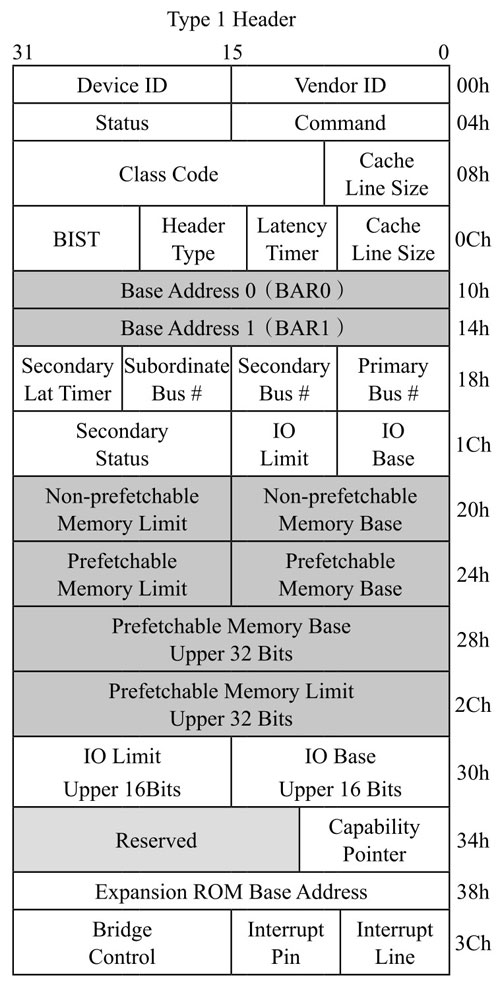
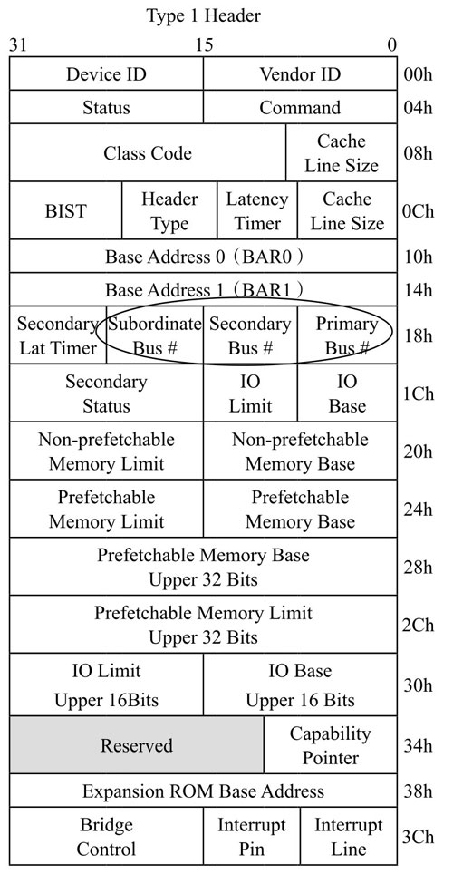

# TLP 路由

以下图所示的简单拓扑结构为例, 讨论**一个TLP**是怎样**从发起者到达接收者**, 即TLP的**路由问题**. 

## 三种路由方式

PCIe共有三种路由方式：

1. 基于**地址**(`Memory Address`)路由
2. 基于**设备ID**(`Bus Number + Device Number +Function Number`)路由
3. **隐式**(`Implicit`)路由

## 不同 TLP

**不同类型的TLP**, 其寻址**方式也不同**, 下表总结了每种TLP对应的路由方式.

# 地址路由

前面提到, **Switch** 负责**路由**和**TLP的转发**, 而**路由信息**是**存储**在 Switch 的 **Configuration 空间**的.

> 这里应该是指每个

因此, 很有必要先理解 Switch 的 Configuration(见图5-39). 

Type 1 Configuration Header:

BAR0 和 BAR1 没有什么好说, 跟前节讲的 Endpoint 的BAR意义一样, 存放 **Switch 内部空间**在主机内存空间映射基址. 

Switch 有**一个上游端口**(靠近RC)和**若干个下游端口**, **每个端口**其实是**一个 Bridge**, **都有一个 Configuration**, 每个Configuration 描述了**其下面连接设备空间映射的范围**, 分别由 `Memory Base` 和 `Memory Limit` 来表示.

* 对上游端口, 其 Configuration 描述的地址范围是它**下游所有设备**的**映射空间范围**;
* 对**每个下游端口**的 Configuration, 描述了连接它的端口设备的映射空间范围. 

> 下游往上游走的路径是唯一的, 直到 RC.

前面我们看到, Memory Read或者Memory Write TLP的Header里面都有一个地址信息, 该地址是PCIe设备内部空间在内存中的映射地址(见图5-40). 

地址路由3DW的TLP Header:

当一个Endpoint收到一个Memory Read或者Memory WriteTLP, 它会把TLP Header中的地址跟Configuration当中所有的BAR寄存器比较, 如果TLP Header中的地址落在这些BAR的地址空间, 那么它就认为该TLP是发给它的, 于是接收该TLP, 否则就忽略, 如图5-41所示. 

EP通过对比目的地址和自己的BAR决定是否接收该TLP:

当一个Switch上游端口收到一个Memory Read或者MemoryWrite TLP, 它首先把TLP Header中的地址跟它自己Configuration当中的所有BAR寄存器比较, 如果TLP Header当中的地址落在这些BAR的地址空间, 那么它就认为该TLP是发给它的, 于是接收该TLP(这个过程与Endpoint的处理方式一样); 如果不是, 则看这个地址是否落在其下游设备的地址范围内(是否在Memory Base和Memory Limit之间), 如果是, 说明该TLP是发给它下游设备的, 因此它要完成路由转发; 如果地址不落在下游设备的地方范围内, 说明该TLP不是发给它下游设备的, 则不接受该TLP, 如图5-42所示. 

Switch如何分配地址路由:

刚才的描述是针对TLP从Upstream流到Downstream的路由. 如果TLP从下游往上走呢？

它(某端口)首先把TLP Header中的地址跟它自己Configuration当中的所有BAR寄存器比较, 如果TLP Header当中的地址落在这些BAR的地址空间, 那么它就认为该TLP是发给它的, 于是接收该TLP(跟前面描述一样)；如果不是, 那就看这个地址是否落在其下游设备的地址范围内(是否在Memory Base和Memory Limit之间). 如果是, 这个时候不是接受, 而是拒绝；相反, 如果地址不落在下游设备的地址范围内, Switch则把该TLP传上去. 

# ID 路由

在一个PCIe拓扑结构中, 由ID=Bus Number+DeviceNumber+Function Number(BDF)能唯一找到某个设备的某个功能. 这种按设备ID号来寻址的方式叫作ID路由. Configuration TLP和Completion TLP(CplD)按ID路由寻址, Message在某些情况下也是ID路由. 

使用ID路由的TLP, 其TLP Header中含有BDF信息(见图5-43). 

使用ID路由的3DW TLP Header:

当一个Endpoint收到一个这样的TLP, 它用自己的ID和收到TLPHeader中的BDF比较, 如果是给自己的, 就收下TLP, 否则就拒绝. 

如果是一个Switch收到这样的一个TLP, 怎么处理？我们再回头看看Switch的Configuration Header(见图5-44). 

Type 1 Header:

注意：不是一个Switch对应一个Configuration空间(Type1 Header), 而是Switch的每个Port都有一个Configuration空间(Type 1 Header). 

看三个寄存器：Subordinate Bus Number、Secondary BusNumber和Primary Bus Number, 如图5-45所示. 

Primary Bus和Secondary Bus的概念:

对一个Switch来说, 每个Port靠近RC(上游)的那根Bus叫作Primary Bus, 其Number写在其Configuration Header中的Primary Bus Number寄存器；每个Port下面的那根Bus叫作Secondary Bus, 其Number写在其Configuration Header中的Secondary Bus Number寄存器；对上游端口, Subordinate Bus是其下游所有端口连接的Bus编号最大的那根Bus, Subordinate Bus Number写在每个Port的Configuration Header中的Subordinate Bus Number寄存器. 

当一个Switch收到一个基于ID寻址的TLP, 首先检查TLP中的BDF是否与自己的ID匹配, 如匹配, 说明该TLP是给自己的, 收下；否则, 检查该TLP中的Bus Number是否落在SecondaryBus Number和Subordinate Bus Number之间. 如果是, 说明该TLP是发给其下游设备的, 然后转发到对应的下游端口；如果是其他情况, 则拒绝这些TLP. 

Switch如何进行ID路由:

# 隐式路由

只有Message TLP才支持隐式路由. 在PCIe总线中, 有些Message是与RC通信的, RC是该TLP的发送者或者接收者, 因此没有必要明明白白地指定地址或者ID, 这种路由方式称为隐式路由. Message TLP还支持地址路由和ID路由, 但以隐式路由为主. 

Message TLP的Header总是4DW, 如图5-47所示. 

Message TLP的Header:

Type字段, 低3位, 由rrr表示, 指明该Message的路由方式, 具体如图5-48所示. 

Type域低3位决定了Message TLP路由方式:

当一个Endpoint收到一个Message TLP, 检查TLP Header, 如果是RC的广播Message(011b)或者该Message终结于它(100b), 它就接受该Message. 

当一个Switch收到一个Message TLP, 检查TLP Header, 如果是RC的广播Message(011b), 则往它每个下游端口复制该Message然后转发. 如果该Message终结于它(100b), 则接受该TLP. 如果下游端口收到发给RC的Message, 则往上游端口转发. 

上面说的是Message使用隐式路由的情况. 如果是地址路由或者ID路由, Message TLP的路由跟其他的TLP一样, 不再赘述. 
