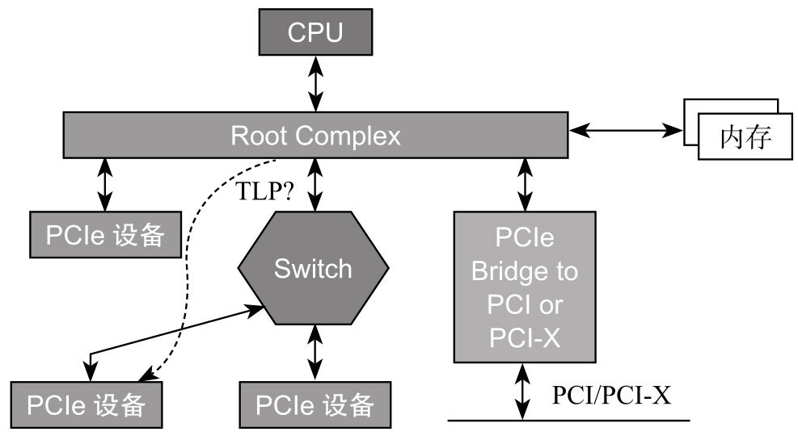
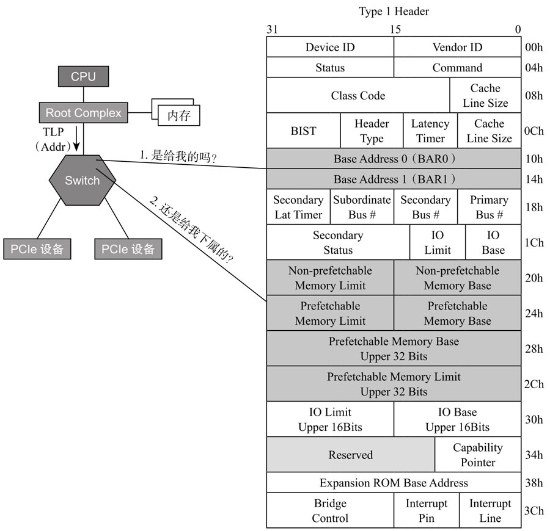

一个TLP是怎样历经千山万水，最后顺利抵达目的地的呢？

下面就以图5-38所示的简单拓扑结构为例，讨论一个TLP是怎样从发起者到达接收者，即TLP的路由问题。

TLP如何传输:

PCIe共有三种路由方式：基于地址（Memory Address）路由、基于设备ID（Bus Number + Device Number +Function Number）路由，还有就是隐式（Implicit）路由。

不同类型的TLP，其寻址方式也不同，表5-6总结了每种TLP对应的路由方式.

TLP路由方式:

下面分别讲述这几种路由方式。

# 地址路由

前面提到，Switch负责路由和TLP的转发，而路由信息是存储在Switch的Confi guration空间的，因此，很有必要先理解Switch的Confi guration（见图5-39）。

Type 1 Confi guration Header:

BAR0和BAR1没有什么好说，跟前节讲的Endpoint的BAR意义一样，存放Switch内部空间在主机内存空间映射基址。

Switch有一个上游端口（靠近RC）和若干个下游端口，每个端口其实是一个Bridge，都有一个Configuration，每个Configuration描述了其下面连接设备空间映射的范围，分别由Memory Base和Memory Limit来表示。对上游端口，其Configuration描述的地址范围是它下游所有设备的映射空间范围，而对每个下游端口的Configuration，描述了连接它端口设备的映射空间范围。

前面我们看到，Memory Read或者Memory Write TLP的Header里面都有一个地址信息，该地址是PCIe设备内部空间在内存中的映射地址（见图5-40）。

地址路由3DW的TLP Header:

当一个Endpoint收到一个Memory Read或者Memory WriteTLP，它会把TLP Header中的地址跟Configuration当中所有的BAR寄存器比较，如果TLP Header中的地址落在这些BAR的地址空间，那么它就认为该TLP是发给它的，于是接收该TLP，否则就忽略，如图5-41所示。

EP通过对比目的地址和自己的BAR决定是否接收该TLP:

当一个Switch上游端口收到一个Memory Read或者MemoryWrite TLP，它首先把TLP Header中的地址跟它自己Configuration当中的所有BAR寄存器比较，如果TLP Header当中的地址落在这些BAR的地址空间，那么它就认为该TLP是发给它的，于是接收该TLP（这个过程与Endpoint的处理方式一样）; 如果不是，则看这个地址是否落在其下游设备的地址范围内（是否在Memory Base和Memory Limit之间），如果是，说明该TLP是发给它下游设备的，因此它要完成路由转发; 如果地址不落在下游设备的地方范围内，说明该TLP不是发给它下游设备的，则不接受该TLP，如图5-42所示。

Switch如何分配地址路由:

刚才的描述是针对TLP从Upstream流到Downstream的路由。如果TLP从下游往上走呢？

它（某端口）首先把TLP Header中的地址跟它自己Configuration当中的所有BAR寄存器比较，如果TLP Header当中的地址落在这些BAR的地址空间，那么它就认为该TLP是发给它的，于是接收该TLP（跟前面描述一样）；如果不是，那就看这个地址是否落在其下游设备的地址范围内（是否在Memory Base和Memory Limit之间）。如果是，这个时候不是接受，而是拒绝；相反，如果地址不落在下游设备的地址范围内，Switch则把该TLP传上去。