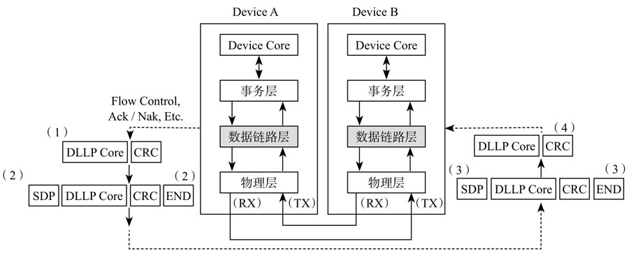
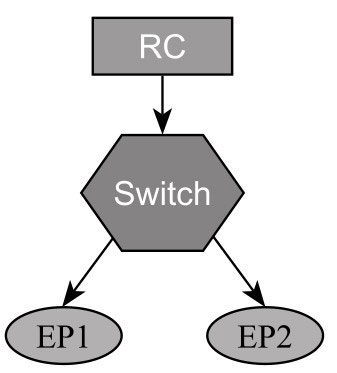
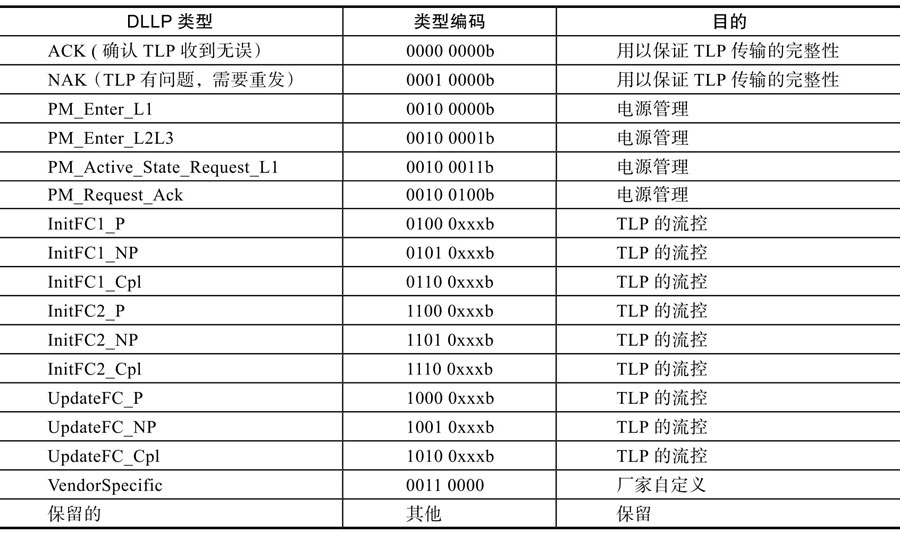
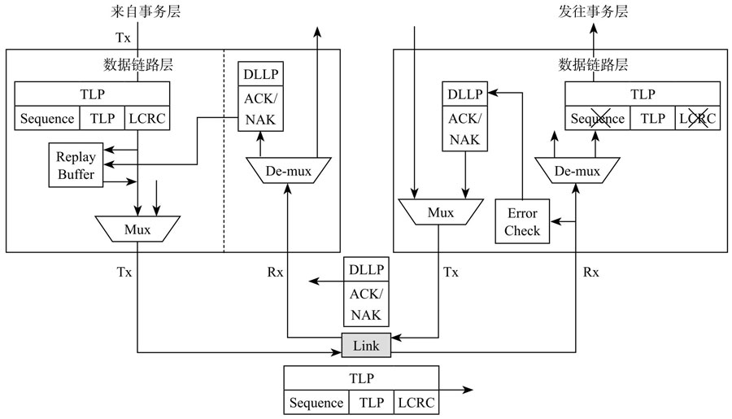

前面看到，一个TLP源于事务层，终于事务层。但TLP不是从发送端一步就跑到接收端，它经由发送端的数据链路层和物理层，然后是接收端的物理层和数据链路层，最终完成TLP的发送和接收。

数据链路层位于事务层的下一层，理所当然为事务层服务。那么，数据链路层在TLP传输过程中起了什么作用呢？

发送端: 数据链路层接收上层传来的TLP，它给每个TLP加上Sequence Number(序列号，下文都用“序列号”来阐述)和LCRC(Link CRC)，然后转交给物理层。

接收端: 数据链路层接收物理层传来的TLP，检测CRC和序列号，如果有问题，会拒绝接收该TLP，即不会传到它的事务层，并且通知发送端重传; 如果该TLP没有问题，数据链路层则去除TLP中的序列号和LCRC，交由它的事务层，并通知发送端TLP正确接收。

从上面的描述可以看出，数据链路层保证了TLP在数据总线上的正常传输，并使用了握手协议(Ack/Nak)和重传(Retry)机制来保证数据传输的一致性和完整性。

数据链路层的作用，除了保证TLP数据包的正确传输，还包括TLP流量控制和电源管理等功能。数据链路层借助DLLP来完成这些功能，如图5-49所示

数据链路层在协议栈中的位置和作用:

DLLP(Data Link Layer Packet，数据链路层的数据包)源于发送端的数据链路层，终于接收端的数据链路层，因此，处于高层的事务层是感知不到它的存在的。

发送端: 数据链路层生成DLLP，交由物理层，物理层加起始(SDP)和结束标志(GEN 1/2加END, GEN3则没有)，然后物理传输到对方。

接收端: 物理层对DLLP掐头去尾，交由数据链路层，数据链路层对DLLP进行校验，不管正确与否，DLLP都终于这层。

与事务层TLP传输不同，数据链路层只处理端到端的数据传输。一个TLP，可以翻山越岭(经过若干个Switch)，从一个设备传输到相隔很远的设备。但DLLP的传输，仅限于相邻的两个端口。因此，DLLP中不需要包含路由信息，即不需要告诉我这个DLLP是哪个设备发起的，以及要发送给哪个目标设备。

如图5-50所示，一个TLP可以从RC传到EP1，但DLLP的传输只限于RC与Switch上游Port, Switch的上游Port与下游Port，以及Switch下游Port与EP1(或者EP2)。

简单的PCIe系统示例:

数据链路层主要有四大类型DLLP: 

* 用以确保TLP传输完整性的DLLP: ACK/NAK;

* 流控相关的DLLP; 

* 电源管理相关的DLLP; 

* 厂家自定义DLLP。

具体如表5-7所示。

DLLP类型:

DLLP大小为6B(物理层上加上头尾，传输的是8B)，格式如图5-51所示。

6B DLLP格式:

不同类型的DLLP，格式相同，内容不一样。

# ACK/NAK 协议

首先，我们来看ACK/NAK DLLP，其格式如下(见图5-52)。

ACK/NAK DLLP格式:

数据链路层通过ACK/NAK协议来保证每个TLP的正确传输，其基本原理为: TLP发送端的数据链路层为每个TLP加上序列号和LCRC，在该TLP被接收端正确收到之前，它会一直保持在一个叫Replay Buffer的接口里面。TLP接收端的数据链路层接收到该TLP后，做CRC校验和序列号检查，如果没有问题，TLP接收端(可能)会生成和发送ACK DLLP, TLP发送方接收到ACK后，知道TLP被正确接收，因此它会把相关的TLP从Replay Buffer中清除; 如果TLP接收方检测到TLP有错误，则会生成和发送NAKDLLP，TLP发送方接收到NAK后，知道有TLP传输出错，会重新发送Replay Buffer相关的TLP给对方。TLP传输出错往往是瞬态的，重传基本能保证TLP传输正确。TLP接收方只有收到正确的TLP才会去掉序列号和LCRC，并把TLP交给它的事务层。

前面提到，没有收到ACK的TLP，发送端的链路层都会把它(包括序列号和LCRC)放在Replay Buffer中。在接收端，当成功收到一个TLP后，它的序列号加1，设置为下一个期望接收到的TLP序列号。

假设当前发送端Replay Buffer中有序列号分别为10、11、12、13的4个TLP，即这些TLP发送出去了，但还没有得到响应。

假设接收端上一个成功接收到的TLP序列号为11，期望下个接收到的TLP序列号为12。这时，接收端接收到一个TLP，首先，它会对该TLP做LCRC校验: 

(1)校验失败

TLP接收端会发送一个NAK，其中AckNak_SEQ_NUM设为11。TLP发送端接收到该NAK后，知道11和它之前的TLP(这里是TLP 10)被成功接收，因此TLP 10和TLP 11会从ReplayBuffer清掉(不需要重发)。同时，它知道12和后面的TLP(这里是TLP 13)没有被成功接收，因此它们会重发。

(2)校验成功

CRC没有问题，接下来就检查TLP的序列号了。这里有三种情况: 

* TLP接收端发现收到的TLP序列号为12，与预期相符。TLP接收端可能需要发一个ACK，也可能不需要发ACK。为什么这么说？为减少数据链路层DLLP的传输，可能设置正确接收到若干个TLP后，才会返回一个ACK，并非每成功接收一个TLP，就返回一个ACK。假设这个时候需要返回ACK，则设AckNak_SEQ_NUM为12。TLP发送端接收到该ACK，知道TLP 12和它之前所有的TLP都被成功接收，因此TLP 10、TLP 11和TLP 12会从Replay Buffer清掉。
* TLP接收端发现收到的TLP序列号为13，与预期不符(预期为TLP 12)。TLP接收端希望接收到的TLP为12，这个时候收到的却是13，说明TLP 12在半路丢了，发生丢包。这个时候，接收端会发一个NAK，其中AckNak_SEQ_NUM设为11(即上一个成功被接收的TLP序列号)。TLP发送端接收到该DLLP后，知道TLP 11和它之前所有的TLP都被成功接收，因此TLP 10和TLP 11会从Replay Buffer清掉，并重发TLP 12和它后面的TLP(这里是TLP 13)。
* TLP接收端发现收到的TLP序列号为10，与预期不符(预期为TLP 12)。TLP上次正确接收到的是TLP 11，这次又收到一个序列号比它小的TLP，为什么会这样？原因是在TLP发送端，一个TLP在一定时间内没有收到ACK，它会自动重发所有Hold在Replay Buffer中的TLP。由于发送端的这个超时重发机制，导致一个TLP会被接收端接收到两次或者更多次(如果接收端一直不能及时响应)。TLP接收端如果收到重复的TLP包，它会默默扔掉这些重复的TLP，并发送ACK，其中的AckNak_SEQ_NUM设为11。TLP发送端接收到该DLLP后，知道TLP 11和它之前所有的TLP都被成功接收，因此TLP 10和TLP 11会从Replay Buffer清掉。

图5-53是数据链路层内部框图，从中我们可以看到ACK/NAK是怎样实现的。

数据链路层内部框图:

数据链路层通过ACK/NAK协议和TLP重传机制，保障了TLP传输的数据完整性。

问题来了，每个DLLP在接收端也需要做CRC校验，那如果DLLP出错了怎么办？接收端会丢弃出错的DLLP，并通过下一个成功的DLLP更新之前丢失的信息。读者可根据上面的例子自行分析。

2. TLP流控(流量控制，Flow Control)

我们再看看跟流控相关的DLLP，其格式如图5-54所示。

流控DLLP格式:

我们不打算对每个流控DLLP展开解释，这里只简单说说TLP流控机制。

TLP的发送端不能随便向对方发送TLP，因为接收端处理TLP的速度可能赶不上发送TLP的速度。接收端如果没有足够空间接受该TLP的话，就会拒绝该TLP，发送端必须重复发送该TLP直到对方接受，这在一定程度上影响了通信的效率。PCIe有一套流控机制，来保证TLP的发送和接收是高效的。

TLP流控基于Credit。每个TLP都有一定大小，发送者在发送前，先看看对方是否有足够的空间来接纳该TLP，如果有，则发送过去，否则就Hold在那里，直到对方有足够的空间再发。那发送者怎样才能知道对方有多少空间呢？PCIe使用流控DLLP来告知。接收端会时不时通过DLLP来告诉对方我有多少TLP接收空间，然后发送端依据此信息决定是不是生成TLP并发送过去，如图5-55所示。

TLP接收者通过流控DLLP告知发送者可用TLP接收空间:

需要注意的是，这里的流控是针对TLP传输而言。DLLP的传输是不需要流控的，因为每个DLLP的大小只有六个字节，跟TLP相比非常迷你。如果DLLP需要流控，那就麻烦了。TLP的流控是通过DLLP来实现的，如果DLLP还需要流控，那又有谁来帮忙实现呢？

# 电源管理

最后是跟电源管理相关的DLLP(见图5-56)。

电源管理DLLP格式:

关于电源管理，请查看第8章，在这里不做解释。