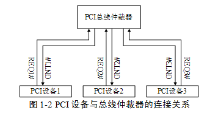

<!-- @import "[TOC]" {cmd="toc" depthFrom=1 depthTo=6 orderedList=false} -->

<!-- code_chunk_output -->

* [1. 地址和数据信号](#1-地址和数据信号)
* [2. 接口控制信号](#2-接口控制信号)
* [3. 仲裁信号](#3-仲裁信号)
* [4. 中断请求等其他信号](#4-中断请求等其他信号)

<!-- /code_chunk_output -->

PCI总线是一条共享总线，在**一条PCI总线上可以挂接多个PCI设备**。**这些PCI设备通过一系列信号与PCI总线相连**，这些信号由地址/数据信号、控制信号、仲裁信号、中断信号等多种信号组成。

**PCI总线是一个同步总线，每一个设备都具有一个CLK信号**，其**发送设备与接收设备使用这个CLK信号进行同步数据传递**。PCI总线可以使用33MHz或者66MHz的时钟频率，而PCI-X总线可以使用133MHz、266MHz或者533MHz的时钟频率。

除了RST#、INTA\~D#、PME#和CLKRUN#等信号之外，PCI设备使用的绝大多数信号需要与CLK信号同步。其中RST#是复位信号，PCI设备使用INTA\~D#信号进行中断请求。本篇并不关心PME#和CLKRUN#信号。

## 1. 地址和数据信号

在PCI总线中，与地址和数据相关的信号如下所示。

(1) AD[31:0]信号

PCI总线复用地址与数据信号。PCI总线事务在启动后的第一个时钟周期传送地址，这个地址是PCI总线域的存储器地址或者I/O地址; 而在下一个时钟周期传送数据(双地址周期在第一、二个时钟周期，都传送地址)。传送地址的时钟周期也被称为地址周期，而传送数据的时钟周期也被称为数据周期。PCI总线支持突发传送，即在一个地址周期之后，可以紧跟多个数据周期。

(2) PAR信号

PCI总线使用奇偶校验机制，保证地址和数据信号在进行数据传递时的正确性。PAR信号是AD[31:0]和C/BE[3:0]的奇偶校验信号。PCI主设备在地址周期和数据周期中，使用该信号为地址和数据信号线提供奇偶校验位。

(3) C/BE[3:0]#信号

PCI总线复用命令与字节选通引脚。在地址周期中，C/BE[3:0]信号表示PCI总线的命令。而在数据周期，C/BE[3:0]引脚输出字节选通信号，其中C/BE3、C/BE2、C/BE1和C/BE0与数据的字节3、2、1和0对应。使用这组信号可以对PCI设备进行单个字节、字和双字访问。PCI总线通过C/BE[3:0]#信号定义了多个总线事务，这些总线事务如表1‑2所示。 

## 2. 接口控制信号

在PCI总线中，接口控制信号的主要作用是保证数据的正常传递，并根据PCI主从设备的状态，暂停、终止或者正常完成当前总线事务，其主要信号如下。

(1) FRAME#信号

该信号指示一个PCI总线事务的开始与结束。当PCI设备获得总线的使用权后，将置该信号有效，即置为低，启动PCI总线事务，当结束总线事务时，将置该信号无效，即置为高。PCI设备(HOST主桥)只有通过仲裁获得当前PCI总线的使用权后，才能驱动该信号。

(2) IRDY#信号

该信号由PCI主设备(包括HOST主桥)驱动，该信号有效时表示PCI主设备的数据已经准备完毕。如果当前PCI总线事务为写事务，表示数据已经在AD[31:0]上有效; 如果为读事务，表示PCI目标设备已经准备好接收缓冲，目标设备可以将数据发送到AD[31:0]上。

(3) TRDY#信号

该信号由目标设备驱动，该信号有效时表示目标设备已经将数据准备完毕。如果当前PCI总线事务为写事务，表示目标设备已经准备好接收缓冲，可以将AD[31:0]上的数据写入目标设备; 如果为读事务，表示PCI设备需要的数据已经在AD[31:0]上有效。

该信号可以和IRDY#信号联合使用，在PCI总线事务上插入等待周期，对PCI总线的数据传送进行控制。

(4) STOP#信号

该信号有效时表示目标设备请求主设备停止当前PCI总线事务。一个PCI总线事务除了可以正常结束外，目标设备还可以使用该信号终止当前PCI总线事务。目标设备可以根据不同的情况，要求主设备对当前PCI总线事务进行重试(Retry)、断连(Disconnect)，也可以向主设备报告目标设备夭折(Target Abort)。

目标设备要求主设备Retry和Disconnect并不意味着当前PCI总线事务出现错误。当目标设备没有将数据准备好时，可以使用Retry周期使主设备重试当前PCI总线事务。有时目标设备不能接收来自主设备较长的Burst操作时，可以使用Disconnect周期，将一个较长的Burst操作，分解为多个Burst操作。当主设备访问的地址越界时，目标设备可以使用Disconnect周期，终止主设备的越界访问。

而Target Abort表示在数据传送中出现错误。处理器系统必须要对这种情况进行处理。在PCI总线中，出现Abort一般意味着当前PCI总线域出现了较为严重的错误。

(5) IDSEL信号

PCI总线在进行配置读写总线事务时，使用该信号选择PCI目标设备。配置读写总线事务与存储器读写总线事务在实现上略有不同。在PCI总线中，存储器读写总线事务使用地址译码方式访问外部设备。而配置读写总线事务使用“ID译码方式”访问PCI设备，即通过PCI设备的总线号、设备号和寄存器号访问PCI设备的配置空间。

IDSEL信号与PCI设备的设备号相关，相当于PCI设备配置空间的片选信号，这部分内容将在第2.4.4节中详细介绍。

(6) DEVSEL#信号

该信号有效时表示PCI总线的目标设备准备好，该信号与TRDY#信号不同之处在于该信号有效仅表示目标设备已经完成了地址译码。目标设备使用该信号通知PCI主设备，其访问对象在当前PCI总线上，但是并不表示目标设备可以与主设备进行数据交换。而TRDY#信号表示数据有效，PCI主设备可以向目标设备写入或者从目标设备读取数据。

PCI总线规范根据设备进行译码速度的快慢，将PCI设备分为快速、中速和慢速三种设备。在PCI总线上还有一种特殊的设备，即负向译码设备，在一条PCI总线上当快速、中速和慢速三种设备都不能响应PCI总线事务的地址时，负向译码设备将被动地接收这个PCI总线事务。如果在PCI主设备访问的PCI总线上，没有任何设备可以置DEVSEL#信号为有效，主设备将使用Master Abort周期结束当前总线事务。

(7) LOCK#信号

PCI主设备可以使用该信号，将目标设备的某个存储器或者I/O资源锁定，以禁止其他PCI主设备访问此资源，直到锁定这个资源的主设备将其释放。PCI总线使用LOCK#信号实现LOCK总线事务，只有HOST主桥、PCI桥或者其他桥片可以使用LOCK#信号。在PCI总线的早期版本中，PCI Agent设备也可以使用LOCK#信号，而目前PCI总线使用LOCK#信号仅是为防止死锁和向前兼容。LOCK总线事务将严重影响PCI总线的传送效率，在实际应用中，设计者应当尽量避免使用该总线事务。

## 3. 仲裁信号

PCI设备使用该组信号进行总线仲裁，并获得PCI总线的使用权。只有PCI主设备需要使用该组信号，而PCI从设备可以不使用总线仲裁信号。这组信号由REQ#和GNT#组成。其中PCI主设备的REQ#和GNT#信号与PCI总线的仲裁器直接相连。

PCI主设备的总线仲裁信号与PCI总线仲裁器的连接关系如图1‑2所示。值得注意的是，每一个PCI主设备都具有独立的总线仲裁信号，并与PCI总线仲裁器一一相连。而总线仲裁器需要保证在同一个时间段内，只有一个PCI设备可以使用当前总线。 

在一个处理器系统中，一条PCI总线可以挂接PCI主设备的数目，除了与负载能力相关之外，还与PCI总线仲裁器能够提供的仲裁信号数目直接相关。

在一颗PCI总线树中，每一条PCI总线上都有一个总线仲裁器。一个处理器系统可以使用PCI桥扩展出一条新的PCI总线，这条新的PCI总线也需要一个总线仲裁器，通常在PCI桥中集成了这个总线仲裁器。多数HOST主桥也集成了一个PCI总线仲裁器，但是PCI总线也可以使用独立的PCI总线仲裁器。

PCI主设备使用PCI总线进行数据传递时，需要首先置REQ#信号有效，向PCI总线仲裁器发出总线申请，当PCI总线仲裁器允许PCI主设备获得PCI总线的使用权后，将置GNT#信号为有效，并将其发送给指定的PCI主设备。而PCI主设备在获得总线使用权之后，将可以置FRAME#信号有效，与PCI从设备进行数据通信。

## 4. 中断请求等其他信号

**PCI总线提供了INTA#、INTB#、INTC#和INTD#四个中断请求信号**，PCI设备借助这些中断请求信号，使用电平触发方式向处理器提交中断请求。当这些中断请求信号为低时，PCI设备将向处理器提交中断请求; 当处理器执行中断服务程序清除PCI设备的中断请求后，PCI设备将该信号置高(INTx#这组信号为开漏输出，当所有的驱动源不驱动该信号时，该信号由上拉电阻驱动为高)，结束当前中断请求。

PCI总线规定单功能设备只能使用INTA#信号，而多功能设备才能使用INTB#/C#/D#信号。PCI设备的这些中断请求信号可以通过某种规则进行线与，之后与中断控制器的中断请求信号线相连。而处理器系统需要预先知道这个规则，以便正确处理来自不同PCI设备的中断请求，这个规则也被称为中断路由表，有关中断路由表的详细描述见第1.4.2节。

PCI总线在进行**数据传递过程**时，难免会出现**各种各样的错误**，因此**PCI总线提供了一些错误信号，如PERR#和SERR#信号**。其中当PERR#信号有效时，表示数据传送过程中出现奇偶校验错(Special Cycle周期除外); 而当SERR#信号有效时，表示当前处理器系统出现了三种错误可能，分别为地址奇偶校验错，在Special Cycle周期中出现数据奇偶校验错，或者系统出现其他严重错误。

如果PCI总线支持64位模式，还需要提供AD[63:32]、C/BE[7:4]、REQ64、ACK64和PAR64这些信号。此外PCI总线还有一些与JTAG、SMBCLK以及66MHz使能等信号，本章并不关心这些信号。