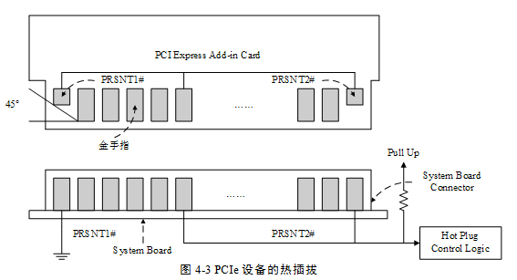

<!-- @import "[TOC]" {cmd="toc" depthFrom=1 depthTo=6 orderedList=false} -->

<!-- code_chunk_output -->

- [1 端到端的数据传递](#1-端到端的数据传递)
- [2 PCIe总线使用的信号](#2-pcie总线使用的信号)
  - [2.1 PERST#信号](#21-perst信号)
  - [2.2 REFCLK+和REFCLK-信号](#22-refclk和refclk-信号)
  - [2.3 WAKE#信号](#23-wake信号)
  - [2.4 SMCLK和SMDAT信号](#24-smclk和smdat信号)
  - [2.5 JTAG信号](#25-jtag信号)
  - [2.6 PRSNT1#和PRSNT2#信号](#26-prsnt1和prsnt2信号)
- [3 PCIe总线的层次结构](#3-pcie总线的层次结构)
  - [3.1 事务层](#31-事务层)
  - [3.2 数据链路层](#32-数据链路层)
  - [3.3 物理层](#33-物理层)
- [4 PCIe链路的扩展](#4-pcie链路的扩展)

<!-- /code_chunk_output -->

与PCI总线不同PCIe总线使用**端到端的连接方式**在一条**PCIe链路**的两端只能**各连接一个设备**这两个设备**互为数据发送端和数据接收端**. PCIe总线除了**总线链路**外还具有多个层次发送端发送数据时将通过这些层次而接收端接收数据时也使用这些层次. **PCIe总线使用的层次结构与网络协议栈较为类似**. 

# 1 端到端的数据传递

PCIe链路使用"端到端的数据传送方式"**发送端**和**接收端**中都含有**TX(发送逻辑**)和**RX(接收逻辑**)其结构如图4‑1所示. 

由上图所示在**PCIe总线的物理链路**的一个**数据通路(Lane！！！可能有多个数据通路！！！**)中由**两组！！！差分信号**共**4根信号线！！！组成**. 

- 其中**发送端的TX部件**与**接收端的RX部件**使用**一组差分信号！！！**连接该**链路**也被称为**发送端的发送链路**也是**接收端的接收链路**; 
- 而**发送端的RX部件**与**接收端的TX部件**使用**另一组差分信号**连接该链路也被称为发送端的接收链路也是接收端的发送链路. 

**一个PCIe链路(物理链路**)可以由**多个Lane**组成. 

**高速差分信号电气规范**要求其**发送端(！！！)串接一个电容**以进行AC耦合. 该电容也被称为AC耦合电容. **PCIe链路**使用**差分信号进行数据传送(！！！**)**一个差分信号**由**D\+和D\-两根信号**组成**信号接收端**通过**比较这两个信号的差值**判断**发送端**发送的是**逻辑"1**"还是**逻辑"0**". 

与单端信号相比**差分信号抗干扰的能力更强**因为**差分信号**在**布线(！！！**)时要求"**等长**"、"**等宽**"、"**贴近**"而且在**同层**. 因此**外部干扰噪声**将被"**同值**"而且"**同时**"加载到**D\+和D\-两根信号**上其**差值**在**理想情况下为0**对**信号的逻辑值产生的影响较小(！！！**). 因此差分信号可以使用**更高的总线频率**. 

此外使用**差分信号**能**有效抑制电磁干扰EMI(Electro Magnetic Interference**). 由于差分信号D\+与D\-距离很近而且信号幅值相等、极性相反. 这两根线与地线间耦合电磁场的幅值相等将相互抵消因此差分信号对外界的电磁干扰较小. 当然差分信号的缺点也是显而易见的一是**差分信号**使用**两根信号**传送**一位数据**; 二是差分信号的**布线相对严格一些**. 

PCIe链路可以由**多条Lane！！！** 组成目前PCIe链路可以支持**1、2、4、8、12、16和32个Lane**即**×1**、×2、×4、×8、×12、×16和**×32** 宽度的 **PCIe链路**. **每一个Lane**上**使用的总线频率**与**PCIe总线使用的版本**相关. 

第1个PCIe总线规范为V1.0之后依次为V1.0aV1.1V2.0和V2.1. 目前PCIe总线的最新规范为V2.1而V3.0正在开发过程中预计在2010年发布. 不同的PCIe总线规范所定义的总线频率和链路编码方式并不相同如表4\‑1所示. 

表4\‑1 **PCIe总线规范**与**总线频率**和**编码**的关系

<table>
    <tr>
        <th rowspan="2">PCIe总线规范</th>
        <th rowspan="2">总线频率</th>
        <th rowspan="2">单Lane的峰值带宽</th>
        <th rowspan="2">编码方式</th>
        <th rowspan="1", colspan="4">吞吐量
            <tr>
                <th>x1</th>
                <th>x4</th>
                <th>x8</th>
                <th>x16</th>
            </tr>
        </th>
    </tr>
    <tr>
        <th>1.x</th>
        <th>1.25GHz</th>
        <th>2.5GT/s</th>
        <th>8/10b编码</th>
        <th>250MB/s</th>
        <th>1GB/s</th>
        <th>2GB/s</th>
        <th>4GB/s</th>
    </tr>
    <tr>
        <th>2.x</th>
        <th>2.5GHz</th>
        <th>5GT/s</th>
        <th>8/10b编码</th>
        <th>500MB/s</th>
        <th>2GB/s</th>
        <th>4GB/s</th>
        <th>8GB/s</th>
    </tr>
    <tr>
        <th>3.x</th>
        <th>4GHz</th>
        <th>8GT/s</th>
        <th>128/130b编码</th>
        <th>984.6MB/s</th>
        <th>3.938GB/s</th>
        <th>7.877GB/s</th>
        <th>15.754GB/s</th>
    </tr>
    <tr>
        <th>4.x</th>
        <th>8GHz</th>
        <th>16GT/s</th>
        <th>128/130b编码</th>
        <th>1.969GB/s</th>
        <th>7.877GB/s</th>
        <th>15.754GB/s</th>
        <th>31.508GB/s</th>
    </tr>
    <tr>
        <th>5.x</th>
        <th>16GHz</th>
        <th>32 or 25GT/s</th>
        <th>128/130b编码</th>
        <th>3.9 or 3.08GB/s</th>
        <th>15.8 or 12.3GB/s</th>
        <th>31.5 or 24.6GB/s</th>
        <th>63.0 or 49.2GB/s</th>
    </tr>
</table>

目前最新量产使用的是PCIe 3.x

注: 这里的**总线频率**指的是**差分信号**按照**逻辑"0**"和"**1**"**连续变化时的频率(！！！**)

1GHz是10\^9(10的9次方), **每秒10\^9次变化**

**PCIe 3.0**的**总线频率4GHz**, 即**每秒变化4 x (10的9次方)次**; **一个数据通路(Lane**)有**两组差分信号**, 两两分组, **每组一次1位**, 也就是说**一次可以传输2 bit**, 也就是说每条数据通路(Lane)每秒传输8 x (10的9次方)次, 这就是上面的**单Lane的峰值带宽(！！！次数概念！！！**); 一个数据通路(Lane)**每秒传输8 x (10的9次方)个bit**, 即**每一条Lane 上支持每秒钟内传输 8G个bit**; 由于编码是128/130b, 所以**每一条Lane支持 8 \* 128 / 130 = 7876923080 bps = 984615385 B/s ≈ 984.6MB/s**. 也就是上面的吞吐量

GT/s是Giga Transmissionper second (千兆传输/秒)即**每一秒内传输的次数(！！！没有单位的, 只是次数！！！**). 重点在于描述物理层通信协议的速率. 

Gbps —— Giga Bits Per Second (千兆位/秒). 

GT/s 与Gbps 之间不存在成比例的换算关系. GT/s着重描述端口的速率属性可以不和链路宽度等关联这样来描述"可以进行链路宽度扩展"的高速串行接口更为合适一些.  需要结合具体的物理层通信协议来分析. 

例如: **PCI\-e2.0** 协议支持**5.0 GT/s**, 即**每一条Lane 上支持每秒钟内传输 5G个bit(5Gbps**); 但这**并不意味着 PCIe 2.0协议的每一条Lane支持 5Gbps 的速率(！！！**). 为什么这么说呢? 因为PCIe 2.0 的物理层协议中使用的是 **8b/10b的编码机制**.  即**每传输8个bit需要发送10个bit**; 这**多出的2个bit**并**不是对上层有意义的信息**.  那么**PCIe 2.0**协议的**每一条Lane支持 5 \* 8 / 10 = 4Gbps 的速率(！！！**).  以一个PCIe 2.0 x8的通道为例x8的可用带宽为 4 \* 8 = 32 Gbps. 

如上表所示**不同的PCIe总线规范**使用的**总线频率并不相同**其使用的**数据编码方式也不相同**. PCIe总线**V1.x和V2.0规范**在**物理层**中使用**8/10b编码**即在****PCIe链路****上的**10 bit**中含有**8 bit的有效数据**; 而**V3.0**规范使用**128/130b**编码方式即在PCIe链路上的**130 bit**中含有**128 bit的有效数据**. 

由上表所示**V3.0规范**使用的**总线频率**虽然只有**4GHz**但是其**有效带宽**是**V2.x的两倍**. 下文将以**V2.x规范**为例说明**不同宽度PCIe链路**所能提供的**峰值带宽**如表4‑2所示. 

表4\‑2 PCIe V2.x总线的峰值带宽

PCIe总线的数据位宽 | ×1 | ×2 | ×4 | ×8 | ×12 | ×16 | ×32
---|---|---|---|---|---|---|---
峰值带宽(GT/s) | 5 | 10 | 20 | 40 | 60 | 80 | 160

由上表所示**×32的PCIe链路**可以提供**160GT/s的链路带宽**远高于PCI/PCI\-X总线所能提供的峰值带宽. 而即将推出的**PCIe V3.0**规范使用**4GHz**的总线频率将进一步提高PCIe链路的峰值带宽. 

在**PCIe总线**中使用**GT(Gigatransfer**)计算**PCIe链路的峰值带宽**. GT是在PCIe链路上传递的峰值带宽其计算公式为**总线频率**×**数据位宽**×**2**. 

在PCIe总线中影响有效带宽的因素有很多因而其有效带宽较难计算这部分内容详见第8.4.1节. 尽管如此PCIe总线提供的有效带宽还是远高于PCI总线. PCIe总线也有其**弱点**其中最突出的问题是**传送延时**. 

PCIe链路使用**串行方式**进行**数据传送**然而在**芯片内部****数据总线**仍然是**并行**的因此**PCIe链路接口**需要进行**串并转换(！！！**)这种串并转换将产生**较大的延时**. 除此之外PCIe总线的**数据报文**需要经过**事务层**、**数据链路层**和**物理层**这些数据报文在穿越这些层次时也将带来**延时**. 本书将在第8.4节详细讨论PCIe总线的延时与带宽之间的联系. 

在**基于PCIe总线的设备**中**×1的PCIe链路**最为常见而**×12的PCIe链路**极少出现×4和×8的PCIe设备也不多见. **Intel**通常在**ICH**中集成了**多个×1的PCIe链路**用来**连接低速外设**而在**MCH**中集成了**一个×16的PCIe链路**用于连接**显卡控制器**. 而PowerPC处理器通常能够支持×8、×4、×2和×1的PCIe链路. 

PCIe总线**物理链路**间的**数据传送**使用**基于时钟的同步传送机制(！！！**)但是在**物理链路(！！！**)上并**没有时钟线(！！！**)PCIe总线的**接收端**含有**时钟恢复模块CDR(Clock Data Recovery**)CDR将从**接收报文**中提取**接收时钟**从而进行**同步数据传递**. 

值得注意的是在一个PCIe设备中除了需要从报文中提取时钟外还使用了REFCLK\+和REFCLK\-信号对作为本地参考时钟这个信号对的描述见下文. 

# 2 PCIe总线使用的信号

PCIe设备使用**两种电源信号供电**分别是Vcc与Vaux(大写V, 右下角cc和aux)其额定**电压为3.3V**. 其中**Vcc为主电源**PCIe设备使用的**主要逻辑模块**均使用**Vcc供电**而一些**与电源管理相关的逻辑**使用**Vaux供电**. 在PCIe设备中**一些特殊的寄存器**通常使用**Vaux供电**如Sticky Register此时即使PCIe设备的Vcc被移除这些与电源管理相关的逻辑状态和这些特殊寄存器的内容也不会发生改变. 

在PCIe总线中使用Vaux的主要原因是为了**降低功耗**和**缩短系统恢复时间**. 因为Vaux在多数情况下并不会被移除因此当PCIe设备的Vcc恢复后该设备不用重新恢复使用Vaux供电的逻辑从而设备可以很快地恢复到正常工作状状态. 

**PCIe链路**的**最大宽度为×32**但是在实际应用中×32的链路宽度极少使用. 在一个处理器系统中一般提供**×16的PCIe插槽(！！！**)并使用PETp0\~15、PETn0\~15和PERp0\~15、PERn0\~15共**64根信号线(！！！**)组成**32对差分信号(！！！**)其中**16对PETxx信号**用于**发送链路**另外16对PERxx信号用于接收链路. 除此之外PCIe总线还使用了下列**辅助信号**. 

## 2.1 PERST#信号

该信号为全局复位信号由处理器系统提供处理器系统需要为PCIe插槽和PCIe设备提供该复位信号. PCIe设备使用该信号复位内部逻辑. 当该信号有效时PCIe设备将进行复位操作. PCIe总线定义了多种复位方式其中Cold Reset和Warm Reset这两种复位方式的实现与该信号有关详见第4.1.5节. 

## 2.2 REFCLK+和REFCLK-信号

在一个处理器系统中可能含有许多PCIe设备这些设备可以作为Add-In卡与PCIe插槽连接也可以作为内置模块与处理器系统提供的PCIe链路直接相连而不需要经过PCIe插槽. PCIe设备与PCIe插槽都具有REFCLK+和REFCLK-信号其中PCIe插槽使用这组信号与处理器系统同步. 

在一个处理器系统中通常采用专用逻辑向PCIe插槽提供REFCLK+和REFCLK-信号如图4\‑2所示. 其中100Mhz的时钟源由晶振提供并经过一个"一推多"的差分时钟驱动器生成多个同相位的时钟源与PCIe插槽一一对应连接. 

PCIe插槽需要使用参考时钟其频率范围为100MHz±300ppm. 处理器系统需要为每一个PCIe插槽、MCH、ICH和Switch提供参考时钟. 而且要求在一个处理器系统中时钟驱动器产生的参考时钟信号到每一个PCIe插槽(MCH、ICH和Swith)的距离差在15英寸之内. 通常信号的传播速度接近光速约为6英寸/ns由此可见不同PCIe插槽间REFCLK+和REFCLK-信号的传送延时差约为2.5ns. 

当PCIe设备作为Add-In卡连接在PCIe插槽时可以直接使用PCIe插槽提供的REFCLK+和REFCLK-信号也可以使用独立的参考时钟只要这个参考时钟在100MHz±300ppm范围内即可. 内置的PCIe设备与Add-In卡在处理REFCLK+和REFCLK-信号时使用的方法类似但是PCIe设备可以使用独立的参考时钟而不使用REFCLK+和REFCLK-信号. 

在PCIe设备配置空间的Link Control Register中含有一个"Common Clock Configuration"位. 当该位为1时表示该设备与PCIe链路的对端设备使用"同相位"的参考时钟; 如果为0表示该设备与PCIe链路的对端设备使用的参考时钟是异步的. 

在PCIe设备中"Common Clock Configuration"位的缺省值为0此时PCIe设备使用的参考时钟与对端设备没有任何联系PCIe链路两端设备使用的参考时钟可以异步设置. 这个异步时钟设置方法对于使用PCIe链路进行远程连接时尤为重要. 

在一个处理器系统中如果使用PCIe链路进行机箱到机箱间的互连因为参考时钟可以异步设置机箱到机箱之间进行数据传送时仅需要差分信号线即可而不需要参考时钟从而极大降低了连接难度. 

## 2.3 WAKE#信号

当PCIe设备进入休眠状态主电源已经停止供电时PCIe设备使用该信号向处理器系统提交唤醒请求使处理器系统重新为该PCIe设备提供主电源Vcc. 在PCIe总线中WAKE#信号是可选的因此使用WAKE#信号唤醒PCIe设备的机制也是可选的. 值得注意的是产生该信号的硬件逻辑必须使用辅助电源Vaux供电. 

WAKE#是一个Open Drain信号一个处理器的所有PCIe设备可以将WAKE#信号进行线与后统一发送给处理器系统的电源控制器. 当某个PCIe设备需要被唤醒时该设备首先置WAKE#信号有效然后在经过一段延时之后处理器系统开始为该设备提供主电源Vcc并使用PERST#信号对该设备进行复位操作. 此时WAKE#信号需要始终保持为低当主电源Vcc上电完成之后PERST#信号也将置为无效并结束复位WAKE#信号也将随之置为无效结束整个唤醒过程. 

PCIe设备除了可以使用WAKE#信号实现唤醒功能外还可以使用Beacon信号实现唤醒功能. 与WAKE#信号实现唤醒功能不同Beacon使用In-band信号即差分信号D+和D-实现唤醒功能. Beacon信号DC平衡由一组通过D+和D-信号生成的脉冲信号组成. 这些脉冲信号宽度的最小值为2ns最大值为16us. 当PCIe设备准备退出L2状态(该状态为PCIe设备使用的一种低功耗状态)时可以使用Beacon信号提交唤醒请求. 

## 2.4 SMCLK和SMDAT信号

SMCLK和SMDAT信号与x86处理器的SMBus(System Mangement Bus)相关. SMBus于1995年由Intel提出SMBus由SMCLK和SMDAT信号组成. SMBus源于I2C总线但是与I2C总线存在一些差异. 

SMBus的最高总线频率为100KHz而I2C总线可以支持400KHz和2MHz的总线频率. 此外SMBus上的从设备具有超时功能当从设备发现主设备发出的时钟信号保持低电平超过35ms时将引发从设备的超时复位. 在正常情况下SMBus的主设备使用的总线频率最低为10KHz以避免从设备在正常使用过程中出现超时. 

在SMbus中如果主设备需要复位从设备时可以使用这种超时机制. 而I2C总线只能使用硬件信号才能实现这种复位操作在I2C总线中如果从设备出现错误时单纯通过主设备是无法复位从设备的. 

SMBus还支持Alert Response机制. 当从设备产生一个中断时并不会立即清除该中断直到主设备向0b0001100地址发出命令. 

上文所述的SMBus和I2C总线的区别还是局限于物理层和链路层上实际上SMBus还含有网络层. SMBus还在网络层上定义了11种总线协议用来实现报文传递. 

SMBus在x86处理器系统中得到了大规模普及其主要作用是管理处理器系统的外部设备并收集外设的运行信息特别是一些与智能电源管理相关的信息. PCI和PCIe插槽也为SMBus预留了接口以便于PCI/PCIe设备与处理器系统进行交互. 

在Linux系统中SMBus得到了广泛的应用ACPI也为SMBus定义了一系列命令用于智能电池、电池充电器与处理器系统之间的通信. 在Windows操作系统中有关外部设备的描述信息也是通过SMBus获得的. 

## 2.5 JTAG信号

JTAG(Joint Test Action Group)是一种国际标准测试协议与IEEE 1149.1兼容主要用于芯片内部测试. 目前绝大多数器件都支持JTAG测试标准. JTAG信号由TRST#、TCK、TDI、TDO和TMS信号组成. 其中TRST#为复位信号; TCK为时钟信号; TDI和TDO分别与数据输入和数据输出对应; 而TMS信号为模式选择. 

JTAG允许多个器件通过JTAG接口串联在一起并形成一个JTAG链. 目前FPGA和EPLD可以借用JTAG接口实现在线编程ISP(In-System Programming)功能. 处理器也可以使用JTAG接口进行系统级调试工作如设置断点、读取内部寄存器和存储器等一系列操作. 除此之外JTAG接口也可用作"逆向工程"分析一个产品的实现细节因此在正式产品中一般不保留JTAG接口. 

## 2.6 PRSNT1#和PRSNT2#信号

PRSNT1\#和PRSNT2\#信号与PCIe设备的热插拔相关. 在基于PCIe总线的Add\-in卡中PRSNT1\#和PRSNT2#信号直接相连而在处理器主板中PRSNT1\#信号接地而PRSNT2#信号通过上拉电阻接为高. PCIe设备的热插拔结构如图4‑3所示. 

如上图所示当Add\-In卡没有插入时处理器主板的PRSNT2\#信号由上拉电阻接为高而当Add\-In卡插入时主板的PRSNT2\#信号将与PRSNT1\#信号通过Add\-In卡连通此时PRSNT2\#信号为低. 处理器主板的热插拔控制逻辑将捕获这个"低电平"得知Add\-In卡已经插入从而触发系统软件进行相应地处理. 

Add-In卡拔出的工作机制与插入类似. 当Add\-in卡连接在处理器主板时处理器主板的PRSNT2\#信号为低当Add\-In卡拔出后处理器主板的PRSNT2\#信号为高. 处理器主板的热插拔控制逻辑将捕获这个"高电平"得知Add\-In卡已经被拔出从而触发系统软件进行相应地处理. 

不同的处理器系统处理PCIe设备热拔插的过程并不相同在一个实际的处理器系统中热拔插设备的实现也远比图4‑3中的示例复杂得多. 值得注意的是在实现热拔插功能时Add\-in Card需要使用"长短针"结构. 

如图4\‑3所示PRSNT1#和PRSNT2\#信号使用的金手指长度是其他信号的一半. 因此当PCIe设备插入插槽时PRSNT1\#和PRSNT2\#信号在其他金手指与PCIe插槽完全接触并经过一段延时后才能与插槽完全接触; 当PCIe设备从PCIe插槽中拔出时这两个信号首先与PCIe插槽断连再经过一段延时后其他信号才能与插槽断连. 系统软件可以使用这段延时进行一些热拔插处理. 

# 3 PCIe总线的层次结构

PCIe总线采用了**串行连接方式**并**使用数据包(Packet)进行数据传输**采用这种结构有效**去除了在PCI总线中存在的一些边带信号**如INTx和PME#等信号. 在PCIe总线中数据报文在接收和发送过程中需要通过多个层次包括事务层、数据链路层和物理层. PCIe总线的层次结构如图4‑4所示. 

PCIe总线的层次组成结构与网络中的层次结构有类似之处但是**PCIe总线的各个层次都是使用硬件逻辑实现**的. 在PCIe体系结构中数据报文首先在设备的核心层(Device Core)中产生然后再经过该设备的事务层(Transaction Layer)、数据链路层(Data Link Layer)和物理层(Physical Layer)最终发送出去. 而接收端的数据也需要通过物理层、数据链路和事务层并最终到达Device Core. 

## 3.1 事务层

事务层定义了PCIe总线使用总线事务其中**多数总线事务与PCI总线兼容**. 这些总线事务可以**通过Switch等设备传送到其他PCIe设备或者RC**. RC也可以使用这些总线事务访问PCIe设备. 

事务层接收来自**PCIe设备核心层**的数据并将其封装为TLP(Transaction Layer Packet)后发向数据链路层. 此外事务层还可以从数据链路层中接收数据报文然后转发至PCIe设备的核心层. 

事务层的一个重要工作是处理PCIe总线的"序". 在PCIe总线中"序"的概念非常重要也较难理解. 在PCIe总线中事务层传递报文时可以乱序这为PCIe设备的设计制造了不小的麻烦. 事务层还使用流量控制机制保证PCIe链路的使用效率. 有关事务层的详细说明见第6章. 

## 3.2 数据链路层

数据链路层保证来自发送端事务层的报文可以可靠、完整地发送到接收端的数据链路层. 来自事务层的报文在通过数据链路层时将被**添加Sequence Number前缀和CRC后缀**. 数据链路层使用ACK/NAK协议保证报文的可靠传递. 

PCIe总线的数据链路层还定义了多种DLLP(Data Link Layer Packet)DLLP产生于数据链路层终止于数据链路层. 值得注意的是TLP与DLLP并不相同**DLLP并不是由TLP加上Sequence Number前缀和CRC后缀组成的**. 

## 3.3 物理层

**物理层是PCIe总线的最底层将PCIe设备连接在一起**. PCIe总线的物理电气特性决定了PCIe链路只能使用端到端的连接方式. **PCIe总线的物理层为PCIe设备间的数据通信提供传送介质**为数据传送提供可靠的物理环境. 

物理层是PCIe体系结构最重要也是最难以实现的组成部分. PCIe总线的物理层定义了LTSSM(Link Training and Status State Machine)状态机PCIe链路使用该状态机管理链路状态并进行链路训练、链路恢复和电源管理. 

PCIe总线的物理层还定义了一些专门的"序列"有的书籍将物理层这些"序列"称为PLP(Phsical Layer Packer)这些序列用于同步PCIe链路并进行链路管理. 值得注意的是PCIe设备发送PLP与发送TLP的过程有所不同. 对于系统软件而言物理层几乎不可见但是系统程序员仍有必要较为深入地理解物理层的工作原理. 

# 4 PCIe链路的扩展

PCIe链路使用端到端的数据传送方式. 在一条PCIe链路中这两个端口是完全对等的分别连接发送与接收设备而且一个PCIe链路的一端只能连接一个发送设备或者接收设备. 因此**PCIe链路必须使用Switch扩展PCIe链路后才能连接多个设备**. 使用Switch进行链路扩展的实例如图4‑5所示. 

在PCIe总线中Switch(这里的Switch指传统Switch在MR-IOV中的不同)是一个特殊的设备该设备由1个上游端口和2~n个下游端口组成. PCIe总线规定**在一个Switch中可以与RC直接或者间接相连(也就是指通过其他Switch再与RC相连)的端口为上游端口**在PCIe总线中RC的位置一般在上方这也是上游端口这个称呼的由来. 在Switch中除了上游端口外其他所有端口都被称为下游端口. 下游端口一般与EP相连或者连接下一级Switch继续扩展PCIe链路. 其中与上游端口相连的PCIe链路被称为上游链路与下游端口相连的PCIe链路被称为下游链路. 

上游链路和下游链路是一个相对的概念. 如上图所示**Switch与EP2连接的PCIe链路对于EP2而言是上游链路而对Switch而言是下游链路**. 

在上图所示的Switch中含有3个端口其中一个是上游端口(Upstream Port)而其他两个为下游端口(Downstream Port). 其中上游端口与RC或者其他Switch的下游端口相连而下游端口与EP或者其他Switch的上游端口相连. 

在Switch中还有两个与端口相关的概念分别是Egress端口和Ingress端口. 这两个端口与通过Switch的数据流向有关. 其中**Egress端口指发送端口即数据离开Switch使用的端口; Ingress端口指接收端口即数据进入Switch使用的端口**. 

Egress端口和Ingress端口与上下游端口没有对应关系. 在Switch中上下游端口可以作为Egress端口也可以作为Ingress端口. 如图4‑5所示RC对EP3的内部寄存器进行写操作时Switch的上游端口为Ingress端口而下游端口为Egress端口; 当EP3对主存储器进行DMA写操作时该Switch的上游端口为Egress端口而下游端口为Ingress端口. 

PCIe总线还规定了一种**特殊的Switch连接方式**即**Crosslink连接模式**. 支持这种模式的Switch其上游端口可以与其他Switch的上游端口连接其下游端口可以与其他Switch的下游端口连接. 

PCIe总线提供CrossLink连接模式的主要目的是为了解决**不同处理器系统之间的互连**如图4\‑6所示. 使用CrossLink连接模式时虽然从物理结构上看一个Switch的上/下游端口与另一个Switch的上/下游端口直接相连但是这个PCIe链路经过训练后仍然是一个端口作为上游端口而另一个作为下游端口. 

处理器系统1与处理器系统2间的数据交换可以通过Crosslink进行. 当处理器系统1(2)访问的PCI总线域的地址空间或者Requester ID不在处理器系统1(2)内时这些数据将被Crosslink端口接收并传递到对端处理器系统中. Crosslink对端接口的P2P桥将接收来自另一个处理器域的数据请求并将其转换为本处理器域的数据请求. 

使用Crosslink方式连接两个拓扑结构完全相同的处理器系统时仍然有不足之处. 假设图4‑6中的处理器系统1和2的RC使用的ID号都为0而主存储器都是从0x0000-0000开始编址时. 当处理器1读取EP2的某段PCI总线空间时EP2将使用ID路由方式将完成报文传送给ID号为0的PCI设备此时是处理器2的RC而不是处理器1的RC收到EP2的数据. 因为处理器1和2的RC使用的ID号都为0EP2不能区分这两个RC. 

由上所述使用Crosslink方式并**不能完全解决两个处理器系统的互连**问题因此在有些Switch中支持非透明桥结构. 这种结构与PCI总线非透明桥的实现机制类似本章对此不做进一步说明. 

使用非透明桥仅解决了两个处理器间数据通路问题但是不便于NUMA结构对外部设备的统一管理. PCIe总线对此问题的最终解决方法是使用MR-IOV技术该技术要求Switch具有多个上游端口分别与不同的RC互连. 目前PLX公司已经可以提供具有多个上游端口的Switch但是尚未实现MR-IOV技术涉及的一些与虚拟化相关的技术. 

即便MR\-IOV技术可以合理解决多个处理器间的数据访问和对PCIe设备的配置管理使用PCIe总线进行两个或者多个处理器系统间的数据传递仍然是一个不小问题. 因为PCIe总线的传送延时仍然是制约其在大规模处理器系统互连中应用的重要因素. 