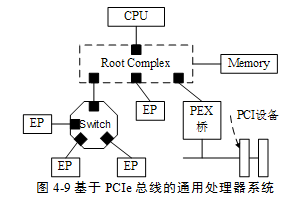
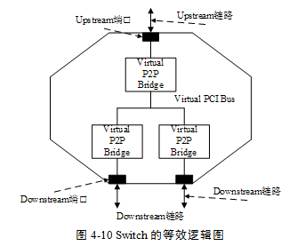

<!-- @import "[TOC]" {cmd="toc" depthFrom=1 depthTo=6 orderedList=false} -->

<!-- code_chunk_output -->

- [基于PCIe架构的处理器系统](#基于pcie架构的处理器系统)
  - [处理器系统A](#处理器系统a)
  - [PowerPC处理器](#powerpc处理器)
  - [基于PCIe总线的通用处理器结构](#基于pcie总线的通用处理器结构)
- [RC的组成结构](#rc的组成结构)
- [Switch](#switch)
- [VC和端口仲裁](#vc和端口仲裁)
- [PCIe-to-PCI/PCI-X桥片](#pcie-to-pcipci-x桥片)

<!-- /code_chunk_output -->

PCIe总线作为处理器系统的局部总线其作用与PCI总线类似主要目的是为了**连接处理器系统中的外部设备**当然PCIe总线也可以连接其他处理器系统. 在不同的处理器系统中PCIe体系结构的实现方法略有不同. 但是在**大多数处理器系统**中都使用了**RC**、**Switch**和**PCIe\-to\-PCI桥**这些基本模块**连接PCIe和PCI设备**. 在PCIe总线中**基于PCIe总线的设备**也被称为**EP(Endpoint**). 

# 基于PCIe架构的处理器系统

**在不同的处理器系统中PCIe体系结构的实现方式不尽相同**. 在PCIe总线规范中有许多内容是x86处理器独有的也仅在x86处理器的Chipset中存在. 在**PCIe总线规范**中一些最新的功能也在**Intel的Chipset中率先实现**. 

本节将以一个虚拟的处理器系统A和PowerPC处理器为例简要介绍RC的实现并简单归纳RC的通用实现机制. 

## 处理器系统A

在有些处理器系统中**没有直接提供PCI总线**此时需要使用**PCIe桥(PCIe\-to\-PCI/PCI\-X桥片**)将**PCIe链路**转换为**PCI总线**之后才能连接PCI设备. 在PCIe体系结构中也存在PCI总线号的概念其**编号方式与PCI总线兼容**. 一个基于PCIe架构的处理器系统A如图4‑7所示. 

在上图的结构中处理器系统首先使用一个**虚拟的PCI桥分离**处理器系统的**存储器域(？？？处理器部分？)**与**PCI总线域**. FSB总线下的所有外部设备都属于PCI总线域. 与这个虚拟PCI桥直接相连的总线为PCI总线0. 这种架构**与Intel的x86处理器系统较为类似**. 

在这种结构中**RC**由**两个FSB\-to\-PCIe桥**和**存储器控制器**组成. 值得注意的是在图4‑7中**虚拟PCI桥**的作用**只是分离存储器域与PCI总线域**但是并**不会改变信号的电气特性(RC与处理器是FSB！！！)**. RC与处理器通过FSB连接而从电气特性上看**PCI总线0与FSB兼容(所以从处理器到桥上的还是FSB叫做PCI总线是因为到了PCI总线域的范围)**因此在PCI总线0上挂接的是FSB\-to\-PCIe桥而不是PCI\-to\-PCIe桥. 

在PCI总线0上有一个存储器控制器和两个FSB\-to\-PCIe桥. 

- 这两个FSB\-to\-PCIe桥分别推出一个×16和×8的PCIe链路
    - 其中×16的PCIe链路连接显卡控制器(GFX)其编号为PCI总线1; 
    - ×8的PCIe链路连接一个Switch进行PCIe链路扩展. 
- **存储器控制器作为PCI总线0的一个Agent设备**连接**DDR插槽**或者**颗粒**. 

此外在这个PCI总线上还可能连接了一些**使用”PCI配置空间"管理的设备**这些设备的访问方法与PCI总线兼容在x86处理器的Chipset中集成了一些内嵌的设备. **这些内嵌的设备使用均使用”PCI配置空间"进行管理包括存储器控制器**. 

PCIe总线使用端到端的连接方式因此**只有使用Switch才能对PCIe链路进行扩展**而每扩展一条PCIe链路将产生一个新的PCI总线号. 如图4‑7所示Switch可以将1个×8的PCIe端口扩展为4个×2的PCIe端口其中每一个PCIe端口都可以挂接EP. 除此之外PCIe总线还可以**使用PCIe桥****将PCIe总线转换为PCI总线或者PCI-X总线****之后挂接PCI/PCI-X设备**. **多数x86处理器系统使用这种结构连接PCIe或者PCI设备(！！！**). 

在**PCIe总线规范**中**并没有明确提及PCIe主桥**而使用RC概括除了处理器之外的所有与PCIe总线相关的内容. 在PCIe体系结构中RC是一个很模糊也很混乱的概念. Intel使用PCI总线的概念管理所有外部设备包括与这些外部设备相关的寄存器因此在RC中包含一些实际上与PCIe总线无关的寄存器. 使用这种方式有利于系统软件使用相同的平台管理所有外部设备也利于平台软件的一致性但是仍有其不足之处. 

## PowerPC处理器

PowerPC处理器挂接外部设备使用的拓扑结构与x86处理器不同. 在PowerPC处理器中虽然也含有PCI/PCIe总线但是仍然有许多外部设备并不是连接在PCI总线上的. 在PowerPC处理器中PCI/PCIe总线并没有在x86处理器中的地位. 在PowerPC处理器中还含有许多内部设备如TSEC(Three Speed Ethenet Controller)和一些内部集成的快速设备与SoC平台总线直接相连而不与PCI/PCIe总线相连. 在PowerPC处理器中PCI/PCIe总线控制器连接在SoC平台总线的下方. 

Freescale即将发布的P4080处理器采用的互连结构与之前的PowerPC处理器有较大的不同. P4080处理器是Freescale第一颗基于E500 mc内核的处理器. E500 mc内核与之前的E500 V2和V1相比从指令流水线结构、内存管理和中断处理上说并没有本质的不同. E500mc内核内置了一个128KB大小的L2 Cache该Cache连接在BSB总线上; 而E500 V1/V2内核中并不含有L2 Cache而仅含有L1 Cache而且与FSB直接相连. 在E500mc内核中还引入了虚拟化的概念. 在P4080处理器中一些快速外部设备如DDR控制器、以太网控制器和PCI/PCIe总线接口控制器也是直接或者间接地连接到CoreNet中在P4080处理器L3 Cache也是连接到CoreNet中. P4080处理器的拓扑结构如图4‑8所示. 

目前Freescale并没有公开P4080处理器的L1、L2和L3 Cache如何进行Cache共享一致性. 多数采用CoreNet架构互连的处理器系统使用目录表法进行Cache共享一致性如Intel的Nehelem EX处理器. P4080处理器并不是一个追求峰值运算的SMP处理器系统而针对Data Plane的应用因此P4080处理器可能并没有使用基于目录表的Cache一致性协议. 在基于全互连网络的处理器系统中如果使用”类总线监听法"进行Cache共享一致性将不利于多个CPU共享同一个存储器系统在Cache一致性的处理过程中容易形成瓶颈. 

如图4‑8所示P4080处理器的设计重点并不是E500mc内核而是CoreNet. CoreNet内部由全互连网络组成其中任意两个端口间的通信并不会影响其他端口间的通信. 与MPC8548处理器相同P4080处理器也使用OceaN[1]结构连接PCIe与RapidIO接口. 

在P4080处理器中不存在RC的概念而仅存在PCIe总线控制器当然也可以认为在P4080处理器中PCIe总线控制器即为RC. P4080处理器内部含有3个PCIe总线控制器如果该处理器需要连接更多的PCIe设备时需要使用Switch扩展PCIe链路. 

在P4080处理器中所有外部设备与处理器内核都连接在CoreNet中而不使用传统的SoC平台总线(这种方式也可以被认为是SoC平台总线从共享总线结构升级到Switch结构)进行连接从而在有效提高了处理器与外部设备间通信带宽的同时极大降低了访问延时. 此外P4080处理器系统使用PAMU(Peripheral Access Management Unit)分隔外设地址空间与CoreNet地址空间. 在这种结构下10GE/1GE接口使用的地址空间与PCI总线空间独立. 

P4080处理器使用的PAMU是对MPC8548处理器ATMU的进一步升级. 使用这种结构时外部设备使用的地址空间、PCI总线域地址空间和存储器域地址空间的划分更加明晰. 在P4080处理器中存储器控制器和存储器都属于一个地址空间即存储器域地址空间. 此外这种结构还使用OCeaN连接SRIO[3]和PCIe总线控制器使得在OCeaN中的PCIe端口之间(PCIe端口之间的直接通信过程也被称为Peer-to-Peer传送方式)可以直接通信而不需要通过CoreNet从而减轻了CoreNet的负载. 

从内核互连和外部设备互连的结构上看这种结构具有较大的优势. 但是采用这种结构需要使用占用芯片更多的资源CoreNet的设计也十分复杂. 而最具挑战的问题是在这种结构之下Cache共享一致性模型的设计与实现. 在Boxboro EX处理器系统中可以使用QPI将多个处理器系统进行点到点连接也可以组成一个全互连的处理器系统. 这种结构与P4080处理器使用的结构类似但是Boxboro EX处理器系统包含的CPU更多. 

## 基于PCIe总线的通用处理器结构

在不同的处理器系统中RC的实现有较大差异. **PCIe总线规范并没有规定RC的实现细则**. 在有些处理器系统中**RC相当于PCIe主桥**也有的处理器系统也将**PCIe主桥称为PCIe总线控制器**. 而在**x86处理器系统**中**RC**除了包含**PCIe总线控制器**之外还包含一些**其他组成部件**因此**RC并不等同于PCIe总线控制器**. 

如果**一个RC**中可以提供**多个PCIe端口**这种RC也被称为**多端口RC**. 如MPC8572处理器的RC可以直接提供3条PCIe链路因此可以直接连接3个EP. 如果MPC8572处理器需要连接更多EP时需要使用Switch进行链路扩展. 

而在**x86处理器系统**中**RC**并**不是存在于一个芯片中(！！！**)如在**Montevina平台**中**RC**由**MCH和ICH两个芯片组成(！！！**). 本节并不对x86和PowerPC处理器使用的PCIe总线结构做进一步讨论而只介绍这两种结构的相同之处. 一个通用的基于PCIe总线的处理器系统如图4‑9所示. 

上图所示的结构将**PCIe总线端口(！！！**)、**存储器控制器(！！！**)等一系列与**外部设备有关的接口都集成在一起**并统称为**RC**. RC具有一个或者多个PCIe端口可以连接各类PCIe设备. **PCIe设备**包括**EP(如网卡、显卡等设备**)、**Switch(！！！**)和**PCIe桥(！！！PCIe\-to\-PCI/PCI\-X桥片简称为PCIe桥片, 上游是PCIe线, 所以是PCIe设备！！！**). PCIe总线采用端到端的连接方式每一个PCIe端口只能连接一个EP当然PCIe端口也可以连接Switch进行链路扩展. 通过Switch扩展出的PCIe链路可以继续挂接EP或者其他Switch. 

# RC的组成结构

RC是PCIe体系结构的一个重要组成部件也是一个较为混乱的概念. RC的提出与x86处理器系统密切相关. 事实上只有x86处理器才存在PCIe总线规范定义的”标准RC"而在多数处理器系统并不含有在PCIe总线规范中涉及的与RC相关的全部概念. 

不同处理器系统的RC设计并不相同在图4‑7中的处理器系统中RC包括存储器控制器、两个FSB-to-PCIe桥. 而在图4‑8中的PowerPC处理器系统中RC的概念并不明晰. 在 PowerPC处理器中并不存在真正意义上的RC而仅包含PCIe总线控制器. 

在**x86处理器系统**中**RC内部集成了一些PCI设备、RCRB(RC Register Block)和Event Collector等组成部件**. 其中**RCRB由一系列”管理存储器系统"的寄存器组成**而仅存在于x86处理器中; 而**Event Collector用来处理来自PCIe设备的错误消息报文和PME消息报文**. **RCRB寄存器组**属于**PCI总线域地址空间**x86处理器访问RCRB的方法与访问PCI设备的配置寄存器相同. 在有些x86处理器系统中RCRB在PCI总线0的设备0中. 

RCRB是x86处理器所独有的PowerPC处理器也含有一组”管理存储器系统"的寄存器这组寄存器与RCRB所实现的功能类似. 但是在PowerPC处理器中该组寄存器以CCSRBAR寄存器为基地址处理器采用存储器映像方式访问这组寄存器. 

如果将RC中的RCRB、内置的PCI设备和Event Collector去除该RC的主要功能与PCI总线中的HOST主桥类似其主要作用是完成存储器域到PCI总线域的地址转换. 但是随着虚拟化技术的引入尤其是引入MR-IOV技术之后RC的实现变得异常复杂. 

但是RC与HOST主桥并不相同RC除了完成地址空间的转换之外还需要完成物理信号的转换. 在PowerPC处理器的RC中来自OCeaN或者FSB的信号协议与PCIe总线信号使用的电气特性并不兼容使用的总线事务也并不相同因此必须进行信号协议和总线事务的转换. 

在P4080处理器中RC的下游端口可以挂接Switch扩展更多的PCIe端口也可以只挂接一个EP. 在P4080处理器的RC中设置了一组Inbound和Outbound寄存器组用于存储器域与PCI总线域之间地址空间的转换; 而P4080处理器的RC还可以使用Outbound寄存器组将PCI设备的配置空间直接映射到存储器域中. PowerPC处理器在处理PCI/PCIe接口时都使用这组Inbound和Outbound寄存器组. 

在P4080处理器中RC可以使用PEX\_CONFIG\_ADDR与PEX\_CONFIG\_DATA寄存器对 EP进行配置读写这两个寄存器与MPC8548处理器HOST主桥的PCI\_CONFIG\_ADDR和PCI\_CONFIG\_DATA寄存器类似本章不再详细介绍这组寄存器. 

而x86处理器的RC设计与PowerPC处理器有较大的不同实际上和大多数处理器系统都不相同. x86处理器赋予了RC新的含义PCIe总线规范中涉及的RC也以x86处理器为例进行说明而且一些在PCIe总线规范中出现的最新功能也在Intel的x86处理器系统中率先实现. 在x86处理器系统中的RC实现也比其他处理器系统复杂得多. 深入理解x86处理器系统的RC对于理解PCIe体系结构非常重要. 

# Switch

本篇在第4.1.4节简单介绍了在PCIe总线中如何使用Switch进行链路扩展本节主要介绍Switch(PCIe总线中的Switch与网络应用的Switch的功能并不相同而与网络应用中的Route功能接近)的内部结构. 从系统软件的角度上看每一个PCIe链路都占用一个PCI总线号但是一条PCIe链路只能连接一个PCI设备Switch、EP或者PCIe桥片. PCIe总线使用端到端的连接方式一条PCIe链路只能连接一个设备. 

一个PCIe链路需要挂接多个EP时需要使用Switch进行链路扩展. 一个标准Switch具有一个上游端口和多个下游端口. 上游端口与RC或者其他Switch的下游端口相连而下游端口可以与EP、PCIe-to-PCI-X/PCI桥或者下游Switch的上游端口相连. 

PCIe总线规范还支持一种特殊的连接方式即Crosslink连接方式. 使用这种方式时Switch的下游端口可以与其他Switch的下游端口直接连接上游端口也可以其他Switch的上游端口直接连接. 在PCIe总线规范中Crosslink连接方式是可选的并不要求PCIe设备一定支持这种连接方式. 

在PCIe体系结构中Switch的设计难度仅次于RCSwitch也是PCIe体系结构的核心所在. 而从系统软件的角度上看Switch内部由多个PCI-to-PCI桥组成其中每一个上游和下游端口都对应一个虚拟PCI桥. 在一个Switch中有多个端口在其内部就有多少个虚拟PCI桥就有多少个PCI桥配置空间. 值得注意的是在Switch内部还具有一条虚拟的PCI总线用于连接各个虚拟PCI桥系统软件在初始化Switch时需要为这条虚拟PCI总线编号. Switch的组成结构如图4‑10所示. 

Switch(在PCIe体系结构中RC和EP也需要处理QoS)需要处理PCIe总线传输过程中的QoS问题. PCIe总线的QoS要求PCIe总线区别对待优先权不同的数据报文而且无论PCIe总线的某一个链路多么拥塞优先级高的报文如等时报文(Isochronous Packet)都可以获得额定的数据带宽. 而且PCIe总线需要保证优先级较高的报文优先到达. PCIe总线采用虚拟多通路VC技术[7]并在这些数据报文设定一个TC(Traffic Class)标签该标签由3位组成将数据报文根据优先权分为8类这8类数据报文可以根据需要选择不同的VC进行传递. 

在PCIe总线中每一条数据链路上最多可以支持8个独立的VC. 每个VC可以设置独立的缓冲用来接收和发送数据报文. 在PCIe体系结构中TC和VC紧密相连TC与VC之间的关系是”多对一". 

TC可以由软件设置系统软件可以选择某类TC由哪个VC进行传递. 其中一个VC可以传递TC不相同的数据报文而TC相同的数据报文在指定一个VC传递之后不能再使用其他VC. 在许多处理器系统中Switch和RC仅支持一个VC而x86处理器系统和PLX的Switch中可以支持两个VC. 

下文将以一个简单的例子说明如何使用TC标签和多个VC以保证数据传送的服务质量. 我们将PCIe总线的端到端数据传递过程模拟为使用汽车将一批货物从A点运送到B点. 如果我们不考虑服务质量可以采用一辆汽车运送所有这些货物经过多次往返就可以将所有货物从A点运到B点. 但是这样做会耽误一些需要在指定时间内到达B点的货物. 有些货物如一些急救物资、EMS等其他优先级别较高的货物必须要及时地从A点运送到B点. 这些急救物资的运送应该有别于其他普通物资的运送. 

为此我们首先将不同种类的货物进行分类将急救物资定义为TC3类货物EMS定义为TC2类货物平信定义为TC1类货物一般包裹定义为TC0类货物我们最多可以提供8种TC类标签进行货物分类. 

之后我们使用8辆汽车分别是VC0~7运送这些货物其中VC7的速度最快而VC0的速度最慢. 当发生堵车事件时VC7优先行驶VC0最后行驶. 然后我们使用VC3运送急救物资VC2运送EMSVC1运送平信VC0运送包裹当然使用VC0同时运送平信和包裹也是可以的但是平信或者包裹不能使用一种以上的汽车运送如平信如果使用了VC1运输就不能使用VC0. 因为TC与VC的对应关系是”多对一"的关系. 

采用这种分类运输的方法我们可以做到在A点到B点带宽有限的情况下仍然可以保证急救物资和EMS可以及时到达B点从而提高了服务质量. 

PCIe总线除了解决数据传送的QoS问题之外还进一步考虑如何在链路传递过程中使用流量控制机制防止拥塞. 

在PCIe体系结构中Switch处于核心地位. PCIe总线使用Switch进行链路扩展在Switch中每一个端口对应一个虚拟PCI桥. 深入理解PCI桥是理解Switch软件组成结构的基础. 目前PCIe总线提出了MRA-Switch的概念这种Switch与传统Switch有较大的区别. 

# VC和端口仲裁

# PCIe-to-PCI/PCI-X桥片

本篇将PCIe-to-PCI/PCI-X桥片简称为PCIe桥片. 该桥片有两个作用. 

- 将**PCIe总线转换为PCI总线以连接PCI设备**. 在一个没有提供PCI总线接口的处理器中需要使用这类桥片连接PCI总线的外设. 许多PowerPC处理器在提供PCIe总线的同时也提供了PCI总线因此PCIe-to-PCI桥片对基于PowerPC处理器系统并不是必须的. 

- **将PCI总线转换为PCIe总线(这也被称为Reverse Bridge)连接PCIe设备**. 一些低端的处理器并没有提供PCIe总线此时需要使用PCIe桥将PCI总线转换为PCIe总线才能与其他PCIe设备互连. 这种用法初看比较奇怪但是在实际应用中确实有使用这一功能的可能. 本节主要讲解PCIe桥的第一个作用. 
PCIe桥的一端与PCIe总线相连而另一端可以与一条或者多条PCI总线连接. 其中可以连接多个PCI总线的PCIe桥也被称为多端口PCIe桥. 

PCIe总线规范提供了两种多端口PCIe桥片的扩展方法. 多端口PCIe桥片指具有一个上游端口和多个下游端口的桥片. 其中上游端口连接PCIe链路而下游端口推出PCI总线连接PCI设备. 

...................

目前虽然PCIe总线非常普及但是仍然有许多基于PCI总线的设计这些基于PCI总线的设计可以通过PCIe桥方便地接入到PCIe体系结构中. 目前有多家半导体厂商可以提供PCIe桥片如PLX、NXP、Tundra和Intel. 就功能的完善和性能而言Intel的PCIe桥无疑是最佳选择而PLX和Tundra的PCIe桥在嵌入式系统中得到了广泛的应用. 