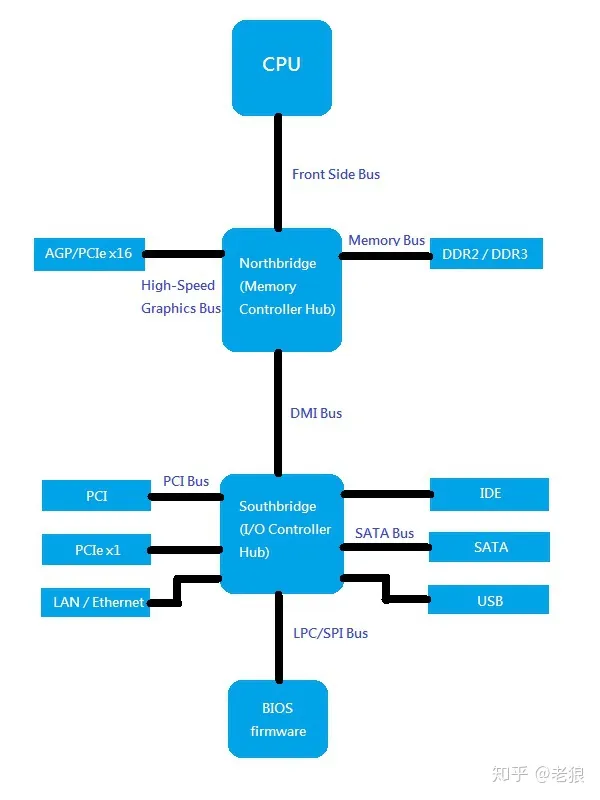
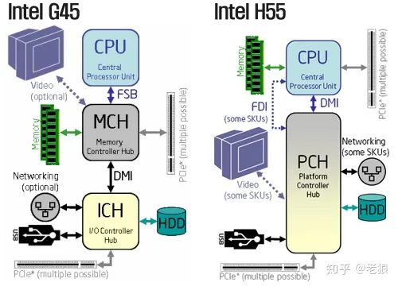

<!-- @import "[TOC]" {cmd="toc" depthFrom=1 depthTo=6 orderedList=false} -->

<!-- code_chunk_output -->

- [平台构成](#平台构成)
- [平台拓扑](#平台拓扑)
  - [FSB-to-PCI桥](#fsb-to-pci桥)
  - [NUMA](#numa)
  - [PCI 0](#pci-0)
- [平台架构变化](#平台架构变化)
  - [CPU/北桥(MCH)/南桥(ICH)](#cpu北桥mch南桥ich)
  - [CPU/PCH](#cpupch)

<!-- /code_chunk_output -->

本章以Montevina平台为例, 说明在x86处理器系统中, PCIe体系结构的实现机制.

# 平台构成

Montevina 平台是Intel提供的一个笔记本平台. 在这个平台上, 含有一个 **mobile 芯片组**, **Mobile 处理器**和**无线网卡**:

- **Mobile 芯片组**: 包括代号为 "`Contiga`" 的 **GMCH**(`Graphics and Memory Controller Hub`)和 `ICH9M` 系列的 **ICH**;

- **Mobile 处理器**: 使用代号为"Penryn"的第二代**Intel Core2 Duo**;

- **无线网卡**: 代号为 "Shirley Peak" (支持Wifi)或者 "Echo Peak" (同时支持 Wifi 和 WiMax ).

# 平台拓扑

Montevina 平台的拓扑结构如图.

> 这是一个典型的 北桥/南桥 架构.

## FSB-to-PCI桥

> Host Bridge

Montevina 平台使用一个**虚拟的 FSB-to-PCI 桥**将 **FSB 总线**和**外部设备**分离, 这个**虚拟 PCI 桥**上方连接 **FSB 总线**, 下方连接 **PCI 总线 0**. 但是从**物理信号**来看, MCH中的 **PCI 总线 0** 是 **FSB 总线的延伸**, 因为该 **PCI 总线 0** 仍然**使用 FSB 总线的信号**, 只是**连接到这条总线上的设备**相当于**虚拟 PCI 设备**. 在 GMCH 中, 并没有提到这个 `FSB-to-PCI` 桥, 但是**芯片设计上**, 存在这个**桥片的概念**.

## NUMA

NUMA 系统应该有多个这种 CPU, 然后在 MCH 中有相应的 **DCI 线**去连接其他的 socket(即物理 CPU), 因为**处理器和 MCH 都算是处理器内部**, DMI 往下的是外部. **每个 CPU** 可能有自己**独立的内存**(NUMA系统), 那些**图像**, **视频**相关和 **DMI 接口(南桥**)去连接相应外设**所有 socket(这里的 socket意思是插座, 插槽, 每个对应一个物理CPU)都会去连接(所以会有很多线, 这样除了内存对其他硬件的访问对于所有 CPU 而言是 SMP 的**), 这些内容需要证实, 只是猜测.

## PCI 0

从系统软件来看, 在 **PCI 总线 0** 上挂接的**设备**都含有**PCI配置寄存器(！！！**), **系统软件**将这些设备**看做 PCI 设备**, 并可以访问这些设备的 **PCI 配置空间**. 在 Montevina 平台的 **GMCH** 和 **ICH** 中, **所有的外部设备**, 如**存储控制器**, **图形控制器**等都是**虚拟 PCI 设备**, 都具有**独立的 PCI 配置空间**. **GMCH** 和 **ICH** 之间**使用 DMI(Direct Management Interface) 接口**相连, 但是 **DMI 接口仅仅是链路级别的连接(！！！**), 并**不产生新的 PCI 总线号(！！！** 下面的没有产生新的 Bus 的话, 通过 `lspci -t` 会看到 DMI 的所有设备都在一个 Bus 下), ICH 的 `DMI-to-USB 桥` 和`DMI-to-PCIe 桥` 也都属于 **PCI 总线 0** 上的**设备**.

Switch 不会改变电气特性, 不会产生新的PCI总线号.

在**x86处理器**中, **MCH** 包含的**虚拟 PCI 设备优先级较高**, 而**ICH**包含的**虚拟PCI设备优先级低**. 当**CPU**发起一个**PCI数据请求**时, **MCH的PCI设备**将首先**在PCI总线0上进行正向译码**. 如果**当前PCI数据请求**所使用的**地址没有在MCH的PCI设备命中**时, **DMI接口部件**将使用**负向译码**方式**被动地接受这个数据请求**, 然后通过**DMI总线**将这个**数据请求转发到ICH(！！！**)中.

因此在**x86**中, **MCH**集成了一些**对宽带要求较高的虚拟PCI设备**, 如**DDR控制器**, **显卡**等. 而在**ICH**中集成了一些**低速PCIe端口**, 和一些**速度相对较低的外部设备**, 如**PCI\-to\-USB桥**, **LPC总线控制器**等.

**MCH**和**ICH**包含一些**内置的PCI设备**, 这些设备**都具于PCI配置空间**, x86处理器可以**使用PCI配置周期访问这些PCI配置空间**. 在 **MCH** 和 **ICH** 中, **PCI总线0**是**FSB总线的延伸**, 所以**处理器访问这些设备**时并**不使用PCI总线规定的信号**, 如 FRAME\#, TRDY\#, IRDY\# 和IDSEL信号. 在MCH和ICH中, 有些PCI设备并不是传统意义上的外部设备, 而仅是虚拟PCI设备, 即使用PCI总线的管理方法统一在一起的设备.

x86处理器使用这些**虚拟 PCI 外设**的优点是可以将所有外部设备都使用PCI总线统一起来, 这些**设备使用的寄存器**都可以**保存在PCI设备的配置空间**中, 但是使用这种方法在某种程度上容易混淆一些概念, 尤其是有关地址空间的概念. 例如在**处理器体系结构的典型定义**中, **DDR\-SDRAM空间**属于**存储器域**, 与其**相关的DDR\-SDRAM控制器**也应该属于**存储器域**, 但是在 **x86 处理器**中**存储器控制器属于 PCI 总线域**.

# 平台架构变化

`CPU/北桥(MCH)/南桥(ICH)` -> `MCH/PCH`

## CPU/北桥(MCH)/南桥(ICH)

以前计算机主板上有**CPU**、北桥（MCH）和南桥（ICH）这三个主要的芯片.

* CPU. 核心处理单元.

* 北桥(`memory control hub`, 内存控制器中心, MCH). 负责与CPU通信，并且连接高速设备(`PCI-E` 显卡和 `RAM` 内存)的读取, 并且与南桥通信. 北桥(MCH)是;

* 南桥(`I/O Controller Hub`, I/O控制器中心, ICH). 主要负责**低速的 I/O** 设备通信(SATA 硬盘、USB 和 LAN), 并对时钟/BIOS/系统管理/旧式设备进行控制, 并且与北桥通信.

## CPU/PCH

处理器频率不断上升, FSB 变成了**系统效能的瓶颈**(带宽)和**对多CPU的制约**，在台式机和笔记本电脑中，MCH 被请进了 CPU中，服务器市场虽然短暂的出现了 IOH，但也慢慢的被 CPU吞噬。

* CPU 整合了**内存控制器**和 **PCI-E 控制器**(提供至少 16 个 lane 的 PCIe Root Port 用来连接显卡)、**DMI 通道**、服务器 uncore 还包括 QPI，相当于是把原来**北桥(MCH)的功能**集成在 **CPU 内部**了，北桥 MCH 自然就消失了.

  * CPU 中 **MCH 原来的部分**, 在**桌面 CPU** 中叫做 **System Agent**(SA)，在**服务器 CPU** 中叫做 **uncore**（和内核 core对应）。

  * 这绝不是表面看起来“换个马甲”这么简单。脱离了FSB这条小细管道，内存控制器、PICe Root Port 的 root complex 和内核(core)之间的通信变成了 ring bus 乃至目前的 Mesh 网络这种片内总线，羊肠小路变成了高速公路。如此改变让原来的瓶颈消失了，计算机效能才在酷睿后有了质的飞跃。

* CPU 内部总线. FSB -> QPI -> UPI. Intel 在 2008 年开始用 **QPI 总线**(`Intel QuickPath Interconnect`, 快速通道互联, 又称 `Multi-FSB` 总线)取代以往用于至强、安腾处理器的 **FSB 总线**(`Front Side Bus`, 前端总线); Intel 于 2017 年发布的 `SkyLake-SP Xeon` 中用 **UPI**(**UltraPath Interconnect**)取代 QPI 总线.

* PCH 负责原来南桥 ICH 的一些功能集. **PCH(Platform Controller Hub**, 平台路径控制器) 是英特尔于 2008 年起所推出的一系列**芯片组**取代以往的 **I/O 路径控制器**(`I/O Controller Hub`, **ICH**)

  * ICH -> PCH 的转变比较小.

* **CPU**和 **PCH** 之间由 **DMI**(`Direct Media Interface`)连接, DMI 也是原来北桥和南桥的连接方法.

从超低功耗的 Broadwells 开始一直到移动 Skylake 处理器英特尔将**时钟**、**PCI控制器**和**南桥 IO 控制器**集成到 **CPU 封装**中, **取消**了 PCH 采用**2个芯片**的**系统级封装**(`System in Package`**SOP**)设计; 一个芯片比另一个大小的芯片是 PCH. SOP **不采用 DMI** 而是直接露出了 PCIe 通道以及来自集成控制器的 SATA、USB 和 HDA 线路以及用于传感器的 `SPI/I²C/UART/GPIO` 线路. 与 PCH 兼容的 CPU 一样它们继续露出 DisplayPort、RAM 和 SMBus 线路.

PCH 还会通过 SPI 总线连接到 Platform Firmware (即 BIOS), eSPI 总线或PCIe总线连接到BMC. **CPU <Xeon> 真实**有**三组PCIe x16的连接**, **每个x16**的可以**当做4个x4的来用**, 还是太少了. **PCH**和**CPU**有个**额外的PCIe连接**, 因为CPU的PCIe口太少, 所以**PCH占用一个x16**的, PCH会**扩展出来一些**, PCH相当于一个**PCIe Switch**, 软件视图相当于**先经过PCH Switch**, 再到**PCH下面接的其他的设备**. **现在 PCH 接的网卡**都是**通过这种方式接进去**的.

Intel 在 **CPU 内部保留了QPI总线**用于**CPU内部的数据传输**. 而在**与外部接口设备进行连接**的时候需要有一条简洁快速的通道就是**DMI总线**. 这样这两个总线的传输任务就分工明确了QPI主管内DMI主管外. 也就是说**DMI往下就不是CPU内部**了, 尽管 PCH 和 MCH 都属于 RC 的一部分.

注: 从体系结构角度看, **MCH和ICH仅仅是一个称呼**, 实际上并不重要.
