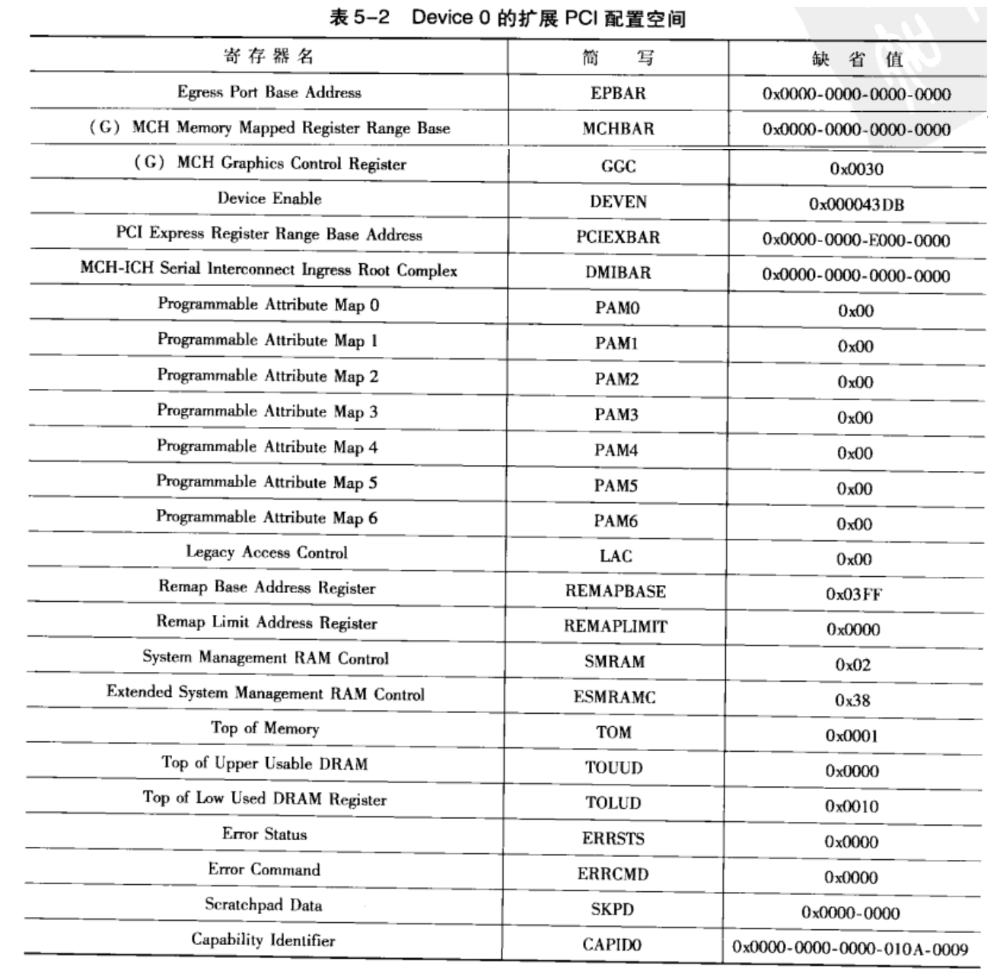

<!-- @import "[TOC]" {cmd="toc" depthFrom=1 depthTo=6 orderedList=false} -->

<!-- code_chunk_output -->

* [0 概述](#0-概述)
* [1 EPBAR寄存器](#1-epbar寄存器)
* [2 MCHBAR寄存器](#2-mchbar寄存器)
* [3 其他寄存器](#3-其他寄存器)

<!-- /code_chunk_output -->

# 0 概述

**PCI总线0**上**存储器控制器(Device 0**)是一个比较**特殊的PCI设备**, 这个设备除了需要**管理DDR SDRAM**之外, 还**管理整个存储器域的地址空间(！！！**), 包括**PCI总线域地址空间(！！！**). 在x86处理器系统中, 该设备是管理存储器域空间的重要设备, 其中含有许多**与存储器空间相关的寄存器**.

这些**寄存器**对于系统程序员理解x86处理器的存储器拓扑结构非常重要, 底层编程需要掌握这些寄存器. 但是在x86处理器系统中, 由于BIOS的存在, 多数程序员没有机会使用这些寄存器.

从底层开发角度, x86处理器系统不如PowerPC, MIPS和ARM处理器透明. x86处理器首先使用BIOS屏蔽处理器的硬件实现细节,其次在处理器内核中使用了microcode进一步屏蔽了CPU的实现细节. 使得底层程序员在没有得到充分的资源时, 几乎无法开发x86处理器的底层代码.

但不可否认的是x86处理器底层开发的复杂程度超过PowerPC, MIPS和ARM处理器, 因为x86处理器系统作为通用CPU需要与各类操作系统兼容, 而向前兼容对于任何一种处理器都是一个巨大的包袱. x86处理器系统使用BIOS和Microcode屏蔽硬件细节基于技术和商业考虑.

从传统外部设备的角度看, PCI总线0的Device 0并不是一个设备, 仅存放与处理器系统密切相关的一组参数. 而除了x86处理器外, 几乎所有处理器都使用存储器映射寻址的寄存器保存这些参数.

在Montevina平台, **系统软件**使用**Type 00h**配置**请求访问存储器控制器**, 该**存储器控制器**除了具有一个**标准的PCI Agent设备**的**64B的配置空间**之外, 还使用了**PCI设备的扩展配置空间**, 其包含的主要寄存器如表.

注: 上图是基本配置空间！！！

Device 0使用的**基本配置空间(所有PCI设备都有！！！**)与**其他PCI设备兼容**.

注意, **Device 0**在**PCIe体系结构**中, 被认为是**HOST主桥(！！！**). 而**Device 0**使用的**PCI扩展配置空间**也被称为**RCRB(！！！**), RCRB主要**作用**是描述**当前处理器**的**存储器地址拓扑结构(！！！**), 包括**主存储器地址(！！！**)和**PCI总线地址(！！！**). 其简写和复位值如图.

注: 上图是扩展PCI配置空间！！！

系统软件**首先**检查**Capability Identifier**寄存器, 该**寄存器地址偏移为0xE0**, 即**CAPPTR寄存器(第一个Capability寄存器地址！！！**)指向的地址为**0xE0**. 该**Capability结构**使用的**PCI Express Extended Capability ID字段**(该字段在**CAPID0寄存器**中)为**0x0A(！！！ID是这个的说明是RCRB！！！**), 因此表5-2中寄存器组为RCRB Capability结构, 关于Capability结构见4.3.

在x86处理器系统中, **RCRB**存放一些与**处理器系统相关的寄存器**. 而在许多处理器中, 如PowerPC中并不含有RCRB.

在**x86处理器**中, 使用**PCI总线管理所有外部设备(！！！**), 这些"**与处理器系统相关的寄存器**"被保存在**RCRB(！！！**)中, 处理器使用**PCI总线**配置**周期访问这些寄存器(！！！**). 实际上在**RCRB中包含的寄存器**与PCIe体系结构并**没有直接关系**, **这些寄存器应该属于存储器域的地址区域(！！！**). x86处理器的这种做法并非完全合理, 在某种程度上容易**使人混淆存储器域**与**PCI总线域**的区别.

RCRB主要寄存器的含义如下.

# 1 EPBAR寄存器

大小为**8B**, 指向一个**4KB大小**的**存储器区域**. **处理器**使用**存储器映像**寻址访问这段存储器区域, 并通过这段存储器区域访问RCRB的扩展配置空间, 在表5-2中存放的仅是RCRB的部分扩展配置空间.

这段存储器区域描述RC的Egress端口属性, 包括RC使用的VC0和VC1两个虚通路的具体信息. 当EPBAR寄存器的"EPBAR Enable"位为1时, 这段空间有效. 这段寄存器区域被称为"Egress Port RCRB"空间, 系统软件可以使用这段空间定义的寄存器, 完成对VC1和VC0通路的设置, 包括端口仲裁, VC仲裁等一些列内容.

# 2 MCHBAR寄存器

大小8B, 指向一个16KB大小的存储器区域. 处理器使用存储器映像寻址访问这段存储器区域. 这段存储器区域描述GMCH内部使用的一些寄存器. 当MCHBAR寄存器的"MCHBAR Enable"位为1时, 这段存储区域有效.

这段区域包含多组寄存器.

# 3 其他寄存器

在Device 0中还包含以下寄存器.

- GGC寄存器.
- DEVEN寄存器.
- PCIEXBAR寄存器. 大小8B, 指向一个**256MB大小**的存储器区域. **PCIe总线**可以使用**ECAM方式**访问PCI设备的**扩展配置空间**, **PCIEXBAR**寄存器存放**PCI配置空间的基地址**, 有关ECAM机制详细信息见5.3.2节.
- DMIBAR寄存器. 大小8B, 指向一个4KB大小的存储器区域, 处理器使用存储器映像寻址访问这段存储器区域. 该寄存器描述**RC中的DMI接口**.
- PAM0\~PAM6寄存器. 描述Shadow BIOS的属性.
- 
.............