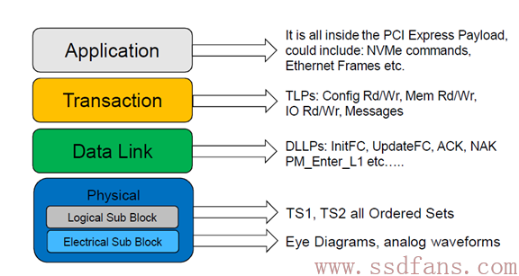

# NVMe位置

NVMe 是一种**主机**(Host)与 **SSD** 之间**通信的协议**, 它在协议栈中隶属高层, 如图所示.

NVMe 处于**协议栈**的最高层:

> NVMe 作为**命令层**和**应用层**协议, 理论上可以**适配**在**任何接口协议上**. 但 NVMe 协议的原配是 **PCIe**, 因此如无特别说明, 后面章节都是基于 `NVMe+PCIe`.

NVMe 在**协议栈**中处于**应用层**或者**命令层**, 它是指挥官、军师, 相当于三国时期诸葛亮的角色. 军师设计好计谋, 就交由手下五虎大将去执行. NVMe 的手下大将就是 PCIe, 它所制定的**任何命令**, 都交由 **PCIe** 去**完成**. 虽然 NVMe 的命令也可以由别的接口完成, 但 NVMe 与 PCIe 合作形成的战斗力无疑是最强的.

# 历史

NVMe 是为 SSD 所生的. NVMe 出现之前, **SSD** 绝大多数用的是 **AHCI** 加 **SATA** 的组合, 后者其实是为**传统 HDD** 服务的.

SATA + AHCI -> PCIe + NVMe

与 HDD 相比, SSD 具有更低的延时和更高的性能, AHCI 已经不能跟上 SSD 性能发展的步伐, 而是成为了制约 SSD 性能的瓶颈. 所有 SATA 接口的 SSD, 你去看性能参数, 会发现都不会超过 600MB/s(或者说都不超过560MB/s). 如果碰到有人跟你说他的 SATA SSD 读取性能可以超过 600MB/s, 直接拨打 12315 投诉. 不是底层闪存带宽不够, 是 **SATA 接口**速度**限制**了带宽, 因为 SATA 3.0 最高带宽就是 600MB/s, 而且不会再有 SATA 4.0 了, 如图所示.

SATA 和 PCIe 接口速度对比:

既然 **SATA 接口**速度太慢, 那么用 **PCIe** 好了, 不过**上层协议**还是 **AHCI**. 五虎上将有了, 由刘备指挥, 让人不禁感叹暴殄天物呀. 刘备什么水平, 诸葛亮出现之前, 居无定所, 一会跟着曹操混, 一会又跟着吕布混, 谁肯收留就跟谁混, 惨呀！**AHCI** 和刘备一个德行, **只有一个命令队列**, 最多同时只能发 **32 条命令**, HDD 时代(群雄逐鹿)还能混混, SSD 时代(三足鼎立)就只有被灭的份. 刘备需要三顾茅庐, 请诸葛亮出山辅佐. 同样, SSD 需要 PCIe, 更需要 NVMe.

在这样的背景下, Intel 等巨头携天子以令诸侯, 集大家的智慧, 制定出了 NVMe 规范, 目的就是释放 SSD 性能潜力, 解 SSD 倒悬之苦. 最初制定 NVMe规范的主要公司如图所示.

最初制定NVMe规范的主要公司:

# NVMe工作原理

NVMe 制定了主机与 SSD 之间通信的命令, 以及命令如何执行的.

## 两种命令

NVMe 有**两种命令**, 一种叫 Admin 命令, 用以**主机管理**和**控制 SSD**; 另外一种就是 I/O 命令, 用以**主机和 SSD 之间数据的传输**, 如图所示.

NVMe 命令集:

### Admin命令集

NVMe 支持的 Admin 命令如图所示

NVMe Admin 命令集:

### I/O命令集

NVMe 支持的 I/O 命令如图所示

NVMe NVM 命令集:

跟 ATA 规范中定义的命令相比, NVMe 的命令个数少了很多, 完全是**为 SSD 量身定制**的. 在 **SATA** 时代, 即使只有 **HDD** 才**需要**的命令(SSD 上其实完全没有必要), 但**为了符合协议标准**, SSD 还是需要实现那些毫无意义(完全只是为了兼容性)的命令. 没有办法, 谁叫你 SSD 寄人篱下呢. NVMe 让 SSD 扬眉吐气了一把.

## 主机发送命令给SSD

命令有了, 那么, 主机又是怎么把这些命令发送给 SSD 执行呢?

### SQ、CQ和DB

NVMe 有三宝: `Submission Queue`(**SQ**)、`Completion Queue`(**CQ**)和 `Doorbell Register`(**DB**). **SQ** 和 **CQ** 位于主机的**内存**中, **DB** 则位于 SSD 的**控制器内部**, 如下图所示.

SQ、CQ 和 DB 在系统中的位置:

这张图信息量比较大, 除了让我们知道 **SQ 和 CQ 在主机的内存**(Memory)中以及 **DB 在 SSD 端**外, 而且让我们对一个PCIe系统有一个直观的认识. 图中的 **NVMe 子系统**一般就是 **SSD**. 请看这张图几秒钟, 然后闭上眼, 脑补SSD所处的位置: **SSD** 作为一个 **PCIe Endpoint**(EP)通过 **PCIe** 连着 `Root Complex`(**RC**), 然后 RC 连接着 **CPU** 和**内存**. RC 是什么? 我们可以认为 RC 就是 CPU 的代言人或者助理. 作为系统中的最高层, CPU说: "我很忙的, 你SSD有什么事情先跟我助理说！"尽管如此, SSD的地位还是较过去提升了一级, **过去** SSD 别说直接接触霸道总裁, 就是连助理的面都见不到, SSD 和助理之间还隔着一座**南桥**.

> 所以 NVMe SSD 最好直接挂在 root port 上, 不要在 Switch 的 PCIe Endpoint, 因为 Switch 会对 message 进行解析, 从而增加了路径.

回到我们的"吉祥三宝"(SQ、CQ、DB). **SQ** 位于**主机内存**中, **主机**要**发送命令**时, 先把准备好的命令**放在 SQ 中**, 然后**通知 SSD** 来取; **CQ** 也是位于**主机内存**中, 一个命令执行完成, 成功或失败, SSD 总会往 CQ 中写入命令完成状态. DB(大宝)又是干什么用的呢? **主机发送命令时**, 不是直接往SSD中发送命令, 而是把命令准备好放在自己的内存中, 那怎么通知SSD来获取命令执行呢? 主机就是通过**写 SSD 端的大宝寄存器**来**告知 SSD** 的.

我们来看看 NVMe 是如何处理命令的, 如图所示.

NVMe 命令处理流程:

NVMe处理命令需要几步? 答: 八步.

第一步, 主机写命令到SQ;

第二步, 主机写SQ的DB, 通知SSD取指;

第三步, SSD收到通知后, 到SQ中取指;

第四步, SSD执行指令;

第五步, 指令执行完成, SSD往CQ中写指令执行结果;

第六步, 然后SSD发中断通知主机指令完成;

第七步, 收到中断, 主机处理CQ, 查看指令完成状态;

第八步, 主机处理完CQ中的指令执行结果, 通过DB回复SSD: 指令执行结果已处理！

