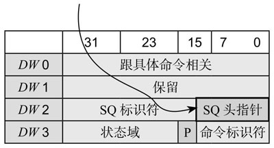

<!-- @import "[TOC]" {cmd="toc" depthFrom=1 depthTo=6 orderedList=false} -->

<!-- code_chunk_output -->

- [队列](#队列)
- [小结](#小结)

<!-- /code_chunk_output -->

# 队列

通过这个例子, 我们又重温了一下命令处理流程. 之前也许只记住了命令处理需要8步(距离曹植一步之遥), 但现在我们应该对命令处理流程有了更深入具体的认识.

那么, DB 在命令处理流程中起了什么作用呢?

首先, 如前文提到的, 它记住了 SQ 和 CQ 的头和尾. 对 SQ 来说, **SSD** 是**消费者**, 它直接和**队列的头**打交道, 很清楚 SQ 的头在哪里, 所以SQ head DB 由 SSD 自己维护; 但它**不知道队伍有多长**, 尾巴在哪, **后面还有多少命令等待执行**, 相反, **主机**知道, 所以 SQ Tail DB 由主机来更新. SSD 结合 SQ 的头和尾, 就知道还有多少命令在SQ中等待执行了. 对 CQ 来说, SSD 是生产者, 它很清楚 CQ 的尾巴在哪里, 所以 CQ Tail DB 由自己更新, 但是 SSD 不知道主机处理了多少条命令完成信息, 需要主机告知, 因此 CQ Head DB 由主机更新. SSD 根据 CQ 的头和尾, 就知道CQ还能不能, 以及能接受多少命令完成信息.

DB 还起到了通知作用: **主机更新 SQ Tail DB** 的同时, 也是在告知SSD**有新的命令**需要处理; **主机更新 CQ Head DB** 的同时, 也是在告知 SSD, 你返回的命令完成状态信息我已经处理, 同时表示谢意.

这里有一个对主机不公平的地方, 主机对 DB 只能写(还**仅限于写 SQ Tail DB 和 CQ Head DB**), **不能读取 DB**.

在这个限制下, 我们看看**主机**是怎样维护 SQ 和 CQ 的. SQ 的尾巴没有问题, 主机是生产者, 对新命令来说, 它清楚自己应该站在队伍哪里. 但是Head呢? SSD 在取指的时候, 是偷偷进行的, 主机对此毫不知情. **主机**发了取指通知后, 它并**不清楚 SSD 什么时候去取命令**、取了多少命令. 怎么办? 机智如你, 如果是你, 你会怎么做? 山人自有妙计. 给个提示(见图).

**SQ** 的 **Head DB** 在**命令完成状态**里:

这是什么? 这是 **SSD** 往 **CQ** 中写入的**命令完成状态信息**(16字节).

是的, **SSD** 往 **CQ** 中**写入命令状态信息**的**同时**, 还把 **SQ Head DB 的信息**告知了主机！这样, **主机**对 **SQ 队列**的**头部和尾部的信息**就都有了, 可以轻松玩转 SQ.

CQ 呢? **主机**知道它队列的头部, 不知道尾部. 那**怎么能知道尾部**呢? 思路很简单, 既然 SSD 知道, 那你告诉我呗！SSD 怎么告诉主机呢? 还是**通过 SSD 返回命令状态信息**获取. 看到上图中所示的 "**P**" 了吗? 干什么用? 做标记用.

具体是这样的: 一开始 **CQ** 中每条命令完成将条目中的 "P" 比特初始化为 0 的工作, SSD 在往 CQ 中写入命令完成条目时, 会把 "P" 写成 1(如果之前该位置为 1, Controller 写 CQ 的时候翻转该比特, 即写 0). 记住一点, CQ 是在主机端的内存中, 主机可以检查 CQ 中的所有内容, 当然包括 "P"了. 主机记住上次队列的尾部, 然后往下一个一个检查 "P", 就能得出新的队列尾部了. 就是这样, 如下图所示.

主机根据 PhaseTag 计算 CQ 队列的尾部:

# 小结

最后, 给大宝做个小结:

* DB 在 SSD Controller 端, 是寄存器;

* DB 记录着 SQ 和 CQ 队列的头部和尾部;

* 每个 SQ 或者 CQ 有两个 DB —— Head DB 和 Tail DB;

* 主机只能写 DB, 不能读 DB;

* 主机通过 SSD 往 CQ 中写入的命令完成状态获取其队列头部或者尾部.

----

PCIe TLP 的类型有很多, 如下图, 不过,  NVMe 只挑选了 Memory Read/Wirte 传递信息

----

