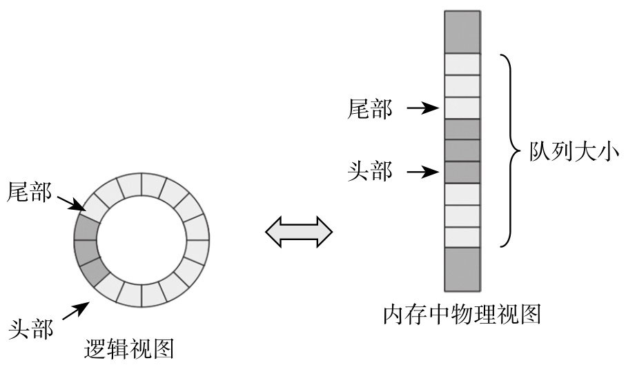
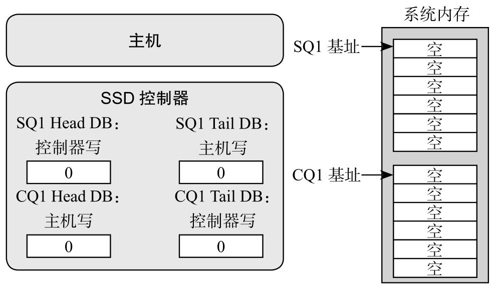

# SQ和CQ

主机往 SQ 中写入命令，SSD 往 CQ 中写入命令完成结果。SQ 与 CQ 的关系，可以是**一对一**的关系，也可以是**多对一**的关系，但不管怎样，它们是成对的：有因就有果，有 SQ 就必然有 CQ。

有**两种 SQ 和 CQ**，一种是Admin，另外一种是IO，前者放 Admin 命令，用以主机管理控制 SSD，后者放置 IO 命令，用以主机与 SSD 之间传输数据。Admin SQ/CQ 和 IO SQ/CQ 各司其职，你不能把Admin命令放到IO SQ中，同样，你也不能把 IO 命令放到Admin SQ里面。IO SQ/CQ 不是一生下来就有的，它们是通过 Admin 命令创建的。

正如图所示，系统中**只有 1 对 Admin SQ/CQ**，它们是一一对应的关系；IO SQ/CQ 却可以有很多，多达 65535 对（**64K**减去 1 对 Admin SQ/CQ）。

SQ 和 CQ:

>需要指出的是，对 NVMe over Fabrics, SQ和CQ的关系只能是一对一；IO SQ/CQ 也不是通过 Admin 命令创建的。

主机端**每个 CPU 核**（Core）可以有**一个或者多个 SQ**，但**只有一个CQ**。给每个 CPU 核分配一对 SQ/CQ 好理解，为什么**一个 CPU 核**中还要**多个 SQ** 呢？一是**性能需求**，一个CPU核中有多线程，可以做到一个线程独享一个 SQ；二是 **QoS** 需求，什么是 QoS? Quality of Service，服务质量。脑补一个场景，蛋蛋一边看小电影，同时在后台用迅雷下载小电影，由于电脑配置差，看个小电影都卡。蛋蛋不要卡顿！怎么办？NVMe建议，你设置两个 SQ，一个赋予高优先级，一个低优先级，把看小电影所需的命令放到高优先级的 SQ，迅雷下载所需的命令放到低优先级的 SQ，这样，你的电脑就能把有限的资源优先满足你看小电影了。至于迅雷卡不卡，下载慢不慢，这个时候已经不重要了。能让蛋蛋舒舒服服地看完一部小电影，就是好的 QoS。实际系统中用多少个 SQ，取决于系统配置和性能需求，可灵活设置 I/O SQ个数。

关于系统中 **IO SQ 的个数**，NVMe 白皮书给出如下建议（见下表）。

NVMe 白皮书对 NVMe 的配置建议:

作为**队列**，每个 SQ 和 CQ 都有一定的深度：对Admin SQ/CQ来说，其深度可以是 `2～4096`（**4K**）；对 IO SQ/CQ，深度可以是 2～65536（**64K**）。队列深度也是可以配置的。

SQ/CQ 的**个数**可以配置，每个 SQ/CQ 的**深度**也可以配置，因此 NVMe 的性能是可以通过配置队列个数和队列深度来灵活调节的。

> 百变星君NVMe：想胖就胖，想瘦就瘦；想高就高，想矮就矮。

我们已经知道，**AHCI 只有一个命令队列**，且**队列深度**是固定的 **32**，和 NVMe 相比，无论是在命令队列广度还是深度上，都是无法望其项背的；NVMe 命令队列的百般变化，更是 AHCI 无法做到的。说到百般变化，我突然又想到一件残忍的事情：PCIe 也是可以的。一个 PCIe 接口，可以有 1、2、4、8、12、16、32 条 lane! SATA 都要哭了：单挑都挑不过你，你还来群殴我，太欺负人了。

* 每个 **SQ** 放入的是**命令条目**，无论是 Admin 还是 IO 命令，**每个命令条目**大小都是 **64 字节**;
* 每个 **CQ** 放入的是**命令完成状态信息条目**，每个条目大小是 **16 字节**。

# 小结

在继续谈大宝（DB）之前，先对 SQ 和 CQ 做个小结：

* SQ 用以主机发命令，CQ 用以 SSD 回命令完成状态；

* SQ/CQ 可以在**主机的内存**中，也可以在 **SSD** 中，但**一般在主机内存中**（本书中除非特殊说明，不然都是基于 SQ/CQ 在主机内存中作介绍）；

* 两种类型的 SQ/CQ: Admin 和 IO，前者发送 Admin 命令，后者发送 IO 命令；

* 系统中**只能**有**一对 Admin SQ/CQ**，但可以有**很多对 IO SQ/CQ**；

* IO SQ 与 CQ 可以是**一对一**的关系，也可以是**多对一**的关系；

* IO SQ 是可以赋予**不同优先级**的；

* `IO SQ/CQ` 深度可达 **64K**, `Admin SQ/CQ` 深度可达 **4K**；

* `IO SQ/CQ` 的广度和深度都可以灵活配置；

* 每条命令大小是 64B，每条命令完成状态是 16B。

# 队列

SQ/CQ 中的 “Q” 指 Queue，队列的意思（见图），无论SQ还是CQ，都是**队列**，并且是**环形队列**。队列有几个要素，除了**队列深度**、**队列内容**，还有队列的**头部**（Head）和**尾部**（Tail）。

队列（Queue）的概念:

队伍**头部**的那个**正在被服务**或者**等待被服务**，一旦完成，就离开队伍。可见队列的头尾很重要，**头**决定谁会**被马上服务**，**尾巴**决定了**新来**的人站的**位置**。**DB** 就是用来**记录**了一个 SQ 或者 CQ 的**头和尾**。每个 SQ 或者 CQ，都有两个对应的 DB: Head DB 和 Tail DB。DB 是在 **SSD 端的寄存器**，记录 SQ 和 CQ 的头和尾巴的位置。

如下图所示是一个**队列生产者/消费者**（Producer/Consumer）**模型**。**生产者**往队列的**尾部写入**东西，**消费者**从队列的**头部取出**东西。

队列生产者/消费者模型:

* 对一个 **SQ** 来说，它的**生产者**是**主机**，因为它**向 SQ 的尾部写入命令**，**消费者**是 **SSD**，因为它从 SQ 的**头部取出**指令执行；

* 对一个 **CQ** 来说，刚好相反，**生产者**是 **SSD**，因为它向 CQ 的**尾部写入**命令完成信息，**消费者**则是**主机**，它从 CQ 的**头部取出**命令完成信息。

下面举个例子说明。

1. 开始假设 SQ1 和 CQ1 是空的，Head = Tail = 0，如图所示。

SQ、CQ、DB 初始化状态:

2. 这个时候，**主机**往 **SQ1** 中**写入了三个命令**，**SQ1** 的 **Tail** 则变成 **3**。**主机**往 SQ1 写入三个命令后，然后漂洋过海去**更新 SSD 控制器端**的 **SQ1 Tail DB 寄存器**，值为 **3**。主机更新这个寄存器的同时，也是在告诉SSD控制器：有新命令了，帮忙去我那里取一下，如图6-15所示。

主机往SQ中写入三个命令:

3. SSD控制器收到通知后，于是派人去SQ1把3个命令都取回来执行。SSD把SQ1的三个命令都消费了，SQ1的Head从而也调整为3, SSD控制器会把这个Head值写入本地的SQ1 Head DB寄存器，如图6-16所示。

SSD取走三个命令:

4. SSD执行完了两个命令，于是往CQ1中写入两个命令完成信息，更新CQ1对应的Tail DB寄存器，值为2。同时发消息给主机：有命令完成，请注意查看，如图6-17所示。

SSD完成两个命令后写CQ:

5. 主机收到SSD的短信通知（中断信息），于是从CQ1中取出那两条完成信息。处理完毕，主机又漂洋过海地往CQ1 Head DB寄存器中写入CQ1的head，值为2，如图所示。

主机处理完CQ中的两个命令状态:

通过这个例子，我们又重温了一下命令处理流程。之前也许只记住了命令处理需要8步（距离曹植一步之遥），但现在我们应该对命令处理流程有了更深入具体的认识。

那么，DB在命令处理流程中起了什么作用呢？

首先，如前文提到的，它记住了SQ和CQ的头和尾。对SQ来说，SSD是消费者，它直接和队列的头打交道，很清楚SQ的头在哪里，所以SQ head DB由SSD自己维护；但它不知道队伍有多长，尾巴在哪，后面还有多少命令等待执行，相反，主机知道，所以SQ Tail DB由主机来更新。SSD结合SQ的头和尾，就知道还有多少命令在SQ中等待执行了。对CQ来说，SSD是生产者，它很清楚CQ的尾巴在哪里，所以CQ Tail DB由自己更新，但是SSD不知道主机处理了多少条命令完成信息，需要主机告知，因此CQ Head DB由主机更新。SSD根据CQ的头和尾，就知道CQ还能不能，以及能接受多少命令完成信息。

DB还起到了通知作用：主机更新SQ Tail DB的同时，也是在告知SSD有新的命令需要处理；主机更新CQ Head DB的同时，也是在告知SSD，你返回的命令完成状态信息我已经处理，同时表示谢意。

这里有一个对主机不公平的地方，主机对DB只能写（还仅限于写SQ Tail DB和CQ Head DB），不能读取DB。

在这个限制下，我们看看主机是怎样维护SQ和CQ的。SQ的尾巴没有问题，主机是生产者，对新命令来说，它清楚自己应该站在队伍哪里。但是Head呢？SSD在取指的时候，是偷偷进行的，主机对此毫不知情。主机发了取指通知后，它并不清楚SSD什么时候去取命令、取了多少命令。怎么办？机智如你，如果是你，你会怎么做？山人自有妙计。给个提示（见图）。

SQ的Head DB在命令完成状态里:

这是什么？这是SSD往CQ中写入的命令完成状态信息（16字节）。

是的，SSD往CQ中写入命令状态信息的同时，还把SQ Head DB的信息告知了主机！这样，主机对SQ队列的头部和尾部的信息就都有了，可以轻松玩转SQ。

CQ呢？主机知道它队列的头部，不知道尾部。那怎么能知道尾部呢？思路很简单，既然SSD知道，那你告诉我呗！SSD怎么告诉主机呢？还是通过SSD返回命令状态信息获取。看到图6-19中所示的“P”了吗？干什么用？做标记用。

具体是这样的：一开始CQ中每条命令完成将条目中的“P”比特初始化为0的工作，SSD在往CQ中写入命令完成条目时，会把“P”写成1（如果之前该位置为1，控制器写CQ的时候翻转该比特，即写0）。记住一点，CQ是在主机端的内存中，主机可以检查CQ中的所有内容，当然包括“P”了。主机记住上次队列的尾部，然后往下一个一个检查“P”，就能得出新的队列尾部了。就是这样，如图6-20所示。

主机根据PhaseTag计算CQ队列的尾部:

最后，给大宝做个小结：

* DB在SSD控制器端，是寄存器；

* DB记录着SQ和CQ队列的头部和尾部；

* 每个SQ或者CQ有两个DB——Head DB和Tail DB；

* 主机只能写DB，不能读DB；

* 主机通过SSD往CQ中写入的命令完成状态获取其队列头部或者尾部。