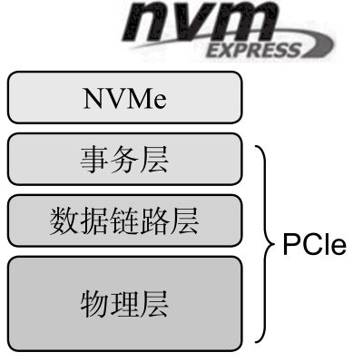
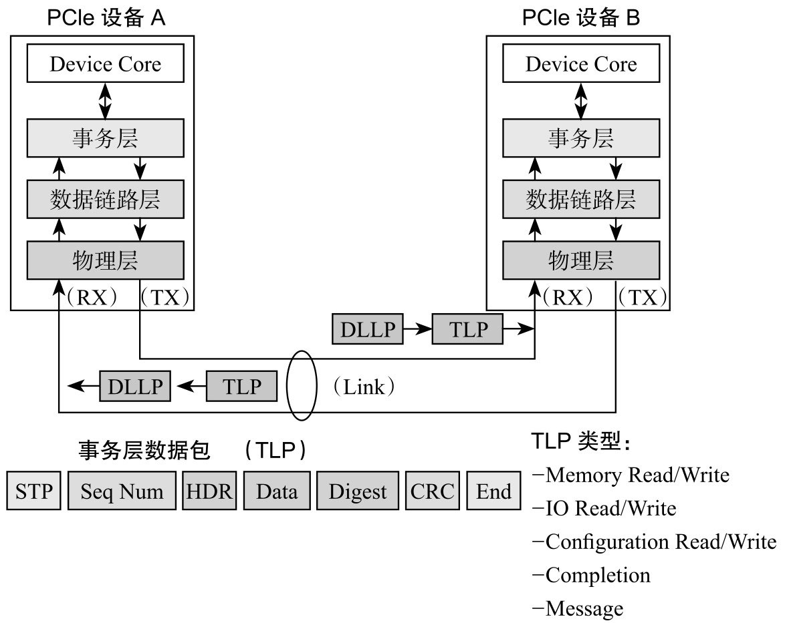
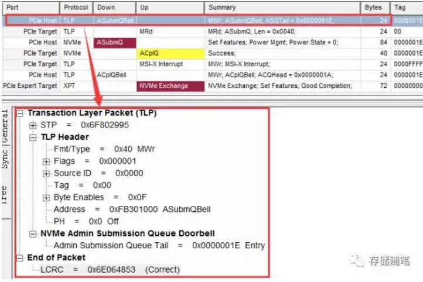
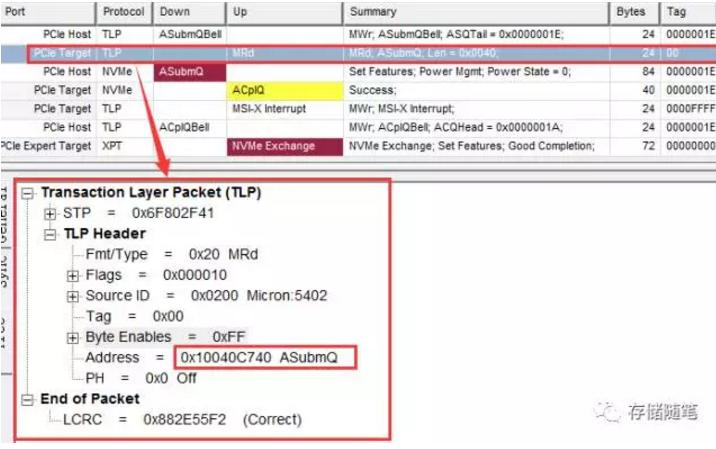
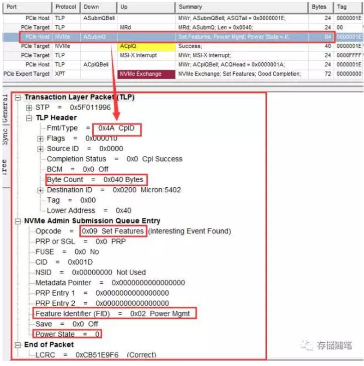
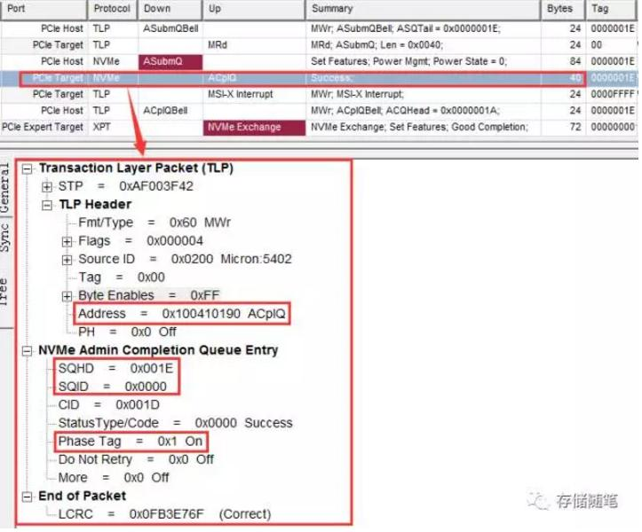
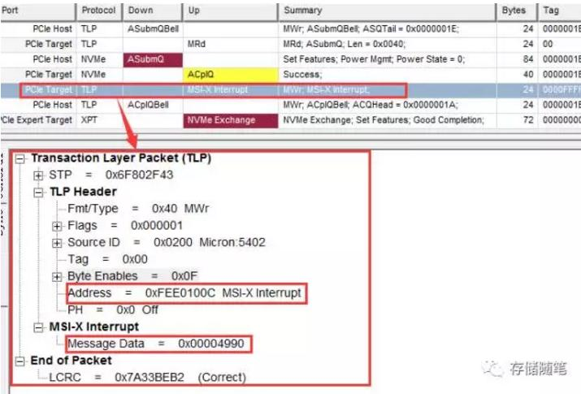
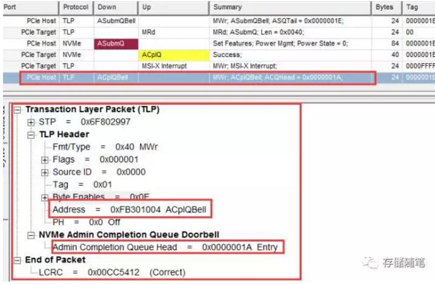

<!-- @import "[TOC]" {cmd="toc" depthFrom=1 depthTo=6 orderedList=false} -->

<!-- code_chunk_output -->

- [1. 协议栈](#1-协议栈)
  - [1.1. NVMe 层](#11-nvme-层)
  - [1.2. 事物层](#12-事物层)
- [2. PCIeTrace](#2-pcietrace)
  - [2.1. Read 命令](#21-read-命令)
  - [2.2. Set Feature](#22-set-feature)
  - [2.3. Read](#23-read)

<!-- /code_chunk_output -->

在命令执行流程中, 几个关键的东西:

* SQ/CQ
* PCIe TLP
* 寄存器

# 1. 协议栈

如下图, 任何一种计算机协议都是采用这种分层结构的, 下层总是为上层服务的:

* 有些协议, 图中所有的层次都有定义和实现;
* 而有些协议, 只定义了其中的几层.

然而, 要让一种协议能工作, 它需要一个完整的协议栈, **PCIe** 定义了**下三层**, NVMe 定义了**最上层**, 两者一拍即合, 构成一个完整的主机与 SSD 通信的协议.

PCIe 最直接接触的是 NVMe 的事务层.

## 1.1. NVMe 层

在 **NVMe 层**, 我们能看到的是 **64 字节的命令**、**16 字节的命令返回状态**, 以及**跟命令相关的数据**.

而在 PCIe 的事务层, 我们能看到的是**事务层数据包**(`Transaction Layer Packet`), 即**TLP**. 还是跟快递做类比, 你要寄东西, 可能是手机, 可能是电脑, 不管是什么, 你交给快递小哥, 他总是把你要寄的东西打包, 快递员看到的就是包裹, 他根本**不关心里面的内容**.

## 1.2. 事物层

**PCIe 事务层**作为 **NVMe 最直接的服务者**, 不管你 NVMe 发给我的是命令, 还是命令状态, 或者是用户数据, 我统统帮你放进包裹, 打包后交给下一层, 即**数据链路层**继续处理, 如图.

PCIe 两设备通信示意图:

对 PCIe, 我们这里只关注事务层, 因为它跟 NVMe 的接触是最直接、最亲密的.

PCIe 事务层传输的是 TLP, 它就是个包裹, 一般由**包头**和**数据**组成, 当然也有可能**只有包头没有数据**. NVMe 传下来的数据都是放在 TLP 的**数据部分**的(**Payload**).

为实现不同的目的, TLP 可分为以下几种类型:

* Configuration Read/Write

* I/O Read/Write

* Memory Read/Write

* Message

* Completion

>注意, 这个 Completion 跟 NVMe 层的 Completion 不是同一个东西, 它们处在不同层. PCIe 层的 **Completion TLP**, 是对所有 `Non-Posted` 型的 TLP 的响应, 比如一个 Read TLP, 就需要 Completion TLP 来作为响应.
>
>NVMe 层的 Completion, 是对每个 SQ 中的命令, 都需要一个 Completion 来作为响应.

在 **NVMe** 命令处理过程中, **PCIe 事务层**基本只用 `Memory Read/Write TLP` 来为 NVMe 服务, 其他类型 TLP 我们可以不用管.

# 2. PCIeTrace

## 2.1. Read 命令

主机发送一个 Read 命令, PCIe 是如何服务的? 结合 NVMe 命令处理流程, 看看 NVMe 和 PCIe 的事务层发生了什么.

NVMe 读命令的 PCIeTrace 图:

首先, 主机准备了一个 Read 命令给 SSD(见图).

NVMe 读命令:

也许你对 NVMe Read 命令格式不是很清楚, 但从图中, 我们还是能得到下面的信息: 主机需要从起始 LBA 0x20E0448(SLBA) 上读取 128 个 DWORD(512 字节)的数据, 读到哪里去呢? PRP1 给出内存地址是 0x14ACCB000. 这个命令放在编号为 3 的 SQ 里(`SQID = 3`), CQ 编号也是 3(CQID = 3).

当主机把一个命令准备好放到 SQ 后, 接下来步骤是什么呢? 回想一下 NVMe 命令处理的八个步骤.

第一步: 主机准备好命令在 SQ;(完成)

第二步: **主机**通过**写 SQ**的 **Tail DB**, 通知 SSD 来取命令.

图中, 上层是 NVMe 层, 下层是 PCIe 的事务层, 这一层我们看到的是 TLP. 主机想往 SQ Tail DB 中写入的值是 5. PCIe 是通过一个 **Memory Write TLP** 来实现主机写 SQ 的 Tail DB 的.

一个 Host, 下面可能连接着若干个 Endpoint, 该 SSD 只是其中的一个 Endpoint 而已, 那有个问题, Host 怎么能准确更新该 SSD Controller 中的 Tail DB 寄存器呢?怎么寻址?

其实, 在上电的过程中, 每个 Endpoint(这里是 SSD)的内部空间都会通过内存映射(memory map)的方式映射到 Host 的内存中, SSD Controller 当中的寄存器会被映射到 Host 的内存, 当然也包括 Tail DB 寄存器. Host 在用 Memory Write 写的时候, Address 只需设置该寄存器在 Host 内存中映射的地址, 就能准确写入到该寄存器. 以上图为例, 该 Tail DB 寄存器应该映射在 Host 内存地址 0xF7C11018, 所以 Host 写 DB, 只需指定这个物理地址, 就能准确无误的写入到对应的寄存器中去. 应该注意的是: Host 并不是往自己内存的那个物理地址写入东西, 而是用那个物理地址作为寻址用, 往 SSD 方向写. 否则就太神奇了, 往自己内存写东西就能改变 SSD 中的寄存器值, 那不是量子效应吗? 我们的东西还没有那么玄乎.

NVMe 处理命令的第三步: SSD 收到通知, 去 Host 端的 SQ 中取指.

PCIe SSD 是通过发一个 **Memory Read TLP** 到 Host 的 SQ 中取指的. 可以看到, PCIe 需要往 Host 内存中读取 16 个 DWORD 的数据. 为什么是 16 DWORD 数据, 因为每个 NVMe 命令的大小是 64 个字节. 从上图中, 我们可以推断 SQ 3 当前的 Head 指向的内存地址是 0x101A41100? 怎么推断来的? 因为 SSD 总是从 Host 的 SQ 的 Head 取指的, 而上图中, Address 就是 0x101A41100, 所以我们有此推断.

在上图中, SSD 往 Host 发送了一个 Memory Read 的请求, Host 通过 Completion 的方式把命令数据返回给 SSD. 和前面的 Memory Write 不同, Memory Read 中是不含数据, 只是个请求, 数据的传输需要对方发个 Completion. 像这种需要对方返回状态的 TLP 请求, 我们叫它 Non-Posted 请求. 怎么理解呢? Post, 有"邮政"的意思, 就像你寄信一样, 你往邮箱中一扔, 对方能不能收到, 就看快递员的素养了, 反正你是把信发出去了. 像 Memory Write 这种, 就是 Posted 请求, 数据传给对方, 至于对方有没有处理, 我们不在乎; 而像 Memory Read 这种请求, 它就必须是 Non-Posted 了, 因为如果对方不响应(不返回数据)给我, Memory Read 就是失败的. 所以, 每个 Memory read 请求都有相应的 Completion.

NVMe 处理命令的第四步: **SSD** 执行**读命令**, 把数据从**闪存**中读到**缓存**中, 然后把数据传给 Host. 数据从闪存中读到缓存中, 这个是 SSD 内部的操作, 跟 PCIe 和 NVMe 没有任何关系, 因此, 我们捕捉不到 SSD 的这个行为. 我们在 PCIe 接口上, 我们只能捕捉到 SSD 把数据传给 Host 的过程.

从上图中可以看出, SSD 是通过 **Memory write TLP** 把 Host 命令所需的 128 个 DWORD 数据写入到 Host 命令所要求的内存中去. SSD 每次写入 32 个 DWORD, 一共写了 4 次. 正如之前所说, 我们没有看到 Completion, 合理.

SSD 一旦把数据返回给 Host, SSD 认为命令以及处理完毕, 第五步就是: **SSD** 往 **Host** 的 **CQ** 中返回状态.

从上图中可以看出, SSD 是通过 **Memory write TLP** 把 16 个字节的命令完成状态信息写入到 Host 的 CQ 中.

SSD 往 Host 的 CQ 中写入后, 第六步就是: **SSD** 采用**中断的方式**告诉 **Host 去处理 CQ**.

SSD 中断 Host, NVMe/PCIe 有四种方式: Pin-based interrupt, single message MSI, multiple message MSI 和 MSI-X. 关于中断, 具体的可以参看 spec, 有详细介绍, 有兴趣的可以去看看. 从上图中, 这个例子中使用的是 MSI-X 中断方式. 跟传统的中断不一样, 它不是通过硬件引脚的方式, 而是把中断信息和正常的数据信息一样, PCIe 打包把中断信息告知 Host. 上图告诉我们, SSD 还是通过 Memory Write TLP 把中断信息告知 Host, 这个中断信息长度是 1 DWORD.

Host 收到中断后, 第七步就是: **Host 处理相应的 CQ**. 这步是在 Host 端内部发生的事情, 在 PCIe 线上我们捕捉不到这个处理过程.

最后一步, **Host** 处理完相应的 CQ 后, 需要**更新 SSD 端**的 **CQ Head DB**, 告知 SSD CQ 处理完毕.

跟前面一样, Host 还是通过 **Memory Write TLP** 更新 SSD 端的 CQ Head DB.

从我们抓的 PCIe trace 上, 我们从 PCIe 的传输层看到了一个 NVMe Read 命令是怎么处理的, 看到传输层基本都是通过 Memory Write 和 Memory Read TLP 传输 NVMe 命令、数据和状态等信息; 我们确实也看到了 NVMe 命令处理的八个步骤.

上面举的是 NVMe 读命令处理, 其他命令处理过程其实差不多, 就不赘述了.

通过真实的 NVMe/PCIe Trace 再回顾一下 CMD 执行流程, 以 `Admin Command: Set Feature` 和 `IO Command: Read` 为例:

## 2.2. Set Feature

首先, 看全局, 如下图

结合前面介绍的 Command 执行流程的八步分解 Trace:

(1) 第一步是 Host 向 Host 内存中的 SQ 写入新的 Command. 因为这部分是在 Host 内部执行的, 所以在 PCIe Trace 中没有体现

(2) 第二步是 Host 更新 Controller 内存中的 SQ Tail DB, 告知 Controller 过来提取 Command.

PCIe 通过 Memory Write TLP(Posted) 完成 Host 对 SQ Tail DB 的更新. 从下图的 Trace 中, 我们可以看到 `SQ Tail=0x1E`(这个值后面有用). SQ Tail DB 在 Controller 内存中的位置 `=0xFB301000`.

(3) 第三步是 Controller 去 Host 内存中的 SQ 中取回 Command. Controller 通过发送 Memory Read TLP(Non-Posted) 从 Host 内存提取 Command. SQ 在 Host 内存中的位置 `=0x10040C740`. 读出数据的长度 =0x40(64), 这个也是 NVMe 规定 Command 的长度 64B.

因为 Memory Read 是 Non-Posted TLP, 所以 Host 会发回一个 Memory Read 对应的 Completion TLP. (需要注意的是在 Xgig PCIe 设备中, 此时 MRd 的 CpID 被叫做了 ASubmQ, 实际就是 CpID)

从 CpID 中包含取回 Command 的一些信息, 比如这个 Set feature 命令是为了改变 NVMe 设备的 Power state.

(4) 第四步是在 Controller 内部开始执行上一步取回的 Set feature 命令. 此时在 PCIe 链路中没有交互, 所以在 PCIe Trace 中看不到执行过程的 Trace.

(5) 第五步是 Controller 更新 CQ, 反馈 Set feature 命令执行结果.

Controller 发送 Memory Write TLP 将 set feature 命令执行结果写入 CQ. 此时 CQ 在 Host 内存中的位置=0x10041090.

同时在告知 Host SQ Head 的位置 `=0x1E`.  还记得第二步中 SQ Tail=0x1E 这个信息吗?  `Head==Tail` 就说明了 SQ 现在空了. 此外, 还有一个信息就是 Phase Tag=1, 代表 Host CQ 中有新增 Completion 信息.

(6) 第六步是 Controller 通知 Host 检查 Set feature 命令执行结果. 这个过程中,  Controller 通过发送 `MSI-X` 中断告知 Host 去检查 CQ 中的返回结果.

(7) 第七步是 Host 检查 CQ 中的 Set feature 命令执行结果. 这个过程时在 Host 内部实现的, 在 PCIe Trace 中也没有体现.

(8) 第八步是 Host 更新 Controller 内存中的 CQ Head DB, 告知 Controller: "您的完成报告我已经处理完了, 非常感谢!" 从 Trace 中可以看到, CQ Head 的位置 `=0x1A`. CQ Head DB 在 Controller 内部的位置 `=0xFB301004`.

## 2.3. Read

IO command 是与 Admin command 处理的流程基本一致, 有一点不同的是: IO Command 处理过程中会涉及到数据的传输. 在这里就不展开解析了