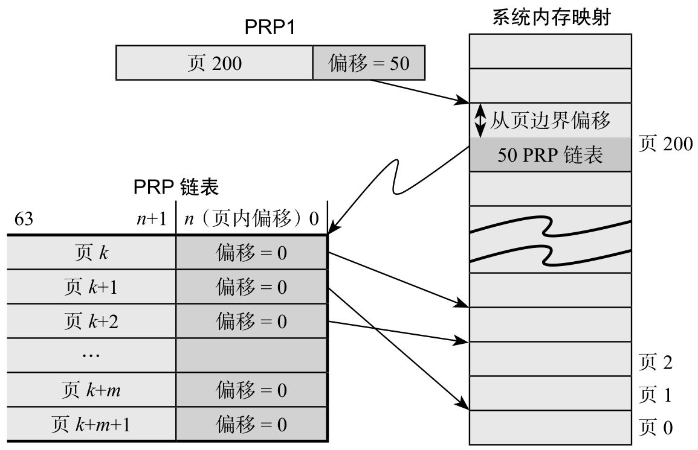
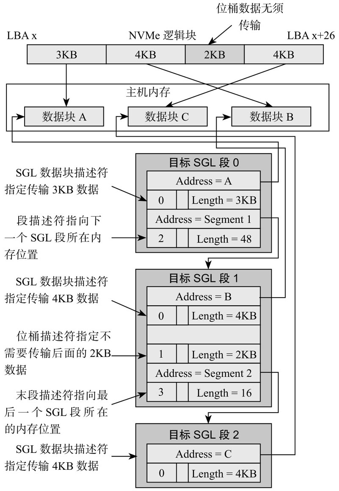

哲学经典三问: 我是谁？我从哪里来？我要去哪里？

这三个问题在NVMe的世界就很容易得到答案: 我是数据, 我从主机端来, 要到SSD去; 或者, 我是数据, 我从SSD来, 要去主机端.

**主机**如果想往 SSD 上**写入用户数据**, 需要告诉 SSD 写入什么数据, **写入多少数据**, 以及**数据源**在**内存中**的**什么位置**, 这些信息包含在主机向 SSD 发送的 **Write 命令**中. 每笔用户数据对应着一个叫作 **LBA**(`Logical Block Address`)的东西, **Write 命令**通过指定 **LBA** 来告诉 SSD 写入的是什么数据. 对 `NVMe/PCIe` 来说, **SSD** 收到 Write 命令后, 通过 **PCIe** 去**主机的内存数据所在位置读取数据**, 然后把这些数据**写入闪存**中, 同时**生成 LBA 与闪存位置的映射关系**.

数据在主机内存和 SSD 中流动:

主机如果想读取 SSD 上的用户数据, 同样需要告诉 SSD 需要什么数据, 需要多少数据, 以及数据最后需要放到主机内存的哪个位置上去, 这些信息包含在主机向 SSD 发送的 Read 命令中. SSD 根据 LBA, 查找映射表(写入时生成的), 找到对应闪存物理位置, 然后读取闪存获得数据. 数据从闪存读上来以后, 对 `NVMe/PCIe` 来说, SSD 会通过 PCIe 把数据写入主机指定的内存中. 这样就完成了主机对 SSD 的读访问.

在上面的描述中, 大家有没有注意到一个问题, 那就是主机在与SSD的数据传输过程中, 主机是被动的一方, SSD是主动的一方. 主机需要数据, 是SSD主动把数据写入主机的内存中；主机写数据, 同样是SSD主动去主机的内存中取数据, 然后写入闪存. 正如快递小哥一样辛劳, SSD不仅送货上门, 还上门取件.

无论送货上门, 还是上门取件, 你都需要告诉快递小哥你的地址, 世界那么大, 快递小哥怎么就能找到你呢？同样的, 主机你不亲自传输数据, 那总该告诉我SSD去你内存中什么地方取用户数据, 或者要把数据写入到你内存中的什么位置. 你在告诉快递小哥送货地址或者取件地址时, 会说××路××号××弄××楼××室, 也可能会说××小区××楼××室, 不管哪种方式, 快递小哥能找到就行. 主机也有两种方式来告诉SSD数据所在的内存位置, 一是PRP(Physical Region Page, 物理区域页, 有人戏称其为"拼人品"), 二是SGL(Scatter/Gather List, 分散/聚集列表, 有人戏称其为"死过来, 送过来").

先说PRP. NVMe把主机端的内存划分为一个一个物理页(Page), 页的大小可以是4KB,8KB,16KB, …,128MB.

PRP是什么, 长什么样呢如图所示.

PRP条目(Entry)布局(Layout):

PRP Entry本质就是一个64位内存物理地址, 只不过把这个物理地址分成两部分：页起始地址和页内偏移. 最后两比特是0, 说明PRP表示的物理地址只能四字节对齐访问. 页内偏移可以是0, 也可以是个非零的值, 如图所示.

PRP描述内存物理空间示例:

一个PRP Entry描述的是一个物理页空间. 如果需要描述若干个物理页, 那就需要若干个PRP Entry. 把若干个PRP Entry连接起来, 就成了PRP链表(List), 如图6-24所示.

PRP链表布局(Layout):

是的, 正如你所见, PRP链表中的每个PRP Entry的偏移量都必须是0, PRP链表中的每个PRP Entry都是描述一个物理页. 它们不允许有相同的物理页, 不然SSD往同一个物理页写入几次数据, 会导致先写入的数据被覆盖.

每个NVMe命令中有两个域：PRP1和PRP2, 主机就是通过这两个域告诉SSD数据在内存中的位置或者数据需要写入的地址, 如表所示.

NVMe命令格式中的PRP:

PRP1和PRP2有可能指向数据所在位置, 也可能指向PRP链表. 类似C语言中的指针概念, PRP1和PRP2可能是指针, 也可能是指针的指针, 还有可能是指针的指针的指针. 别管你包得有多严实, 根据不同的命令, SSD总能一层一层地剥下包装, 找到数据在内存的真正物理地址.

下面是一个PRP1指向PRP链表的示例, 如图6-25所示.

PRP链表描述内存空间示例:

PRP1指向一个PRP链表, PRP链表位于Page 200, 页内偏移50的位置. SSD确定PRP1是个指向PRP链表的指针后, 就会去主机内存中(Page 200, Offset 50)把PRP链表取过来. 获得PRP链表后, 就获得数据的真正物理地址, SSD然后就会向这些物理地址读取或者写入数据.

对Admin命令来说, 它只用PRP告诉SSD内存物理地址；对I/O命令来说, 除了用PRP, 主机还可以用SGL的方式来告诉SSD数据在内存中写入或者读取的物理地址, 如表6-3所示.

NVMe命令格式中的SGL:

主机在命令中会告诉SSD采用何种方式. 具体来说, 如果命令当中 `DW0[15:14]` 是0, 就是PRP的方式, 否则就是SGL的方式.

SGL是什么？SGL是一个数据结构, 用以描述一段数据空间, 这个空间可以是数据源所在的空间, 也可以是数据目标空间. SGL(Scatter Gather List)首先是个List, 是个链表, 由一个或者多个SGL段(Segment)组成, 而每个SGL段又由一个或者多个SGL描述符(Descriptor)组成. SGL描述符是SGL最基本的单元, 它描述了一段连续的物理内存空间：起始地址+空间大小.

每个SGL描述符大小是16字节. 一块内存空间, 可以用来放用户数据, 也可以用来放SGL段, 根据这段空间的不同用途, SGL描述符也分几种类型, 如表6-4所示.

SGL描述符类型:

由表6-4可知, 有4种SGL描述符：

* 一种是数据块描述符, 这个好理解, 就是描述的这段空间是用户数据空间.

* 一种是段描述符, SGL不是由SGL段组成的链表吗？既然是链表, 前面一个段就需要有个指针指向下一个段, 这个指针就是SGL段描述符, 它描述的是它下一个段所在的空间.

* 特别地, 对链表当中倒数第二个段, 它的SGL段描述符我们把它叫作SGL末段描述符. 它本质还是SGL段描述符, 描述的还是SGL段所在的空间. 为什么需要把倒数第二个SGL段描述符单独的定义成一种类型呢？我认为是让SSD在解析SGL的时候, 碰到SGL末段描述符, 就知道链表快到头了, 后面只有一个段了.

* 那么最后, SGL位桶是什么？它只对主机读有用, 用以告诉SSD, 你往这个内存写入的东西我是不要的. 好吧, 你既然不要, 我也就不传了.

说了这么多, 可能有点晕, 结合图6-26, 可能会更明白点.

SGL示例:

看个例子吧(见图6-27). SGL读示例:

这个例子中, 假设主机需要从SSD中读取13KB的数据, 其中真正只需要11KB数据, 这11KB的数据需要放到3个大小不同的内存中, 分别是：3KB、4KB和4KB.

无论是PRP还是SGL, 本质都是描述内存中的一段数据空间, 这段数据空间在物理上可能是连续的, 也可能是不连续的. 主机在命令中设置好PRP或者SGL, 告诉SSD数据源在内存的什么位置, 或者从闪存上读取的数据应该放到内存的什么位置.

大家也许跟我有个同样的疑问, 那就是, 既然有PRP, 为什么还需要SGL？事实上, NVMe1.0的时候的确只有PRP, SGL是NVMe1.1之后引入的. 那SGL和PRP本质的区别在哪？图6-28道出了真相：PRP描述的是物理页, 而SGL可以描述任意大小的内存空间.

PRP vs SGL:

对NVMe over PCIe(我们目前讲的都是NVMe跑在PCIe上), Admin命令只支持PRP, I/O命令可以支持PRP或者SGL；对NVMe over Fabrics, 所有命令只支持SGL.

