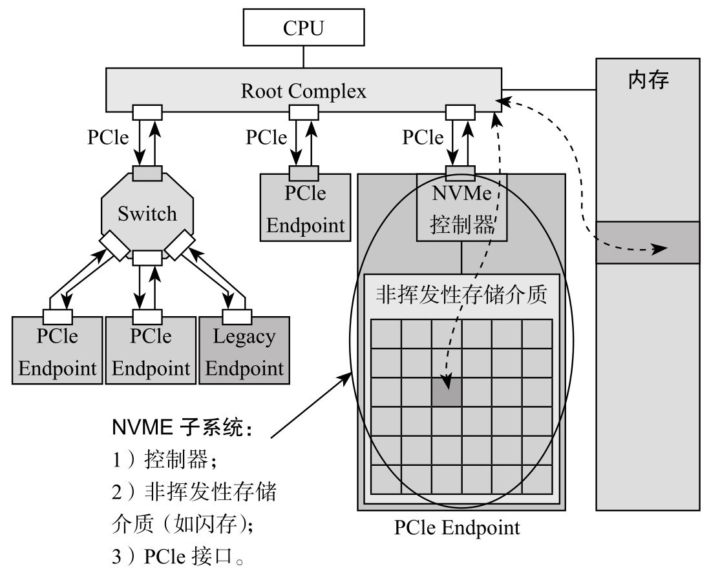
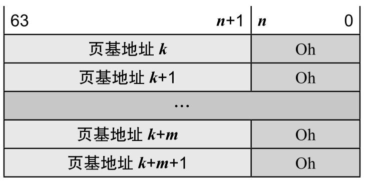
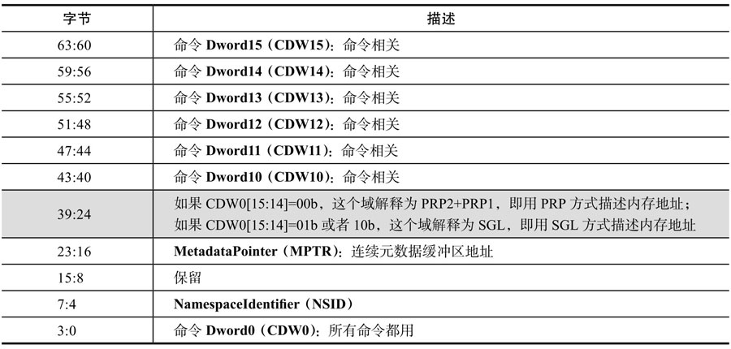
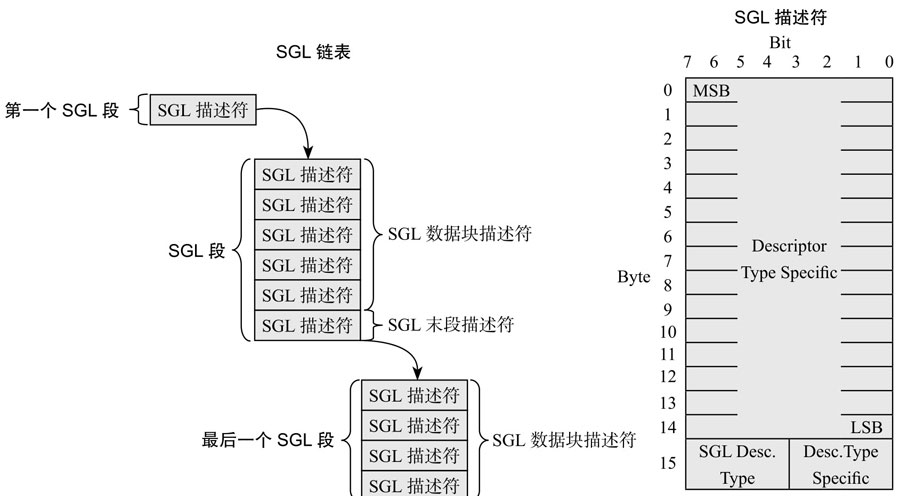
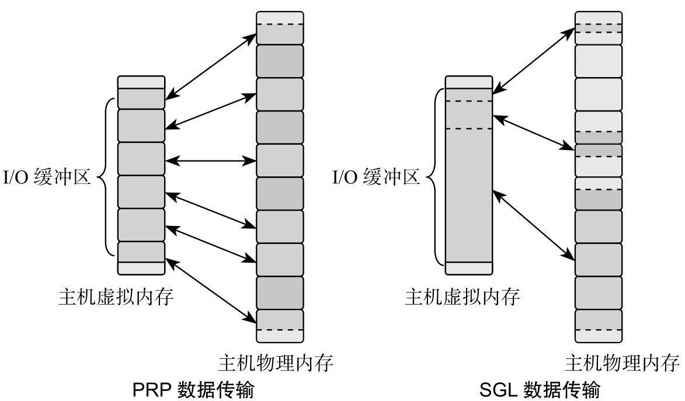

<!-- @import "[TOC]" {cmd="toc" depthFrom=1 depthTo=6 orderedList=false} -->

<!-- code_chunk_output -->

- [1. 数据流](#1-数据流)
  - [1.1. 主机写SSD](#11-主机写ssd)
  - [1.2. 主机读SSD](#12-主机读ssd)
- [2. 两种主机内存寻址方式](#2-两种主机内存寻址方式)
  - [2.1. PRP](#21-prp)
  - [2.2. SGL](#22-sgl)

<!-- /code_chunk_output -->

# 1. 数据流

哲学经典三问: 我是谁? 我从哪里来? 我要去哪里?

这三个问题在 NVMe 的世界中:

* 数据, 从主机端来, 要到SSD去;
* 或者, 数据, 从SSD来, 要去主机端.

## 1.1. 主机写SSD

**主机**如果想往 SSD 上**写入用户数据**, 需要告诉 SSD 写入什么数据, **写入多少数据**, 以及**数据源**在**内存中**的**什么位置**, 这些信息包含在主机向 SSD 发送的 **Write 命令**中.

**每笔用户数据**对应着一个叫作 **LBA**(`Logical Block Address`)的东西, **Write 命令**通过指定 **LBA** 来告诉 SSD 写入的是什么数据. 对 `NVMe/PCIe` 来说, **SSD** 收到 Write 命令后, 通过 **PCIe** 去**主机的内存**数据所在位置**读取**数据, 然后把这些数据**写入闪存**中, 同时**生成 LBA 与闪存位置的映射关系**.

> LBA, 是 SSD 上的地址?

数据在主机内存和 SSD 中流动:

## 1.2. 主机读SSD

**主机**如果想**读取** SSD 上的用户数据, 同样需要告诉 SSD 需要什么数据, 需要**多少数据**, 以及数据最后需要**放到主机内存**的**哪个位置**上去, 这些信息包含在主机向 SSD 发送的 **Read 命令**中.

SSD 根据 **LBA**, **查找映射表**(写入时生成的), 找到**对应闪存物理位置**, 然后读取闪存**获得数据**. 数据从闪存读上来以后, 对 `NVMe/PCIe` 来说, SSD 会通过 **PCIe** 把数据写入**主机指定的内存**中. 这样就完成了主机对 SSD 的读访问.

# 2. 两种主机内存寻址方式

在上面的描述中, 大家有没有注意到一个问题, 那就是主机在与SSD的**数据传输**过程中, **主机**是**被动**的一方, **SSD** 是**主动**的一方. 主机需要数据, 是SSD主动把数据写入主机的内存中; 主机写数据, 同样是 SSD 主动去主机的内存中取数据, 然后写入闪存. 正如快递小哥一样辛劳, SSD不仅**送货上门**, 还**上门取件**.

无论送货上门, 还是上门取件, 你都需要告诉快递小哥你的地址, 世界那么大, 快递小哥怎么就能找到你呢? 同样的, **主机**你不亲自传输数据, 那总该**告诉**我 SSD 去你**内存中什么地方**取用户数据, 或者要把数据写入到你**内存中的什么位置**. 你在告诉快递小哥送货地址或者取件地址时, 会说××路××号××弄××楼××室, 也可能会说××小区××楼××室, 不管哪种方式, 快递小哥能找到就行. 主机也有两种方式来告诉SSD数据所在的内存位置:

* 一是 **PRP**(`Physical Region Page`, **物理区域页**, 有人戏称其为"拼人品");
* 二是 **SGL**(`Scatter/Gather List`, **分散/聚集列表**, 有人戏称其为"死过来, 送过来").

## 2.1. PRP

> 分页方式

先说 PRP. **NVMe** 把**主机端的内存**划分为一个一个**物理页**(Page), 页的**大小**可以是 **4KB**, **8KB**, **16KB**, …, **128MB**.

PRP 是什么, 长什么样呢, PRP 条目(Entry)布局(Layout)如图所示:

PRP Entry 本质就是一个 **64 位内存物理地址**, 只不过把这个物理地址分成两部分: **页起始地址**和**页内偏移**. 最后两比特是 0, 说明 PRP 表示的**物理地址**只能**四字节对齐**访问. 页内偏移可以是 0, 也可以是个非零的值, 如图所示.

PRP描述内存物理空间示例:

**一个 PRP Entry** 描述的是**一个物理页空间**. 如果需要描述**若干个物理页**, 那就需要**若干个 PRP Entry**. 把若干个 PRP Entry 连接起来, 就成了 PRP 链表(List), PRP链表布局(Layout)如图所示:

是的, 正如你所见, PRP 链表中的每个 PRP Entry 的**偏移量**都必须是 **0**, PRP链表中的**每个 PRP Entry** 都是**描述一个物理页**. 它们**不允许有相同的物理页**, 不然 SSD 往同一个物理页写入几次数据, 会导致先写入的数据被覆盖.

**每个 NVMe 命令**中有两个域: **PRP1** 和 **PRP2**, 主机就是通过这两个域告诉 SSD 数据在**内存中的位置**或者数据需要**写入的内存地址**, 如表所示.

NVMe 命令格式中的 PRP:

PRP1 和 PRP2 有可能指向**数据所在位置**, 也可能指向 **PRP 链表**. 类似C语言中的指针概念, PRP1 和 PRP2 可能是**指针**, 也可能是**指针的指针**, 还有可能是**指针的指针的指针**. 别管你包得有多严实, 根据不同的命令, SSD总能一层一层地剥下包装, 找到**数据在内存的真正物理地址**.

下面是一个 PRP1 指向 PRP 链表的示例, 如图所示.

PRP 链表描述内存空间示例:

PRP1 指向一个 **PRP 链表**, PRP 链表位于 Page 200, 页内偏移 50 的位置. SSD 确定 PRP1 是个指向 PRP 链表的指针后, 就会去主机内存中(Page 200, Offset 50)把 **PRP 链表**取过来. 获得 PRP 链表后, 就获得数据的**真正物理地址**, SSD 然后就会向这些物理地址读取或者写入数据.

## 2.2. SGL

> 分段方式

对 **Admin 命令**来说, 它**只用 PRP** 告诉 SSD 内存物理地址; 对 **I/O 命令**来说, 除了用 PRP, 主机还可以用 **SGL** 的方式来告诉 SSD 数据在内存中写入或者读取的物理地址, 如下表所示.

NVMe 命令格式中的 SGL:

主机在命令中会告诉 SSD 采用何种方式. 具体来说, 如果**命令**当中 `DW0[15:14]` 是 0, 就是 PRP 的方式, 否则就是 SGL 的方式.

SGL 是什么? SGL 是一个**数据结构**, 用以**描述一段数据空间**, 这个空间可以是数据源所在的空间, 也可以是数据目标空间. SGL(Scatter Gather List)首先是个 **List**, 是个**链表**, 由一个或者**多个 SGL 段**(Segment)组成, 而**每个 SGL 段**又由一个或者**多个 SGL 描述符**(Descriptor)组成. SGL 描述符是 SGL 最基本的单元, 它描述了**一段连续的物理内存空间**: **起始地址** + **空间大小**.

**每个 SGL 描述符**大小是 **16** 字节. **一块内存空间**, 可以用来放**用户数据**, 也可以用来放 **SGL 段**, 根据这段空间的不同用途, SGL 描述符也分几种类型, 如表所示.

SGL描述符类型:

由表可知, 有 **4 种 SGL 描述符**:

* 一种是**数据块描述符**, 这个好理解, 就是描述的这段空间是用户数据空间.

* 一种是**段描述符**, SGL不是由SGL段组成的链表吗? 既然是链表, 前面一个段就需要有个指针指向下一个段, 这个指针就是SGL段描述符, 它描述的是它下一个段所在的空间.

* 特别地, 对**链表**当中**倒数第二个段**, 它的 SGL 段描述符我们把它叫作 SGL 末段描述符. 它本质还是 SGL 段描述符, 描述的还是 SGL 段所在的空间. 为什么需要把倒数第二个 SGL 段描述符单独的定义成一种类型呢? 我认为是让 SSD 在解析 SGL 的时候, 碰到 SGL 末段描述符, 就知道**链表快到头了**, 后面只有一个段了.

* 那么最后, **SGL 位桶**是什么? 它**只对主机读有用**, 用以**告诉 SSD**, 你往这个内存**写入的东西**我是**不要**的. 好吧, 你既然不要, 我也就不传了.

说了这么多, 可能有点晕, 结合下图, 可能会更明白点.

SGL 示例:

看个例子, SGL 读示例:

这个例子中, 假设主机需要从 SSD 中读取 13KB 的数据, 其中真正只需要 11KB 数据, 这 11KB 的数据需要放到 3 个大小不同的内存中, 分别是: 3KB、4KB 和 4KB.

无论是 PRP 还是 SGL, 本质都是描述内存中的一段数据空间, 这段数据空间在物理上可能是连续的, 也可能是不连续的. 主机在命令中设置好 PRP 或者 SGL, 告诉SSD数据源在内存的什么位置, 或者从闪存上读取的数据应该放到内存的什么位置.

大家也许跟我有个同样的疑问, 那就是, 既然有 PRP, 为什么还需要 SGL? 事实上, NVMe1.0 的时候的确只有 PRP, SGL 是 NVMe1.1 之后引入的. 那 SGL 和 PRP 本质的区别在哪? 下图道出了真相: **PRP** 描述的是**物理页**, 而 **SGL** 可以描述**任意大小的内存空间**.

PRP vs SGL:

对 NVMe over PCIe(我们目前讲的都是 NVMe 跑在 PCIe 上), Admin 命令只支持 PRP, I/O 命令可以支持 PRP 或者 SGL; 对 NVMe over Fabrics, 所有命令只支持 SGL.

