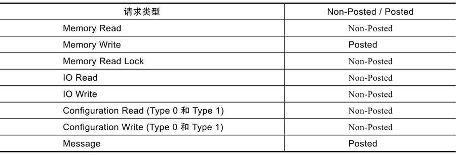

# 协议栈

如下图, 任何一种计算机协议都是采用这种分层结构的, 下层总是为上层服务的:

* 有些协议, 图中所有的层次都有定义和实现;
* 而有些协议, 只定义了其中的几层.

然而, 要让一种协议能工作, 它需要一个完整的协议栈, **PCIe** 定义了**下三层**, NVMe定义了**最上层**, 两者一拍即合, 构成一个完整的主机与SSD通信的协议.

PCIe 最直接接触的是 NVMe 的事务层.

## NVMe层

在 **NVMe 层**, 我们能看到的是 **64 字节的命令**、**16 字节的命令返回状态**, 以及**跟命令相关的数据**.

而在 PCIe 的事务层, 我们能看到的是**事务层数据包**(`Transaction Layer Packet`), 即**TLP**. 还是跟快递做类比, 你要寄东西, 可能是手机, 可能是电脑, 不管是什么, 你交给快递小哥, 他总是把你要寄的东西打包, 快递员看到的就是包裹, 他根本**不关心里面的内容**.

## 事物层

**PCIe 事务层**作为 **NVMe 最直接的服务者**, 不管你 NVMe 发给我的是命令, 还是命令状态, 或者是用户数据, 我统统帮你放进包裹, 打包后交给下一层, 即**数据链路层**继续处理, 如图.

PCIe 两设备通信示意图:

对 PCIe, 我们这里只关注事务层, 因为它跟 NVMe 的接触是最直接、最亲密的.

PCIe 事务层传输的是 TLP, 它就是个包裹, 一般由**包头**和**数据**组成, 当然也有可能**只有包头没有数据**. NVMe 传下来的数据都是放在 TLP 的**数据部分**的(**Payload**).

为实现不同的目的, TLP可分为以下几种类型: 

* Configuration Read/Write

* I/O Read/Write

* Memory Read/Write

* Message

* Completion

>注意, 这个 Completion 跟 NVMe 层的 Completion 不是同一个东西, 它们处在不同层. PCIe 层的 **Completion TLP**, 是对所有 `Non-Posted` 型的 TLP 的响应, 比如一个 Read TLP, 就需要 Completion TLP 来作为响应.
>
>NVMe 层的 Completion, 是对每个 SQ 中的命令, 都需要一个 Completion 来作为响应.

在 **NVMe** 命令处理过程中, **PCIe 事务层**基本只用 `Memory Read/Write TLP` 来为 NVMe 服务, 其他类型 TLP 我们可以不用管.

# PCIeTrace

主机发送一个 Read 命令, PCIe 是如何服务的? 结合 NVMe 命令处理流程, 看看 NVMe 和 PCIe 的事务层发生了什么.

NVMe 读命令的 PCIeTrace 图:

首先, 主机准备了一个 Read 命令给 SSD(见图).

NVMe 读命令:

也许你对NVMe Read命令格式不是很清楚, 但从图6-32中, 我们还是能得到下面的信息: 主机需要从起始LBA 0x20E0448(SLBA)上读取128个DWORD(512字节)的数据, 读到哪里去呢?PRP1给出内存地址是0x14ACCB000. 这个命令放在编号为3的SQ里(SQID = 3), CQ编号也是3(CQID = 3). 我觉得知道这些就够了. 相信你看了前面章节的介绍, 刚才说的这些应该都能懂.

当主机把一个命令准备好放到SQ后, 接下来步骤是什么呢?回想一下NVMe命令处理的八个步骤.

第一步: 主机准备好命令在SQ;(完成)

第二步: **主机**通过**写SQ**的 **Tail DB**, 通知 SSD 来取命令.

图中, 上层是NVMe层, 下层是PCIe的事务层, 这一层我们看到的是TLP. 主机想往SQ Tail DB中写入的值是5. PCIe是通过一个 **Memory Write TLP** 来实现主机写SQ的Tail DB的.

一个Host, 下面可能连接着若干个Endpoint, 该SSD只是其中的一个Endpoint而已, 那有个问题, Host怎么能准确更新该SSD Controller中的Tail DB寄存器呢?怎么寻址?

其实, 在上电的过程中, 每个Endpoint(这里是 SSD)的内部空间都会通过内存映射(memory map)的方式映射到Host的内存中, SSD Controller当中的寄存器会被映射到Host的内存, 当然也包括 Tail DB 寄存器. Host在用Memory Write写的时候, Address只需设置该寄存器在Host内存中映射的地址, 就能准确写入到该寄存器. 以上图为例, 该Tail DB寄存器应该映射在Host内存地址 0xF7C11018, 所以Host写DB, 只需指定这个物理地址, 就能准确无误的写入到对应的寄存器中去. 应该注意的是: Host并不是往自己内存的那个物理地址写入东西, 而是用那个物理地址作为寻址用, 往SSD方向写. 否则就太神奇了, 往自己内存写东西就能改变SSD中的寄存器值, 那不是量子效应吗?我们的东西还没有那么玄乎.

NVMe处理命令的第三步: SSD收到通知, 去Host端的SQ中取指.

PCIe SSD 是通过发一个 **Memory Read TLP** 到Host的SQ中取指的. 可以看到, PCIe需要往Host内存中读取16个DWORD的数据. 为什么是16 DWORD数据, 因为每个NVMe命令的大小是64个字节. 从上图中, 我们可以推断SQ 3当前的Head指向的内存地址是0x101A41100?怎么推断来的?因为SSD总是从Host 的SQ的Head取指的, 而上图中, Address就是0x101A41100, 所以我们有此推断.

在上图中, SSD往Host发送了一个Memory Read的请求, Host通过Completion的方式把命令数据返回给SSD. 和前面的Memory Write不同, Memory Read中是不含数据, 只是个请求, 数据的传输需要对方发个Completion. 像这种需要对方返回状态的TLP请求, 我们叫它Non-Posted请求. 怎么理解呢?Post, 有”邮政”的意思, 就像你寄信一样, 你往邮箱中一扔, 对方能不能收到, 就看快递员的素养了, 反正你是把信发出去了. 像Memory Write这种, 就是Posted请求, 数据传给对方, 至于对方有没有处理, 我们不在乎; 而像Memory Read这种请求, 它就必须是Non-Posted了, 因为如果对方不响应(不返回数据)给我, Memory Read就是失败的. 所以, 每个Memory read请求都有相应的Completion.

NVMe处理命令的第四步: **SSD** 执行**读命令**, 把数据从**闪存**中读到**缓存**中, 然后把数据传给Host. 数据从闪存中读到缓存中, 这个是SSD内部的操作, 跟PCIe和NVMe没有任何关系, 因此, 我们捕捉不到SSD的这个行为. 我们在PCIe接口上, 我们只能捕捉到SSD把数据传给Host的过程.

从上图中可以看出, SSD是通过 **Memory write TLP** 把Host命令所需的128个DWORD数据写入到Host命令所要求的内存中去. SSD每次写入32个DWORD, 一共写了4次. 正如之前所说, 我们没有看到Completion, 合理.

SSD一旦把数据返回给Host, SSD认为命令以及处理完毕, 第五步就是: **SSD** 往 **Host** 的 **CQ** 中返回状态.

从上图中可以看出, SSD是通过 **Memory write TLP** 把16个字节的命令完成状态信息写入到Host的CQ中.

SSD往Host的CQ中写入后, 第六步就是: **SSD** 采用**中断的方式**告诉 **Host 去处理CQ**.

SSD中断Host, NVMe/PCIe有四种方式: Pin-based interrupt, single message MSI,multiple message MSI,和MSI-X. 关于中断, 具体的可以参看spec 第171页, 有详细介绍, 有兴趣的可以去看看. 从上图中, 这个例子中使用的是MSI-X中断方式. 跟传统的中断不一样, 它不是通过硬件引脚的方式, 而是把中断信息和正常的数据信息一样, PCIe打包把中断信息告知Host. 上图告诉我们, SSD还是通过Memory Write TLP把中断信息告知Host, 这个中断信息长度是1DWORD.

Host收到中断后, 第七步就是: **Host 处理相应的 CQ**. 这步是在Host端内部发生的事情, 在PCIe线上我们捕捉不到这个处理过程.

最后一步, **Host** 处理完相应的 CQ 后, 需要**更新 SSD 端**的 **CQ Head DB**, 告知 SSD CQ 处理完毕.

跟前面一样, Host还是通过 **Memory Write TLP** 更新SSD端的CQ Head DB.

从我们抓的PCIe trace(感谢山哥提供！！除此之外, 在整个NVMe系列的写作过程中, 经常向山哥取经, 在这深表感谢, 感谢无私的帮助与解惑！)上, 我们从PCIe的传输层看到了一个NVMe Read命令是怎么处理的, 看到传输层基本都是通过Memory Write和Memory Read TLP传输NVMe命令、数据和状态等信息; 我们确实也看到了NVMe命令处理的八个步骤, 蛋蛋没有欺骗大家.

上面举的是NVMe读命令处理, 其他命令处理过程其实差不多, 就不赘述了.