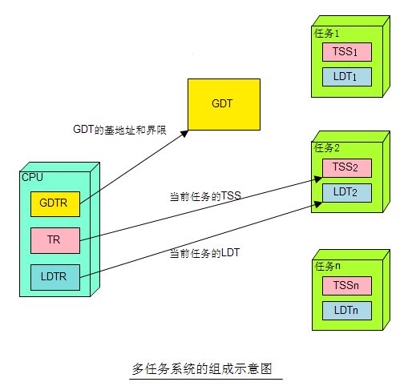
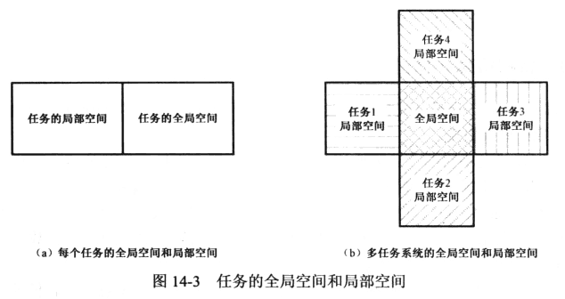
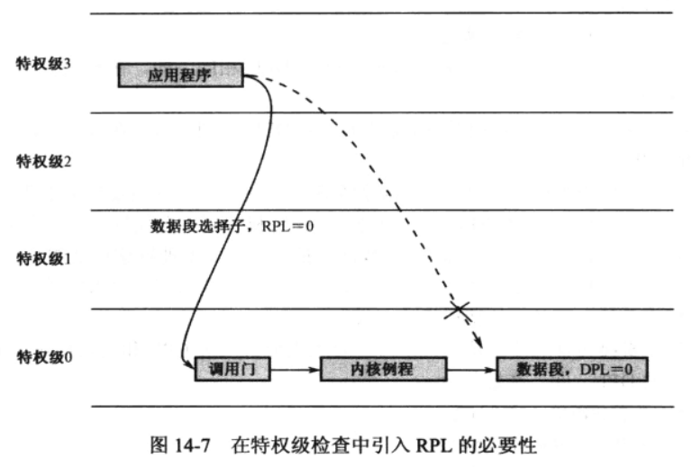

# 1. 任务、任务的 LDT 和 TSS

程序(Program)是指令和数据, 正在执行的一个副本, 叫任务(Task). 所以, 如果一个程序有多个副本正在内存中运行, 那么, 它对应着多个任务, 每个副本都是一个任务.

我们之前把所有段描述符都放在 GDT 中, 而不管属于内核还是用户程序. 如图 14-1, 为有效在任务间实施隔离, 处理器建议每个任务都应该具有自己的描述符表, 即局部描述符表 LDT(Local Descriptor Table).

和 GDT 一样, LDT 也是用来存放描述符的. 不同在于, **某个 LDT 只属于某个任务**, 每个任务都有自己的 LDT, 每个任务私有的段, 都应该在 LDT 中进行描述.

注意, **LDT 的第 1 个描述符, 即 0 号槽位, 也是可以使用的**.



GDT 是全局性的, 为所有的任务服务, 是它们所共有的, 我们只需要一个 GDT 就够了. 为了追踪 GDT, 访问它内部的描述符, 处理器使用了 GDTR 寄存器.

和 GDT 不同, **LDT 的数量**不止一个, **具体有多少, 根据任务的数量而定**. 为了追踪和访问这些 LDT, 处理器使用了 LDTR(局部描述符表寄存器). 在一个多任务的系统中, 会有很多任务轮流执行, 正在执行的那个任务, 称为当前任务(Current Task). 因为**LDTR 只有一个**, 所以, 它**只用于指向当前任务的 LDT**. 每当**发生任务切换**时, **LDTR 的内容被更新, 以指向新任务的 LDT**.

当向段寄存器加载段选择子的时候, 段选择子的 TI(Bit2)位是表指示器(Table Indicator).

- TI=0: 处理器从 GDT 中加载描述符
- TI=1: 处理器从 LDT 中加载描述符

因为描述符索引占用了 13 个比特, 所以每个 LDT 最多能容纳的描述符个数是 8192(2 的 13 次方), 也就是说每个 LDT 只能定义 8192 个段; 又因为每个段描述符占用 8 个字节, 所以 LDT 的最大长度是 64KB(2 的 16 次方).

在一个多任务环境中, 当任务发生切换时, 必须保存现场(比如通用寄存器, 段寄存器, 栈指针等). 为了**保存被切换任务的状态**, 并且在下次执行它时恢复现场, 每个任务都应当有一片**内存区域**, 专门用于保存现场信息, 这就是**任务状态段**(Task State Segment, TSS).

如下图, TSS 有固定的格式, 最小是 104(0x68=104)字节. 处理器固件能识别 TSS 中的每个元素, 并在任务切换的时候读取其中的信息.


和 LDT 类似, 处理器用**任务寄存器 TR**(Task Register)**指向当前任务的 TSS**. 和 GDTR、LDTR 一样, **TR 在处理器中也只有一个**. 当任务发生切换的时候, TR 的内容会跟着指向新任务的 TSS. 这个过程是这样的: 首先, 处理器将要挂起的任务的现场信息保存到 TR 指向的 TSS; 然后, 使 TR 指向新任务的 TSS, 并从这个 TSS 中恢复现场.

# 2. 全局空间和局部空间

在多任务系统中, 操作系统肩负着任务的创建, 以及在任务之间调度和切换的工作. 更多的是对处理器、设备以及存储器的管理.

比如说, 当中断发生, 不可能由某个任务来进行处理, 而只能由操作系统来提供中断处理过程, 并采取适当的操作, 以进行一些和所有任务都有关系的全局性管理工作, 如空闲内存的查找和分配、回收已终止任务的内存、设备访问的排队和调度等.

所以, 如图, **每个任务实际上包括两个部分: 全局部分和私有部分**. 全局部分是所有任务共有的, 含有操作系统的数据、库程序、系统调用等; 私有部分是每个任务自己的数据和代码, 与任务要实现的功能有关, 彼此并不相同.



任务是在内存中运行, 从内存的角度来看, 所谓的全局部分和私有部分, 其实是地址空间的划分, 即全局地址空间(简称全局空间)和局部地址空间(简称局部空间).

对地址空间的访问离不开分段机制, 全局地址空间用 GDT 来指定, 局部地址空间由每个任务私有的 LDT 来指定.

从程序员的角度看, **任务的全局空间包含了操作系统的段, 是由别人编写的**, 但是程序员可以调用这些段的代码, 或者获取这些段中的数据; 任务的局部空间的内容是由程序员自己编写的. 通常, **任务在自己的局部空间运行, 当它需要操作系统提供的服务时, 转入全局空间执行**.

**段寄存器(CS、DS、SS、ES、FS 和 GS)由 16 位的选择器和不可见的描述符高速缓存器组成. 选择器的位 2 是表指示器 TI, TI=0, 指向 GDT, 表示当前正在访问的段描述符位于 GDT 中; 否则指向 LDT, 表示正在访问的段描述符位于 LDT 中. 选择器的高 13 位指定所访问的段描述符的索引号, 从 0 开始**.

**每个段描述符对应着一个内存段. 在一个任务的全局地址空间上, 可以划分出 2\^13 个段, 即 8192 个段. 因为 GDT 的 0 号描述符不能使用, 所以实际上是 8191 个. 因为段内偏移是 32 位(EIP 指针寄存器), 段的长度最大 4GB(段描述符中段界限是 20 位, 而界限和颗粒度 G 关系很大, 颗粒度 G=1 的情况下才能到最大 4GB). 因此, 一个任务的全局地址空间, 其大小为 2\^13\*2\^32=2\^45 字节, 即 32TB**.

**同理, 局部描述符表 LDT 可以定义 2\^13 个, 每个段的最大长度也是 4GB, 所以一个任务的局部地址空间为 2\^13\*2\^32=2\^45 字节, 即 32TB**.

**这样一来, 每个任务的总地址空间是 64TB. 这个是虚拟的地址空间. 操作系统允许程序编写者使用这个地址空间来写程序, 即, 使用虚拟地址来或逻辑地址来访问内存, 就像真的拥有这么大的地址空间一样**.

上面的话可以这样理解: 编译器不考虑处理器可寻址空间的大小, 也不考虑物理内存的大小, 它只是负责编译程序. 当程序编译时, 编译器允许生成很大的程序. 但是当程序超出物理内存的大小时, 或操作系统无法分配这个大的物理内存时, 怎么办?

同一块物理内存, 可以让多个任务, 或者每个任务的不同段来使用. 当执行或访问一个新的段时, 如果它不在物理内存中, 而且也没有空闲的物理内存来加载它, 那么, 操作系统会挑一个暂时用不到的段, 把它换出到磁盘, 并把那个腾出来的空间分配给马上要分配的段, 并**修改段的描述符**, 使之指向这段内存空间. 这就是虚拟内存管理的一般方法.

# 3. 特权级保护概述

想搞清楚段级保护, 必须要弄懂 CPL, DPL, RPL、IOPL 概念.

在分段机制的基础上, 处理器引入了特权级的概念, 并由固件负责实施特权级保护.

特权级(Privilege Level), 是存在于**描述符**及**其选择子**中的一个数值. 当这些描述符或者选择子所指向的对象要进行某种操作, 或者被别的对象访问时, 该数值用于控制它们所能进行的操作, 或者限制它们的可访问性.

Intel 处理器可以识别 4 个特权级别, 分别是 0~3, 数值越小特权级越高.

如下图所示: 这是 Intel 处理器所提供的 4 级环状结构(操作系统不一定全部使用).


操作系统是为所有程序服务的, 可靠性最高, 而且必须对软硬件有完全的控制权, 所以它的主体部分必须拥有特权级 0, 处于整个环形结构的中心. 因此, 操作系统的主体部分通常被称作内核(Kernel、Core).

特权级 1 和 2 通常赋予那些可靠性不如内核的系统服务程序, 比较典型的就是**设备驱动程序**. 不过, 在很多流行的操作系统中, **驱动程序也是 0 特权级**.

应用程序的可靠性被视为是最低的, 而且通常不需要直接访问硬件和一些敏感的系统资源, **通过调用设备驱动程序和操作系统例程**就能完成绝大多数工作, 所以赋予它们最低的特权级别 3.

实施特权级保护的第一步, 是为**所有可管理的对象赋予一个特权级**.

## DPL

DPL: 描述符特权级(Descriptor Privilege Level), 存在于**段描述符中的 DPL 字段**.

DPL 是每个描述符都有的字段, 故又称描述符特权级. 描述符总是指向它所描述的目标对象, 代表着该对象. 因此, **DPL 实际上是目标对象的特权级**.

实模式下, 段寄存器存放的是段地址; 而在保护模式下, 段寄存器存放的是段选择子, 段地址则在描述符高速缓存器中.

## CPL

CPL: 当前特权级(Current Privilege Level), 存在于**CS 寄存器的低两位(不考虑 DS)**.

当处理器正在一个**代码段中取指令和执行**时, 这个代码段所在的特权级叫做当前特权级. 正在执行的这个代码段, 其**选择子位于段寄存器 CS**中, CS 中的低两位就是当前特权级的数值.

一般来说, 操作系统的代码正在执行时, CPL 就等于 0;

相反, 普通的应用程序则工作在特权级 3 上. 应用程序的加载和执行, 是由操作系统主导的, 操作系统一定会将其放在特权级 3 上. 当应用程序开始执行时, CPL 自然会是 3.

需要注意的是, 不能僵化地看待任务和任务的特权级别. 当任务在自己的局部空间执行时, CPL 等于 3; 当它通过**调用系统服务, 进入操作系统内核, 在全局空间执行时, CPL 就变成了 0**.

那些只有在当前特权级 CPL 为 0 时才能执行的指令, 称为特权指令(Privileged Instructions).

## IOPL

除了那些特权级敏感的指令, 处理器还允许对各个特权级所能执行的 I/O 操作进行控制. 这通常指的是端口访问的许可权.

在处理器的**标志寄存器 EFLAGS**中, 位 12、13 是 IOPL 位, 也就是输入/输出特权级(I/O Privilege Level), 它代表着**当前任务的 I/O 特权级别**.


任务是由操作系统加载和创建的, **与任务相关的信息都在它自己的任务状态段**(TSS)中, 其中就包括一个 EFLAGS 寄存器的副本, 用于指示与当前任务相关的机器状态, 比如它自己的 I/O 特权级 IOPL.

多任务系统中, 任务切换, 前一个任务的所有状态被保存到它自己的 TSS 中, 新任务的各种状态从其 TSS 中恢复, 包括 EFLAGS.

处理器不限制 0 特权级程序的 I/O 访问.

**如果 CPL 在数值上小于等于 IOPL, 那么所有的 I/O 操作都是允许的**, 针对任何硬件端口的访问都可以通过.

相反, 如果 CPL 的数值大于 IOPL, 也并不意味着所有的硬件端口都对当前任务关上了大门. 事实上, 处理器的意思是总体上不允许, 但个别端口除外. 至于是哪些个别端口, 要找到当前任务的 TSS, 并检索 I/O 许可位串(具体细节我们以后会说).

只有当 CPL=0 时, 程序才可以使用 POPF 或 IRET 指令修改这个字段.

## 控制转移

在保护模式下, JMP 或 CALL 指令可以用以下四种方法之一来引用另外一个代码段:

1. 目标操作数含有目标代码段的段选择子和偏移
2. 目标操作数指向一个调用门描述符
3. 目标操作数指向一个 TSS
4. 目标操作数指向一个任务门

后两种涉及任务的切换. 本文仅对前两种进行讨论.

JMP、CALL、RET 指令的近转移只是在当前代码段中执行程序的控制转移, 因此不会执行特权级检查. JMP、CALL、RET 指令的远转移形式会把控制转移到另外一个代码段中, 因此处理器一定会执行特权级检查.

**代码段(不是数据段)的特权级检查很严格**. 一般, **控制转移**只允许**两个特权级相同的代码段**之间. 如果当前特权级为 2, 那么可以转移到另外一个 DPL 为 2 的代码段, **不能转移到 DPL 为 0、1、3 的代码段**执行.

不过, 为了让**特权级低的应用程序可以调用特权级高的**操作系统例程, 处理器也提供了相应的解决办法(针对代码段).

第一种方法是**将高特权级的代码段定义为依从的**. 11 章中的段描述符的 TYPE 字段. **代码段描述符的 TYPE 字段有 C 位(只有代码段有！！！)**, C=0, 这样的代码段只能供**同特权级的程序调用**; C=1, 这样的代码段称为依从的代码段, **可以从特权级比它低的程序调用并进入**.

即使将控制转移到依从的代码段, 也有条件, 要求当前特权级 CPL 必须低于等于目标代码段描述符的 DPL 相同. 数值上,

```
CPL >= 目标代码段描述符的 DPL
```

如果一个依从的代码段, 其描述符的 DPL 为 1, 则只有特权级为 1、2、3 的程序调用, 而特权级 0 的不能. 在任何时候, 都**不允许控制从较高特权级转移到较低特权级**.

**依从的代码段不是在它的 DPL 特权级上运行**, 而是在调用程序的特权级上运行. 就是说, 当控制转移到依从的代码段上执行时, 不改变当前特权级 CPL, **段寄存器 CS 的 CPL 字段不会发生变化**, 被调用过程的特权级依从于调用者的特权级, 这就是为什么被称为"依从的"代码段.

可以查看《Intel Architecture Software Developer’s Manual Volume 2: Instruction Set Reference》中的 CALL 指令解释.

另一种在**特权级之间转移的方法是使用门**. 门是另一种描述符, 称为门描述符. 与段描述符不同, **段描述符用于描述内存段, 门描述符用于描述可执行的代码**, 比如一段程序、一个过程(例程)或一个任务.

根据不同用途, 门的类型有好几种. **不同特权级之间的过程可以使用调用门(！！！**); **中断门/陷阱门是作为中断处理程序使用的(软件中断或异常其实也应该算控制转移！！！**); **任务门对应着单个的任务, 用来执行任务切换**.

本章重点介绍调用门(Call Gate).

所有描述符都是 8 字节(64 位), 调用门描述符也不例外. **在调用门描述符中, 定义了目标过程(例程)所在代码段的选择子, 以及段内偏移**. 要想通过调用门进行控制转移, 可以使用**jmp far 或 call far 指令**, 并把**调用门描述符的选择子作为操作数(！！！, 调用门描述符可以安装在 LDT 或 GDT 中！！！**).

使用 jmp far 指令, 可以将**控制通过门转移到比当前特权级高的代码段**, 但**不改变当前特权级别(CPL)**. 但是, 如果使用 call far 指令, 则**当前特权级(CPL)会提升到目标代码段的特权级别**. 也就是说, 处理器是在目标代码段的特权级上执行的. 但是, 除了从高特权级的例程(通常是操作系统例程)返回外, 不允许从特权级高的代码段将控制转移到特权级低的代码段, 因为操作系统不会引用可靠性比自己低的代码.

## RPL

RPL: 请求特权级(Requested Privilege Level), 存在于段选择子的低两位.

要想将控制**从一个代码段转移到另一个代码段**, **通常是使用 jmp 或者 call 指令**, 并**在指令中提供目标代码段的选择子和偏移**; 为了访问内存中的数据, 也必须先将段选择子加载到段寄存器, 比如 DS、ES、FS、GS 中. 不管是实施控制转移还是访问数据段, 这都可以看成是一个请求, 请求者提供一个段选择子, 请求访问指定的段. 从这个意义上来说, RPL 也就是指请求者的特权级别.

多数情况下, 请求者就是当前程序自己, 即, CPL=RPL. 要判断请求者是谁, 最简单办法就是看谁提供了选择子, 下面是两个典型例子:

```
jmp dword 0x0010:flush
```

这里提供选择子的便是当前程序自己.

```
mov eax, 0x0008
mov ds, eax
```

非常清楚的是, 这同样是当前程序自己拿着段选择子 0x0008 来"请求"代入段寄存器 DS, 以便在随后的指令中访问该段中的数据.

但是, 在有些情况下, RPL 和 CPL 并不相同. 如图, 特权级 3 的应用程序希望从硬盘读一个扇区, 并传送到自己的数据段, 因此, 数据段描述符的 DPL 同样会是 3.


由于 I/O 特权级限制, 应用程序无法自己访问硬盘. 操作系统提供了例程, 但必须通过调用门才能使用, 因为特权级间的控制转移必须通过门. 假设, 通过调用门使用操作系统例程时, 必须传入 3 个参数, 分别是 CX 寄存器中的数据段选择子, EBX 寄存器中的段内偏移, 以及 EAX 中的逻辑扇区号.

高特权级的程序可以访问低特权级的数据段, 这是没问题的. 因此, 操作系统例程会用传入的数据段选择子代入段寄存器, 以便代替应用程序访问那个段:

```
mov ds,cx
```

在执行这条指令时, CX 寄存器中的段选择子, 其 RPL 是 3, 当前特权级 CPL 已经变成 0 了, 因为通过调用门实施控制转移可以改变当前特权级. 显然, 请求者并非当前程序, 而是特权级为 3 的应用程序. RPL 和 CPL 不同.

不过上面没有说明为什么引入 RPL.

如图 14-7, 假设应用程序知道了操作系统数据段的选择子, 而且希望这个选择子访问操作系统的数据段. 当然, 它不可能在应用程序中访问操作系统数据段, 因为那个数据段 DPL 为 0, 而应用程序工作的当前特权级为 3.



但是, 它可以借助调用门. 调用门工作在目标代码段的特权级上, 通过调用门进入操作系统例程时, 当前特权级从 3 变成 0(call far). 当那个程序将一个指向操作系统数据段的选择子通过 CX 寄存器作为参数传入调用门时, 因为当前特权级已经变成 0 了, 可以从硬盘读取数据, 并且允许向系统数据段写入扇区数据, 它得逞了！

所以, 当指令

```
mov ds,ax
```
或
```
mov ds,cx
```

执行时, AX 或 CX 中的选择子可能是操作系统提供的, 可能是恶意用户程序提供的, 这两种情况要区别对待, 但超出了处理器的能力.

引入 RPL 的原因是处理器在遇到**一条将选择子传送到段寄存器的指令**时, 无法区分真正的请求者是谁. 但是, 引入 RPL 本身并不能解决, 这只是处理器和操作系统之间的一种协议, 处理器负责检查请求特权级 RPL, 判断它是否有权访问, 但前提是这是正确的 RPL; 内核负责鉴别请求者的身份, 保证 RPL 的值和它请求者身份相符, 因为处理器无能为力.

每当处理器执行将一个段选择子传送到段寄存器(DS、ES、FS、GS)的指令, 比如:

```
mov ds, cx
```

时, 会检查以下两个条件是否满足.

- 当前特权级 CPL 高于等于数据段描述符的 DPL. CPL<=数据段描述符 DPL;
- 请求特权级 RPL 高于等于数据段描述符的 DPL. RPL<=数据段描述符 DPL.

最后, 我们总结下基本的特权级检查规则.

**首先**, 将控制**直接转移**到**非依从的代码段(不是数据段！！！)**, 要求 CPL 和 RPL 特权级等于目标代码段描述符的 DPL.

```
CPL=目标代码段描述符的 DPL
RPL=目标代码段描述符的 DPL
```

因为两个代码段的特权级相同, **转移后当前特权级不变**.

**其次**, 要将控制**直接转移**到**依从的代码段(不是数据段！！！)**, 要求 CPL 和 RPL 特权级都低于或等于目标代码段描述符的 DPL.

```
CPL>=目标代码段描述符的 DPL
RPL>=目标代码段描述符的 DPL
```

控制转移后, **当前特权级保持不变**.

**通过门实施的控制转移, 特权级检查规则在相应章节里描述**.

总结如下:


第三, 高特权级程序可以访问低特权级的**数据段(不是代码段！！！)**, 但低级别程序不能访问高特权级数据段. 访问数据段之前, 肯定要对段寄存器 DS、ES、FS 和 GS 修改, 比如

```
mov fs, ax
```

这时候, 要求 CPL 和 RPL 都必须高于或等于目标数据段描述符的 DPL.

```
CPL<=目标数据段描述符的 DPL
RPL<=目标数据段描述符的 DPL
```

最后, 处理器要求, 任何时候, **堆栈段的特权级必须等于当前特权级 CPL**. 所以, 要对段寄存器 SS 的内容进行修改时, 必须进行特权级检查.

```
mov ss,ax
```

对段寄存器 SS 进行修改, 要求**CPL 和 RPL 必须等于目标堆栈段 DPL**.

```
CPL=目标堆栈段描述符的 DPL
RPL=目标堆栈段描述符的 DPL
```

处理器建议, 如果不需要使用特权机制, 可以将所有程序特权级设置为 0.