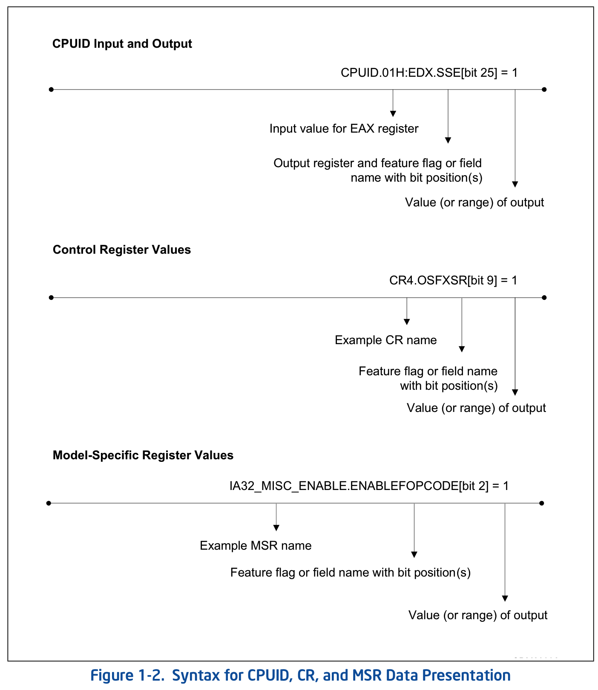

**每个MSR**都有它的**地址值**(或许称为**编号**更合适些).

**MSR的读取**使用**rdmsr指令**, **写入**使用**wrmsr指令**, 由**ecx寄存器(！！！**)提供需要访问的**MSR地址值**.

```assembly
mov ecx, 176H   ;IA32_SYSENTER_EIP 寄存器的地址
rdmsr           ;读MSR内容到 EDX: EAX 寄存器
```

MSR是**64位宽**的, 在上面的代码中读出来的 `IA32_SYSENTER_EIP` 寄存器值放到 `EDX: EAX` 寄存器中,
- **高32位**放在**EDX**寄存器
- **低32位**放在**EAX**寄存器.

在**64位**环境里**rdx和rcx寄存器高32位都被清0**.

```assembly
mov rcx, 176H
mov rdx, KERNEL_SERVICE_ENTRY
mov rax, rdx
shr rdx, 32        ;拆分到EDX: EAX 放入 64 位的值
wrmsr
```

**写入**时 `EDX: EAX` 放入**64位**的值, 像上面的代码一样在 64 位下, 需要将 64 的值拆分到 **EDX** 和 **EAX** 寄存器中.

若提供的**MSR地址**是**保留或未实现**的, 则执行 rdmsr 和 wrmsr 指令会产生 `#GP` 异常.

# Linux中工具: msr-tools

```
# rpm -qa | grep msr
msr-tools-1.3-3.el7.x86_64
# rpm -ql msr-tools
/usr/sbin/msr-cpuid
/usr/sbin/rdmsr
/usr/sbin/wrmsr
```