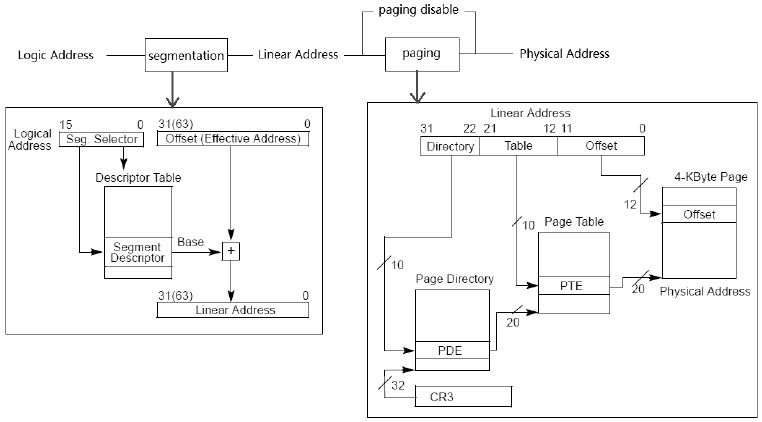

**物理地址空间**(Phyiscal address space)的大小从**36位到 MAXPHYADDR 值**, 这个值可以由`CPUID.80000008H:EAX[7:0]`来查询(详情参考第4章). **MAXPHYADDR值一般都会是36位**, Intel64和AMD64实现了最高为**52位的物理地址**.

下面是**物理地址形成**的示意图, **logic address**经过**段式转换**后形成**linear address**, 当关闭paging管理时, **线性地址**将映射到物理地址空间. 否则linear address是`Virtual address`(虚拟地址), 需要经过页式转换形成物理地址.

关于**物理地址空间**, read/write的**内存设备RAM(DRAM**), read\-only的**内存设备ROM(EPROM**), 以及**memory mapped I/O设备**都可以**映射到物理地址空间**上.

典型的**ROM设备**映射到**物理地址空间**的**高端和低端位置**, 处理器第 1 条指令的指令存放在这个ROM设备里. **Video和IGD设备**的**buffer**映射到**A0000H到BFFFFH的物理地址空间**上. **PCIe等设备**映射到物理地址空间的**E0000000H位置**上, **I/O APIC设备**映射到**FEC00000H以上的位置**, 等等.

经过**页式转换形成的物理地址**, 可以映射到**DRAM或外部存储设备Disk**上, 可以实现更多的memory访问.

