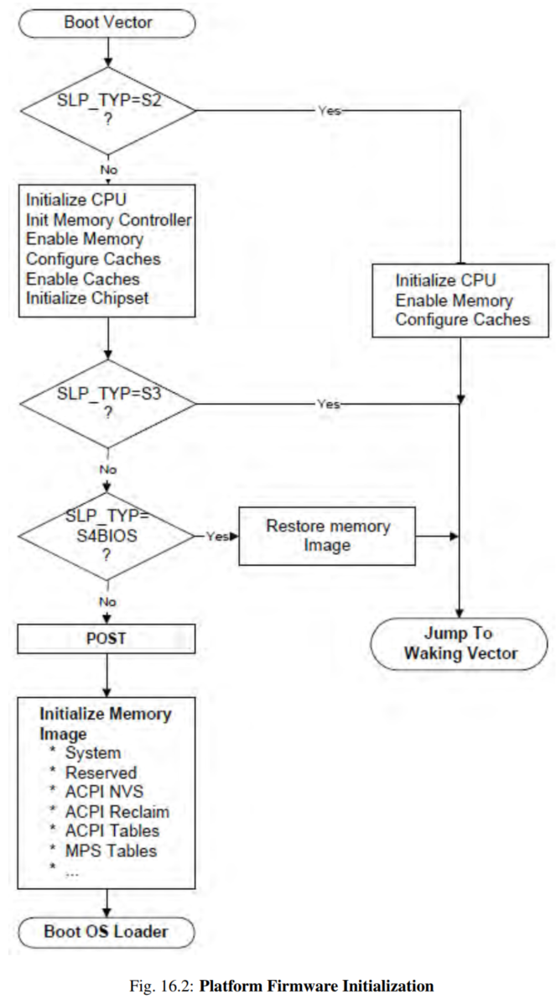

冷复位和热复位，两者的区别在于是否断电，也就是和芯片中的 power 相关。

冷复位，冷启动，`Cold Reset`, `cold reboot`, `cold boot`, `hard reboot`, `hard reset`，是**完全关闭电源**，**断电之后的重启**，相当于关机再重启，也有的地方称之为 `cool reset`, 或者 `hard reset`。

**断电操作**，意味着 cold reset 能够将所有的寄存器进行复位，回归初始状态，同时，重新做芯片的一些初始化操作，也就是bootload.

热复位，热启动，`Warm Reset`, `warm reboot`, `soft reboot`, `soft reset`, 是在**不断电**的情况下，强制重启, 这就是我们印象中的重启，也有的地方称之为 `hot reset`, `soft reset`。

不断电操作，**只对特定的寄存器进行复位操作**，并不会触发芯片做初始化操作。所以也可以认为 cold reset 是大范围的复位，warm reset是局部复位。

主要区别，**热启动没有关闭电源**；启动过程的区别是，**冷启动**需要进行**硬件的自检**，而**热启动跳过硬件自检**这一步。

冷启动（在直接关闭电源时），可能对硬件（如磁盘）有较大的影响，可能导致其损坏；另外，磁盘的写入一般存在cache，直接关闭电源可能导致cache没有flush，可能导致磁盘中数据出现错误。而热启动则一般不存在这样的问题。所以，一般情况下，推荐使用热启动。

启动又可分为冷启动和热启动。冷启动后机器要首先进行硬件的自检(不同的机器可能自检时间不同，这主要取决于各个部件的配置情况，如内存的多少等)，以确定各个部件是否工作正常，如果自检顺利通过，则进入OS启动状态。热启动则没有机器自检这一过程，这就是二者的主要区别。因此热启动的速度显然要比冷启动快。由于热启动没有切断电脑各部件的电 源，因此能有效地延长硬件的寿命，在没有特殊情况(如电脑受到病毒侵袭、某些软件在运行过程中死机并封锁键盘等)的时候，应尽量使用热启动。 冷启动的方法主要是关闭电源，即关机。不过目前绝大多数组装机(或称为兼容机)在机箱上都有一个RESET(意即“重新启动”)按钮，它的主要目的就是简 化冷启动，通常在冷启动时应尽量使用RESET钮，它在启动时对机器的冲击比关机(即按POWER钮)小一些，所以有助于延长电脑的使用寿命。要注意，原 装机(或称为品牌机)，特别是进口机，几乎都没有RESET键(RESET可以说是组装机的“专利”)，此时要想冷启动就只有关闭电源了。要注意，如果使 关闭电源的方法进行冷启动，一定要关闭后至少间隔8秒至10秒后再开机，以免由于间隔时间过短损坏部件。

常见的**热启动**方法(软件重启或者硬件重启)：

* `Ctrl+Alt+Del`；
* 在 **OS** 中选择**重启计算机**；
* 按机箱上的 **reset 重启按钮**（如果有这个按钮）。

常见的**冷启动**方法和场景：按**电源按钮关闭电源**后再**按电源按钮启动**计算机.（停电的情况，或者热启动无效时强制冷启动）。

Q. cold reset 和 power up 是一样的?

yes, 都会断开电源, 对 CPU 来说, 有两种硬件信号: powergood 信号(cold reset 或者 power up), reset 信号(warm reset)

结合 acpi 的 spec, 流程是:

1. OS 可能会写 pm1a/pm1b 寄存器, 如果是 S3 的话, ACPI 是建议断开系统电源(仅保留内存设备通电)

> 对于 S3 而已, 断开电源不是强制性的, 所以 S3 之后 CPU 不一定是 power up/cold reset

2. 对平台进行操作: 设置热启动(上面); 设置冷启动(上面); 正常 power up;

> 冷启动和 power up 是一样的
> 如果按照 ACPI 建议设计, S3 就是相当于 cold reset/power up, 因为断电了

3. 硬件自检 BIST(CPU 自检), 热启动会跳过

4. CPU 按照 SDM 中规定的 Power up, Cold reset, Warm Reset 或者 INIT 这几种类型之一初始化好了 CPU 的初始寄存器状态, 然后开始从 Boot Vector 开始执行

>参照 SDM 9.1.1, Boot Vector 就是 CS:IP, F000:FFF0, ram 里面的 code(非易失性的), 会各种跳转, 然后最后执行 BIOS 固件代码.

5. BIOS 固件代码开始执行, 下图中 Boot Vector 往下内容都是 BIOS 的

6. BIOS 读取 SLP_TYP 值

7. BIOS 可能会设置 CPU 的状态, 初始化 memory controller, cache 设置, 初始化芯片组 等等;

8. BIOS 可能会 POST(加电自检), 检测电脑中的设备(不是 CPU, 而是 memory, 中断, 扩展卡等等, 所以 BIOS 是有所有设备信息的)工作状态是否正常

8. BIOS 可能会初始化 memory

9. BIOS 会跳到 Boot loader 执行

