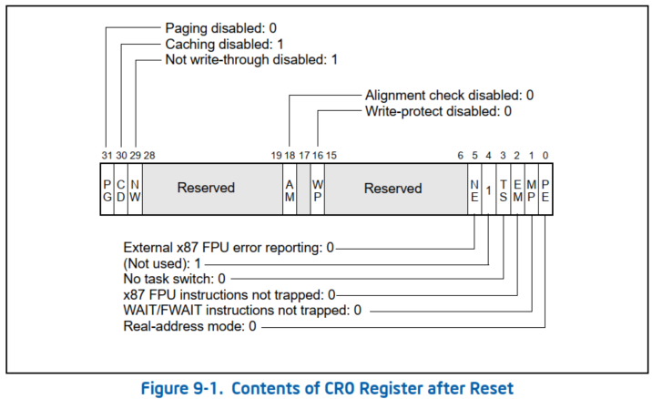
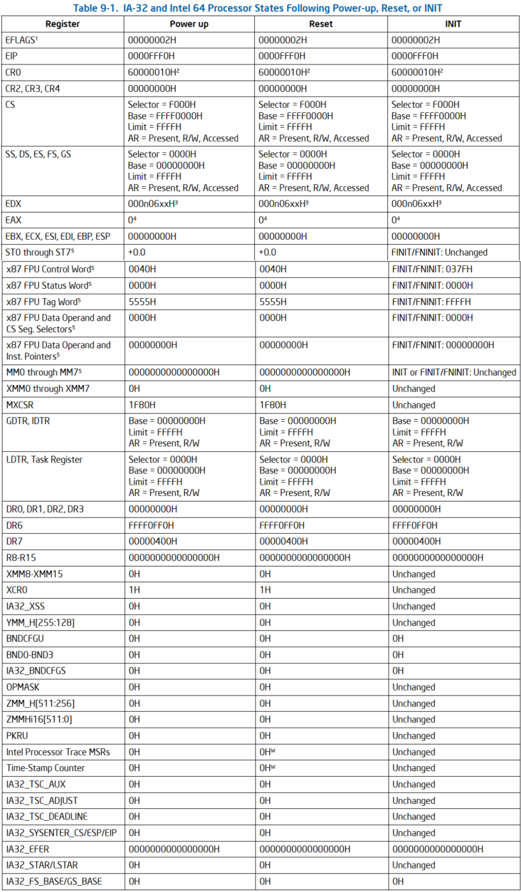
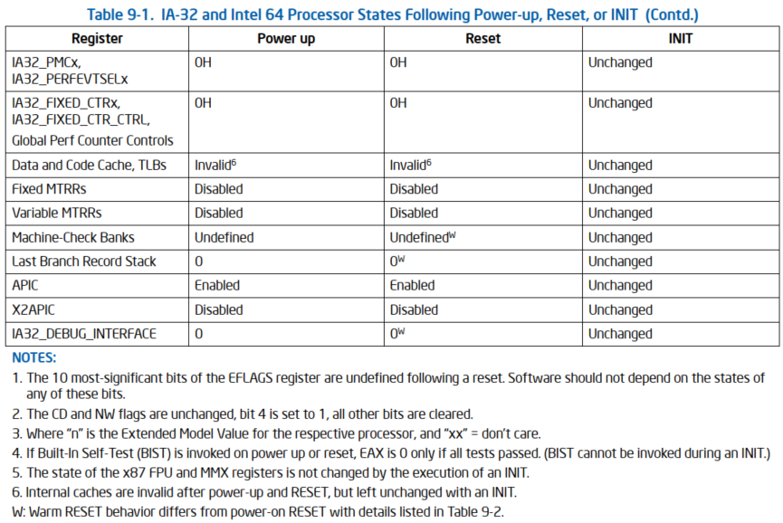
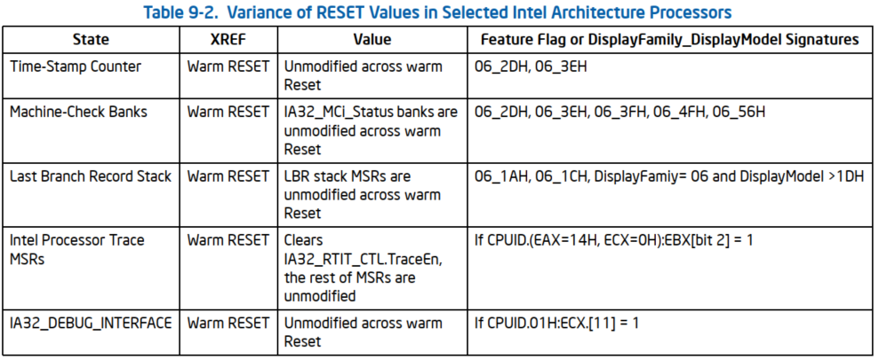

# 概述

上电或置位 `RESET#` **引脚**后, 系统总线上的每个处理器执行处理器的硬件初始化(称为硬件复位,hardware reset)和可选的**内置自检**(`built-in self-test`, BIST). **硬件复位**将**每个处理器**的**寄存器**设置为**已知状态**, 并将处理器置于**实模式**.它还会使**内部缓存**, TLB 和分支目标缓冲区(BTB) 失效. 此时, 所执行的操作取决于处理器系列:

* Pentium 4 处理器 (cpuid DisplayFamily 是 0Fh): 系统总线上的**所有处理器**(包括单处理器系统中的单个处理器)都执行**多处理器**(MP)**初始化协议**.然后,通过**此协议**选择作为**自举处理器** (`bootstrap processor`, BSP)的处理器立即开始在**当前代码段** (code segment) 中, 从 **EIP** 寄存器中的**偏移量**开始执行**软件初始化代码**. 当 BSP 执行初始化代码时, 应用进程(**非 BSP)处理器 (AP**) 会进入**等待启动 IPI**(`Startup IPI`, **SIPI**)状态. 有关更多详细信息, 请参见"多处理器(MP)初始化". 请注意, 在单处理器系统中,单个 Pentium 4 或 Intel Xeon 处理器自动成为 BSP.

* IA-32 和 Intel 64 处理器 (cpuid DisplayFamily 是 06h): 和 Pentium 4 一致.

* Pentium 处理器:

* Intel486 处理器:

**软件初始化代码**会执行 **BSP** 或**主处理器**和系统逻辑的所有**特定于系统的初始化**。

此时，对于 MP（或 DP）系统，BSP（或主）处理器会唤醒每个 AP（或 secondary）处理器，使这些处理器使能并执行自配置代码。

当**所有处理器**都**初始化**、**配置**和**同步**后，**BSP** 或主处理器开始执行**初始操作系统**或执行任务。

在**硬件重置期间**，**x87 FPU** 也会初始化为**已知状态**。然后可以执行 x87 FPU 软件初始化代码来执行设置 x87 FPU 的精度和异常掩码等操作。无需对 x87 FPU 进行特殊初始化即可切换操作模式。

在处理器上断言(assert, 置位) `INIT#` **引脚**会调用**对硬件重置**的类似响应。主要区别在于，在 **INIT** 期间，**内部缓存**、**MSR**、**MTRR** 和 **x87 FPU** 状态保持不变（尽管 TLB 和 BTB 与硬件 reset 一样失效）。**INIT** 提供了一种从受**保护模式**切换到**实地址模式**的方法，同时**保留内部缓存**的内容。

# Reset 之后的处理器状态

上电后，控制寄存器 CR0 的状态为 `60000010H`（见图9-1）。这会将处理器置于**禁用分页**的**实地址模式**。

下表 9-1 显示了 IA-32 和 Intel 64 处理器（CPUID DisplayFamily 为 06H）在以下事件中的状态：开机、RESET 和 INIT。在**少数情况**下，**某些寄存器**的行为在 **warm RESET** 中的行为**略有不同**，表中标记了变体情况，在表 9-2 中对此进行了更详细的描述。

注:

* 1, 复位后，EFLAGS 寄存器的 10 个最高有效位是 **undefined**。软件不应依赖于这些位中的任何一个的状态。
* 2, CD 和 NW 标志保持不变，位 4 设置为 1，所有其他位均被清除.
* 3, 其中 “n” 是相应处理器的扩展模型值，“xx”= 不关心。
* 4, 如果在上电(`power-on`)或复位(`reset`)时调用**内置自检**(`Built-In Self-Test`, BIST)，则仅当所有 test 都通过时，EAX 才为 0。（在 INIT 期间不能调用 BIST)。
* 5, x87 FPU 和 MMX 寄存器的状态不会因执行 INIT 而改变。
* 6, 内部缓存在上电(`power-on`)和复位(`reset`)后无效，但在 INIT 中保持不变。
* W：warm RESET 行为与 power-on RESET 不同，详细信息如表 9-2 所示。

所以对于 CPU 来讲, 只是 power-up, warm reset, cold reset 以及 INIT 这四种, 