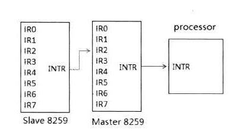
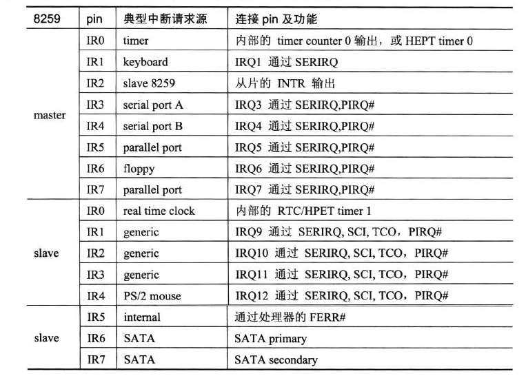

<!-- @import "[TOC]" {cmd="toc" depthFrom=1 depthTo=6 orderedList=false} -->

<!-- code_chunk_output -->

- [1. 8259中断控制器](#1-8259中断控制器)
- [2. IRQ的优先级](#2-irq的优先级)
- [3. 中断请求状态](#3-中断请求状态)
  - [3.1. IRR](#31-irr)
- [4. 中断服务状态](#4-中断服务状态)
  - [4.1. ISR](#41-isr)
- [5. 中断屏蔽状态](#5-中断屏蔽状态)
  - [5.1. IMR](#51-imr)
- [6. 中断响应过程](#6-中断响应过程)
  - [6.1. edge触发](#61-edge触发)
  - [6.2. level触发](#62-level触发)
  - [6.3. 发送EOI命令](#63-发送eoi命令)

<!-- /code_chunk_output -->

# 1. 8259中断控制器

实际应用中, 由两块8259 PIC串联在一起使用, 分为master片和slave片, 如下

每个8259A PIC的**IR口**都接一条**IRQ线(IRQ线是唯一的！！！**). 

**主片**的**IR0到IR7**对应着**IRQ0到IRQ7线**.

除了**IR2 pin被接上从片的INTR pin**外, **从片**的**IR0到IR7**对应着**IRQ8到IRQ15**线. 由于**从片**串接到**主片**的**IR2 pin**上, **从片**的**IR1 pin**同时接到**IRQ2**和**IRQ9线**.

8259经历多次数代bus和芯片组变革, 保持绝大部分的兼容性. pin用途如下表

# 2. IRQ的优先级

8259中断控制器中, IR0 pin接收的中断请求优先级最高, IR7 pin能接收的中断请求优先级最低. 从片8259接在主片IR2pin时, 从片所有中断请求优先级相当于IRQ2. IRQ优先级由高到低次序: IRQ0, IRQ1, IRQ8\~IRQ15, IRQ3\~IRQ7.

# 3. 中断请求状态

当**每条IRQ线产生中断请求**时, 8259内部的**IRR(Interrupt Request Register**)将记录对应的IR **pin发生中断请求**. 若**IRQ10线**发生中断请求, 则**记录在**对应**从片**的**IRR寄存器中**(IR2 pin的状态). 这时使用**in指令读从片的IRR寄存器**可知道IRQ10发生了中断请求.

如上, 当IRQ0发生中断请求, **IRR寄存器的bit 0置位**, 指示**IR0发生了中断请求**.

## 3.1. IRR

**8259控制器**内的**IRR是一个8位的寄存器**, 每一位对应一个IR pin引脚. 置位指示发生了中断请求. IRR寄存器中**各位可同时被置位**, 指示有**多个中断请求发生**.

# 4. 中断服务状态

**IRQ线上的中断请求**, 并**不意味着会得到8259控制器的响应**, **允许被处理器响应的中断请求**会在8259内部的**ISR(In\-Service Register或Interrupt service register)里记录下来**. ISR记录着8259各个IR pin的中断服务状态.

如上, IR0口上的中断请求被允许执行, 8259提交到处理器core执行. ISR对应的bit 0置位记录着这个pin所接的IRQ0中断请求正在执行.

## 4.1. ISR

和IRR一样, ISR也是一个8位的寄存器, 每一位对应一个IR pin引脚. 置位指示**该pin的中断请求得到响应执行**. ISR 上**多个位被同时置位**时, 表明当前存在"**低优先级服务例程被高优先级服务例程中断**". 处理器**某一个时刻只能服务一个中断请求(！！！**).

# 5. 中断屏蔽状态

只有当IR pin上中断请求被允许响应, 并没有更高优先级的中断请求发生, IRQ线上的中断请求才可能被执行.

8259内部的**IMR(Interrupt Mask Register**)控制着IR pin上的中断请求许可.

如上, 当IMR的bit 0置位, 则IRQ0上的中断请求被抑制; 当IR2被屏蔽, 整个Slave 8259上所有中断请求被屏蔽

## 5.1. IMR

IMR也是一个8位寄存器, IMR的位可以同时被置位, 当IMR值为0FFh时, 指示所有IR pin上的中断请求被屏蔽. 对某个IR pin的屏蔽不会影响到其他IR pin上的中断请求.

实验: 观察IMR, IRR和ISR 

实验的主体代码在topic17\ex17-1\protected.asm里, 下面是输出结果. 

结果显示, 在**进入timer handler之前**打印出**master片的IMR、IRR和ISR信息**, IRQ0和IRQ1都被屏蔽, 同时发生了中断请求, 因此在IMR和IRR里显示它们都被置位. 

在进入timer handler后又打印了一次, 这时候IRQ0的mask已被清0, 在ISR里被置位. IRR被清0. 

# 6. 中断响应过程

可以从Intel 提供的chipset datasheet找到关于8259响应中断的流程

① 当IRQ线上发生中断请求时, 8259内核的**IRR对应的位将置位**, 这个中断请求可以是**edge或level模式触发**

② 如果这个中断请求是允许的(**没被屏蔽, 通过IMR**), 则提交到处理器INTR pin上

③ 处理器将以**interrupt acknowledge cycle(中断响应周期**)作为**回复(走的是系统总线！！！**), 这个**cycle**被**host bridge(CPU到PCI桥**)传送到**PCH(Platform Controller Hub**)上

④ PCH将这个cycle**转化**为8259可以响应的两个interrupt acknowledge pulse(**中断响应脉冲**)出现在master和slave 8259**控制器**的**INTA\#pin**上.

⑤ 在接收到**第1个INTA\#脉冲**后, 8259进行**优先级的仲裁**, 最高的中断请求得到响应, **ISR寄存器相应的位置位**, **IRR寄存器**对应的位被**清0(控制器接收了请求后就将相应的IRR\<中断请求状态>寄存器位清0**).

⑥ 如果如果**slave 8259**赢了**中断仲裁**(即**slave上有优先级别高的中断请求**), 则master 8259通过一条**3位宽的内部线**向slave 8259传送一个slave identification code(**从片标识码**), slave 8259会对这个code进行检查, 决定是否在**第2个INTA#脉冲**时**回复一个interrupt vector**, 当这个code与slave 8259内的**identification code**相符时(初始化时设置), slave 8259必须回复一个**interrupt vector**通过**data bus**给processor. 

⑦ 如果**master 8259**赢了中断仲裁, 则master 8259在**第2个INTA\#脉冲**时, 会回复一个**interrupt vector**通过**data bus(数据总线**)给processor. 

⑧ **中断完成**后, 在**AEOI(Automatic End of Interrupt)模式**里, 8259在**第2个INTA\#结束后**自动**清ISR相应的位**. 否则必须发送一个**EOI命令给8259**. 

## 6.1. edge触发

边沿触发

**8259**可以选择**中断请求**使用**edge模式**还是**level模式**触发, 当选择**edge模式**时, IRQ的中断请求将在一个**low\-to\-high(低电平到高电平**)的**转化过程中触发**. 

## 6.2. level触发

电平触发

当选择level模式触发时, 中断请求将在**high\-level(高电平**)时触发, **IRQ不需要检测从low到high这个转变过程**. 

我们看到了edge触发与level触发的不同: 

- 在**edge触发模式**里可以**维持一个high level而不会触发第二次中断请求**; 
- 而在**level触发模式**里, **IRQ不能维持在high level**上, 否则会产生多次中断请求. 

## 6.3. 发送EOI命令

当**中断服务例程执行完毕**后, 在**非AEOI模式**下应发送**EOI(End Of Interrupt)命令到8259**, 指示这个中断请求已经响应并执行完毕. **8259收到EOI命令**会**清ISR的相应位**, 指示没有中断请求被执行. 

在使用**special full mode**时, 当slave片中断请求响应执行时, 请参考下面17.2.2.4节中关于special full nested mode的描述. 

