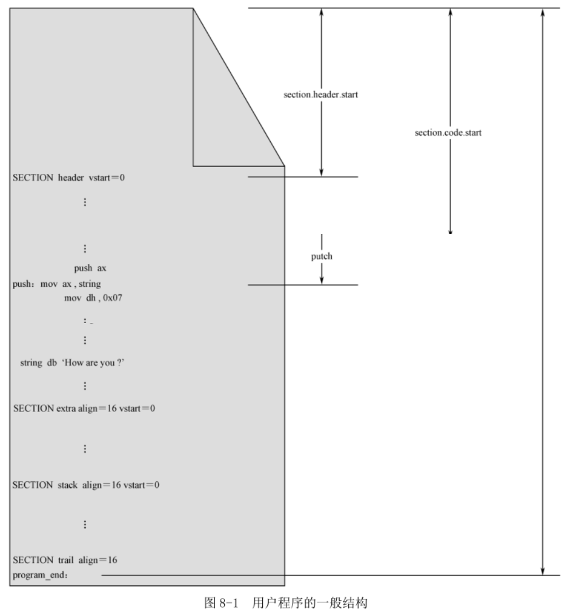
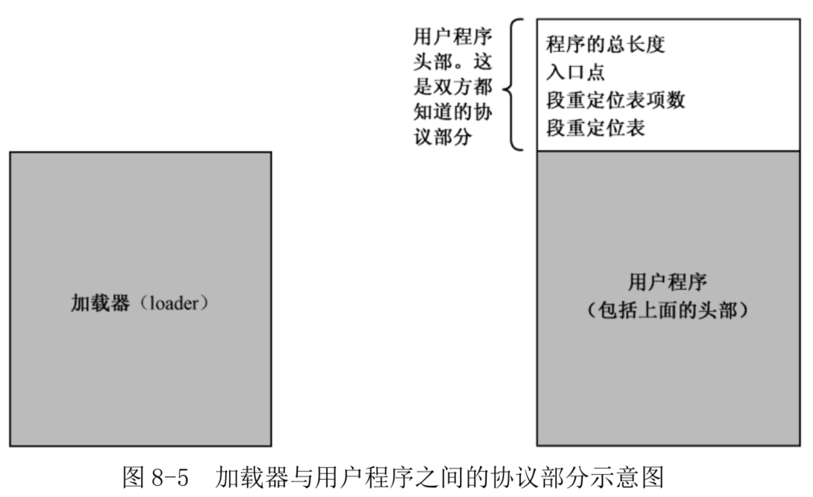

## 1. 分段、段的汇编地址和段内汇编地址

处理器的工作模式是将内存分成逻辑上的段, 指令的获取和数据的访问一律按"段地址: 偏移地址"的方式进行. 相对应地, 一个规范的程序, 应当包括代码段、数据段、附加段和堆栈段. 

图 8-1 给出了整个源程序的组织结构. 

NASM 编译器使用汇编指令"SECTION"或者"SEGMENT"来定义段. 

```
SECTION 段名称
```

```
SEGMENT 段名称
```

**段名称, 它主要用来引用一个段, 可以是任意名字**. 

NASM 编译器不关心段的用途, 可能也根本不知道段的用途, 不知道它是数据段, 还是代码段, 或是堆栈段. 事实上, 这都不重要, 段只用来分隔程序中的不同内容. 



一旦定义段, 那么, 后面的内容就都属于该段, 除非又出现了另一个段的定义. 

有时候, 程序并不以段定义语句开始. 在这种情况下, 这些内容默认地自成一个段. 最为典型的情况是, 整个程序中都没有段定义语句. 这时, 整个程序自成一个段. 

NASM 对段的数量没有限制. 一些大的程序, 可能拥有不止一个代码段和数据段. 

Intel 处理器要求**段在内存中的起始物理地址起码是16字节对齐**的. 这句话的意思是, 必须是16 的倍数. 

相应地, 汇编语言源程序中定义的各个段, 也有对齐方面的要求. 具体做法是, 在段定义中使用"align="子句, 用于指定某个SECTION的汇编地址对齐方式. 比如说, "align=16"就表示段是 16 字节对齐的, "align=32"就表示段是 32 字节对齐的. 

在源程序编译阶段, 编译器将根据 align 子句确定段的起始汇编地址. 如下面所示, 这
里定义了三个段, 分别是 data1、data2 和 data3, 每个段里只有一个字节的数据, 分别是 0x55、0xaa 和 0x99. 

```
section data1 align=16
    db 0x55
    
section data2 align=16
    db 0xaa

section data3 align=16
    db 0x99
```

理论上, 如果不考虑段的对齐方式, 那么段 data1 的汇编地址是 0, 段 data2 的汇编地址是 1, 段 data3 的汇编地址是 2. 

查看文件大小, 有33字节

```
root@Gerry:/home/project/nasm# ll section
-rw-r--r-- 1 root root 33 Dec 17 00:13 section
```

编译并查看文件的16进制数据. 

```
root@Gerry:/home/project/nasm# hexdump -C section
00000000  55 00 00 00 00 00 00 00  00 00 00 00 00 00 00 00  |U...............|
00000010  aa 00 00 00 00 00 00 00  00 00 00 00 00 00 00 00  |................|
00000020  99                                                |.|
00000021
```

每个段都有一个汇编地址, 它是相对于整个程序开头(0)的. 为了方便取得**该段的汇编地址**, NASM 编译器提供了以下的表达式, 可以用在你的程序中: 

```
section.段名称.start
```

段"header"相对于整个程序开头的汇编地址是section.header.start, 段"code"相对于整个程序开头的汇编地址是 section.code.start. 在这个例子中, 因为段"header"是在程序的一开始定义的, 它的前面没有其他内容, 故 section.header.start=0. 

如图 8-1 所示, 段定义语句还可以包含"vstart="子句. 尽管定义了段, 但是, 引用某个标号时, 该标号处的汇编地址依然是从整个程序的开头计算的, 而不是从段的开头处计算的. 

如图 8-1 所示, "putch"是段code中的一个标号, **原则上, 该标号代表的汇编地址应该从程序开头计算**. 但是, 因为段code的定义中有"vstart=0"子句, 所以, 标号"putch"的汇编地址要从它所在段的开头计算, 而且从0开始计算. 

段data的定义中也有"vstart=0"子句, 因此, 当我们在段code中引用段data中的标号"string"时(mov ax,string), 尽管在图中没有标明, **标号"string"所代表的汇编地址是相对于其所在段 data 的**. 也就是说, 传送到寄存器 AX 中的数值是标号 string 相对于段 data 起始处的长度. 

但是, 图中最后一个段trail的定义中没有包含"vstart=0"子句. 该段内有一个标号"program_end", 它的汇编地址就要从整个程序开头计算. 因为它是整个程序中的最后一行, 从这个意义上来说, 它所代表的汇编地址就是整个程序的大小(以字节计). 

## 2. 用户程序头部

代码8-2定义了7个段. 

一般, 加载器和用户程序是分开的. 加载器只需要了解一些信息, 足以知道如何加载用户程序. 



经验表明, 把约定信息的地点放在用户程序的开头, 对双方, 特别是对加载器来说比较方便, 这就是用户程序头部. 

头部需要在源程序以一个段的形式出现. 源码第7行. 

```
SECTION header vstart=0
```

用户程序头部起码要包含以下信息. 

① 用户程序的尺寸, 即以字节为单位的大小. 这对加载器来说是很重要的, 加载器需要根据这一信息来决定读取多少个逻辑扇区(在本书中, 所有程序在硬盘上所占用的逻辑扇区都是连续的). 

第 8 行, 伪指令 dd 用于声明和初始化一个双字, 即一个 32 位的数据. 用户程序可能很大, 16 位的长度不足以表示 65535 以上的数值. 

程序的长度取自程序中的一个标号"program\_end", 这是允许的. 在编译阶段, 编译器将该标号所代表的汇编地址填写在这里. 该标号位于整个源程序的最后, 从属于段"trail". 由于该段并没有vstart子句, 所以, 标号"program\_end"所代表的汇编地址是从整个程序的开头计算的. 换句话说, **program_end所代表的汇编地址, 在数值上等于整个程序的长度**. 

类似于下面: 

```
root@Gerry:/home/project/nasm/booktool/c08# cat label_1.asm 
SECTION header align=16 vstart=0
    db 0x15
    db program_end
    
SECTION end align=16

program_end:

root@Gerry:/home/project/nasm/booktool/c08# nasm label_1.asm

root@Gerry:/home/project/nasm/booktool/c08# ll label_1
-rw-r--r-- 1 root root 2 Jan 14 16:36 label_1

root@Gerry:/home/project/nasm/booktool/c08# hexdump -C label_1
00000000  15 10                                             |..|
00000002

```

双字在内存中的存放也是按低端序的. 如图8-6所示, 低字保存在低地址, 高字保存在高地址. 同时, 每个字又按低端字节序, 低字节在低地址, 高字节在高地址. 


② 应用程序的入口点, 包括段地址和偏移地址. 加载器不清楚用户程序的分段情况, 更不知道**第一条指令在用户程序中的位置**. 因此, 必须在头部给出**第一条指令的段地址和偏移地址**, 这就是所谓的应用程序入口点(Entry Point). 

第 11、12 行, 依次声明并初始化了入口点的偏移地址和段地址. 偏移地址取自代码段code\_1中的标号"start", 段地址是用表达式 section.code\_1.start 得到的. 

段定义中包含了"vstart=0"子句, 故标号start所代表的汇编地址是相对于当前代码段code\_1的起始位置, 从0开始计算的. 

入口点的段地址是用伪指令dd声明的, 并初始化为汇编地址section.code_1.start, 这是一个32位的地址. 它仅仅是**编译阶段确定的汇编地址**, 在用户程序加载到内存后, 需要根据加载的实际位置**重新计算**(浮动). 

尽管在 16 位的环境中, 一个段最长为64KB, 但它却可以起始于任何20位的物理地址处. 你不可能用 16 位的单元保存 20 位的地址, 所以, 只能保存为 32 位的形式. 

③ 段重定位表. 用户程序可能包含多个代码段, 多个数据段. 程序加载到内存后, 每个段的地址必须重新确定一下. 

段的重定位是加载器的工作, 它需要知道每个段在用户程序内的位置, 即它们分别位于用户程序内的多少字节处. 为此, 需要在用户程序头部建立一张段重定位表. 

用户程序可以定义的段在数量上是不确定的, 因此, 段重定位表的表项数是不确定的. 第14行, 声明并初始化了段重定位表的项目数. 因为段重定位表位于两个标号header\_end和code\_1_segment之间, 而且每个表项占用 4 字节, 故实际的表项数为

```
(header_end – code_1_segment) / 4
```