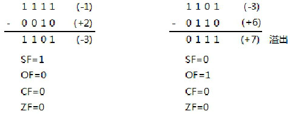

<!-- @import "[TOC]" {cmd="toc" depthFrom=1 depthTo=6 orderedList=false} -->

<!-- code_chunk_output -->

- [1. 概述](#1-概述)
  - [1.1. PF标志位](#11-pf标志位)
  - [1.2. AF标志位](#12-af标志位)
- [2. signed数的运算](#2-signed数的运算)
  - [2.1. 溢出位和符号位的产生](#21-溢出位和符号位的产生)
    - [2.1.1. overflow的产生](#211-overflow的产生)
    - [2.1.2. underflow的产生](#212-underflow的产生)
  - [2.2. signed数的比较操作](#22-signed数的比较操作)
    - [2.2.1. signed数的条件码](#221-signed数的条件码)
- [3. unsigned数的运算](#3-unsigned数的运算)
  - [3.1. 进位标志的产生](#31-进位标志的产生)
  - [3.2. unsigned数的比较及条件码](#32-unsigned数的比较及条件码)

<!-- /code_chunk_output -->

# 1. 概述

status flags包括: **OF(溢出标志**), **SF(符号位标志**), **ZF(零标志**), **AF(调整位标志**), **CF(进位标志**), 以及**PF(奇偶位标志**). 这些标志位反映了指令执行结果的状态值.

## 1.1. PF标志位

指令判断**结果值的最低字节(byte 0**), 而设置相应的PF标志位, 如下所示.


当最低字节(byte 0)中位为1值的数量是偶数PF标志被置位, 否则被清0.

## 1.2. AF标志位

当运算时bit 3发生向上进位或借位时, AF标志被置位. AF标志位使用在BCD码的运算指令上, 如下面使用AF标志位的例子.

```assembly
mov al, 8             ;  al=0000 1000B
mov bl, 9             ;  bl=0000 1001B
add al, bl            ;  al=0001 0001B, AF标志为1
aaa                     ;  使用 AF 标志进行调整, AX的结果是: 00000001 00000111B
```

在上面的8+9式子里, bit 3向bit 4进1位, AF标志为1. AAA指令根据AF标志进行调整后, AX的值变成0107H(BCD码形式).

# 2. signed数的运算

status flags标志位中有一部分用于表达signed(符号)数运算结果的状态, 一部分用于表达unsigned(无符号)数运算结果的状态. 而ZF标志位可以使用在signed和unsigned数上.

signed数运算中使用的标志位有: OF(溢出)标志和SF(符号)标志.

## 2.1. 溢出位和符号位的产生

对于signed(符号数)的溢出, 有两种情况.

① overflow(向上溢出): 当结果值超出signed数的最大值时产生overflow.

② underflow(向下溢出): 当结果值超出signed数的最小值时产生underflow.

当结果产生overflow或underflow时会对OF标志位置位.

### 2.1.1. overflow的产生

我们看看下面的2个正数相加的式子, 为了计算方便, 以4位的signed数为例.

- 式子1: 7+6.
- 式子2: 3+4.


如上面所示: 式子2的运算是正确的. 而在式子1中的+7与+6相加里, 结果值却是-2, 显然这是错误的. 因为这个4位符号数的结果值超出了正数最大值7, 而产生了overflow. 因此, 在这个计算结果中eflags.OF=1(溢出标志被置位), eflags.SF=1(符号标志位被置位).

>记录下来: 两个正数相加, 结果为负数时, 产生了overflow.

### 2.1.2. underflow的产生

同样以4位数为例, 再看看2个负数相加的式子.

- 式子1: (-4)+(-8)
- 式子2: (-4)+(-1)


在式子1中: (-4)+(-8)=(+4)两个负数相加结果为正数, 显然是错误的. 4位数的负数最小值是-8, 而-4加上-8的值应为-12, 它也超出了4位符号数的最小值, 产生了underflow, 这时eflags.OF=1, eflags.SF=0.

式子2中: (-4)+(-1)=(-5)这个值是正确的, 这时eflags.OF=0, eflags.SF=1. 值得注意的是, 在这两个式子中都产生了进位. 因此这两个式子中, CF标志位也被置位.

>记录下来: 两个负数相加, 结果为正数时, 产生了underflow溢出.

那么, 当正数和负数相加时, 情况又如何呢?


上面的2个正数与负数相加的式子中, 它们的值都是正确的, OF标志都为0(没有溢出). 式子1中SF标志为0, 式子2中的SF标志为1.

>记录下来: 正数和负数相加, 不会产生溢出.

OF标志和SF标志也将影响到条件指令的执行, 在x86上有下面几类条件指令族: Jcc指令家族, SETcc指令家族, LOOPcc指令家族, 以及CMOVcc指令家族. 这些指令助记符中cc代表一个条件码助记符.

## 2.2. signed数的比较操作

上面的OF、SF及ZF标志都用于signed数的比较. 在执行cmp指令比较时, 是对两个数进行相减操作, 将比较的结果反映在标志位上.

>\-1\>\-2?4\>\-6?这两个比较式子如何反映在标志位上?

计算(-1)-(-2)和(4)-(-6)的结果, 从eflags标志位上获得比较结果, 如下所示.


在式子1中, -1减-2的结果是SF、OF以及ZF标志位都是0; 式子2中, +4减-6的结果产生了overflow, 因此OF标志与SF标志都为1.

对于这两个比较式子, 我们知道前面的数都大于后面的数, 因此得到的结论如下.

>记录下来: 当OF==SF时, 比较结果是大于.

再看看-1>2和-3>6这两个比较式子, 我们知道前面的数都小于后面的数, 那么标志位上是什么呢?



在式子2的计算中, 由于负数减正数结果值为正数而产生了underflow, 因此OF标志被置位. 可以看出, 这两个式子中, ZF为0, SF与OF标志位都不相等. 我们得到的结论是:

>记录下来: 当OF<>SF时, 比较结果是小于.

### 2.2.1. signed数的条件码

基于SF标志、OF标志, 以及ZF标志位, 下面是用于signed数的条件码.

```
G (greater)                 : OF == SF 并且 ZF=0
L (less)                     : OF <> SF
GE (greater or euqal)     : OF == SF
LE (less or equal)         : OF <> SF或者ZF=1
```

在GE(大于等于)的情况下只需要判断OF是否等于SF标志, 无论ZF是否为零都满足条件. 而在L(小于)的情况下只需要判断OF不等于SF标志就可以了, 也不需要判断ZF标志.

# 3. unsigned数的运算

ZF标志和CF标志被用在与unsigned数相关的运算里, 在unsigned数的相关比较中不会使用OF和SF这两个标志位.

在x86上, 尽管对于数的运算, 指令会同时依据unsigned和signed数的结果对OF、SF、CF, 以及ZF、AF和PF做相应的设置. 可是, 在unsigned与singed数与条件相关的指令中会做出相应的区分.

## 3.1. 进位标志的产生

在相加运算中, 由于向前进位而使用CF标志置位. 在相减运算中, 由于向前借位也会使CF标志置位.


-4加-8产生了进位, +4减-6产生了借位, 这两个计算结果都会使CF标志置位.

## 3.2. unsigned数的比较及条件码

当unsigned数相减时, 如果不够减则会产生借位(eflags.CF=1), 表明是小于关系. 下面是用于unsigned数的条件码.

```
A (Above)                   : CF=0并且ZF=0
B (below)                   : CF=1
AE (Above or euqal)       : CF=0
BE (below or equal)       : CF=1或者ZF=1
```

这与signed数的情形类似, AE(高于等于)和B(低于)的比较中都无需判断ZF标志.