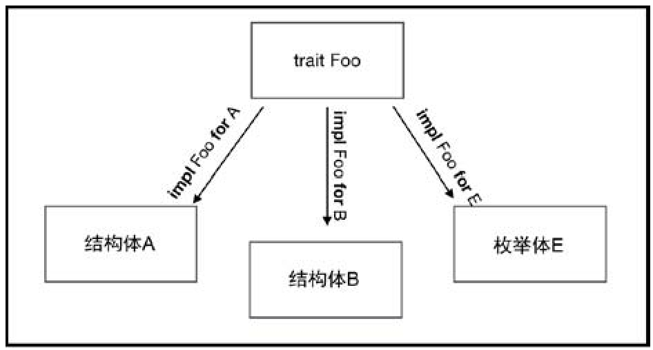
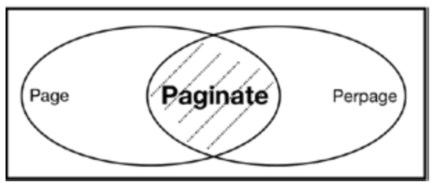
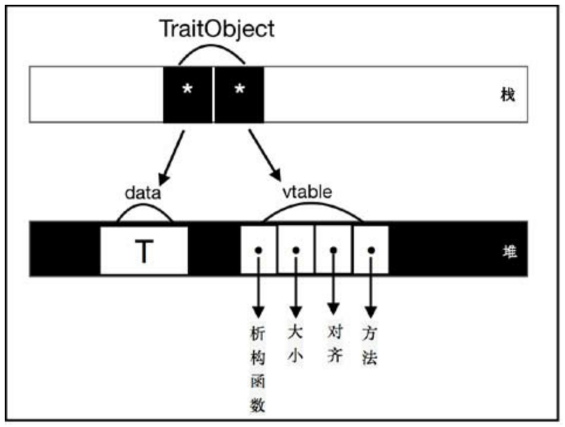

<!-- @import "[TOC]" {cmd="toc" depthFrom=1 depthTo=6 orderedList=false} -->

<!-- code_chunk_output -->

- [1. 什么是 trait](#1-什么是-trait)
- [2. 接口抽象](#2-接口抽象)
  - [2.1. 关联类型](#21-关联类型)
    - [2.1.1. 结合泛型的 trait](#211-结合泛型的-trait)
    - [2.1.2. 缺点](#212-缺点)
    - [2.1.3. 使用关联类型的定义](#213-使用关联类型的定义)
  - [2.2. trait 一致性: 孤儿规则](#22-trait-一致性-孤儿规则)
    - [2.2.1. 重新定义 Add trait](#221-重新定义-add-trait)
    - [2.2.2. 重新定义实现 trait 的类型](#222-重新定义实现-trait-的类型)
  - [2.3. trait 继承](#23-trait-继承)
- [3. 泛型约束](#3-泛型约束)
  - [3.1. trait bound](#31-trait-bound)
  - [3.2. 理解 trait bound](#32-理解-trait-bound)
    - [3.2.1. 类型系统中的 trait bound](#321-类型系统中的-trait-bound)
    - [3.2.2. 数学角度的 trait bound](#322-数学角度的-trait-bound)
    - [3.2.3. 小结](#323-小结)
    - [3.2.4. where 关键字](#324-where-关键字)
- [4. 抽象类型](#4-抽象类型)
  - [4.1. trait 对象](#41-trait-对象)
- [5. 标签 trait](#5-标签-trait)
  - [5.1. Sized trait](#51-sized-trait)
  - [5.2. Copy trait](#52-copy-trait)
  - [5.3. Send trait 和 Sync trait](#53-send-trait-和-sync-trait)

<!-- /code_chunk_output -->

# 1. 什么是 trait

trait 是 Rust 的灵魂. Rust 中**所有的抽象**, 比如接口抽象、OOP范式抽象、函数式范式抽象等, 均**基于 trait 来完成**. 同时, trait 也保证了这些抽象几乎都是**运行时零开销**的.

那么, 到底什么是 trait?

从**类型系统**的角度来说, trait 是 Rust **对 Ad-hoc 多态的支持**.

从**语义**上来说, trait 是**对类型在行为上的约束**, 有如下 4 种用法:

* **接口抽象**. **接口**是对**类型行为**的统一约束.
* **泛型约束**. **泛型的行为**被 trait 限定在更有限的范围内.
* **抽象类型**. 在运行时作为一种**间接的抽象类型**去使用, 动态地分发给具体的类型.
* **标签 trait**. **对类型的约束**, 可以直接作为一种“**标签**”使用.

# 2. 接口抽象

特点如下:

* **接口**中可以**定义方法**, 并支持**默认实现**
* 接口中**不能实现另一个接口**, 但是接口之间**可以继承**
* **同一个接口**可以同时被**多个类型实现**, 但**不能**被**同一个类型**实现**多次**
* 使用 **trait** 关键字来**定义接口**
* 使用 **impl** 关键字**为类型实现接口方法**



`code 2_53` 中的 `Fly trait` 就是一个典型的接口抽象. 类型 Duck 和 Pig 均实现了该 trait, 但具体行为不同. 这正是一种 **Ad-hoc** 多态: **同一个 trait, 在不同上下文中实现的行为不同**.

**为不同的类型实现 trait**, 属于一种**函数重载**, 也可以说函数重载就是一种 **Ad-hoc 多态**.

## 2.1. 关联类型

Rust 中的很多操作符都是基于 trait 来实现的.

比如加法操作符就是一个 trait. 那如何对这个加法操作进行抽象呢?

### 2.1.1. 结合泛型的 trait

一个方法是**结合泛型的 trait**.

```rust
trait Add<RHS, Output> {
	fn add(self, rhs: RHS) -> Output;
}
impl Add<i32, i32> for i32 {
	fn add(self, rhs: i32) -> i32 {
		self + rhs
	}
}
impl Add<u32, i32> for u32 {
	fn add(self, rhs: u32) -> i32 {
	    (self + rhs) as i32
	}
}
fn main_3_22() {
	let (a, b, c, d) = (1i32, 2i32, 3u32, 4u32);
	let x: i32 = a.add(b);
	let y: i32 = c.add(d);
	assert_eq!(x, 3i32);
	assert_eq!(y, 7i32);
}
```

### 2.1.2. 缺点

使用 trait 泛型来实现加法抽象, 它有一个**很大的问题**.

一般来说, 对于**加法操作**要考虑以下**两种情况**:

* **基本数据类型**, 比如 i32 和 i32 类型相加, 出于安全考虑, 结果必然还是 i32 类型
* 对**字符串**进行加法操作, 但是 Rust 中可以**动态增加长度**的**只有 String 类型**的字符串, 所以一般是 String 类型的才会实现 Add, 其**返回值**也必须是 **String** 类型. 但是**加法操作符右侧**也可以是**字符串字面量**. 所以, String 的加法操作还必须实现 `Add<&str, String>`.

不管是以上两种情况中的哪一种, trait Add 的**泛型第二个类型参数**总是显得有点**多余**. 所以, Rust **标准库**中定义的 `Add trait` 使用了另外一种写法.

### 2.1.3. 使用关联类型的定义

**标准库**中 Add trait 的定义:

```rust
pub trait Add3_23<RHS = Self> {
	type Output;
	fn add3_23(self, rhs: RHS) -> Self::Output;
}
```

> 这里 RHS 就是泛型声明, 类似之前的 T

第二个类型参数去掉了. 取而代之的是 **type 定义的 Output**, 以这种方式定义的类型叫作**关联类型**.

`Add<RHS = Self>` 这种形式表示**为类型参数 RHS 指定了默认值 Self**. Self 是**每个 trait** 都带有的**隐式类型参数**, 代表**实现当前 trait 的具体类型**.

> Self 大写 S, 代表类型?

当代码中出现**操作符** “`+`” 的时候, Rust 就会自动调用**操作符左侧的操作数对应**的 `add()` 方法, 去完成具体的加法操作, 即 “`+`” 操作与调用 `add()` 方法是等价的, 如图.


标准库中 u32 类型 Add trait 的实现:

```rust
pub trait Add3_23<RHS = Self> {
	type Output;
	fn add3_23(self, rhs: RHS) -> Self::Output;
}
impl Add3_23 for $t {
	type Output = $t;
	fn add3_23(self, other: $t) -> $t { self + other }
}
```

> 这里没有声明泛型, 因为使用了默认值 Self
>
> 对比 trait 的定义看下, Output 必须指定

`$t` 是宏, 这里可以看作 u32 类型.

这里的**关联类型是 u32**, 因为两个 u32 整数相加结果必然还是 u32 整数. 如果实现 Add trait 时并**未指明泛型参数(RHS)的具体类型**, 则**默认**为**Self类型**, 也就是 u32 类型.

String 类型的字符串也支持加号.

标准库中 String 类型 Add trait 的实现(有删减):

```rust
pub trait Add3_23<RHS = Self> {
	type Output;
	fn add3_23(self, rhs: RHS) -> Self::Output;
}
impl Add<&str> for String {
	type Output = String;
	fn add3_23(self, other: &str) -> String {
	    self.push_str(other);
	    self
	}
}
```

> 对比 trait 的定义看下, Output 必须指定

关联类型 Output 指定为 String 类型, 意味着加法返回的是 String 类型.

```rust
fn main_3_27() {
	let a = "hello"; // &str
	let b = " world"; // &str
	let c = a.to_string() + b;
	println!("{:?}", c);
}
```

使用**关联类型**能够使代码变得更加精简, 同时也对方法的**输入**和**输出**进行了很好的**隔离**, 使得代码的可读性大大增强.

在**语义层面**上, 使用**关联类型**也增强了 trait 表示行为的这种语义, 因为它表示了和**某个行为**(`trait`)**相关联的类型**. 在工程上, 也体现出了高内聚的特点.

## 2.2. trait 一致性: 孤儿规则

上面 Add trait 的分析可以知道, **u32 和 u64 不能直接相加**.

```rust
use std::ops::Add;
impl Add<u64> for u32 {
	type Output = u64;
	fn add(self, other: u64) -> Self::Output {
	    (self as u64) + other
	}
}
fn main_3_28() {
	let a = 1u32;
	let b = 2u64;
	assert_eq!(a + b, 3);
}
```

**编译出错**:

```
error[E0117]: only traits defined in the current crate can be implemented for arbitrary types
```

因为 Rust 遵循一条重要的规则: **孤儿规则**(`Orphan Rule`), 即 **如果要实现某个 trait, 那么该 trait 定义和要实现该 trait 的那个类型至少有一个要在当前 crate 中定义**.

**Add trait** 和 **u32 的实现**都**不是**在**当前 crate** 中定义的, 而是定义于标准库中的.

> 如果**没有孤儿规则**的限制, **标准库**中 **u32 类型的加法行为**就会**被破坏性地改写**, 导致所有使用 u32 类型的 crate 可能产生难以预料的Bug.

### 2.2.1. 重新定义 Add trait

要想正常编译通过, 可以把 Add trait 放到当前 crate 中来定义.

```rust
trait Add<RHS=Self> {
	type Output;
	fn add(self, rhs: RHS) -> Self::Output;
}
impl Add<u64> for u32 {
    type Output = u64;
    fn add(self, other: u64) -> Self::Output  {
	    (self as u64) + other
    }
}
fn main_3_29() {
	let a = 1u32;
	let b = 2u64;
	assert_eq!(a.add(b), 3);
}
```

在 **impl Add 实现**时候, 将 **RHS** 和**关联类型**指定为 **u64** 类型. 同时用 add, 而非操作符 `+`, 避免调用标准库中的 add.

### 2.2.2. 重新定义实现 trait 的类型

还可以**在本地创建一个新的类型**, 然后**为此新类型实现Add**, 这同样不会违反孤儿规则.

```rust
use std::ops::Add;
#[derive(Debug)]
struct Point {
	x: i32,
	y: i32,
}
impl Add for Point {
	type Output = Point;
	fn add(self, other: Point) -> Point {
		Point {
			x: self.x + other.x,
			y: self.y + other.y,
		}
	}
}
fn main_3_30() {
	// Point { x: 3, y: 3 }
	println!("{:?}", Point { x: 1, y: 0 } + Point { x: 2, y: 3 });
}
```

还需要注意, **关联类型 Output 必须指定具体类型**. 函数 add 的返回类型可以写 `Point`, 也可以写 `Self`, 也可以写 `Self::Output`.

## 2.3. trait 继承

Rust 不支持传统面向对象的继承, 但是支持**trait继承**.

在日常编程中, **trait** 中定义的一些**行为可能会有重复**的情况, 使用trait 继承可以简化编程, 方便组合, 让代码更加优美.

```rust
trait Page {
	fn set_page(&self, p: i32) {
		print!("Page Default: 1");
	}
}
trait PerPage {
	fn set_perpage(&self, num: i32) {
		print!("Per Page Default: 10");
	}
}
struct MyPaginate { page: i32 }
impl Page for MyPaginate { }
impl PerPage for MyPaginate { }
fn main_3_31() {
	let my_paginate = MyPaginate{ page: 1 };
	my_paginate.set_page(2);
	my_paginate.set_perpage(100);
}
```

定义了**两个 trait**, 分别实现了**默认方法**.

定义了 MyPaginate 结构体, 分别实现了 Page trait 和 PerPage trait, 使用**空的 impl 块**代表**使用** trait 的**默认实现**.

假如此时需要**多加一个功能**, 为**不影响之前的代码**, 可以使用 trait 继承扩展功能:

```rust
trait Paginate: Page + PerPage {
	fn set_skip_page(&self, num: i32) {
		print!("Skip Page : {:?}", num);
	}
}
impl<T: Page + PerPage> Paginate for T{}
```

* **定义了 trait Paginate**, 并使用**冒号**代表**继承其他 trait**, 多个父 trait 用加号相连.

* **为泛型 T 实现**了 trait Paginate. 意思是, 为所有**拥有 Page 和 PerPage 行为**的类型**实现 trait Paginate**.

```rust
fn main_3_33() {
	let my_paginate = MyPaginate{ page: 1 };
	my_paginate.set_page(1);
	my_paginate.set_perpage(100);
	my_paginate.set_skip_page(12);
}
```

# 3. 泛型约束

使用**泛型编程**时, 很多情况下的行为**并不是针对所有类型都实现**的.

```rust
fn sum_3_34<T>(a: T, b: T) {
	a + b
}
```

如果传入的**两个参数**是**整数**和**字符串**, 意义就不明确了, 可能引起程序崩溃.

如何修正? 用 trait 作为**泛型的约束**.

## 3.1. trait bound

> 使用 trait 对泛型进行约束. trait 约束, trait 限定

只要**两个参数**是**可相加的类型**就可以

```rust
use std::ops::Add;
fn sum_3_35<T: Add<T, Output=T>>(a: T, b: T) -> T {
	a + b
}
fn main_3_35() {
	assert_eq!(sum_3_35(1u32, 2u32), 3);
	assert_eq!(sum_3_35(1u64, 2u64), 3);
}
```

使用 `<T: Add<T, Output=T>>` 对泛型进行了约束, 表示**类型 T 必须实现 Add trait**, 并且**加号两边的类型必须一致**.

> 注意, Add trait 定义可以参见上面
>
> 对泛型约束的时候, `Add<T, Output=T>` 通过类型参数确定了**关联类型Output**也是 T, 也可以省略类型参数 T, 直接写为 `Add<Output=T>`

如果该 sum 函数传入**两个 String 类型参数**, 就会**报错**. 因为 String 字符串相加时, **右边的值**必须是 `&str` 类型. 所以不满足此 sum 函数中 Add trait 的约束.

**使用 trait 对泛型进行约束**, 叫做 **trait bound** (`trait 限定`). 格式如下:

```rust
fn generic<T: MyTrait + MyOtherTrait + SomeStandardTrait>(t: T) { }
```

该泛型函数签名要表达的意思是: **需要一个类型 T**, 并且该**类型 T 必须实现** `MyTrait`、`MyOtherTrait` 和 `SomeStandardTrait` **中定义的全部方法**, 才能使用该泛型函数.

## 3.2. 理解 trait bound

> trait 约束, trait 限定

### 3.2.1. 类型系统中的 trait bound

**trait bound** 的思想与 `Java` 中的**泛型限定**、`Ruby` 和 `Python` 中的 **Duck Typing**、`Golang` 中的 **Structural Typing**、`Elixir` 和 `Clojure` 中的 **Protocol** 都很相似.

在**类型理论**中, **Structural Typing** 是一种**根据结构来判断类型是否等价**的理论, 翻译过来为**结构化类型**.
* Duck Typing、Protocol 都是 `Structural Typing` 的变种, 一般用于**动态语言**, 在**运行时检测类型是否等价**.
* Rust 中的 trait bound 也是 Structural Typing 的一种实现, 可以看作一种**静态 Duck Typing**.

### 3.2.2. 数学角度的 trait bound

从**数学角度**来理解 trait bound 可能更加直观. **类型 struct** 可以看作具有**相同属性值的集合**.

当声明变量 `let x: u32` 时, 意味着 `x ∈ u32`, 也就是说, **x 属于 u32 集合**.

```rust
trait Paginate: Page + PerPage
```

**trait** 也是**一种类型**, 是一种**方法集合**, 或者说, 是一种行为的集合. 它的意思是, `Paginate ⊂ (Page ∩ Perpage)`, Paginate集合是Page和Perpage交集的子集, 如下图.



由此可以得出, Rust 中

* **冒号**代表集合的“**包含于**”关系;
* **加号**则代表**交集**.

所以下面这种写法:

`impl<T: A + B> C for T`

可以解释为“为所有 `T⊂(A∩B)` 的**类型 T** 实现 `Trait C`”, 如图所示.


### 3.2.3. 小结

Rust 编程的哲学是**组合优于继承**, Rust 并**不提供类型层面上的继承**, Rust 中**所有的类型都是独立存在的**, 所以 Rust 中的**类型**可以看作 Rust 语言允许的**最小集合**, **不能再包含其他子集**. 而 **trait bound** 可以**对这些类型集合进行组合**, 也就是**求交集**.

总的来说, trait bound 给予了开发者更大的自由度, 因为不再需要类型间的继承, 也简化了编译器的检查操作. 包含 **trait bound** 的**泛型**属于**静态分发**, 在**编译期**通过**单态化**分别**生成具体类型的实例**, 所以调用 trait bound 中的方法也都是**运行时零成本**的, 因为不需要在运行时再进行方法查找.

### 3.2.4. where 关键字

如果为泛型增加比较多的 trait bound, 代码可能会变得不太易读, 比如下面这种写法:

`fn foo<T: A, K: B+C, R: D>(a: T, b: K, c: R) { ... }`

Rust提供了 **where 关键字**, 用来对这种情况进行重构:

`fn foo<T, K, R>(a: T, b: K, c: R) where T: A, K: B+C, R: D { ... }`

代码可读性提高了.

# 4. 抽象类型

trait 还可以用作**抽象类型**(`Abstract Type`).

抽象类型属于类型系统的一种, 也叫作**存在类型**(`Existential Type`). 相对于具体类型而言, **抽象类型无法直接实例化**, 它的每个实例都是具体类型的实例.

对于抽象类型而言, 编译器可能**无法确定**其**确切的功能**和**所占的空间大小**. 所以 Rust目前有两种方法来处理抽象类型: **trait 对象**和 **impl Trait**.

## 4.1. trait 对象

在**泛型中使用 trait bound**, 可以将**任意类型的范围**根据**类型的行为**限定到更精确可控的范围内.

从这个角度出发, 也可以将**共同拥有相同行为的类型集合抽象为一个类型**, 这就是 **trait 对象**(`trait Object`).

“对象”这个词来自面向对象编程语言, 因为 trait 对象是对具有相同行为的一组具体类型的抽象, 等价于面向对象中一个封装了行为的对象, 所以称其为 trait 对象.

trait bound 和 trait 对象的用法比较:

```rust
#[derive(Debug)]
struct Foo_3_36;
trait Bar_3_36 {
    fn baz(&self);
}
impl Bar_3_36 for Foo_3_36 {
    fn baz(&self) { println!("{:?}", self) }
}
fn static_dispatch_3_36<T>(t: &T) where T:Bar_3_36 {
	t.baz();
}
fn dynamic_dispatch_3_36(t: &Bar_3_36) {
	t.baz();
}
fn main_3_36() {
	let foo = Foo_3_36;
	static_dispatch_3_36(&foo);
	dynamic_dispatch_3_36(&foo);
}
```

定义了 struct Foo 和 Bar trait, 并且为 Foo 实现了 Bar.

分别定义了**带 trait bound** 的**泛型函数** `staitc_dispatch` 和**使用 trait 对象**的 dynamic_dispatch 函数.

分别调用了 static_dispatch 和 dynamic_dispatch 函数.
* static_dispatch 是属于**静态分发**的, 参数 t 之所以能调用 baz 方法, 是因为为 Foo 类型实现了 Bar.
* dynamic_dispatch 是属于**动态分发**的, 参数 t 标注的类型 `&Bar` 是 **trait 对象**. 那么, 什么是动态分发呢？它的工作机制是怎样的呢？

**trait 本身也是一种类型**, 但它的**类型大小**在**编译期**是**无法确定**的, 所以 **trait 对象必须使用指针**. 可以利用**引用操作符 &** 或 `Box<T>` 来制造一个 **trait 对象**. trait 对象等价于下面代码所示的结构体.

等价于 trait 对象的结构体:

```rust
pub struct TraitObject {
	pub data: *mut (),
	pub vtable: *mut (),
}
```

结构体 TraitObject 来自 Rust 标准库, 但它并不能代表真正的 trait 对象, 它**仅仅用于操作底层的一些 Unsafe 代码**. 这里使用该结构体只是为了用它来帮助理解 trait 对象的行为.

TraitObject 包括两个指针: **data 指针**和 **vtable 指针**. 以 `implMyTrait for T` 为例, data 指针指向 trait 对象保存的类型数据 T, vtable 指针指向包含为 T 实现的 MyTrait 的 `Vtable(Virtual Table)`, 该名称来源于C++, 所以可以称之为虚表. 虚表的本质是一个结构体, 包含了析构函数、大小、对齐和方法等信息.

TraitObject 的结构如图:



在**编译期**, 编译器只知道 TraitObject 包含指针的信息, 并且指针的大小也是确定的, 并不知道要调用哪个方法. 在运行期, 当有 `trait_object.method()` 方法被调用时, **TraitObject 会根据虚表指针从虚表中查出正确的指针, 然后再进行动态调用**. 这也是将 trait 对象称为动态分发的原因.

所以, 当代码清单 3-36 中的 `dynamic_dispatch(&foo)` 函数在运行期被调用时, 会先去查虚表, 取出相应的方法 `t.baz()`, 然后调用.

trait对象时，我们需要特别讲一下对象安全的问题.

并不是每个trait都可以作为trait对象被使用，这依旧和类型大小是否确定有关系。每个trait都包含一个隐式的类型参数Self，代表实现该trait的类型。Self默认有一个隐式的trait限定？Sized，形如＜Self：？Sized＞，？Sized trait 包括了所有的动态大小类型和所有可确定大小的类型。Rust 中大部分类型都默认是可确定大小的类型，也就是＜T：Sized＞，这也是泛型代码可以正常编译的原因。

当trait对象在运行期进行动态分发时，也必须确定大小，否则无法为其正确分配内存空间。所以必须同时满足以下两条规则的trait才可以作为trait对象使用。

* trait的Self类型参数不能被限定为Sized。
* trait中所有的方法都必须是对象安全的。

满足这两条规则的trait就是对象安全的trait。那么，什么是对象安全呢？

trait的Self类型参数绝大部分情况默认是？**Sized**，但也有可能出现被限定为Sized的情况，如代码清单3-38所示。

```rust

```

# 5. 标签 trait

## 5.1. Sized trait

## 5.2. Copy trait

## 5.3. Send trait 和 Sync trait