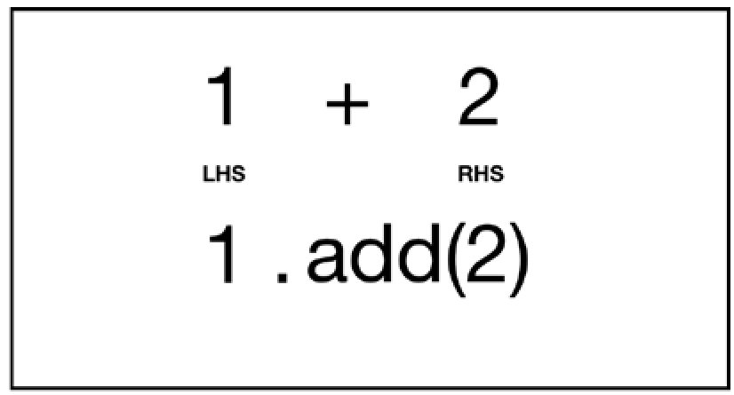

# 什么是 trait

trait 是 Rust 的灵魂. Rust 中所有的抽象, 比如接口抽象、OOP范式抽象、函数式范式抽象等, 均基于 trait 来完成. 同时, trait也保证了这些抽象几乎都是运行时零开销的. 

那么, 到底什么是trait？

从**类型系统**的角度来说, trait是 Rust **对 Ad-hoc 多态的支持**. 

从**语义**上来说, trait是**在行为上对类型的约束**, 这种约束可以让 trait 有如下 4 种用法:

* **接口抽象**. **接口**是对**类型行为**的统一约束. 
* **泛型约束**. **泛型的行为**被 trait 限定在更有限的范围内. 
* **抽象类型**. 在运行时作为一种**间接的抽象类型**去使用, 动态地分发给具体的类型. 
* **标签 trait**. 对类型的约束, 可以直接作为一种“**标签**”使用. 

下面依次介绍 trait 的这4种用法. 

# 接口抽象

特点如下:

* **接口**中可以**定义方法**, 并支持**默认实现**
* 接口中**不能实现另一个接口**, 但是接口之间**可以继承**
* **同一个接口**可以同时被**多个类型实现**，但**不能**被**同一个类型**实现**多次**
* 使用 impl 关键字**为类型实现接口方法**
* 使用 trait 关键字来**定义接口**


`code 2_53` 中的 `Fly trait` 就是一个典型的接口抽象. 类型 Duck 和 Pig 均实现了该 trait, 但具体行为不同. 这正是一种 Ad-hoc 多态: 同一个 trait, 在不同上下文中实现的行为不同. 为不同的类型实现 trait，属于一种函数重载，也可以说函数重载就是一种Ad-hoc多态。

## 关联类型

Rust中的很多操作符都是基于trait来实现的. 比如加法操作符就是一个 trait，加法操作不仅可以针对整数、浮点数，也可以针对字符串。

那如何对这个加法操作进行抽象呢? 一个方法是**结合泛型的 trait**.

```rust
trait Add_3_22<RHS, Output> {
	fn my_add(self, rhs: RHS) -> Output;
}
impl Add_3_22<i32, i32> for i32 {
	fn my_add(self, rhs: i32) -> i32 {
		self + rhs
	}
}
impl Add_3_22<u32, i32> for u32 {
	fn my_add(self, rhs: u32) -> i32 {
	    (self + rhs) as i32
	}
}
fn main_3_22() {
	let (a, b, c, d) = (1i32, 2i32, 3u32, 4u32);
	let x: i32 = a.my_add(b);
	let y: i32 = c.my_add(d);
	assert_eq!(x, 3i32);
	assert_eq!(y, 7i32);
}
```

使用 trait 泛型来实现加法抽象，它有一个**很大的问题**。一般来说，对于加法操作要考虑以下两种情况：

* 基本数据类型，比如i32和i32类型相加，出于安全考虑，结果必然还是i32类型
* 对**字符串**进行加法操作，但是 Rust 中可以**动态增加长度**的**只有 String 类型**的字符串，所以一般是 String 类型的才会实现 Add，其**返回值**也必须是 **String** 类型。但是**加法操作符右侧**也可以是**字符串字面量**。所以，String 的加法操作还必须实现 `Add<&str，String>`。

不管是以上两种情况中的哪一种，Add 的**第二个类型参数**总是显得有点**多余**。所以，Rust **标准库**中定义的 `Add trait` 使用了另外一种写法。

标准库中 i32 类型 Add trait 的定义:

```rust
pub trait Add<Rhs = Self> {
	type Output;
	fn add(self, rhs: Rhs) -> Self::Output;
}
```

与上面定义不同在于, 它将第二个类型参数去掉了. 取而代之的是 **type 定义的 Output**，以这种方式定义的类型叫作**关联类型**。而 `Add<Rhs = Self>` 这种形式表示为类型参数 Rhs 指定了默认值 Self。Self 是**每个 trait** 都带有的**隐式类型参数**，代表实现**当前 trait 的具体类型**。

当代码中出现操作符 “`+`” 的时候，Rust 就会自动调用操作符左侧的操作数对应的 `add（）` 方法，去完成具体的加法操作，也就是说 “`+`” 操作与调用 `add（）` 方法是等价的，如图.




## trait 一致性


## trait 继承


# 泛型约束


## trait 限定

## 理解 trait 限定

# 抽象类型

## trait 对象


# 标签 trait

## Sized trait

## Copy trait

## Send trait 和 Sync trait