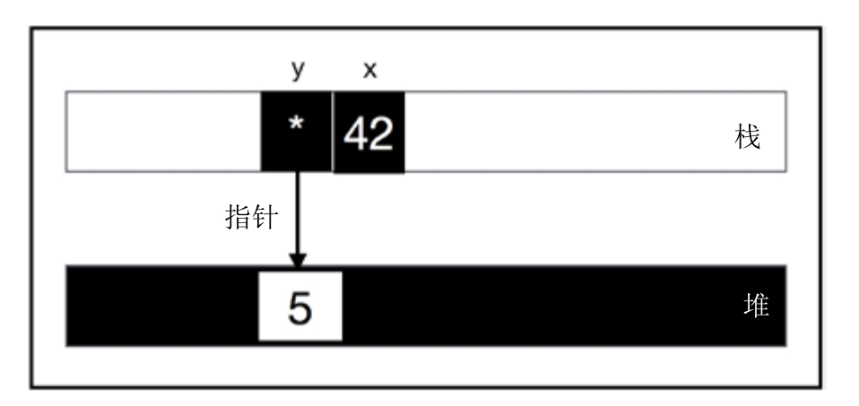
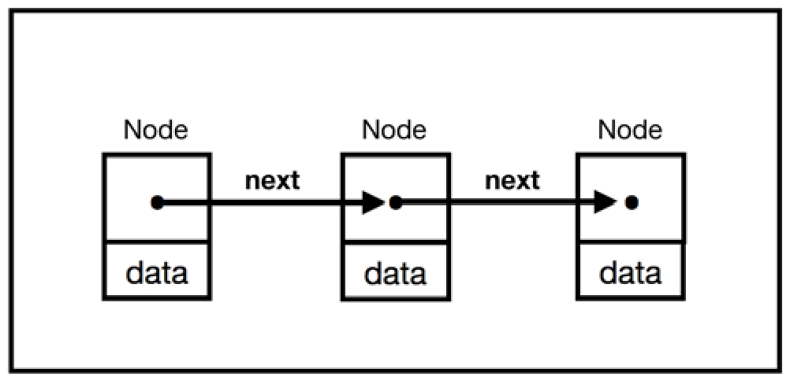
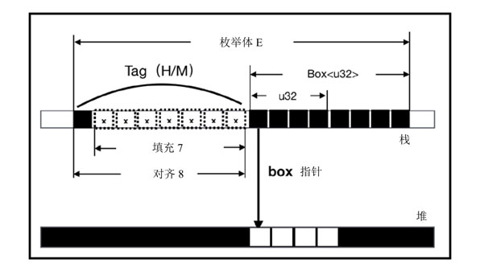

采用虚拟内存空间在栈和堆上分配内存, 这是诸多编程语言通用的内存管理基石, Rust 当然也不例外.

Rust **不需要**开发者**显式**地通过 `malloc/new` 或 `free/delete` 之类的函数去分配和回收堆内存.

Rust 可以**静态**地在**编译时**确定**何时需要释放内存**,而**不需要**在**运行时去确定**. Rust 有一套完整的内存管理机制来保证资源的合理利用和良好的性能.

# 变量和函数

前面提到, **变量**有两种:

* **全局变量**. 分为**常量变量**和**静态变量**.
* **局部变量**. 是指在**函数中定义的变量**.

**常量**使用 **const** 关键字定义, 并且需要**显式指明类型**, 只能进行**简单赋值**, 只能使用支持 **CTFE** 的**表达式**. **常量没有固定的内存地址**, 因为其**生命周期是全局的**, 随着程序消亡而消亡, 并且会被**编译器**有效地**内联**到每个使用到它的地方.

**静态变量**使用 **static** 关键字定义, 跟常量一样需要**显式指明类型**, 进行简单赋值, 而**不能使用任何表达式**. 静态变量的生命周期也是全局的, 但它**并不会被内联**, 每个静态变量都有一个**固定的内存地址**.

静态变量**并非被分配到栈**中, 也**不是在堆**中, 而是和程序代码一起被存储于**静态存储区**中. 静态存储区是伴随着程序的**二进制文件的生成(编译时)被分配**的, 并且在程序的**整个运行期都会存在**. Rust 中的**字符串字面量**同样是存储于**静态内存**中的.

## 检测声明的未初始化变量

在**函数**中定义的**局部变量**都会被默认存储到**栈**中.

这和 `C/C++` 语言, 甚至更多的语言行为都一样, 但**不同的是**, Rust 编译器可以**检查未初始化的变量**, 以保证**内存安全**, 如代码所示.

```rust
fn main_4_4() {
	let x: i32;
	println!("{}", x);
}
```

编译会报如下错误:

```
error[E0381]: borrow of possibly-uninitialized variable: `x`
  --> src/main.rs:29:17
   |
29 |     println!("{}", x);
   |                    ^ use of possibly-uninitialized `x`
```

Rust编译器会对代码做基本的**静态分支流程分析**.

x **没有绑定任何值**, 可能会存在内存不安全, 比如**计算结果非预期**、**程序崩溃**等, 所以 Rust 编译器必须报错.

## 检测分支中的未初始化变量

Rust编译器的**静态分支流程分析比较严格**.

```rust
fn main_4_5() {
	let x: i32;
	if true {
		x = 1;
	} else {
		x = 2;
	}
	println!("{}", x);
}
```

if **分支的所有情况**都给**变量 x 绑定了值**, 所以它可以正确运行. 但是如果**去掉 else 分支**, 编译器就会报以下错误:

```rust
fn main_4_5() {
	let x: i32;
	if true {
		x = 1;
	}
	println!("{}", x);
}
```

```
error[E0381]: borrow of possibly-uninitialized variable: `x`
  --> src/main.rs:39:17
   |
39 |     println!("{}", x);
   |                    ^ use of possibly-uninitialized `x`
```

编译器已经检查出**变量 x** 并**未正确初始化**. 这可能有点反直觉, 去掉了else分支之后, 编译器的静态分支流程分析判断出在**if表达式之外**的 `println!` 也用到了变量x, 但并未有任何值绑定行为. 

第2章提过, 编译器的**静态分支流程分析**并**不能识别 if 表达式中的条件是 true**, 所以它要检查所有的分支情况.

如果把 else 分支和 `println!` 语句都**去掉**, 则可以正常编译运行. 因为在 **if 表达式之外**再**没有使用到 x** 的地方, 在唯一使用到 x 的 if 表达式中已经绑定了值, 所以编译正常.

## 检测循环中是否产生未初始化变量

当在循环中使用 break 关键字的时候, break会将分支中的变量值返回.

> 循环中变量可以使用外层的

在loop循环中使用break关键字:

```rust
fn main_4_6() {
	let x: i32;
	loop {
		if true {
			x = 2;
			break;
		}
	}
	println!("{}", x); // 2
}
```

从 Rust 编译器的静态分支流程分析可以知道, break会将x的值返回, 所以在loop循环之外的 `println!` 语句可以正常打印x的值.

## 空数组或向量可以初始化变量

当变量绑定**空的数组**或**向量**时, 需要**显式指定类型**, 否则编译器无法推断其类型.

绑定空数组或向量:

```rust
fn main_4_7() {
	let a: Vec<i32> = vec![];
	let b: [i32; 0] = [];
}
```

如果**不加显式类型标注**, 编译器会报如下错误:

`let a = vec![];`

```
error[E0282]: type annotations needed for `Vec<T>`
```

`let b  = [];`

```
error[E0282]: type annotations needed for `[_; 0]`
```

**空数组**或**向量**可以用来**初始化变量**, 但目前暂时**无法**用于**初始化常量**或**静态变量**.

## 转移所有权产生了未初始化变量

如下面代码, 当将一个**已初始化的变量** y 绑定给**另外一个变量** y2 时, Rust会把变量 **y** 看作逻辑上的**未初始化变量**.

将已初始化变量绑定给另外一个变量:

```rust
fn main_4_8() {
	let x = 42;
	let y = Box::new(5);
	println!("{:p}", y); // 0x55563cb6aba0
	let x2 = x;
	let y2 = y;
	// println!("{:p}", y); //
}
```

变量 x 为**原生整数类型**, 默认存储在**栈**上. 变量 y 属于指针类型, 通过 `Box: : new` 方法在**堆上分配的内存返回指针**, 并与y绑定, 而**指针 y** 被存储于**栈**上, 可以通过 `println!` 语句打印指针地址验证这一点, 代码中的 main 函数的变量内存布局如图所示.

main函数中变量内存布局示意图:



第5行代码让变量 x2 绑定了变量 x, 因为x是原生整数类型, **实现**了 `Copy trait`, 所以这里变量x并未发生任何变化.

但第6行代码中, 变量 y2 绑定了变量 y, 因为y是 `Box<T>` 指针, 并**未实现**`Copy trait`, 所以此时 y 的值会**移动**给 y2, 而**变量 y** 会被编译器看作一个**未初始化的变量**, 所以当第7行代码**再次使用变量y**时, 编译器就会**报错**. 但是此时如果给y再重新绑定一个新值, y依然可用, 这个过程称为**重新初始化**.

当 main 函数调用完毕时, **栈帧**会**被释放**, 变量 x 和 y 也会被清空. 变量 x 为原生类型, 本就存储在栈上, 所以被释放是没关系的. 但是**变量 y 是指针**, 如果就这样被清空, 那么其指向的**已分配堆内存**怎么办? 代码中并没有使用 free 之类的函数去清空堆内存, 这会引起内存泄漏的问题吗? 答案是不会, 因为 `Box<T>` 类型的**指针**会在**变量 y 被清空**之时, **自动清空其指向的已分配堆内存**.

像 `Box<T>` 这样的**指针**被称为**智能指针**. 使用**智能指针**, 可以让 Rust 利用**栈**来**隐式自动释放堆内存**, 从而**避免显式调用 free 之类的函数去释放内存**.

# 智能指针与RAII

Rust中的指针大致可以分为三种: **引用**、**原生指针**(裸指针)和**智能指针**.

**引用**就是 Rust 提供的**普通指针**, 用 `&` 和 `&mut` 操作符来创建, 形如 `&T` 和 `&mut T`. **原生指针**是指形如 `*const T` 和 `*mut T` 这样的类型.

引用和原生指针类型之间的异同如下:

* 可以通过as操作符随意转换, 例如 `&T as*const T` 和 `&mut Tas*mut T`.
* 原生指针可以在 unsafe 块下任意使用, 不受 Rust 的安全检查规则的限制, 而引用则必须受到编译器安全检查规则的限制.

## 智能指针

智能指针(`smart pointer`)实际上是一种**结构体**, 只不过它的**行为类似指针**. 

**智能指针**是**对指针的一层封装**, 提供了一些**额外的功能**, 比如**自动释放堆内存**. 

**智能指针**区别于**常规结构体**的特性在于, 它实现了 **Deref** 和 **Drop** 两个 trait.

* Deref 提供了**解引用**能力
* Drop 提供了**自动析构**的能力

正是这**两个 trait** 让**智能指针**拥有了**类似指针**的行为. **类型决定行为**, 同时**类型也取决于行为**, 不是指针胜似指针, 所以称其为智能指针. 开发者也可以编写自己的智能指针.

第3章介绍过 **Deref trait**, 用它可以**重载解引用运算符** `*`. **智能指针结构体**中实现了 Deref, 重载了**解引用运算符** `*` 的行为.

> 重载? 也就是说 `*T` 相当于调用 `T.deref`? 说法有问题

其实 **String** 和 **Vec** 类型也是一种智能指针(如下面代码所示), 它们也都实现了 `Deref` 和 `Drop`.


```rust
fn main_4_9() {
	let s = String::from("hello"); // String
	//let deref_s: str = *s;
	let v = vec![1, 2, 3];
	//let deref_v: [u32] = *v;
}
```

**String** 类型和 **Vec** 类型的**值**都是被分配到**堆内存**并**返回指针**的, 通过**将返回的指针封装**来实现 **Deref** 和 **Drop**, 以**自动化管理解引用**和**释放堆内存**. 代码中第3行代码对**变量 s** 进行了**解引用**操作, 其返回的是 **str 类型**, 因为 str 是**大小不确定的类型**, 所以**编译器会报错**.

String 类型和 Vec 类型虽然是智能指针的一种, 但并**不是**让开发者把它们**当作指针**来使用的. 这里只是为了演示说明, **真实代码**中并**不会这样用**. 

同理, 第5行代码对变量 v **解引用**, 返回的是 `[u32]` 类型, 依然是**大小不确定的类型**.

当 main 函数执行完毕, **栈帧释放**, 变量 s 和 v 被清空之后, 其对应的已分配**堆内存**会**被自动释放**. 这是因为它们**实现了Drop**.

**Drop** 对于智能指针来说非常重要, 因为它可以帮助智能指针在**被丢弃时自动执行一些重要的清理工作**, 比如释放堆内存. 更重要的是, 除了释放内存, Drop还可以做很多其他的工作, 比如**释放文件和网络连接**. Drop的功能有点类似GC, 但它比GC的应用更加广泛, GC只能回收内存, 而Drop可以回收内存及内存之外的一切资源.

## 确定性析构

其实这种资源管理的方式有一个术语, 叫RAII(ResourceAcquisition Is Initialization), 意思是资源获取及初始化. RAII和智能指针均起源于现代 C++, 智能指针就是基于RAII机制来实现的.

在现代 C++ 中, RAII的机制是使用构造函数来初始化资源, 使用析构函数来回收资源. 看上去RAII所要做的事确实跟GC差不多. 但RAII和GC最大的不同在于, RAII将资源托管给创建堆内存的指针对象本身来管理, 并保证资源在其生命周期内始终有效, 一旦生命周期终止, 资源马上会被回收. 而GC是由第三方只针对内存来统一回收垃圾的, 这样就很被动. 正是因为RAII的这些优势, Rust也将其纳入了自己的体系中.

Rust中并没有现代C++所拥有的那种构造函数(constructor), 而是直接对每个成员的初始化来完成构造, 也可以直接通过封装一个静态函数来构造“构造函数”. 而Rust中的Drop就是析构函数(Destructor).

Drop被定义于std: : ops模块中, 其内部实现如代码清单4-10所示.

Drop的内部实现:

```rust

```

Drop已经被标记为语言项, 这表明该trait为语言本身所用, 比如智能指针被丢弃后自动触发析构函数时, 编译器知道该去哪里找Drop.

为结构体实现Drop:

```rust

```

代码中定义了元组结构体S, 通过impl为结构体S实现了Drop定义的drop方法, 令其在被调用的时候执行指定的打印输出. main函数中声明了两个结构体实例x和y, y被置于内部scope中.

代码的输出结果如下:

```

```

在代码清单4-11中, 变量x的作用域范围是整个main函数, 而变量y的作用域范围是内部scope所界定的范围. 通过输出结果来看, 在变量x和y分别离开其作用域时, 都执行了drop方法. 所以RAII也有另外一个别名, 叫作用域界定的资源管理(Scope-Bound ResourceManagement, SBRM).

这也正是Drop的特性, 它允许在对象即将消亡之时, 自行调用指定代码(drop方法).

Rust中的一些常用类型, 比如Vec、String和File等, 均实现了Drop, 所以不管是开发者使用Vec创建的动态数组被丢弃时, 还是使用String类型创建的字符串被丢弃时, 都不需要显式地释放堆内存, 也不需要使用File进行文件读取, 甚至不需要显式地关闭文件, 因为Rust会自动完成这些操作.

## 使用Valgrind来检测内存泄漏

代码清单4-13使用了Box<T>指针来分配堆内存, 并配合一款知名的专门用于内存调试和检测内存泄漏的工具Valgrind来验证其是否有内存泄漏.

使用 `Box<T>` 指针分配内存:

```rust

```

将代码保存到box.rs文件中, 使用rustc命令将其编译为二进制文件box:

```
rustc box.rs
```

然后再执行如下命令:

```
valgrind ./box
```

输出结果为:

```

```

Valgrind 给出了提示: 所有堆内存都已释放. 证明了 `Box<T>` 指针随着栈帧销毁而被丢弃时, 自动调用了析构函数, 释放了堆内存.

## drop-flag

在代码清单4-13中, 变量box1和box3的析构函数分别是在离开main函数和create_box函数之后调用的. 而变量 box2 是在离开由花括号构造的显式内部作用域时调用的. 它们的析构函数调用顺序是在编译期(而非运行时)就确定好的. 这是因为Rust编译器使用了名为drop-flag 的“魔法”, 在函数调用栈中为离开作用域的变量自动插入布尔标记, 标注是否调用析构函数, 这样, 在运行时就可以根据编译期做的标记来调用析构函数了.

对于结构体或枚举体这种复合类型来说, 并不存在隐式的drop-flag. 只有在函数调用时, 这些复合结构实例被初始化之后, 编译器才会加上drop-flag. 如果复合结构本身实现了Drop, 则会调用它自己的析构函数; 否则, 会调用其成员的析构函数.

当变量被绑定给另外一个变量, 值发生移动时, 也会被加上drop-flag, 在运行时会调用析构函数. 加上drop-flag的变量意味着其生命周期的结束, 之后再也不能被访问. 这其实就是第5章会讲到的所有权机制.

这意味着, 可以使用花括号构造显式作用域来“主动析构”那些需要提前结束生命周期的变量, 如代码清单4-14所示.

代码: 使用花括号构造显式作用域主动析构局部变量

```rust

```

在代码清单4-14中, 变量v被置于花括号构造的显式内部作用域中, 当其离开此内部作用域时, 就会调用v的析构函数, 所以如果在内部作用域外使用push方法, 则会报错, 因为变量v已经被释放了.

值得注意的是, 对于实现Copy的类型, 是没有析构函数的. 因为实现了Copy的类型会复制, 其生命周期不受析构函数的影响, 所以也就没必要存在析构函数.

同时, 变量遮蔽(`shadowing`)并不会导致其生命周期提前结束, 如代码清单4-15所示.

代码清单4-15: 变量遮蔽不等于生命周期提前结束

```rust

```

代码清单4-15的输出结果表明, 变量遮蔽并不会主动析构原来的变量, 它会一直存在, 直到函数退出.

# 内存泄漏与内存安全

RAII的设计目标就是替代GC, 防止内存泄漏. 然而RAII并非“银弹”, 如果使用不当, 还是会造成内存泄漏的.

## 制造内存泄漏

有的时候, 需要对同一个堆内存块进行多次引用. 比如, 要创建一个链表, 如图4-10所示.

创建链表示意图:



那么, 首先需要创建一个节点Node结构体, 如代码所示.

代码: 链表节点 Node 结构体

```rust

```

仔细思考, 此处 `NodePtr<T>` 该如何设计呢? 可以设想一下伪代码:

```rust

```

这里的 `NodePtr<T>` 首先是一个 `Option<T>`, 因为链表的结尾节点之后有可能不存在下一个节点, 所以需要 `Some<T>` 和 `None`. 然后, 还需要一个智能指针来保持节点之间的连接, 所以此处设想 `NodePtr<T>` 为 `Opiton<Box<Node<T>>>`.

然后就是对 `node1.next` 和 `node2.next`赋值, 使得 node1、node2 和 node3 节点相连, 就像图4-10展示的那样. 但是这里有个问题, 因为 `Box<T>` 指针对所管理的堆内存有唯一拥有权, 所以并不共享. 代码清单4-17展示了如何使用 `Box<T>` 来构造链表节点之间的指针.

代码: 使用 `Box<T>` 来构造链表节点之间的指针

```rust

```

代码编译会报如下错误:

```

```

代码清单4-17的第9行将 second 节点指定给了 first, 因为sencond使用了 `Box<T>` 指针, 此时 second 发生了值移动, 变成了未初始化变量, 所以在第10行使用它的时候, 编译器报错了.

Rust 另外提供了智能指针 `Rc<T>`, 它的名字叫引用计数(reference counting)智能指针, 使用它可以共享同一块堆内存. 可以将 `Box<T>` 换为 `Rc<T>`, 此时 `NodePtr<T>` 就变成了 `Option<Rc<Node<T>>>`. 但是 `Rc<T>` 有一个特性: 它包含的数据T是不可变的, 而 `second.next=Some(first)` 这种操作需要是可变的, 因为要修改second中next成员的值. 所以, 仅仅使用 `Rc<T>` 还不够, 如代码清单4-18所示.

代码: 仅使用 `Rc<T>` 的情况

```rust

```

在代码清单4-18中, 变量 first 和 second 使用了 clone 方法, 但并不会真的复制, `Rc<T>`内部维护着一个引用计数器, 每 clone一次, 计数器加1, 当它们离开main函数作用域时, 计数器会被清零, 对应的堆内存也会被自动释放.

不出所料, 代码清单4-18编译会报错.

```

```

编译器提示, 不能对不可变字段进行修改. 不过, Rust 提供了另外一个智能指针`RefCell<T>`, 它提供了一种内部可变性, 这意味着, 它对编译器来说是不可变的, 但在运行过程中, 包含在其中的内部数据是可变的. 那么我们使用 `RefCell<T>` 来重构代码, 此时 `NodePtr<T>` 就变成了 `Option<Rc<RefCell<Node<T>>>>`, 如代码清单4-19所示.

代码: 使用 `RefCell<T>` 保证内部可变

```rust

```

代码清单 4-19 终于可以正常运行了, 但是代码中使用了两种智能指针,  Rc<T>和RefCell<T>, 内存是否可以被正确释放? 现在我们为Node结构体实现Drop, 来验证内存是否可以被正确释放, 如代码清单4-20所示.

代码: 为Node结构体实现Drop


```rust

```

在代码清单4-20中, `Node<T>`结构体实现了Drop, 其析构函数drop会输出指定的字符串. 第22行和第23行中出现了一个循环引用, first和second节点互相指向对方. 但是编译运行之后并没有看到任何输出. 这说明析构函数并没有执行, 这里存在内存泄漏.

这是一次精心设计的内存泄漏, 只是为了证明一件事: Rust并不能百分百地阻止内存泄漏, 但也不是轻而易举就可以造成内存泄漏的.

## 内存安全的含义

Rust 不是号称内存安全的语言吗? 为什么还可以造成内存泄漏? 这也许是每个 Rust 初学者的疑问. 但实际上, 内存泄漏(MemoryLeak)并不在内存安全(Memory Safety)概念范围内.

只要不会出现以下内存问题即为内存安全:

* 使用未定义内存.
* 空指针
* 悬垂指针
* 缓冲区溢出
* 非法释放未分配的指针或已经释放过的指针.

Rust中的变量必须初始化以后才可使用, 否则无法通过编译器检查. 所以, 可以排除第一种情况, Rust不会允许开发者使用未定义内存.

空指针就是指Java中的null、C++中的nullptr或者C中的NULL. 而在Rust(特指Safe Rust)中, 开发者没有任何办法去创建一个空指针, 因为Rust不支持将整数转换为指针, 也不支持未初始化变量. 其他语言中引入空指针, 是因为空指针可以在逻辑上表示不指向任何内存, 比如一个方法返回空指针, 表示其返回值不存在, 便于在代码中进行逻辑判断. 但这都是人为控制的, 如果开发者并没有对空指针进行处理, 就会出现问题. Rust中使用Option类型来代替空指针, Option实际是枚举体, 包含两个值: Some(T)和None, 分别代表两种情况, 有和无. 这就迫使开发者必须对这两种情况都做处理, 以保证内存安全.

悬垂指针(dangling pointer)是指堆内存已被释放, 但其本身还没有做任何处理, 依旧指向已回收内存地址的指针. 如果悬垂指针被程序使用, 则会出现无法预期的后果, 代码清单4-21构造了一个垂悬指针.

代码: 构造悬垂指针

```rust

```

代码清单4-21定义了foo函数, 返回&'a str类型, 其中'a为生命周期标记, 在第5章会着重介绍. &'a str类型实际是标注了生命周期标记的&str类型. 该函数体内定义了局部变量a, 并返回a的引用. 但是局部变量a在离开foo函数之后会被销毁. 如果把该引用传到函数外面, 绑定给main函数中的变量x, 则会出现问题. foo函数中的&a就是一个悬垂指针.

当然, Rust编译器是不会允许代码清单4-21编译通过的, 它会报如下错误:

```rust

```

编译器提示, 变量a的生命周期很短暂——就这样简单地避免了一次悬垂指针导致的内存安全问题. 这背后的功臣是第5章会着重介绍的Rust的所有权和借用机制.

缓冲区是指一块连续的内存区域, 可保存相同类型的多个实例. 缓冲区可以是栈内存, 也可以是堆内存. 一般可以使用数组来分配缓冲区. C和C++语言没有数组越界检查机制, 当向局部数组缓冲区里写入的数据超过为其分配的大小时, 就会发生缓冲区溢出. 攻击者可利用缓冲区溢出来窜改进程运行时栈, 从而改变程序正常流向, 轻则导致程序崩溃, 重则导致系统特权被窃取. 而使用Rust则无须担心这种问题, Rust编译器在编译期就能检查出数组越界的问题, 从而完美地避免了缓冲区溢出. 在第3章和第4章中都已经举了不少相关示例. Rust中不会出现未分配的指针, 所以也不存在非法释放的情况. 同时, Rust的所有权机制严格地保证了析构函数只会调用一次, 所以也不会出现非法释放已释放内存的情况.

总的来说, Rust对内存安全做出了百分之百的保证. 但是这并不意味着能百分之百地阻止内存泄漏, 因为内存泄漏是无法避免的, 哪怕是拥有GC的语言, 也照样会出现内存泄漏的问题.

## 内存泄漏的原因

在Rust中可导致内存泄漏的情况大概有以下三种:

* 线程崩溃, 析构函数无法调用.
* 使用引用计数时造成了循环引用.
* 调用Rust标准库中的forget函数主动泄漏.

对于线程崩溃, 没有什么好的办法来阻止它; 我们也已经见识过循环引用了. 但是Rust为什么会提供一个主动泄漏内存的forget函数呢? 

以上三种情况从本质上说就是, Rust并不会保证百分之百调用析构函数. 析构函数可以做很多事情, 除了释放内存, 还可以释放其他资源, 如果析构函数不能执行, 不仅仅会导致内存泄漏, 从更广的角度来看, 还会导致其他资源泄漏. 相比内存安全问题, 资源泄漏其实并没有那么严重. 以内存泄漏为例, 一次内存泄漏不会有多大影响, 但是一次内存不安全操作可能会导致灾难性的后果.

内存泄漏是指没有对应该释放的内存进行释放, 属于没有对合法的数据进行操作. 内存不安全操作是对不合法的数据进行了操作. 两者性质不同, 造成的后果也不同.

甚至有时候还需要进行主动泄漏. 比如, 通过FFI与外部函数打交道, 把值交由C代码去处理, 在 Rust 这边要使用forget函数来主动泄漏, 防止Rust调用析构函数引起问题. 第13章有关于forget函数的更详细的介绍.

# 复合类型的内存分配和布局

对于基本原生数据类型来说, Rust是默认将其分配到栈中的. 那么, 结构体(Enum)或联合体(Union)是被分配在哪的呢? 

结构体或联合体只是定义, 看它们被分配在哪, 主要是看其类型实例如何使用.

代码: 验证三种复合结构内存布局

```rust

```

代码清单4-22覆盖了 Rust 中三种自定义复合数据结构: 结构体、枚举体和联合体.

结构体A的成员a为基本数字类型, b为 `Box<T>` 类型. 根据内存对齐规则, 结构体A的大小为16个字节, 其内存对齐示意如下图所示.

图: 结构体A的内存对齐示意图


在图4-11中, 每个方块代表一个字节. 按照内存对齐规则, 结构体A中的成员b最长, 占8个字节, 所以按8字节对齐, 变量a需要补齐4个字节, 整个结构体长度为a和b之和, 占16个字节.

当结构体A在函数中有实例被初始化时, 该结构体会被放到栈中, 首地址为第一个成员变量a的地址, 长度为16个字节. 其中成员b是Box<u32>类型, 会在堆内存上开辟空间存放数据, 但是其指针会返回给成员b, 并存放在栈中, 一共占8个字节.

在代码清单 4-22 中, 结构体 B 为元组结构体, 其对齐规则和普通结构体一样, 所以占16个字节.

结构体N为单元结构体, 占0个字节.

枚举体E实际上是一种标签联合体(Tagged Union), 和普通联合体(Union)的共同点在于, 其成员变量也共用同一块内存, 所以联合体也被称为共用体. 不同点在于, 标签联合体中每个成员都有一个标签(tag), 用于显式地表明同一时刻哪一个成员在使用内存, 而且标签也需要占用内存. 操作枚举体的时候, 需要匹配处理其所有成员, 这也是其被称为枚举体的原因, 图4-12展示了枚举体E内存对齐的布局.

图: 枚举体E的内存对齐示意图



在枚举体E的成员H(u32)和M(`Box<u32>`)中, H和M就是标签, 占1个字节. 但是H和M都带有自定义数据, u32和`Box<u32>`, 其中`Box<u32>`最长, 按联合体的内存对齐规则, 此处按8字节对齐. 所以, 标签需要补齐到8个字节, 自定义数据取最长字节, 即8个字节, 整个枚举体的长度为标签和自定义数据之和, 为16个字节. 联合体U没有标签, 按内存对齐规则, 占8个字节.

当枚举体和联合体在函数中有实例被初始化时, 与结构体一样, 也会被分配到栈中, 占相应的字节长度. 如果成员的值存放于堆上, 那么栈中就存放其指针.

下面代码清单展示的输出结果和按内存对齐规则计算出来的结果一致.

```

```