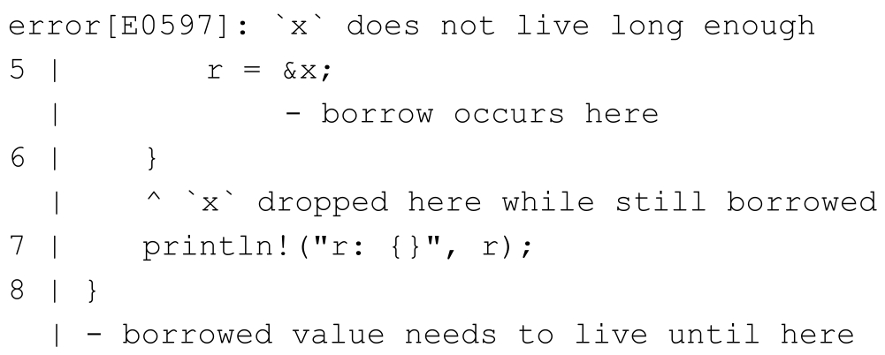

**值的生命周期**和**词法作用域**有关, 但是**借用**可以在**各个函数间传递**, 必然会**跨越多个词法作用域**.

对于**函数本地声明**的拥有所有权的**值**或者**借用**来说, Rust编译器中包含的**借用检查器**(**borrow checker**)可以检查它们的生命周期, 但是对于**跨词法作用域**的**借用**, 借用检查器就**无法自动推断**借用的合法性了, 也就是说, 无法判断这些跨词法作用域的借用是否满足借用规则. **不合法的借用**会产生**悬垂指针**, 造成内存不安全.

所以, Rust必须确保所有的借用都是有效的, 不会存在悬垂指针.

**绑定 r** 将在**整个 main 函数作用域**中存活, 其生命周期长度用 `'a` 表示; **绑定 x** 存活于第 3 ~ 6 行之间的**内部词法作用域**中, 因为它**离开内部作用域**就会**被析构**, 其生命周期长度用 `'b` 表示, `'b` 要比 `'a` 小很多.

**如果**该代码**正常通过编译**, 则在运行时, 第 5 行代码就会产生一个悬垂指针. 幸运的是, **Rust编译器不会允许这种事情发生**. 编译时会通过**借用检查器**检查代码中**每个引用的有效性**, 会报错如下:

根据借用规则一, **借用方**的生命周期不能长于**出借方**的生命周期. 在代码清单5-28中, 借用 `&x` 要绑定给变量r, r 就成了**借用方**, 其生命周期长度是 `'a`, 而出借方是x, 出借方的生命周期长度是 'b, 现在 'a远远大于 'b, 说明借用的生命周期远远大于出借方的生命周期, 出借方被析构, 借用还存在, 就会造成悬垂指针. 由此证明借用无效, 借用检查无法通过, 编译器报错, 成功地阻止了悬垂指针的产生.

如果只是在函数本地使用借用, 那么借用检查器很容易推导其生命周期, 因为此时Rust拥有关于此函数的所有信息. 一旦跨函数使用借用, 比如作为函数参数或返回值使用, 编译器就无法进行检查, 因为编译器无法判断出所有的传入或传出的借用生命周期范围, 此时需要显式地对借用参数或返回值使用生命周期参数进行标注.

# 显式生命周期参数

生命周期参数必须以单引号开头，参数名通常都是小写字母，比如＇a。生命周期参数位于引用符号&后面，并使用空格来分割生命周期参数和类型，如下所示。

