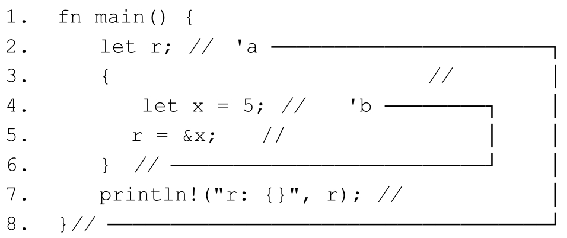

**值的生命周期**和**词法作用域**有关，但是**借用**可以在**各个函数间传递**，必然会**跨越多个词法作用域**。

对于**函数本地声明**的拥有所有权的**值**或者**借用**来说，Rust编译器中包含的**借用检查器**（**borrow checker**）可以检查它们的生命周期，但是对于**跨词法作用域**的**借用**，借用检查器就**无法自动推断**借用的合法性了，也就是说，无法判断这些跨词法作用域的借用是否满足借用规则。**不合法的借用**会产生**悬垂指针**，造成内存不安全。

所以，Rust必须确保所有的借用都是有效的，不会存在悬垂指针.

**绑定 r** 将在**整个 main 函数作用域**中存活，其生命周期长度用 `'a` 表示；**绑定 x** 存活于第 3 ~ 6 行之间的**内部词法作用域**中，因为它**离开内部作用域**就会**被析构**，其生命周期长度用 `'b` 表示，`'b` 要比 `'a` 小很多。

**如果**该代码**正常通过编译**，则在运行时，第 5 行代码就会产生一个悬垂指针。幸运的是，**Rust编译器不会允许这种事情发生**。

编译时会借用检查器检查代码中每个引用的有效性

