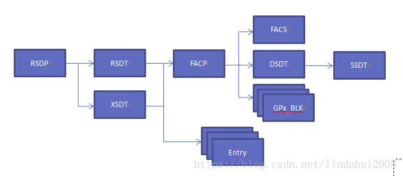
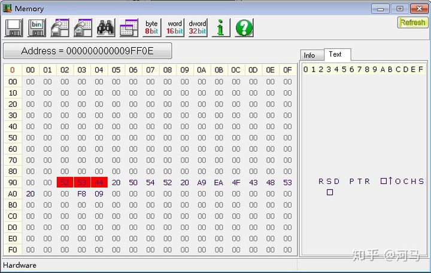
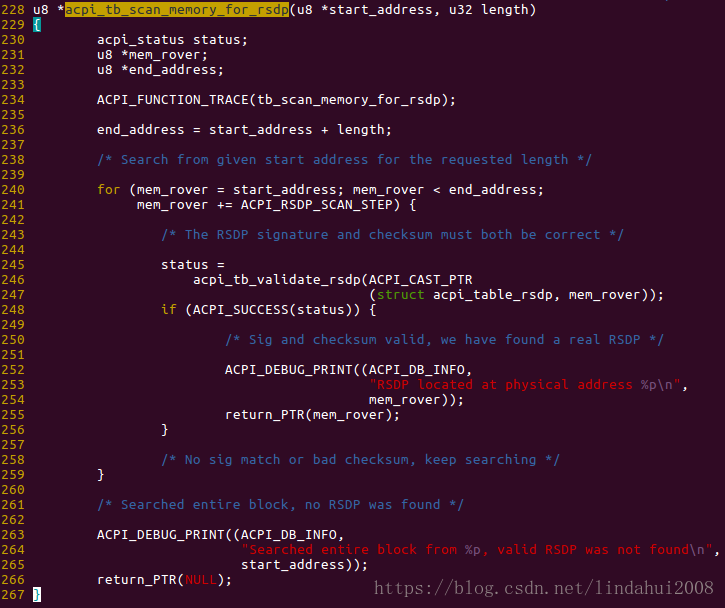

**ACPI**(Advanced Configuration and Power Interface)是在**系统启动阶段**由`BIOS/UEFI`**收集系统各方面信息并创建**的，它大致**以树形的组织形式**(如下图所示)存在**系统物理内存**中. 

**整个ACPI表**以**RSDP**(Root System Descriptor Pointer Table)为**入口点**，每个非叶子节点都会包含指向其他子表的指针，各个表都会有一个表头，在该表头中包含了相应的Signature，用于标识该表，有点类似与该表的ID，除此之外，在表头中还会包含Checksum、Revision、OEM ID等信息. 所以查找ACPI表的关键就是在内存中定位到RSDP表. 

对于基于Legacy BIOS的系统而言，RSDP表所在的物理地址并不固定，要么位于EBDA(Extended BIOS Data Area)(位于物理地址0x40E)的前1KB范围内; 要么位于0x000E0000 到0x000FFFFF的物理地址范围内. Linux kernel在启动的时候，会去这两个物理地址范围，通过遍历物理地址空间的方法寻找RSDP表，即通过寻找RSDP表的Signature(RSD PTR)来定位RSDP的位置，并通过该表的length和checksum来确保找到的表是正确的. 

用RW读取的RSD PTR表

来看一下Linux内核源码，在内核启动的时候会调用acpi_boot_table_init()函数，该函数会调用到acpi_find_root_pointer()函数用于定位RSDP表，其函数的调用顺序如下: 

`arch/x86/kernel/head64.S -> arch/x86/kernel/head64.c:x86_64_start_kernel() -> arch/x86/kernel/head64.c:x86_64_start_reservations -> init/main.c:start_kernel() -> arch/x86/kernel/setup.c:setup_arch() -> acpi_boot_table_init() -> acpi_table_init() -> acpi_initialize_tables() -> acpi_os_get_root_pointer() -> acpi_find_root_pointer()`

在`acpi_find_root_pointer()`函数中，会先后在EBDA和0x000E0000 到0x000FFFFF的物理地址范围内调用`acpi_tb_scan_memory_for_rsdp()`函数来检测RSDP表的Signature “RSD PTR”. 

对于基于UEFI的系统而言，RSDP Table位于EFI_SYSTEM_TABLE，所以Linux内核可以直接到该表里面查找RSDP表，然后定位所有的ACPI表. 

# 参考

https://zhuanlan.zhihu.com/p/49500489

