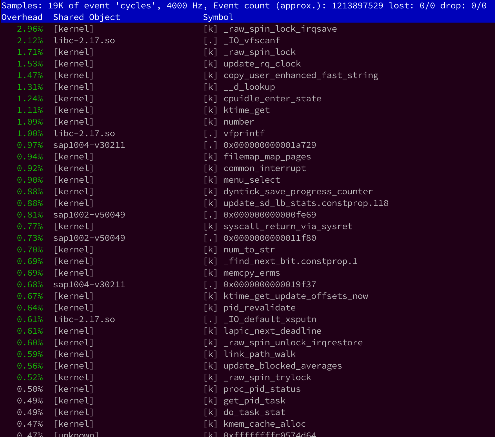
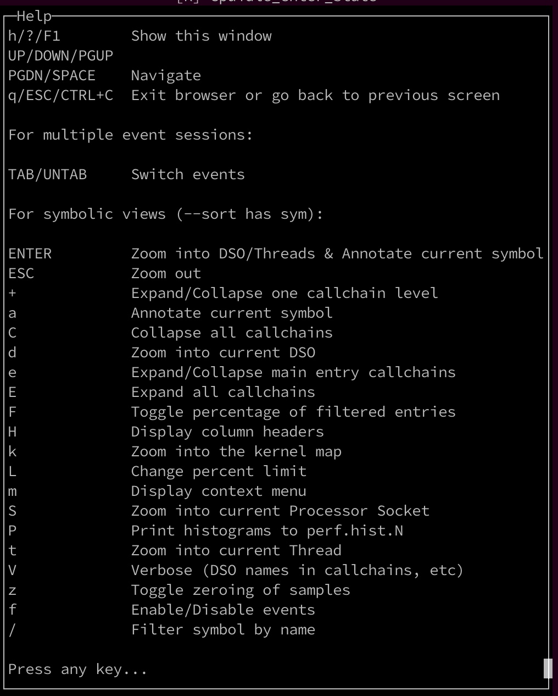
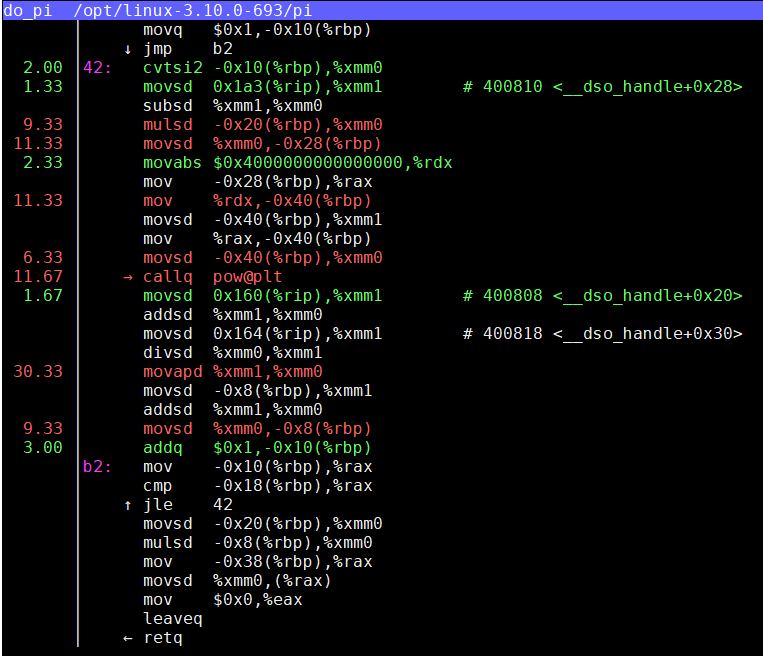
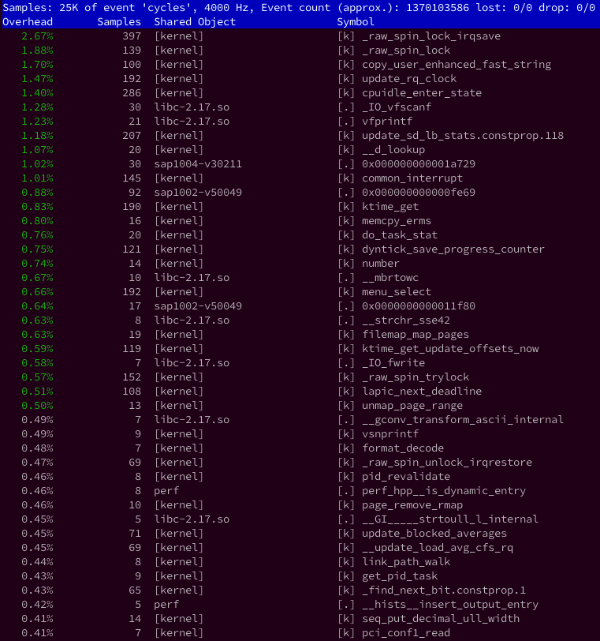
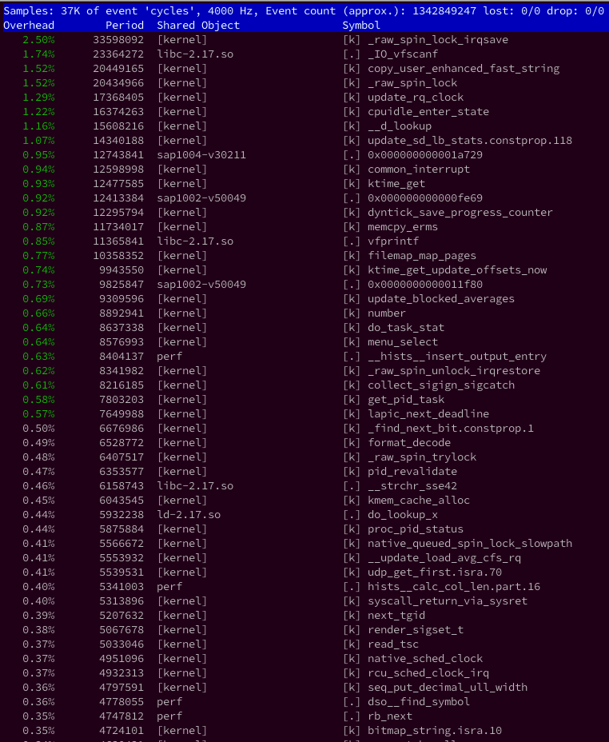
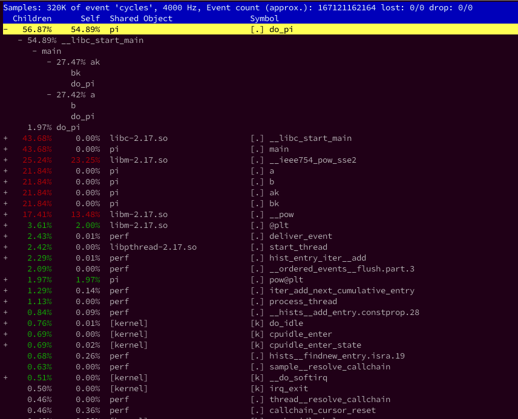
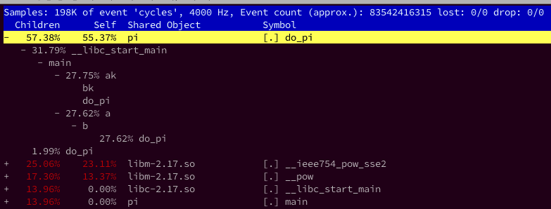
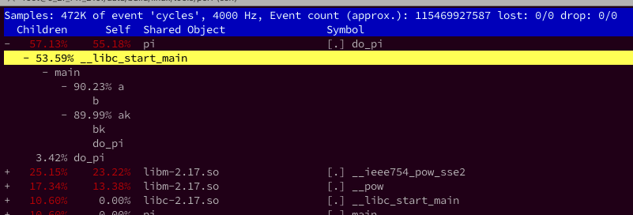
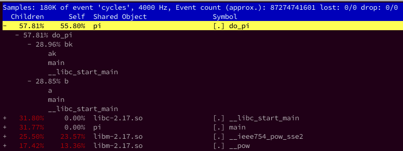

<!-- @import "[TOC]" {cmd="toc" depthFrom=1 depthTo=6 orderedList=false} -->

<!-- code_chunk_output -->

- [1. 用途](#1-用途)
- [2. 使用方法](#2-使用方法)
- [3. 界面](#3-界面)
  - [3.1. 3种用户页面](#31-3种用户页面)
  - [3.2. 4列信息](#32-4列信息)
  - [3.3. 界面常用命令](#33-界面常用命令)
    - [3.3.1. 帮助信息](#331-帮助信息)
    - [3.3.2. annoate注解功能](#332-annoate注解功能)
- [4. 参数介绍](#4-参数介绍)
  - [4.1. 常用参数](#41-常用参数)
  - [4.2. 指定性能事件](#42-指定性能事件)
  - [4.3. 采样周期](#43-采样周期)
  - [4.4. 进程id](#44-进程id)
  - [4.5. 线程id](#45-线程id)
  - [4.6. 所有CPU](#46-所有cpu)
  - [4.7. 特定的CPU列表](#47-特定的cpu列表)
  - [4.8. 有符号表的内核映像](#48-有符号表的内核映像)
  - [4.9. 不显示内核符号](#49-不显示内核符号)
  - [4.10. mmap页面数](#410-mmap页面数)
  - [4.11. 实时优先级](#411-实时优先级)
  - [4.12. 界面刷新周期](#412-界面刷新周期)
  - [4.13. DSO的符号表](#413-dso的符号表)
  - [4.14. 符号过滤](#414-符号过滤)
  - [4.15. 计数器组](#415-计数器组)
  - [4.16. 动态创建的进程的性能采集](#416-动态创建的进程的性能采集)
  - [4.17. 指定符号名](#417-指定符号名)
  - [4.18.](#418)
  - [4.19. 使用tty界面](#419-使用tty界面)
  - [4.20. 显示冗余信息](#420-显示冗余信息)
  - [4.21. 指定显示信息](#421-指定显示信息)
  - [4.22. 显示每个符号的采样数量](#422-显示每个符号的采样数量)
  - [4.23. 显示符号对应的性能事件总数](#423-显示符号对应的性能事件总数)
  - [4.24. 显示函数的调用图谱](#424-显示函数的调用图谱)
  - [4.25. 仅显示部分符号](#425-仅显示部分符号)
- [5. 例子](#5-例子)

<!-- /code_chunk_output -->

# 1. 用途

perf top主要用于**实时分析**各个**函数**在**某个性能事件**上的热度，能够快速的定位热点函数，包括**应用程序函数**、**模块函数**与**内核函数**，甚至能够定位到**热点指令**。

> 像是把proc集成了

**默认**的**性能事件**为`cpu cycles`, 每2s刷新界面。跟踪时可以**指定事件**，**CPU**，以及**是否跟踪stack trace**。

利用perf top，能够直观地观察到当前的热点函数，并利用工具中**内置的annotate功能**，进一步查找热点指令。



# 2. 使用方法

查看帮助手册

```
perf --help top
```

perf top的基本使用方法为: 

```
perf top [-e <EVENT> | --event=EVENT] [<options>]
```

该命令以**默认性能事件**"`cycles`(CPU周期数)"进行全系统的性能剖析，检测系统中的所有**应用程序函数**与**内核函数**的热度。

默认情况下perf top是**无法显示信息**的，需要`sudo perf top`或者`echo -1 > /proc/sys/kernel/perf_event_paranoid`(在Ubuntu16.04，还需要`echo 0 > /proc/sys/kernel/kptr_restrict`)

# 3. 界面

## 3.1. 3种用户页面

perf提供了**3种用户页面**，分别是**tui**、**gtk**以及**tty**。其中可操作性最强，功能最丰富的界面是**tui**。

本文主要基于此界面讲解 perf。top 工具仅支持 tui 与 tty，**默认界面**为 **tui**。上图中展示的就是 tui 界面。

需要提一下的是，必须在系统安装 newt 软件包，perf 才能使能 tui 界面。

## 3.2. 4列信息

top工具的界面具有4列信息。

第一列: **该符号引发的性能事件**在**整个检测域**中占的比例，我们将其称为该符号的**热度**。检测域是指perf监控的**所有符号**。默认情况下包括系统中**所有进程**、**内核**以及**内核模块的函数**。

第二列: 该符号所在的**DSO**。**DSO**即**动态共享对象**(Dynamic Shared Object)的缩写。

第三列: **DSO的类型**。perf中DSO共有**5种类型**，分别是: **ELF可执行文件**，**动态链接库**，**内核**，**内核模块**和**VDSO**。当第三列为`[.]`时表示此符号属于**用户态的ELF文件**(包括可执行文件与动态链接库)。为`[k]`表示此符号属于**内核与内核模块**。

第四列: **符号名**，也就是**函数名**。

## 3.3. 界面常用命令

* h: 显示帮助，即可显示详细的帮助信息。

* UP/DOWN/PGUP/PGDN/SPACE: 上下和翻页。

* a: annotate current symbol，注解当前符号。能够给出汇编语言的注解，给出各条指令的采样率。

* d: 过滤掉所有不属于此DSO的符号。非常方便查看同一类别的符号。

* P: 将当前信息保存到perf.hist.N中。

### 3.3.1. 帮助信息

在tui界面下按'h','?'或'F1'键时，会弹出一个帮助窗口，如下图所示。



帮助窗口列出了**perf top**的**所有功能**。

### 3.3.2. annoate注解功能

我们首先来看注解(**Annoate**)功能。注解功能可以**进一步深入分析某个符号**。给出**对应线程**的**代码**并且为**热点代码**标记出它们触发的性能事件在**整个测试域**中的**百分比**。

下面让我们来看一下如何使用注解功能。

在界面上按**上下键**，将光标在各个symbol间移动。选定**某个符号后**，按下**a键**，得到如下的界面。



上图显示的是`[pi]`程序中`do_pi()`函数的**注解**。从图上可以看到perf对`do_pi()`中的C代码给出了汇编语言的注解。并且给出了**各条指令的采样率**。从上图可以看到**耗时较多的指令**(如访存指令)比较容易被perf采到。

选定**某个符号**后按下热键'd'，perf会**过滤掉**所有**不属于此DSO的文件**。符号`do_pi`归属的DSO为**thread**。当在符号`do_pi`上按下'd'键后，perf过滤掉了所有不属于thread的符号。如下图所示。


类似于热键'd'，热键't'能够过滤**所有不属于当前符号所属线程的符号**。

热键'P'可以将pref top的当前显示的信息输出到文件perf.hist.X中。

右方向键也是热键，它可以打开 perf top 的功能菜单。菜单上列出的各项功能分别对应上述各个热键的功能。

# 4. 参数介绍

## 4.1. 常用参数

* `'-e'`: 指定性能事件, 默认是`cycles`
* `'-p'`: 指定待分析进程的 PID 及其创建的线程
* `'-t'`: 指定待分析线程的 TID
* `'-a'`: 分析整个系统的性能(Default) 
* `'-g'`: 显示函数的调用关系图
* `'-c'`: 事件的采样周期
* `'-d'`: 界面的刷新周期(Default:2s), 因为perf top默认每2s从mmap的内存区域读取一次性能数据
* `'-E'`: 显示的函数条数
* `'-r <priority>'`: 将 perf top 作为实时任务，优先级为 `<priority>`
* `'-k'`: 带符号表的内核映像(vmlinux)所在的路径, 这是 annotation 功能所依赖的
* `'-K'`: 不显示内核态符号 
* `'-U'`: 不显示用户态符号

Perf top的参数较多，本文只介绍几个常用的参数的使用方法。

## 4.2. 指定性能事件

* `'-e'` or `'--event' <event>`: 该参数用于**指定分析的性能事件**。默认情况下, cycles(CPU周期数)

可分析的性能事件可以参考**perf list**。

例如: 我们希望利用top工具剖析系统中**Cache丢失次数**，可以采用以下命名: 

```
perf top -e cache-misses
```

## 4.3. 采样周期

* `'-c'` or `'--count' <n>`: 该参数用于**指定性能计数器**的**采样周期**。默认情况下，**每秒采样4000次**。

## 4.4. 进程id

* `'-p'` or `'--pid' <pid>`: 该参数用于指定分析**进程的pid**。指定pid后，perf top仅分析**目标进程**以及**目标进程创建的线程**。

## 4.5. 线程id

* `'-t'` or `'--tid' <tid>`: 该参数用于指定分析**线程的tid**。指定tid后，perf top仅分析**目标线程**，**不包括**此线程**创建的其他线程**。

## 4.6. 所有CPU

* `'-a'` or `'--all-cpus'`: 采集系统中**所有CPU产生的性能事件**。这就是perf top的**默认情况**。

## 4.7. 特定的CPU列表

* `'-C'` or `'--cpu' <cpu>`: 指定**待分析的CPU列表**。

如果系统中有4个CPU，如果仅需采集CPU0与CPU3的数据，可通过如下方法调用perf top: 

```
perf top -C 0,3
```

## 4.8. 有符号表的内核映像

* `'-k'` or `'--vmlinux' <file>`: 指定**带符号表的内核映像**所在的路径。

与GDB类似，perf只有在**DSO存在符号表**的情况下才能解析出**IP对应的具体符号**。

Perf通常采用以下顺序加载**内核符号**: 

1. /proc/kallsyms
2. 用户通过'-k'参数指定的路径
3. 当前路径下的"vmlinux"文件
4. /boot/vmlinux
5. /boot/vmlinux-$(uts.release)
6. /lib/modules/$(uts.release)/build/vmlinux
7. /usr/lib/debug/lib/modules/$(uts.release)/build/vmlinux

## 4.9. 不显示内核符号

* `'-K'` or `'--hide_kernel_symbols'`: **不显示属于内核的符号**。对于只想分析应用程序的用户而言，使用此参数后，perf top的界面会清爽很多。

## 4.10. mmap页面数

* `'-m'` or `'--mmap-pages' <n> `: 指定perf**开辟的mmap页面的数量**。mmap缓存主要用于用户空间与内核空间的数据通信。perf在内核中驱动将采集到的性能数据存入ring buffer，用户空间的分析程序则通过mmap机制从ring buffer中读取数据。

默认情况下，mmap的页面数量为128，此时mmap内存区域的大小为512KB。perf top默认每个2s读取一次性能数据，当内核生成性能数据的速度过快时，就可能因为缓冲区满导致数据丢失，从而影响到分析结果。在此情况下，用户可以通过'-m'参数扩大缓冲区，以避免性能数据的大量丢失。

## 4.11. 实时优先级

* `'-r'` or `'--realtime' <n>`: 指定分析程序的实时优先级。如上文所述，如果perf分析程序读取数据的速度长期小于内核生成数据的速度时，就可能导致采样数据的大量丢失，影响分析精度。在系统负载过高时，分析程序可能会因为调度延迟过高而不能及时读取数据。因此，在高负载系统中可以通过参数'-r'将分析程序设置为实时进程，并为其设定较高的优先级。

```
perf top -r 0
```

上述命令中，0即为指定给分析程序的**实时优先级**。顺便说一句，Linux中实时优先级的范围是`[0,99]`，其中优先级0最高。不要与范围是`[-20,19]`的nice值搞混。

## 4.12. 界面刷新周期

* `'-d'` or `'--delay' <n>`: 指定perf top界面的刷新周期，<n>的单位为妙。默认值为2s。

## 4.13. DSO的符号表

* `'-D'` or `'--dump-symtab'`: 打印**DSO的符号表**，此功能主要用于perf自身的调试。该参数仅与`'--stdio'`(即TTY界面)配合使用时才起作用。

启用此参数后，perf top会在退出时打印所有DSO的符号表。

```
perf top --stdio -D
```


图中给出了 perf top 输出的符号表的片段，这些符号来自于 ELF 文件’thread’
的 symtable section。符号表的第一列为该符号的地址范围。第二列表示该符号的属性，如’g’表示全局符号，’l’表示局部符号等。

## 4.14. 符号过滤

* `'-f'` or `'--count-filter' <n>`: 此参数主要用于**符号过滤**。指定此参数后，页面上将仅显示采样数`大于<n>`的符号。

## 4.15. 计数器组

* `'--group'`: 将计数器组合成**计数器组**。Perf在默认情况下会为每个计数器创建一个独立的ring buffer。如果将计数器组合成计数器组，perf则会将所有counter的数据输出到group leader的ring buffer中。当内核生成采样数据不多并且内存较为紧张时，可采用此参数以节省内存。

## 4.16. 动态创建的进程的性能采集

* `'-i'` or `'--inherit'`: 采用此参数后，子进程将**自动集成父进程的性能事件**。从而使得perf能够采集到**动态创建的进程的性能数据**。但是当采用`'-p'`参数仅分析特定进程的性能数据时，继承机制会被禁用。这主要是出于性能的考虑。

## 4.17. 指定符号名

* `'--sym-annotate' <symbol name>`: 指定待解析的符号名。

## 4.18. 

* `'-z'` or `'--zero'`: 更新页面的数据后，清除历史信息。

* `'-F'` or `'--freq' <n>`: 指定采样频率，此参数与'-c'参数指定一个即可。两个参数同时指定时，perf仅使用'-c'指定的值作为采样周期。

* `'-E'` or `'--entries' <n>`: 指定页面上的符号数。如果用户仅希望查看top <n>个符号，可以通过此参数实现。

* `'-U'` or `'--hide_user_symbols'`: 仅显示属于内核的符号，隐藏属于用户空间的符号，即类型为[.]的符号。

* `'--tui'`: 使用tui界面。tui为perf top的默认界面。如前所述，tui界面需要newt软件包的支持。如果用户打开perf top后，出现的不是tui界面，请检查系统中是否已安装newt包。

## 4.19. 使用tty界面

* `'--stdio'`: 使用TTY页面。当系统中**未装newt软件包**时，此界面为默认界面。

## 4.20. 显示冗余信息

* `'-v'` or `'--verbose'`: 显示冗余信息，如符号地址、符号类型(全局、局部、用户、内核等)。

## 4.21. 指定显示信息

* `'-s'` or `'--sort' <key[,key2]...>`: 指定界面显示的信息，以及这些信息的排序。

Perf提供的备选信息有: 

option | comment
---|---
Comm | 触发事件的进程名
PID | 触发事件的进程号
DOS | 符号所属的DSO的名称
Symbol | 符号名
Parent | 调用路径的入口

当采用如下命令时，perf top会给出更加丰富的信息。

```
perf top -s comm,pid,dso,parent,symbol
```


从图可以查看更丰富的信息，各行信息的意义与上述命令中个字段的排序相对应。

## 4.22. 显示每个符号的采样数量

* `'-n'` or `'--show-nr-samples'`: 显示**每个符号**对应的**采样数量**。

```
perf top -n 
```



图上的第二列为本行的符号在本轮分析中对应的采样数量

## 4.23. 显示符号对应的性能事件总数

* `'--show-total-period'`: 在界面上显示符号对应的**性能事件总数**。

**性能事件计数器**在**溢出**时才会触发**一次采样**。两次采样之间的**计数值**即为这段事件内发生的**事件总数**，perf将其称之为周期(`period`)。

* 使用方法为: 

```
perf top --show-total-period
```



图上的第二列即为该行符号在本轮分析中对应的事件总数。

## 4.24. 显示函数的调用图谱

* `'-g'` or `'--call-graph <record_mode[,record_size],print_type,threshold[,print_limit],order,sort_key[,branch]>'`: 在界面上显示函数的**调用图谱**。

用户还可以指定显示类型，采样率的最小阈值，以及调用顺序。

下面通过一个简单的程序观察一下 perf top 如何显示调用图谱。

```cpp
#include <stdio.h>
#include <math.h>
#include <sys/types.h>
#include <linux/unistd.h>

int do_pi(int p)
{
    double mypi, h, sum, x;
    long long n, i;

    n = 500000000000;
    h = 1.0/n;
    sum = 0.0;

    for (i = 1; i <= n; i++) {
        x = h * (i - 0.5);
        sum += 4.0 / (1.0 + pow(x,2));
    }

    mypi = h * sum;
    return 0;
}

int bk()
{
    do_pi(0);
}

int ak()
{
    double mypi, h, sum, x;
    long long n, i;

    n = 500000;
    h = 1.0/n;
    sum = 0.0;

    for (i = 1; i <= n; i++) {
        x = h * (i - 0.5);
        sum += 4.0 / (1.0 + pow(x,2));
    }

    mypi = h * sum;
    bk();
}

int b()
{
    do_pi(1); 
}

int a()
{
    b(); 
}

int main(void)
{
    pid_t pid;
    printf("pid: %d\n", getpid());

    pid = fork();

    if (pid==0) {
        ak();
    }
    
    a();

    return 0;
}
```

上面是一个多进程程序，**主进程**通过 `main()‐>a()‐>b()‐>do_pi()`这条路径最终调用了`do_pi()`，**子进程**则通过 `main()‐>ak()‐>bk()‐>do_pi()`这条路径最终调用了
`do_pi()`。

```
gcc pi2.c -lm -o pi
```

在系统中运行后，执行下述命令:

```
perf top –g
```



从图上可以看到，与普通的 perf top 界面相比，每行的最左面多了一个`’+’`号，表示此符号可以展开函数调用图谱。将焦点定位在符号 `do_pi` 后，通过**回车键**，即可展开`do_pi()`的调用图谱。展开以后，perf top 会在**每条调用路径前**显示相应的采样率，表示有多少采样是由该条路径触发的。在图中，共有 **2 条路径**调用了 `do_pi()`，分别是 `main()‐>a()‐>b()‐>do_pi()`与 `main()‐>ak()‐>bk()‐>do_pi()`。这两条路径的采样率分别是 27.42%与 27.47%。对于复杂的软件而言，函数调用图谱为更加深入的性能分析提供了途径。我们不仅能够直观地查找热点函数，还能够进一步直观地查找到使得该函数成为热点的代码路径。

参数`‐g` 具有多个选项 `output_type` 允许用户指定调用图谱的显示方式。

```
--call-graph <record_mode[,record_size],print_type,threshold[,print_limit],order,sort_key[,branch]>
                    setup and enables call-graph (stack chain/backtrace):

                        record_mode:    call graph recording mode (fp|dwarf|lbr)
                        record_size:    if record_mode is 'dwarf', max size of stack recording (<bytes>)
                                        default: 8192 (bytes)
                        print_type:     call graph printing style (graph|flat|fractal|folded|none)
                        threshold:      minimum call graph inclusion threshold (<percent>)
                        print_limit:    maximum number of call graph entry (<number>)
                        order:          call graph order (caller|callee)
                        sort_key:       call graph sort key (function|address)
                        branch:         include last branch info to call graph (branch)
                        value:          call graph value (percent|period|count)

                        Default: fp,graph,0.5,caller,function
```

Perf 提供了 3 种显示方式:

⓵ graph: 使用调用树，将每条调用路径进一步折叠。这种显示方式更加直观。 每条调用路径的采样率为**绝对值**。也就是该条路径占**整个采样域的比率**。此为**默认选项**.

使用方法为:

```
./perf top --call-graph graph
```



⓶ fractal。类似与 graph，但是每条路径前的采样率为**相对值**。图中采用的就是 **fractal** 风格。

```
perf top --call-graph fractal
```



⓷ flat. 不折叠各条调用路径，也不显示每条调用路径的采样率。线性展开所有调用链.

```
./perf top --call-graph flat
```

我们还可以通过 threshold 选项过滤采样率低于 threshold 的调用路径。

threshold 的**默认值**为 0.5。

选项 order 用以设定调用图谱的**显示顺序**，该选项有 2 个取值，分别是callee 与 caller。

- 将该选项设为 **callee** 时，perf 按照**被调用的顺序**显示调用图谱，**上层函数被下层函数所调用**。
- 该选项被设为 **caller** 时，按照调用顺序显示调用图谱，即**上层函数调用了下层函数**。

执行如下命令后，可以得到 callee 风格的调用图谱，如图所示。

```
./perf top --call-graph graph,0.5,callee
```



默认按照`Chidren`排序, 要是按照`self`可以

```
./perf top --no-children
```

## 4.25. 仅显示部分符号

* `'--dsos' <dso_name[,dso_name...]>`: 仅显示dos名为`dos_name`的符号。可以同时指定多个dso，各个dso名字之间通过逗号隔开。

* `'--comms' <comm[,comm...]>`: 仅显示属于进程"comm"的符号。

* `'--symbols' <symbol[,symbol...]>`: 仅显示指定的符号。

* `'-M'` or `'--disassembler-style'`: 显示符号注解时，可以通过此参数指定汇编语言的风格。

# 5. 例子

动态显示成本最高的地址和符号，不保存到文件

```
perf top -F 49
```

动态显示成本最高的命令

```
perf top -F 49 -ns comm,dso
```