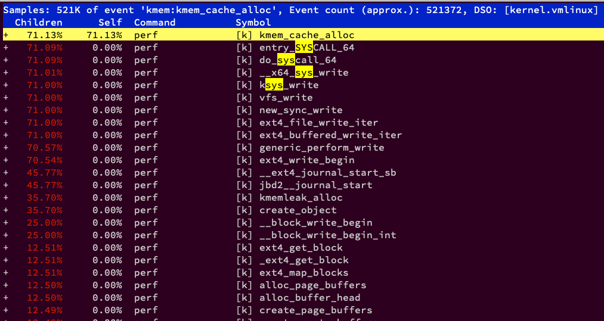
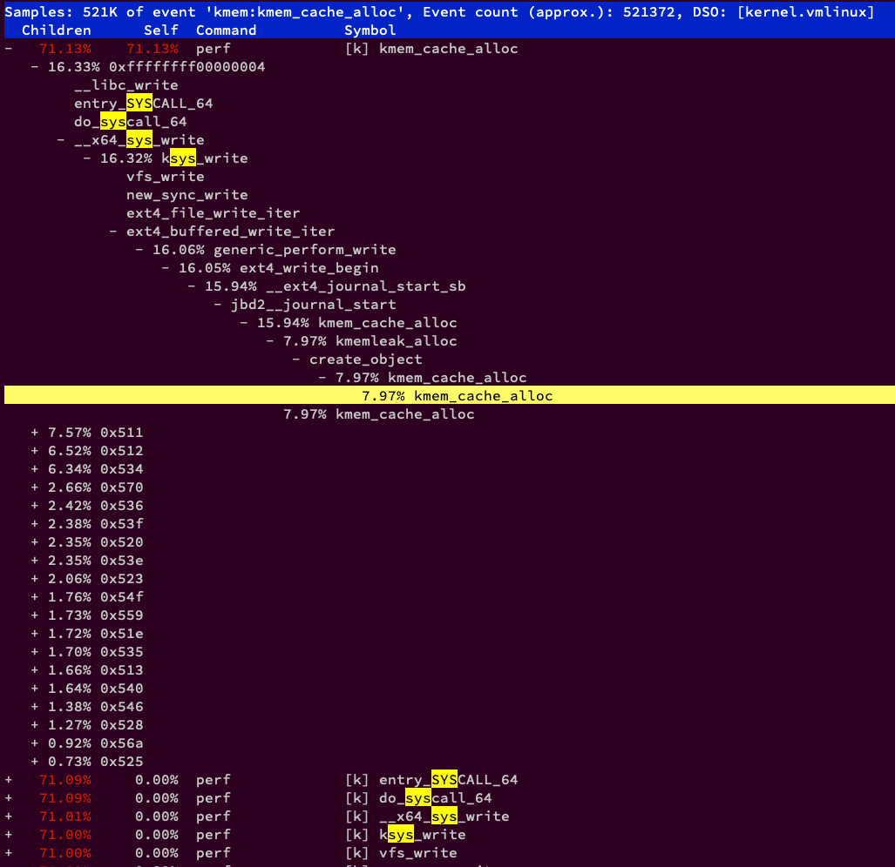
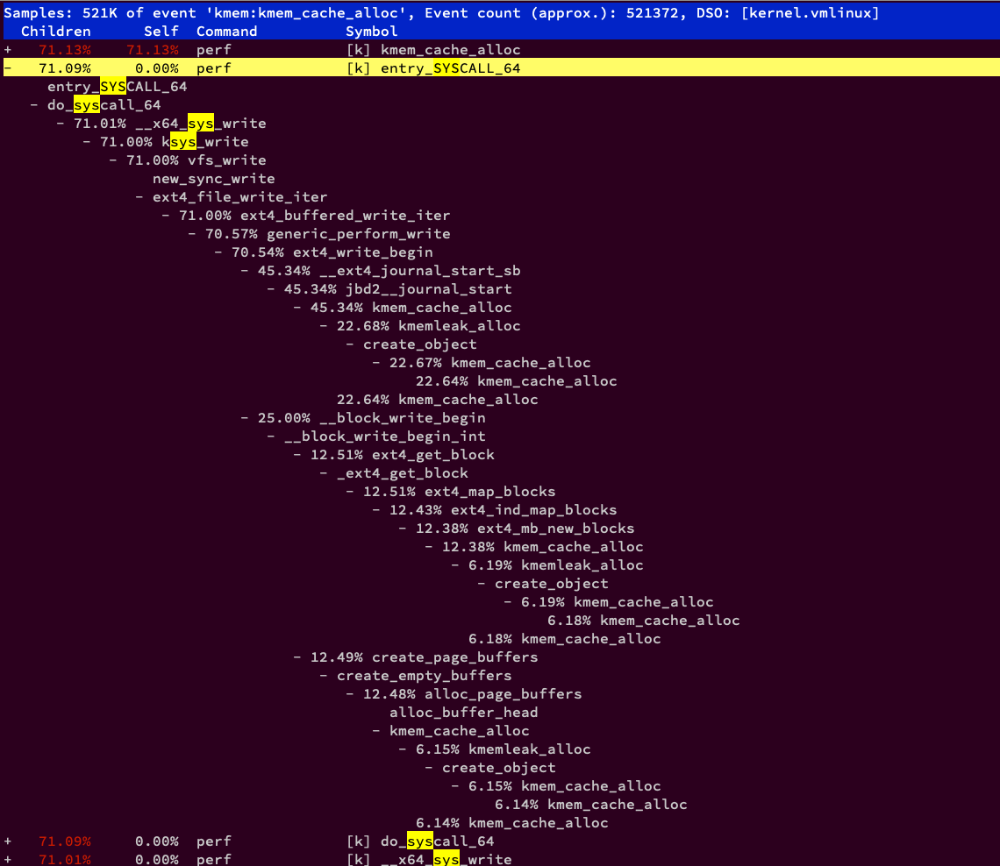
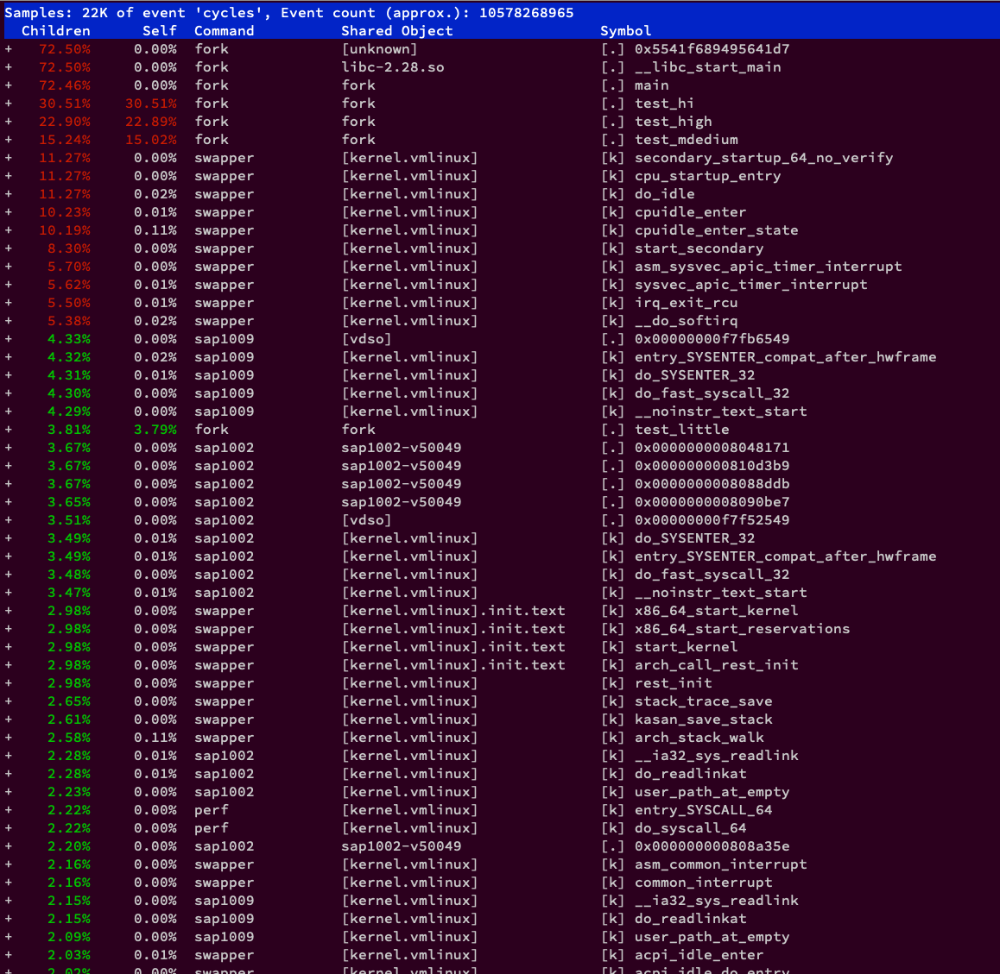
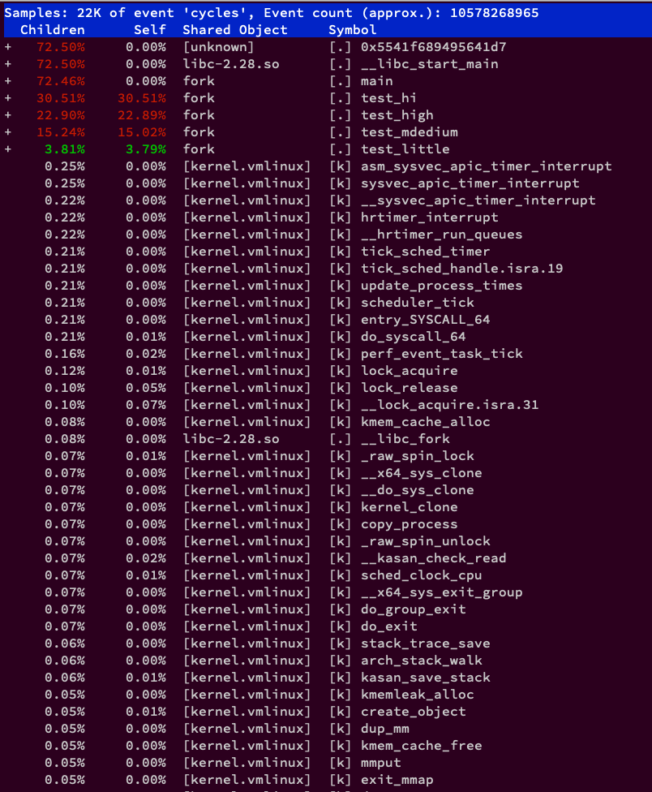

<!-- @import "[TOC]" {cmd="toc" depthFrom=1 depthTo=6 orderedList=false} -->

<!-- code_chunk_output -->

- [1. 功能用途](#1-功能用途)
  - [1.1. 相关功能](#11-相关功能)
  - [1.2. 采样周期](#12-采样周期)
    - [1.2.1. 事件发生次数](#121-事件发生次数)
    - [1.2.2. 每秒采样个数](#122-每秒采样个数)
  - [1.3. 事件](#13-事件)
- [2. 使用方法](#2-使用方法)
- [3. 参数介绍](#3-参数介绍)
  - [3.1. 常用参数](#31-常用参数)
  - [3.2. 输出信息](#32-输出信息)
- [4. 例子](#4-例子)
  - [4.1. 性能剖析](#41-性能剖析)
  - [4.2. 静态追踪](#42-静态追踪)
- [5. 示例](#5-示例)
- [6. 火焰图](#6-火焰图)
- [7. 参考](#7-参考)

<!-- /code_chunk_output -->

# 1. 功能用途

记录**一段时间**内**系统**/**进程**的性能数据(采样)到 `perf.data`, 最常用的功能, 该文件可以使用`perf report`进行解析.

该命令**不是记录所有事件**, 而是**进行采样**. **默认**情况下采样基于**cycle事件**, 也就是类似于**进行定期采样！！！**(cycle事件情况下). 

而perf的采样是**基于事件！！！** 进行的. **采样的周期**以**事件的数量！！！来表示**, 而**非基于时间**. 当**目标事件计数溢出指定的数值！！！**, 则**产生一个采样**(针对 **IP** 或者 **stack trace**). 

>* IP: 即函数名
>* stack trace: 堆栈信息

> **永远记住这一点**, 所以采样的数据就是事件触发时的数据(IP或stack), 所以如果是基于具体event(比如tracepoint), 采样得到的数据信息可能会很相似, 也就是那个tracepoint出现位置的调用情况.

此命令可以启动一个命令, 并对其进行剖析, 然后把剖析数据记录到文件(默认`perf.data`). 按`Ctrl - C`可以随时结束剖析. 

## 1.1. 相关功能

此命令可以在线程、进程、CPU、全局级别进行剖析, 更甚具体到**某一进程某一事件**; 可宏观, 也可以很微观. 

* pref record: 记录信息到`perf.data`; 
* perf report: 生成报告; 
* perf diff: 对两个记录进行diff; 
* perf evlist: 列出记录的性能事件; 
* perf annotate: 显示perf.data函数代码; 
* perf archive: 将相关符号打包, 方便在其它机器进行分析; 
* perf script: 将perf.data输出可读性文本; 

record, report, annotate是一组相关的命名, 通常的使用流程是: 

1. 在被剖析机器上调用record录制数据
2. 拷贝录制的perf.data, 在任意机器上调用report、annotate进行分析

`perf annotate`能够提供**源码信息**, 不过需要在应用编译的时候带有`-ggdb`.

## 1.2. 采样周期

perf接口允许通过两种方式描述**采样周期**: 

1. period: 指定的**事件发生的次数**
2. frequency: **每秒**采集样本的**平均个数**

### 1.2.1. 事件发生次数

第一种对应`-c`参数, 该机制是由处理器实现的, 当**相应事件达到这个阈值**才**中断内核**进行采样.

### 1.2.2. 每秒采样个数

perf**默认使用第二种**, 具体来说对应到`-F`选项. `-F 1000`表示1000Hz, 也就是**每秒平均采样1000个**. 内核会根据事件(默认cycle)出现的频率来**动态的调整采样周期**, 以**尽量满足需求**. 

>hz: 每一秒周期性事件发生的次数. 这里当然是 cycles 事件. 也就是说, 内核动态调整, 让每秒采样1000次, 而这个是基于cycles事件(假设每秒2000次cycles事件, 内核尽量保证每发生2次cycles事件采样一次, 从而实现每秒采样 1000 次

>CPU周期(cpu-cycles)是默认的性能事件, 所谓的**CPU周期**是指CPU所能识别的**最小时间单元！！！**, 通常为亿分之几秒, 是CPU执行最简单的指令时所需要的时间, 例如读取寄存器中的内容, 也叫做`clock tick`. 

## 1.3. 事件

perf的采样是**基于事件！！！** 进行的. **采样的周期**以**事件的数量！！！来表示**, 而**非基于时间**. 当**目标事件计数溢出指定的数值！！！**, 则**产生一个采样！！！**(针对 **IP** 或者 **stack trace**). 

>* IP: 即函数名
>* stack trace: 堆栈信息. 

record理论上三种event都可以使用, 而默认事件是 cycle 事件, 这意味着只要CPU执行指令就会有这个事件, 所以可能会得到系统中任何位置的采样数据. 这也就是所说的**CPU Profiling**.

所以如果这种采样模式下**使用了其他具体事件**, 因为具体事件往往是业务相关的, 也就是说得到的采样往往是某一行或某几行代码的快照, 也就是说容易出现固定几个位置的采样数据信息(取决于event出现的位置).

> 当然你要对比看这个event主要会出现的位置或者出现频率, 可以使用这个

比如某个tracepoint

```
# perf record -e kmem:kmem_cache_alloc -F 99 -ag -- sleep 5
# perf report
```

这个得到的肯定是围绕这个tracepoint时候的 stack trace, 显示的是这个stack trace的调用链中每个函数的热点率







总结来说, 如果你想要了解某个具体event的情况(频率和调用堆栈), 再指定event.

# 2. 使用方法

```
perf --help record
```

```
perf record [-e <EVENT> | --event=EVENT] [-a] <command>
perf record [-e <EVENT> | --event=EVENT] [-a] — <command> [<options>]
```

# 3. 参数介绍

参考stat子命令. 

## 3.1. 常用参数

* `'-e'`: 指定性能事件, 默认是`cycles`
* `'-p'`: 指定待分析进程的 PID 
* `'-t'`: 指定待分析线程的 TID
* `'-a’`: 分析整个系统的性能(Default) 
* `'-c'`: 事件的采样周期
* `'-o'`: 指定输出文件(Default: perf.data) 
* `'-g'`: 记录函数间的调用关系
* `'-r <priority>'`: 将 perf top 作为实时任务, 优先级为 `<priority>`
* `'-u <uid>'`: 只分析用户`<uid>`创建的进程

<table>
 <caption><b><br>标题</br></b></caption>
    <tr>
        <th>选项</th>
        <th>说明</th>
    </tr>
    <tr>
        <td>-e</td>
        <td>
            剖析的事件类型, 也就是性能监控单元(Performance Monitoring Unit, PMU)类型. 可以指定: <br>
            <ol>
            <li>事件名称, 执行 perf list可以显示支持的事件列表</li>
            <li>一组事件, 以花括号包围 {event1,event2,...}</li>
            <li>其它形式</li>
            </ol>
        </td>
    </tr>
    <tr>
        <td>--filter</td>
        <td>事件过滤器, 必须和指定了追踪点(tracepoint)事件的-e配合使用</td>
    </tr>
    <tr>
        <td>--exclude-perf</td>
        <td>不记录perf自己发起的事件</td>
    </tr>
    <tr>
        <td>-a</td>
        <td>使用Per-CPU模式, 如果不指定-C, 则相当于全局模式<br>
如果指定-C, 则可以选定若干CPU</td>
    </tr>
    <tr>
        <td>-p</td>
        <td>收集指定进程的事件, 逗号分割的PID列表</td>
    </tr>
    <tr>
        <td>-t</td>
        <td>收集指定线程的事件, 逗号分割的线程ID列表</td>
    </tr>
    <tr>
        <td>-u</td>
        <td>收集指定用户态的进程的事件</td>
    </tr>
    <tr>
        <td>-r</td>
        <td>使用RT SCHED_FIFO优先级收集数据</td>
    </tr>
    <tr>
        <td>-c</td>
        <td>采样周期</td>
    </tr>
    <tr>
        <td>-o</td>
        <td>输出文件的名称</td>
    </tr>
    <tr>
        <td>-F</td>
        <td>以指定的频率剖析</td>
    </tr>
    <tr>
        <td>-i</td>
        <td>不包括子任务的事件, 不监控子进程、线程、子进程的线程</td>
    </tr>
    <tr>
        <td>-g</td>
        <td>记录调用栈</td>
    </tr>
    <tr>
        <td>--call-graph</td>
        <td>收集调用栈使用的方法: <br>
            <ol>
            <li>frame pointer, fp, 栈指针</li>
            <li>dwarf, DWARF的调用帧信息(CFI)</li>
            <li>lbr, Hardware Last Branch Record facility</li>
            </ol>
            某些系统上, 如果应用通过GCC的--fomit-frame-pointer参数构建, fp模式下可能只能看到匿名调用帧, 可以用dwarf代替
        </td>
    </tr>
    <tr>
        <td>-s</td>
        <td>记录每个线程的事件计数器, 配合 perf report -T使用</td>
    </tr>
    <tr>
        <td>-d</td>
        <td>记录样本地址</td>
    </tr>
    <tr>
        <td>-T</td>
        <td>记录样本时间戳</td>
    </tr>
    <tr>
        <td>-P</td>
        <td>记录样本周期</td>
    </tr>
    <tr>
        <td>-C</td>
        <td>仅仅从指定的CPU上收集样本, 示例:  -C 0,2-3</td>
    </tr>
    <tr>
        <td>-G</td>
        <td>仅仅记录指定控制组的事件</td>
    </tr>
</table>

## 3.2. 输出信息

默认在当前目录下生成数据文件: perf.data

# 4. 例子

记录nginx进程的性能数据: 

```
# perf record -p `pgrep -d ',' nginx`
```

记录**执行ls**时的**性能数据**: 


```
# perf record ls -g
```

记录执行**ls**时的**系统调用**, 可以知道**哪些系统调用最频繁**: 

```
# perf record -e 'syscalls:sys_enter_*' ls
```

## 4.1. 性能剖析

以99HZ的频率剖析指定的命令, 默认情况下工作在`Per-thread`模式

```
perf record -F 99 command
```

以99HZ的频率剖析指定的PID

```
perf record -F 99 -p PID
```

以99HZ的频率剖析指定的PID, 持续10秒

```
perf record -F 99 -p PID sleep 10
```

以99HZ的频率剖析整个系统

```
perf record -F 99 -ag -- sleep 10
```

基于**事件发生次数**, 而非采样频率来指定采样周期

```
perf record -e retired_instructions:u -c 2000
```

进行栈追踪(通过Frame Pointer)

```
perf record -F 99 -p PID -g -- sleep 10
```

进行栈追踪(通过DWARF)

```
perf record -F 99 -p PID --call-graph dwarf sleep 10
```

全局性栈追踪

```
perf record -F 99 -ag -- sleep 10  # 4.11之前
perf record -F 99 -g -- sleep 10   # 4.11之后
```
追踪**某个容器**的栈

```
perf record -F 99 -e cpu-clock --cgroup=docker/1d567f4393190204...etc... -a -- sleep 10
```

每发生10000次L1缓存丢失, 进行一次采样

```
perf record -e L1-dcache-load-misses -c 10000 -ag -- sleep 5
```

每发生以100次最后级别的CPU缓存丢失, 进行一次采用

```
perf record -e LLC-load-misses -c 100 -ag -- sleep 5 
```

采样内核指令

```
perf record -e cycles:k -a -- sleep 5 
```

采用用户指令

```
perf record -e cycles:u -a -- sleep 5
```

精确采样用户指令, 基于PEBS

```
perf record -e cycles:up -a -- sleep 5 
```

## 4.2. 静态追踪

```
# 追踪新进程的创建
perf record -e sched:sched_process_exec -a
 
# 追踪上下文切换
perf record -e context-switches -a
perf record -e context-switches -c 1 -a
perf record -e context-switches -ag
# 追踪通过sched跟踪点的上下文切换
perf record -e sched:sched_switch -a
 
# 追踪CPU迁移
perf record -e migrations -a -- sleep 10
 
# 追踪所有connect调用(出站连接)
perf record -e syscalls:sys_enter_connect -ag
# 追踪所有accepts调用(入站连接)
perf record -e syscalls:sys_enter_accept* -ag
 
# 追踪所有块设备请求
perf record -e block:block_rq_insert -ag
# 追踪所有块设备发起和完成
perf record -e block:block_rq_issue -e block:block_rq_complete -a
# 追踪100KB(200扇区)以上的块操作完成
perf record -e block:block_rq_complete --filter 'nr_sector > 200'
# 追踪所有同步写操作的完成
perf record -e block:block_rq_complete --filter 'rwbs == "WS"'
# 追踪所有写操作的完成
perf record -e block:block_rq_complete --filter 'rwbs ~ "*W*"'
 
# 采样Minor faults(RSS尺寸增加)
perf record -e minor-faults -ag
perf record -e minor-faults -c 1 -ag
# 采样页面错误
perf record -e page-faults -ag
 
# 追踪所有Ext4调用, 并把结果写入到非Ext4分区
perf record -e 'ext4:*' -o /tmp/perf.data -a 
 
# 追踪kswapd唤醒事件
perf record -e vmscan:mm_vmscan_wakeup_kswapd -ag
 
# 添加Node.js USDT 探针, 要求Linux 4.10+
perf buildid-cache --add `which node`
# 跟踪Node.js http__server__request USDT事件
perf record -e sdt_node:http__server__request -a 
```

# 5. 示例

创建一个 fork.c 来测试

```cpp
#include <stdio.h>

void test_little(void)
{
  int i,j;

  for(i = 0; i < 30000000; i++) 
    j=i; 
}

void test_mdedium(void)
{
  int i,j;

  for(i = 0; i < 60000000; i++) 
    j=i; 
}

void test_high(void)
{
  int i,j;

  for(i = 0; i < 90000000; i++) 
    j=i; 
}

void test_hi(void)
{
  int i,j;

  for(i = 0; i < 120000000; i++) 
    j=i; 
}

int main(void)
{
  int i, pid, result;

  for(i = 0; i<2; i++) {
    result = fork();
    if(result>0)
      printf("i=%d parent parent=%d current=%d child=%d\n", i, getppid(), getpid(), result);
    else
      printf("i=%d child parent=%d current=%d\n", i, getppid(), getpid());

    if(i==0)
    {
      test_little();
      sleep(1);
    } else {
      test_mdedium();
      sleep(1);
    }
  }

  pid = wait(NULL);
  test_high();
  printf("pid=%d wait=%d\n", getpid(), pid);
  sleep(1);
  pid = wait(NULL);
  test_hi();
  printf("pid=%d wait=%d\n", getpid(), pid);
  return 0;
}
```

编译fork.c文件`gcc fork.c -o fork  -g -O0`, 同时可以使用此方法分析是否选择编译优化产生的结果. `-g`是只能callgraph功能, `-O0`是**关闭优化**. 

```
# sudo perf record -a -g ./fork
Couldn't synthesize bpf events.
i=0 parent parent=181586 current=181587 child=181589
i=0 child parent=181587 current=181589
i=1 parent parent=181587 current=181589 child=181590
i=1 child parent=181589 current=181590
i=1 parent parent=181586 current=181587 child=181591
i=1 child parent=181587 current=181591
pid=181590 wait=-1
pid=181591 wait=-1
pid=181590 wait=-1
pid=181591 wait=-1
pid=181589 wait=181590
pid=181587 wait=181591
pid=181589 wait=-1
pid=181587 wait=181589
[ perf record: Woken up 6 times to write data ]
[ perf record: Captured and wrote 3.953 MB perf.data (22308 samples) ]
```

会在当前目录生成`perf.data`文件

```
perf report
```

结果如下



上图看上去比较乱, 如果想只看fork产生的信息: 

```
perf report -c fork
```

可以看出只显示了fork程序的相关符号及其占用率



# 6. 火焰图

```
git clone https://github.com/cobblau/FlameGraph

```

# 7. 参考

https://www.cnblogs.com/arnoldlu/p/6241297.html (none)