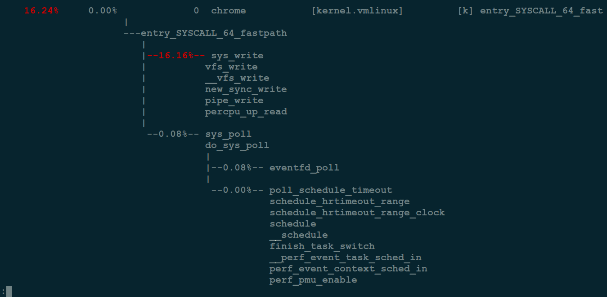
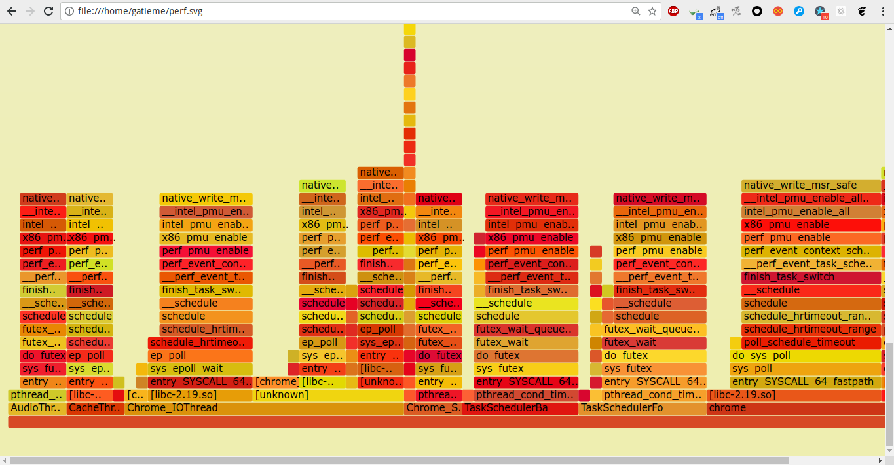
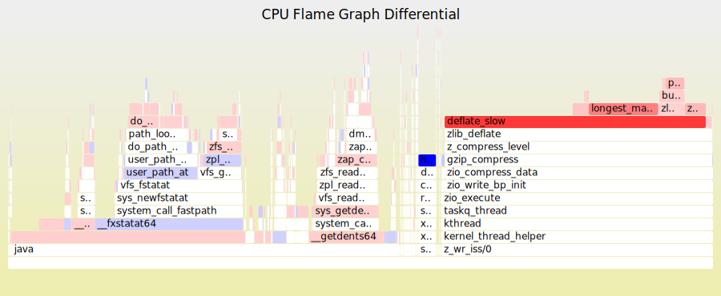
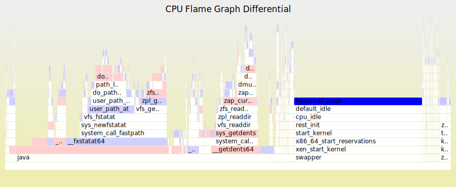
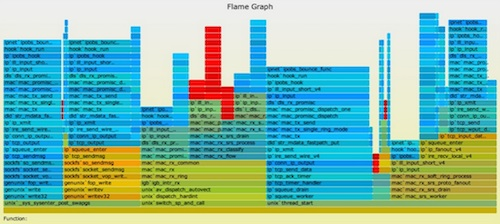
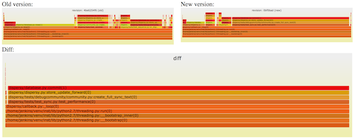

<!-- @import "[TOC]" {cmd="toc" depthFrom=1 depthTo=6 orderedList=false} -->

<!-- code_chunk_output -->

- [1. 火焰图简介](#1-火焰图简介)
  - [1.1. 火焰图](#11-火焰图)
  - [1.2. On/Off-CPU 火焰图](#12-onoff-cpu-火焰图)
  - [1.3. 火焰图可视化生成器](#13-火焰图可视化生成器)
- [2. 用 perf 生成火焰图](#2-用-perf-生成火焰图)
  - [2.1. perf 采集数据](#21-perf-采集数据)
  - [2.2. 生成火焰图](#22-生成火焰图)
- [3. 解析火焰图](#3-解析火焰图)
  - [3.1. 火焰图的含义](#31-火焰图的含义)
  - [3.2. 互动性](#32-互动性)
  - [3.3. 局限](#33-局限)
  - [3.4. 浏览器的火焰图](#34-浏览器的火焰图)
- [4. 红蓝分叉火焰图](#4-红蓝分叉火焰图)
  - [4.1. 红蓝差分火焰图示例](#41-红蓝差分火焰图示例)
  - [4.2. 红蓝差分火焰图简介](#42-红蓝差分火焰图简介)
  - [4.3. 生成红/蓝差分火焰图](#43-生成红蓝差分火焰图)
  - [4.4. 不足之处](#44-不足之处)
  - [4.5. CPI 火焰图](#45-cpi-火焰图)
  - [4.6. 其他的差分火焰图](#46-其他的差分火焰图)
  - [4.7. 总结](#47-总结)
- [5. 参考](#5-参考)

<!-- /code_chunk_output -->

# 1. 火焰图简介

软件的性能分析, 往往需要查看 `CPU` 耗时, 了解瓶颈在哪里.

火焰图(`flame graph`) 是性能分析的利器

让我们回想一下我们一般是如何调试程序的 : 通常是在没有数据的情况下依靠主观臆断来瞎蒙, 而不是考虑问题到底是什么引起的!

毫无疑问, 调优程序性能问题的时候, 同样需要对症下药. 好消息是 [`Brendan D. Gregg`]((http://www.brendangregg.com/perf.html#FlameGraphs) 发明了[火焰图](http://www.brendangregg.com/flamegraphs.html)

## 1.1. 火焰图

常见的火焰图类型有 [`On-CPU`](http://www.brendangregg.com/FlameGraphs/cpuflamegraphs.html), [`Off-CPU`](http://www.brendangregg.com/FlameGraphs/offcpuflamegraphs.html), 还有 [`Memory`](http://www.brendangregg.com/FlameGraphs/memoryflamegraphs.html), [`Hot/Cold`](http://www.brendangregg.com/FlameGraphs/hotcoldflamegraphs.html), [`Differential`](http://www.brendangregg.com/blog/2014-11-09/differential-flame-graphs.html) 等等.

关于火焰图详细的介绍可以参考 [`Blazing Performance with Flame Graphs`](http://www.slideshare.net/brendangregg/blazing-performance-with-flame-graphs), 简而言之 : 整个图形看起来就像一团跳动的火焰, 这也正是其名字的由来. 燃烧在火苗尖部的就是 `CPU` 正在执行的操作, 不过需要说明的是颜色是随机的, 本身并没有特殊的含义, 纵向表示调用栈的深度, 横向表示消耗的时间. 因为调用栈在横向会按照字母排序, 并且同样的调用栈会做合并, 所以一个格子的宽度越大越说明其可能是瓶颈. 综上所述, 主要就是看那些比较宽大的火苗, 特别留意那些类似平顶山的火苗.

要生成火焰图, 必须要有一个顺手的 [`Tracer`](http://www.brendangregg.com/blog/2015-07-08/choosing-a-linux-tracer.html) 工具, 如果操作系统是 `Linux` 的话, 那么选择通常是 [`perf`](http://www.brendangregg.com/perf.html), [`systemtap`](https://sourceware.org/systemtap/) 中的一种. 其中 `perf` 相对更常用, 因为它时 `Linux Kernel` 内置的性能调优工具, 多数 `Linux` 都包含了它, 有兴趣的读者稍后可以参考 [`Linux Profiling at Netflix`](http://www.slideshare.net/brendangregg/scale2015-linux-perfprofiling) 中的介绍, 尤其是里面关于如何处理 `Broken stacks` 问题的描述, 建议多看几遍, 而 `systemtap` 相对更强大, 不过缺点是你需要先学会它本身的编程语言.

早期火焰图在 `Nginx`  和 社区比较活跃, 如果你是一个 `Nginx` 开发或者优化人员, 那么我强烈推荐你使用 [春哥](http://weibo.com/agentzh) 的 [`nginx-systemtap-toolkit`](https://github.com/openresty/nginx-systemtap-toolkit), 乍一看名字你可能会误以为这个工具包是 `nginx` 专用的, 实际上这里面很多工具适用于任何 `C/CPP` 语言编写的程序: 

| 程序 | 功能 |
|:---:|:----:|
| [`sample-bt`](https://github.com/openresty/nginx-systemtap-toolkit#sample-bt) | 用来生成 On-CPU 火焰图的采样数据([`DEMO`](http://openresty.org/download/user-flamegraph.svg)) |
| [`sample-bt-off-cpu`](https://github.com/openresty/nginx-systemtap-toolkit#sample-bt-off-cpu) | 用来生成 Off-CPU 火焰图的采样数据 ([`DEMO`](http://agentzh.org/misc/flamegraph/off-cpu-lua-resty-mysql.svg)) |

## 1.2. On/Off-CPU 火焰图

那么什么时候使用 `On-CPU` 火焰图? 什么时候使用 `Off-CPU` 火焰图呢?

取决于当前的瓶颈到底是什么, 如果是 `CPU` 则使用 `On-CPU` 火焰图, 如果是 `IO` 或锁则使用 `Off-CPU` 火焰图. 如果无法确定, 那么可以通过压测工具来确认 : 通过压测工具看看能否让 `CPU` 使用率趋于饱和, 如果能那么使用 `On-CPU` 火焰图, 如果不管怎么压, `CPU` 使用率始终上不来, 那么多半说明程序被 `IO`  或锁卡住了, 此时适合使用 `Off-CPU` 火焰图.

如果还是确认不了, 那么不妨 `On-CPU` 火焰图和 `Off-CPU` 火焰图都搞搞, 正常情况下它们的差异会比较大, 如果两张火焰图长得差不多, 那么通常认为 `CPU` 被**其它进程**抢占了.

在**采样数据**的时候, 最好通过压测工具对程序持续施压, 以便采集到足够的样本. 关于压测工具的选择, 如果选择 `ab` 的话, 那么务必记得开启 `-k` 选项, 以避免耗尽系统的可用端口. 此外, 我建议尝试使用诸如 [`wrk`](https://github.com/wg/wrk) 之类更现代的压测工具.

## 1.3. 火焰图可视化生成器

`Brendan D. Gregg` 的 `Flame Graph` 工程实现了一套生成火焰图的脚本.

`Flame Graph` 项目位于 `GitHub`上

>https://github.com/brendangregg/FlameGraph

用 `git` 将其 `clone`下来

```cpp
git clone https://github.com/brendangregg/FlameGraph.git
```

生成和创建火焰图需要如下**几个步骤**

| 流程 | 描述 | 脚本 |
|:---:|:---:|:----:|
| **捕获堆栈** | 使用 `perf/systemtap/dtrace` 等工具抓取程序的运行堆栈 | `perf/systemtap/dtrace` |
| **折叠堆栈** | `trace` 工具抓取的系统和程序运行每一时刻的堆栈信息, 需要对他们进行分析组合, 将重复的堆栈累计在一起, 从而体现出负载和关键路径 | `FlameGraph` 中的 `stackcollapse` 程序 |
| **生成火焰图** | 分析 stackcollapse 输出的堆栈信息生成火焰图 | `flamegraph.pl` |

不同的 trace 工具抓取到的**信息不同**, 因此 `Flame Graph` 提供了一系列的 `stackcollapse` **折叠堆栈工具**.

| `stackcollapse` | 描述 |
|:---------------:|:----:|
| stackcollapse.pl | for **DTrace** stacks |
| stackcollapse-perf.pl | for Linux perf_events "**perf script**" output |
| stackcollapse-pmc.pl | for FreeBSD **pmcstat -G** stacks |
| stackcollapse-stap.pl | for **SystemTap** stacks |
| stackcollapse-instruments.pl | for XCode Instruments |
| stackcollapse-vtune.pl | for Intel VTune profiles |
| stackcollapse-ljp.awk | for Lightweight Java Profiler |
| stackcollapse-jstack.pl | for Java jstack(1) output |
| stackcollapse-gdb.pl | for gdb(1) stacks |
| stackcollapse-go.pl | for Golang pprof stacks |
| stackcollapse-vsprof.pl | for Microsoft Visual Studio profiles |

# 2. 用 perf 生成火焰图

## 2.1. perf 采集数据

让我们从 `perf` 命令(`performance` 的缩写)讲起, 它是 `Linux` 系统原生提供的性能分析工具, 会返回 `CPU` 正在执行的函数名以及调用栈(`stack`)

```cpp
sudo perf record -F 99 -p 3887 -g -- sleep 30
```


`perf record` 表示采集系统事件, 
- 没有使用 `-e` 指定采集事件, 则默认采集 `cycles`(即 `CPU clock` 周期), 
- `-F 99` 表示每秒 `99` 次, 
- `-p 13204` 是进程号, 即对哪个进程进行分析, 
- `-g` 表示记录调用栈, 
- `sleep 30` 则是持续 `30` 秒.

>`-F` 指定采样频率为 `99Hz`(每秒`99`次), 如果 `99次` 都返回同一个函数名, 那就说明 `CPU` 这一秒钟都在执行同一个函数, 可能存在性能问题.

运行后会产生一个庞大的文本文件. 如果一台服务器有 `16` 个  `CPU`, **每秒抽样** `99` 次, 持续 `30` 秒, 就得到 `47,520` 个调用栈, 长达几十万甚至上百万行.

为了便于阅读, `perf record` 命令可以统计**每个调用栈**出现的**百分比**, 然后**从高到低排列**.

```cpp
perf report -n --stdio
```



## 2.2. 生成火焰图

首先用 `perf script` 工具对 `perf.data` 进行解析

```cpp
# 生成折叠后的调用栈
perf script -i perf.data &> perf.unfold
```

将解析出来的信息存下来, 供生成火焰图

首先用 `stackcollapse-perf.pl` 将 perf 解析出的内容 `perf.unfold` 中的符号进行折叠 :

```cpp
# 生成火焰图
./stackcollapse-perf.pl perf.unfold &> perf.folded
```

最后生成 `svg` 图

```cpp
./flamegraph.pl perf.folded > perf.svg
```

我们可以使用管道将上面的流程简化为一条命令

```cpp
perf script | FlameGraph/stackcollapse-perf.pl | FlameGraph/flamegraph.pl > process.svg
```



# 3. 解析火焰图

最后就可以用浏览器打开火焰图进行分析啦.

## 3.1. 火焰图的含义

火焰图是基于 `stack` 信息生成的 `SVG` 图片, 用来展示 `CPU` 的调用栈. 

`y` 轴表示调用栈, 每一层都是一个函数. 调用栈越深, 火焰就越高, 顶部就是正在执行的函数, 下方都是它的父函数.

`x` 轴表示抽样数, 如果一个函数在 `x` 轴占据的宽度越宽, 就表示它被抽到的次数多, 即执行的时间长. 注意, `x` 轴不代表时间, 而是所有的调用栈合并后, 按字母顺序排列的.

火焰图就是看顶层的哪个函数占据的宽度最大. 只要有 "平顶"(`plateaus`), 就表示该函数可能存在性能问题. 

颜色没有特殊含义, 因为火焰图表示的是 `CPU` 的繁忙程度, 所以一般选择暖色调.

## 3.2. 互动性

火焰图是 `SVG` 图片, 可以与用户互动.

* 鼠标悬浮

火焰的每一层都会标注函数名, 鼠标悬浮时会显示完整的函数名、抽样抽中的次数、占据总抽样次数的百分比. 下面是一个例子.

mysqld'JOIN::exec (272,959 samples, 78.34 percent)

* 点击放大

在某一层点击, 火焰图会水平放大, 该层会占据所有宽度, 显示详细信息. 

左上角会同时显示 "Reset Zoom", 点击该链接, 图片就会恢复原样.

* 搜索

按下 Ctrl + F 会显示一个搜索框, 用户可以输入关键词或正则表达式, 所有符合条件的函数名会高亮显示.

## 3.3. 局限

两种情况下, 无法画出火焰图, 需要修正系统行为.

* 调用栈不完整

当调用栈过深时, 某些系统只返回前面的一部分(比如前10层). 

* 函数名缺失

有些函数没有名字, 编译器只用内存地址来表示(比如匿名函数). 

## 3.4. 浏览器的火焰图

`Chrome` 浏览器可以生成页面脚本的火焰图, 用来进行 `CPU` 分析.

打开开发者工具, 切换到 `Performance` 面板. 然后, 点击"录制" 按钮, 开始记录数据. 这时, 可以在页面进行各种操作, 然后停止"录制".

这时, 开发者工具会显示一个时间轴. 它的下方就是火焰图.

浏览器的火焰图与标准火焰图有两点差异 : 它是倒置的(即调用栈最顶端的函数在最下方); `x` 轴是时间轴, 而不是抽样次数.

# 4. 红蓝分叉火焰图

参考 http://www.brendangregg.com/blog/2014-11-09/differential-flame-graphs.html

幸亏有了 `CPU` 火焰图(`flame graphs`), `CPU` 使用率的问题一般都比较好定位. 但要处理性能回退问题, 就要在修改前后或者不同时期和场景下的火焰图之间, 不断切换对比, 来找出问题所在, 这感觉就是像在太阳系中搜寻冥王星. 虽然, 这种方法可以解决问题, 但我觉得应该会有更好的办法.

所以, 下面就隆重介绍 **红/蓝差分火焰图(red/blue differential flame graphs)**

## 4.1. 红蓝差分火焰图示例



上面是[一副交互式 `SVG` 格式图片](http://www.brendangregg.com/blog/images/2014/zfs-flamegraph-diff.svg). 图中使用了两种颜色来表示状态, 红色表示增长, 蓝色表示衰减.

这张火焰图中各火焰的形状和大小都是和第二次抓取的 `profile` 文件对应的 `CPU` 火焰图是相同的. (其中, `y` 轴表示栈的深度, `x` 轴表示样本的总数, 栈帧的宽度表示了 `profile` 文件中该函数出现的比例, 最顶层表示正在运行的函数, 再往下就是调用它的栈).

在下面这个案例展示了, 在系统升级后, 一个工作载荷的 `CPU` 使用率上升了. 下面是对应的 `CPU` 火焰图(`SVG` 格式)


通常, 在标准的火焰图中栈帧和栈塔的颜色是随机选择的. 而在红/蓝差分火焰图中, 使用不同的颜色来表示两个 `profile` 文件中的差异部分.

在第二个 `profile` 中 `deflate_slow( )` 函数以及它后续调用的函数运行的次数要比前一次更多, 所以在上图中这个栈帧被标为了红色. 可以看出问题的原因是ZFS的压缩功能被启用了, 而在系统升级前这项功能是关闭的.

这个例子过于简单, 我甚至可以不用差分火焰图也能分析出来. 但想象一下, 如果是在分析一个微小的性能下降, 比如说小于5%, 而且代码也更加复杂的时候, 问题就为那么好处理了.

## 4.2. 红蓝差分火焰图简介

这个事情我已经讨论了好几年了, 最终我自己编写了一个我个人认为有价值的实现. 它的工作原理是这样的 :

1.	抓取修改前的堆栈 `profile1` 文件

2.	抓取修改后的堆栈 `profile2` 文件

3.	使用 `profile2` 来生成火焰图. (这样栈帧的宽度就是以`profile2` 文件为基准的)

4.	使用 "2-1" 的差异来对火焰图重新上色. 上色的原则是, 如果栈帧在 `profile2` 中出现出现的次数更多, 则标为红色, 否则标为蓝色. 色彩是根据修改前后的差异来填充的.

这样做的目的是, 同时使用了修改前后的 `profile` 文件进行对比, 在进行功能验证测试或者评估代码修改对性能的影响时, 会非常有用. 新的火焰图是基于修改后的 `profile` 文件生成(所以栈帧的宽度仍然显示了当前的CPU消耗). 通过颜色的对比, 就可以了解到系统性能差异的原因. 

只有对性能产生直接影响的函数才会标注颜色(比如说, 正在运行的函数), 它所调用的子函数不会重复标注. 

## 4.3. 生成红/蓝差分火焰图

作者的 `GitHub` 仓库 `FlameGrdph` 中实现了一个程序脚本, `difffolded.pl` 用来生成红蓝差分火焰图. 为了展示工具是如何工作的, 用 	Linux perf_events	 来演示一下操作步骤. 你也可以使用其他 `profiler/tracer`.

*	抓取修改前的profile 1文件:

```cpp
#	抓取数据
perf record -F 99 -a -g -- sleep 30
#	解析数据生成堆栈信息
perf script > out.stacks1
#	折叠堆栈
./stackcollapse-perf.pl ../out.stacks1 > out.folded1
```

*	一段时间后 (或者程序代码修改后), 抓取 	profile 2` 文件

```cpp
#	抓取数据
perf record -F 99 -a -g -- sleep 30
#	解析数据生成堆栈信息
perf script > out.stacks2
#	折叠堆栈
./stackcollapse-perf.pl ../out.stacks2 > out.folded2
```

生成红蓝差分火焰图

```cpp
./difffolded.pl out.folded1 out.folded2 | ./flamegraph.pl > diff2.svg
```

`difffolded.pl` 只能对 "折叠" 过的堆栈 `profile` 文件进行操作, [折叠操作](https://github.com/brendangregg/FlameGraph) 是由前面的 `stackcollapse` 系列脚本完成的. 脚本共输出 `3` 列数据, 其中一列代表折叠的调用栈, 另两列为修改前后 `profile` 文件的统计数据.

```cpp
func_a;func_b;func_c 31 33
[...]
```

在上面的例子中 "funca()->funcb()->func_c()" 代表调用栈, 这个调用栈在 	profile1` 文件中共出现了 `31` 次, 在 `profile2` 文件中共出现了 `33` 次. 然后, 使用 `flamegraph.pl` 脚本处理这 `3` 列数据, 会自动生成一张红/蓝差分火焰图.

再介绍一些有用的选项: 

| 其他选项 | 描述 |
|:-------:|:---:|
| difffolded.pl -n | 这个选项会把两个profile文件中的数据规范化, 使其能相互匹配上. 如果你不这样做, 抓取到所有栈的统计值肯定会不相同, 因为抓取的时间和CPU负载都不同. 这样的话, 看上去要么就是一片红(负载增加), 要么就是一片蓝(负载下降). -n选项对第一个profile文件进行了平衡, 这样你就可以得到完整红/蓝图谱 |
| difffolded.pl -x | 这个选项会把16进制的地址删掉.  profiler时常会无法将地址转换为符号, 这样的话栈里就会有16进制地址. 如果这个地址在两个profile文件中不同, 这两个栈就会认为是不同的栈, 而实际上它们是相同的. 遇到这样的问题就用-x选项搞定 |
| flamegraph.pl --negate | 用于颠倒红/蓝配色.  在下面的章节中, 会用到这个功能 |

## 4.4. 不足之处

虽然红/蓝差分火焰图很有用, 但实际上还是有一个问题 : 如果一个代码执行路径完全消失了, 那么在火焰图中就找不到地方来标注蓝色. 你只能看到当前的 `CPU` 使用情况, 而不知道为什么会变成这样.

一个办法是, 将对比顺序颠倒, 画一个相反的差分火焰图. 例如 :



上面的火焰图是以修改前的 `profile` 文件为基准, 颜色表达了将要发生的情况. 右边使用蓝色高亮显示的部分, 从中可以看出修改后 `CPU Idle` 消耗的 `CPU` 时间会变少. (其实, 通常会把 `cpuidle` 给过滤掉, 使用命令行 `grep -v cpuidle`)

图中把消失的代码也突显了出来(或者应该是说, 没有突显), 因为修改前并没有使能压缩功能, 所以它没有出现在修改前的 `profile` 文件了, 也就没有了被表为红色的部分.

下面是对应的命令行: 

```cpp
./difffolded.pl out.folded2 out.folded1 | ./flamegraph.pl --negate > diff1.svg
```

这样, 把前面生成 `diff2.svg` 一并使用, 我们就能得到:

| 火焰图信息 | 描述 |
|:--------:|:---:|
| diff1.svg | 宽度是以修改前profile文件为基准, 颜色表明将要发生的情况 |
| diff2.svg | 宽度是以修改后profile文件为基准, 颜色表明已经发生的情况 |

如果是在做功能验证测试, 我会同时生成这两张图. 

## 4.5. CPI 火焰图

这些脚本开始是被使用在[CPI火焰图](http://www.brendangregg.com/blog/2014-10-31/cpi-flame-graphs.html) 的分析上. 与比较修改前后的 `profile` 文件不同, 在分析 `CPI` 火焰图时, 可以分析 `CPU` 工作周期与停顿周期的差异变化, 这样可以凸显出CPU的工作状态来.

## 4.6. 其他的差分火焰图



也有其他人做过类似的工作. [Robert Mustacchi](http://dtrace.org/blogs/rm) 在不久前也做了一些尝试, 他使用的方法类似于代码检视时的标色风格: 只显示了差异的部分, 红色表示新增(上升)的代码路径, 蓝色表示删除(下降)的代码路径. 一个关键的差别是栈帧的宽度只体现了差异的样本数. 右边是一个例子. 这个是个很好的主意, 但在实际使用中会感觉有点奇怪, 因为缺失了完整profile文件的上下文作为背景, 这张图显得有些难以理解. 



Cor-Paul Bezemer也制作了一种差分显示方法[flamegraphdiff](http://corpaul.github.io/flamegraphdiff/), 他同时将3张火焰图放在同一张图中, 修改前后的标准火焰图各一张, 下面再补充了一张差分火焰图, 但栈帧宽度也是差异的样本数.  上图是一个[例子](http://corpaul.github.io/flamegraphdiff/demos/dispersy/dispersy_diff.html). 在差分图中将鼠标移到栈帧上, 3张图中同一栈帧都会被高亮显示. 这种方法中补充了两张标准的火焰图, 因此解决了上下文的问题. 

我们3人的差分火焰图, 都各有所长. 三者可以结合起来使用: Cor-Paul方法中上方的两张图, 可以用我的diff1.svg 和 diff2.svg. 下方的火焰图可以用Robert的方式. 为保持一致性, 下方的火焰图可以用我的着色方式: 蓝->白->红. 

火焰图正在广泛传播中, 现在很多公司都在使用它. 如果大家知道有其他的实现差分火焰图的方式, 我也不会感到惊讶. (请在评论中告诉我)

## 4.7. 总结

如果你遇到了性能回退问题, 红/蓝差分火焰图是找到根因的最快方式. 这种方式抓取了两张普通的火焰图, 然后进行对比, 并对差异部分进行标色: 红色表示上升, 蓝色表示下降.  差分火焰图是以当前(“修改后”)的profile文件作为基准, 形状和大小都保持不变. 因此你通过色彩的差异就能够很直观的找到差异部分, 且可以看出为什么会有这样的差异. 

差分火焰图可以应用到项目的每日构建中, 这样性能回退的问题就可以及时地被发现和修正. 

via: http://www.brendangregg.com/blog/2014-11-09/differential-flame-graphs.html


# 5. 参考

| CSDN | GitHub |
|:----:|:------:|
| [ALinux下用火焰图进行性能分析](http://blog.csdn.net/gatieme/article/details/78885908) | [`AderXCoding/system/tools`](https://github.com/gatieme/AderXCoding/tree/master/system/tools) |

[使用linux perf工具生成java程序火焰图](https://www.cnblogs.com/CarpenterLee/p/7467283.html)

[使用perf生成Flame Graph(火焰图)](http://blog.csdn.net/justlinux2010/article/details/11520829?utm_source=tuicool&utm_medium=referral)

[大神brendangregg的站点](http://www.brendangregg.com/perf.html#FlameGraphs)
