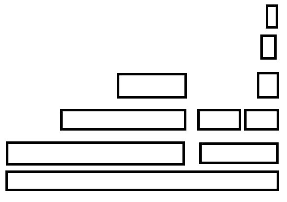
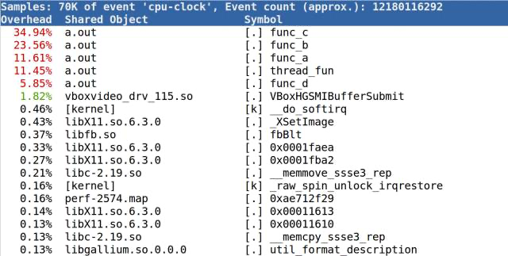

# 简介

火焰图（Flame Graph）是由Linux性能优化大师Brendan Gregg发明的，和所有其他的trace和profiling方法不同的是，Flame Graph以一个全局的视野来看待时间分布，它从底部往顶部，列出所有可能的调用栈。

其他的呈现方法，一般只能列出单一的调用栈或者非层次化的时间分布。

根据系统性能的指标可以将火焰图分为多种，常见的有on-cpu和off-cpu两种火焰图

## 火焰图示例

以典型的分析CPU时间花费到哪个函数的`on-cpu`火焰图为例来展开。

CPU火焰图中的**每一个方框**是**一个函数**，**方框的长度**，代表了它的**执行时间**，所以越宽的函数，执行越久。火焰图的**楼层每高一层**，就是**更深一级的函数被调用**，**最顶层的函数**，是**叶子函数**。


## 生成过程

火焰图的生成过程是：

1. 先trace系统，获取系统的profiling数据 
2. 用脚本来绘制

系统的profiling数据获取，可以选择最流行的perf record，而后把采集的数据进行加工处理，绘制为火焰图。

其中第二步的绘制火焰图的脚本程序，通过如下方式获取:

```
git clone https://github.com/brendangregg/FlameGraph
```

# 火焰图案例

直接从最简单的例子开始说起, 代码如下:

```cpp
c(){
    for(int i=0;i<1000;i++);
}

b(){
    for(int i=0;i<1000;i++);
    c();
}

a(){
    for(int i=0;i<1000;i++);
    b();
}
```

则这三个函数，在火焰图中呈现的样子为：


`a()`的`2/3`的时间花在`b()`上面，而`b()`的`1/3`的时间花在`c()`上面。很多个这样的`a->b->c`的火苗堆在一起，就构成了火焰图。



进一步理解火焰图的最好方法仍然是通过一个实际的案例，下面的程序**创建2个线程**，两个线程的handler都是`thread_fun()`，之后`thread_fun()`调用`fun_a()`、`fun_b()`、`fun_c()`，而`fun_a()`又会调用`fun_d()`：

```cpp
#include <pthread.h>

func_d(){
    int i;
    for(i=0;i<50000;i++);
}

func_a(){
    int i;
    for(i=0;i<100000;i++);
    func_d();
}

func_b(){
    int i;
    for(i=0;i<200000;i++);
}

func_c(){
    int i;
    for(i=0;i<300000;i++);
}

void* thread_fun(void* param){
    while(1) {
        int i;
        for(i=0;i<100000;i++);
        
        func_a();
        func_b();
        func_c();
    }
}

int main(void){
    pthread_t tid1,tid2;
    int ret;
    
    ret=pthread_create(&tid1,NULL,thread_fun,NULL);
    if(ret==-1){
        ...
    }
    
    ret=pthread_create(&tid2,NULL,thread_fun,NULL);
    ...
    
    if(pthread_join(tid1,NULL)!=0){
        ...
    }
    
    if(pthread_join(tid2,NULL)!=0){
        ...
    }
    
    return 0;
}
```

先看看不用火焰图的缺点在哪里。

如果不用火焰图，我们也可以用类似perf top这样的工具分析出来CPU时间主要花费在哪里了：

```
$gcc exam.c -pthread
$./a.out&
$sudo perf top
```

perf top的显示结果如下：



perf top提示出来了fun_a()、fun_b()、fun_c(), fun_d()，thread_func()这些函数内部的代码是CPU消耗大户，但是它缺乏一个全局的视野，我们无法看出全局的调用栈，也弄不清楚这些函数之间的关系。火焰图则不然，我们用下面的命令可以生成火焰图（以root权限运行）：

```
# 采集信息
# perf record -F 99 -a -g -- sleep 60

# 查看采集到的信息
# perf script | ./stackcollapse-perf.pl > out.perf-folded

# 生成火焰图
./flamegraph.pl out.perf-folded > perf-kernel.svg
```

`-F 99`表示每秒99次，`-p 13204`是进程号，即对哪个进程进行分析，`-g`表示**记录调用栈**，`-a`表示所有进程, `sleep 60`则是持续60秒。

上述程序捕获系统的行为60秒钟，最后调用flamegraph.pl生成一个火焰图`perf-kernel.svg`，用看图片的工具就可以打开这个svg。


上述火焰图显示出了a.out中，thread_func()、func_a()、func_b()、fun_c()和func_d()的时间分布。

从上述火焰图可以看出，虽然thread_func()被两个线程调用，但是由于thread_func()之前的调用栈是一样的，所以2个线程的thread_func()调用是合并为同一个方框的。

# 更深阅读

除了on-cpu的火焰图以外，off-cpu的火焰图，对于分析系统堵在IO、SWAP、取得锁方面的帮助很大，有利于分析系统在运行的时候究竟在等待什么，系统资源之间的彼此伊伴。

比如，下面的火焰图显示，nginx的吞吐能力上不来的很多程度原因在于sem_wait()等待信号量。


上图摘自Yichun Zhang (agentzh)的《Introduction to offCPU Time Flame Graphs》。

关于火焰图的更多细节和更多种火焰图各自的功能，可以访问：

官网: http://www.brendangregg.com/flamegraphs.html

on-cpu资料: http://www.brendangregg.com/FlameGraphs/cpuflamegraphs.html

off-cpu资源: http://www.brendangregg.com/FlameGraphs/offcpuflamegraphs.html

# 参考

https://mp.weixin.qq.com/s/Kz4tii8O4Nk-S4SV4kFYPA