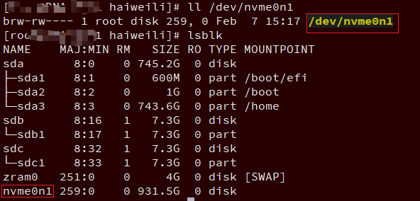

NVMe 本身是一个块设备, 因此NVMe的驱动也是遵循块设备的驱动架构. 本文通过两部分介绍NVMe的驱动程序, 一部分是操作系统如何创建NVMe块设备, 另外一部分是分析一下NVMe的主要流程, 包括读写流程和管理流程等.

# 创建NVMe块设备

对于 Linux 的**块设备**来说, 其主要的是通过 `device_add_disk` 或者 `add_disk` 函数(后者是对前者的简单包装)来向操作系统**添加一个设备实例**. 其基本原理就是通过调用该函数, 就会创建在 `/dev` 目录下看到的类似 **sdX** 的块设备.

NVMe 本身也是块设备, 自然也不会跳出这个大框架. 

首先从**硬件层面**上, **任何设备**必须通过**某个总线与CPU相连接**, NVMe 则正是通过 **PCIe 总线与CPU相连**. 


当然, 目前NVMe除了可以通过PCIe总线与CPU相连外, 还可以通过**其它通道**连接, 比如**FC**或者**IB**. 后者则是一种将 NVMe 设备从计算节点独立出来的方式, 也就是此时 **NVMe** 就**不再是一个卡设备**, 而是一个**独立机箱的设备**. 无论何种方式相连接, 其本质是一样等. 

然后是**操作系统**软件层面. 硬件的连通性是基础, 当硬件已经连通后, 就可以在 Linux 内核层面**发现设备**, 并**进行初始化**了. 软件层面的初始化有**两种情况**:

* 一种是计算机**启动的时候**, 操作系统会**扫描总线上的设备**, 并完成**初始化**；
* 另外一种情况是设备在**系统启动后连接的**, 此时需要**手动触发扫描**的过程. 

与其它块设备类似, NVMe 设备初始化完成后会在 `/dev` 目录下出现一个文件. NVMe 设备会出现一个形如 nvmeXnY 的设备文件. 如图所示, 红色方框中的为一个NVMe块设备. 



上一篇内容中, 在驱动加载过程中(系统启动), 会**调用总线**的 `probe` 函数, 如果总线没有 `probe` 函数, 则调用**设备驱动**的 `probe` 函数

```cpp
// drivers/pci/pci-driver.c
// pci 总线的 ops
struct bus_type pci_bus_type = {
    .probe| |       = pci_device_probe,
}

// drivers/nvme/host/pci.c
// nvme 驱动的 ops
static struct pci_driver nvme_driver = {
    .probe| |       = nvme_probe,
}
```

那问题来了，PCI Bus 是怎么将 nvme driver 匹配到对应的 NVMe 设备的呢？

系统启动时，BIOS 会枚举整个 PCI Bus, 之后将扫描到的设备通过 ACPI tables 传给操作系统。当操作系统加载时，PCI Bus 驱动则会根据此信息读取各个 PCI 设备的 Header Config 空间，从 class code 寄存器获得一个特征值。class code 就是 PCI bus 用来选择哪个驱动加载设备的唯一根据。NVMe Spec 定义 NVMe 设备的 Class code=0x010802h, 如下图。


无论是**系统启动**也好, 还是**手动触发扫描**也好, NVMe 发现设备的核心流程是一样的. 


## 核心实现分析

在上面初始化流程中需要重点关注的是 `nvme_alloc_ns` 函数的流程. 该函数完成了块设备创建、基本信息填充和块设备注册到内核等工作. 这部分片段完成了函数指针的初始化、命令队列初始化和设备名称的初始化等工作. 具体关于 `nvme_alloc_ns` 函数源代码的逻辑请自行阅读代码, 本文不再赘述. 

```cpp

```

在整个初始化流程中比较关键的是对**请求队列**(`request_queue`)中请求处理函数指针(`make_request_fn`)的初始化及**多队列函数集**(`mq_ops`)的初始化. 因为, 这里的函数正是 NVMe 区别于 SCSI 等类型设备数据处理流程的地方. 


# NVMe设备的IO流程

为了便于理解NVMe的处理流程, 我们给出了传统SCSI及NVMe数据处理的对比流程. 如图5所示, 整个流程是从通用块层的接口(submit_bio)开始的, 这个函数大家都非常清楚了. 


对于NVMe设备来说, 在初始化的时候初始化函数指针make_request_fn为nvme_queue_rq, 该函数就是NVMe驱动程序的请求处理接口. 该函数最终会将请求写入NVMe中的SQ队列当中, 并通知控制器处理请求. 


当 nvme.ko 已经加载完了(注册了nvme driver), 这时候如果有 nvme 盘插入 pcie 插槽, **pci** 会**自动识别**到, 并交给 nvme driver 去处理, 而 **nvme driver** 就是调用 `nvme_probe` 去处理这个新加入的设备.

