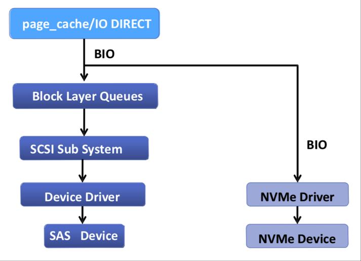
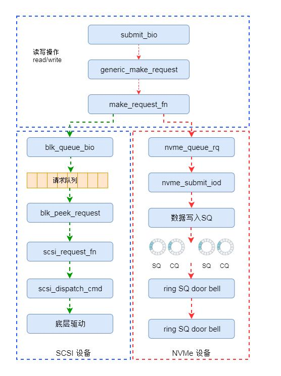

参照: https://blog.csdn.net/geshifei/article/details/120590183

机械硬盘时代, 由于其**随机访问**性能差, 内核开发者主要放在**缓存** I/O、**合并** I/O 等方面, 并**没有**考虑**多队列**的设计；而 Flash 的出现, 性能出现了戏剧性的反转, 因为**单个 CPU 每秒**发出 IO **请求数量**是**有限**的, 所以促进了 **IO 多队列**开发.

驱动中的队列创建, 通过函数 `kcalloc_node`(上节)

Queue 有的概念, 那就是**队列深度**,表示其能够放多少个成员. 在 NVMe 中, 这个队列深度是由 **NVMe SSD 决定**的, 存储在 **NVMe 设备的 BAR 空间**里.

队列用来存放 NVMe Command, NVMe Command 是主机与 SSD 控制器交流的基本单元, 应用的 I/O 请求也要转化成 NVMe Command.

不过需要注意的是, 就算有很多 CPU 发送请求, 但是**块层**并**不能保证都能处理完**, **将来**可能要**绕过 IO 栈的块层**, 不然瓶颈就是操作系统本身了.

当前 Linux 内核提供了 `blk_queue_make_request` 函数, 调用这个函数注册自定义的队列处理方法, 可以**绕过 io 调度和 io 队列**, 从而缩短 io 延时. Block 层收到上层发送的 IO 请求, 就会选择该方法处理, 如下图: 



从图中可 以看出 NVMe SSD I/O 路径并不经传统的块层.


为了便于理解 NVMe 的处理流程, 我们给出了传统 SCSI 及 NVMe 数据处理的对比流程. 如图所示, 整个流程是从**通用块层的接口**(`submit_bio`)开始的, 这个函数大家都非常清楚了.



对于 NVMe 设备来说, 在初始化的时候初始化函数指针 `make_request_fn` 为 `nvme_queue_rq`, 该函数就是 NVMe 驱动程序的**请求处理接口**. 该函数最终会**将请求**写入 NVMe 中的 **SQ 队列**当中, 并通知控制器处理请求.

```cpp
static const struct blk_mq_ops nvme_mq_admin_ops = {
	.queue_rq	= nvme_queue_rq, // 请求处理函数
	.complete	= nvme_pci_complete_rq, // 请求完成时调用的函数
	.init_hctx	= nvme_admin_init_hctx,
	.init_request	= nvme_pci_init_request,
	.timeout	= nvme_timeout,
};

static const struct blk_mq_ops nvme_mq_ops = {
	.queue_rq	= nvme_queue_rq,        // 请求处理函数
	.queue_rqs	= nvme_queue_rqs,       // 请求处理函数
	.complete	= nvme_pci_complete_rq, // 请求完成时调用的函数
	.commit_rqs	= nvme_commit_rqs,
	.init_hctx	= nvme_init_hctx,
	.init_request	= nvme_pci_init_request,
	.map_queues	= nvme_pci_map_queues,
	.timeout	= nvme_timeout,
	.poll		= nvme_poll,
};

// 中断处理函数
static irqreturn_t nvme_irq(int irq, void *data)
{
	struct nvme_queue *nvmeq = data;
	DEFINE_IO_COMP_BATCH(iob);

	if (nvme_poll_cq(nvmeq, &iob)) {
		if (!rq_list_empty(iob.req_list))
			nvme_pci_complete_batch(&iob);
		return IRQ_HANDLED;
	}
	return IRQ_NONE;
}

static irqreturn_t nvme_irq_check(int irq, void *data)
{
	struct nvme_queue *nvmeq = data;

	if (nvme_cqe_pending(nvmeq))
		return IRQ_WAKE_THREAD;
	return IRQ_NONE;
}
```


# DMA

PCIe 有个寄存器位 Bus Master Enable, 这个 bit 置 1 后, PCIe 设备就可以向 Host 发送 DMA Read Memory 和 DMA Write Memory 请求.

当 Host 的 driver 需要跟 PCIe 设备传输数据的时候, 只需要告诉 PCIe 设备存放数据的地址就可以.

NVMe Command 占用 64 个字节, 另外其 PCIe BAR 空间被映射到虚拟内存空间(其中包括用来通知 NVMe SSD Controller 读取 Command 的 Doorbell 寄存器).

NVMe 数据传输都是通过 NVMe Command, 而 NVMe Command 则存放在 NVMe Queue 中, 其配置如下图.


