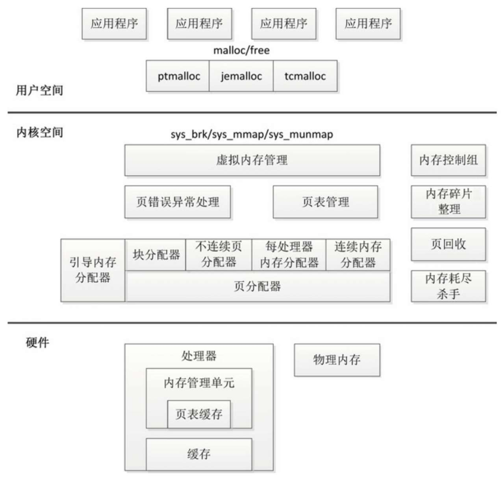

内存管理子系统的架构如图，分为用户空间、内核空间和硬件3个层面。

# 用户空间

应用程序使用 malloc() 申请内存，使用free()释放内存。

`malloc()` 和 `free()` 是 **glibc 库**的**内存分配器 ptmalloc** 提供的接口，ptmalloc 使用**系统调用** `brk` 或 `mmap` 向内核**以页为单位**申请内存，然后**划分**成**小内存块**分配给应用程序。

用户空间的内存分配器，除了 glibc 库的 ptmalloc，还有谷歌公司的 tcmalloc 和 FreeBSD 的jemalloc。

# 内核空间

（1）内核空间的基本功能。

**虚拟内存管理**负责从进程的**虚拟地址空间**分配**虚拟页**，`sys_brk` 用来**扩大或收缩堆**，`sys_mmap` 用来在**内存映射区域分配虚拟页**，`sys_munmap` 用来释放虚拟页。

内核使用延迟分配物理内存的策略，进程第一次访问虚拟页的时候，触发页错误异常，页错误异常处理程序从页分配器申请物理页，在进程的页表中把虚拟页映射到物理页。

页分配器负责分配物理页，当前使用的页分配器是伙伴分配器。

内核空间提供了把页划分成小内存块分配的块分配器，提供分配内存的接口kmalloc()和释放内存的接口kfree()，支持3种块分配器：SLAB分配器、SLUB分配器和SLOB分配器。

在内核初始化的过程中，页分配器还没准备好，需要使用临时的引导内存分配器分配内存。

（2）内核空间的扩展功能。

不连续页分配器提供了分配内存的接口vmalloc和释放内存的接口vfree，在内存碎片化的时候，申请连续物理页的成功率很低，可以申请不连续的物理页，映射到连续的虚拟页，即虚拟地址连续而物理地址不连续。

每处理器内存分配器用来为每处理器变量分配内存。

连续内存分配器（Contiguous Memory Allocator, CMA）用来给驱动程序预留一段连续的内存，当驱动程序不用的时候，可以给进程使用；当驱动程序需要使用的时候，把进程占用的内存通过回收或迁移的方式让出来，给驱动程序使用。

内存控制组用来控制进程占用的内存资源。

当内存碎片化的时候，找不到连续的物理页，内存碎片整理（“memory compaction”的意译，直译为“内存紧缩”）通过迁移的方式得到连续的物理页。

在内存不足的时候，页回收负责回收物理页，对于没有后备存储设备支持的匿名页，把数据换出到交换区，然后释放物理页；对于有后备存储设备支持的文件页，把数据写回存储设备，然后释放物理页。如果页回收失败，使用最后一招：内存耗尽杀手（OOM killer, Out-of-Memory killer），选择进程杀掉。

# 硬件层面

处理器包含一个称为内存管理单元（Memory ManagementUnit, MMU）的部件，负责把虚拟地址转换成物理地址。

内存管理单元包含一个称为页表缓存（Translation LookasideBuffer, TLB）的部件，保存最近使用过的页表映射，避免每次把虚拟地址转换成物理地址都需要查询内存中的页表。

为了解决处理器的执行速度和内存的访问速度不匹配的问题，在处理器和内存之间增加了缓存。缓存通常分为一级缓存和二级缓存，为了支持并行地取指令和取数据，一级缓存分为数据缓存和指令缓存。