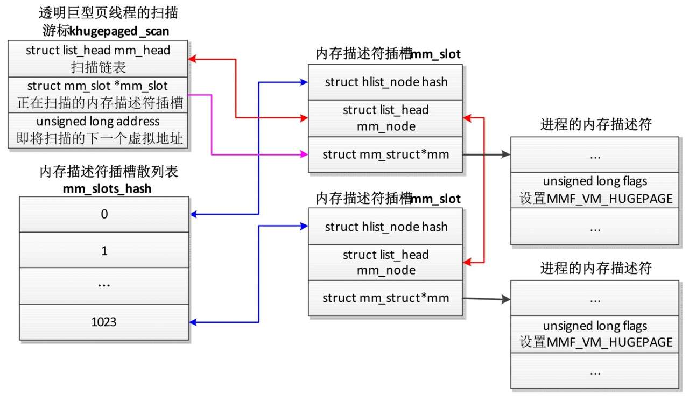
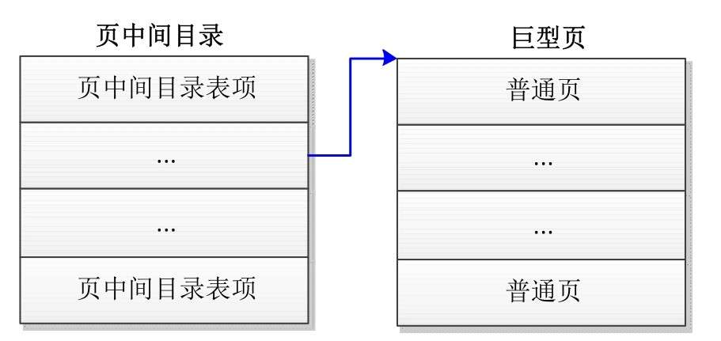
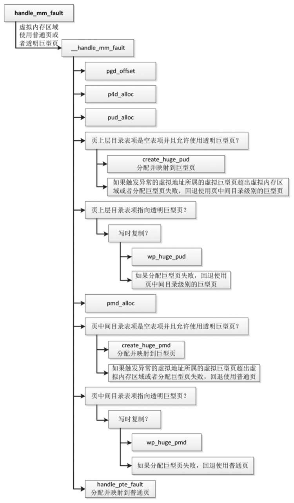
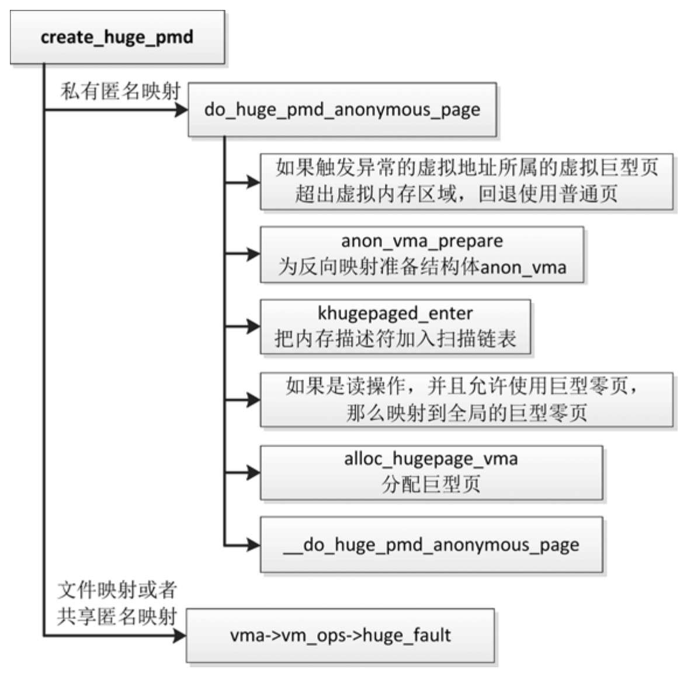
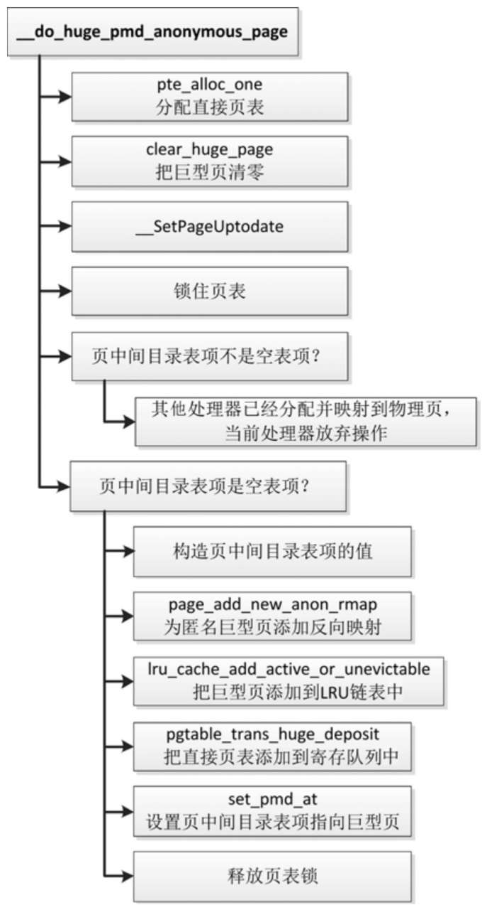
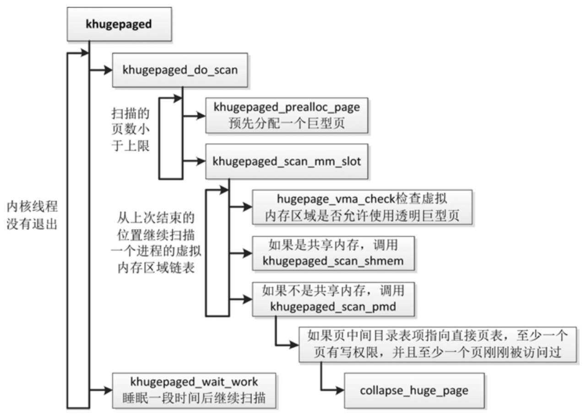
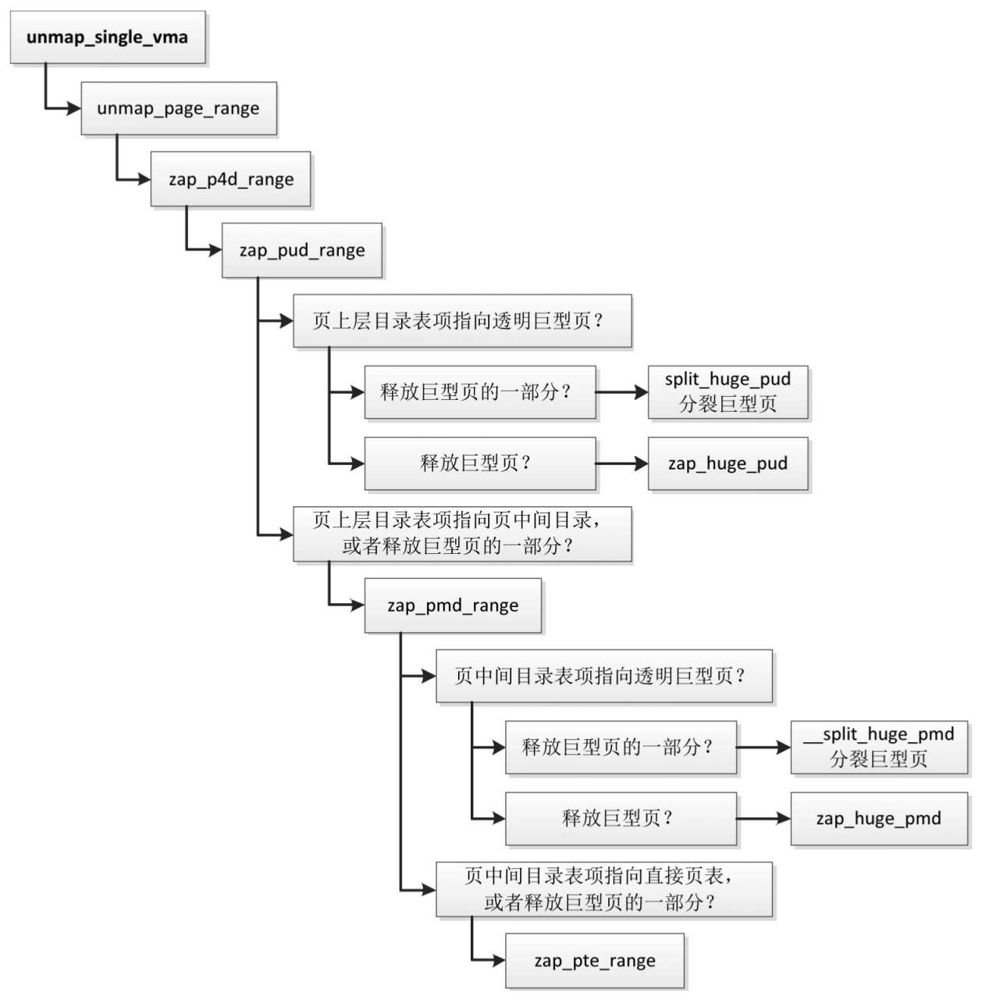
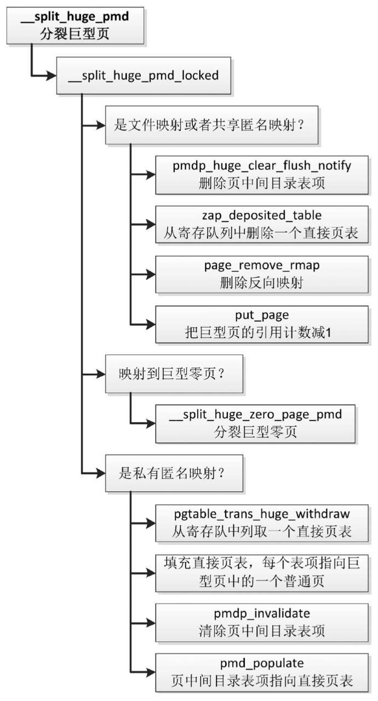

<!-- @import "[TOC]" {cmd="toc" depthFrom=1 depthTo=6 orderedList=false} -->

<!-- code_chunk_output -->

- [1. 使用方法](#1-使用方法)
  - [1.1. 启用/禁用透明大页](#11-启用禁用透明大页)
    - [1.1.1. 内核配置](#111-内核配置)
    - [1.1.2. 内核启动参数](#112-内核启动参数)
    - [1.1.3. 运行时设置](#113-运行时设置)
  - [1.2. 内存碎片整理策略](#12-内存碎片整理策略)
  - [1.3. 透明大页的长度](#13-透明大页的长度)
  - [1.4. 扫描线程](#14-扫描线程)
  - [1.5. 系统调用 madvise](#15-系统调用-madvise)
- [2. 实现原理](#2-实现原理)
  - [2.1. vma vm_flags](#21-vma-vm_flags)
  - [2.2. 使用条件](#22-使用条件)
  - [2.3. 透明大页映射](#23-透明大页映射)
    - [2.3.1. page fault](#231-page-fault)
      - [2.3.1.1. 页中间目录大页](#2311-页中间目录大页)
    - [2.3.2. khugepaged](#232-khugepaged)
  - [2.4. 释放大页一部分](#24-释放大页一部分)
  - [2.5. 处理流程](#25-处理流程)
    - [2.5.1. 分配透明大页](#251-分配透明大页)
      - [2.5.1.1. 分配透明大页](#2511-分配透明大页)
    - [2.5.2. 透明大页线程](#252-透明大页线程)
    - [2.5.3. 释放透明大页](#253-释放透明大页)

<!-- /code_chunk_output -->

**透明大页**(`Transparent Huge Page`, **THP**) 对进程是透明的, 如果**虚拟内存区域足够大**, 并且允许使用**透明大页**, 那么内核在分配内存的时候**首先选择分配大页**, 如果分配大页失败, **回退分配普通页**.

透明大页(transparent hugepages)和普通大页的区别是

* 第一, **透明大页** 可以**实时配置**, **不需要重启配置**就可以生效(标准大页也可以实时设置);

* 第二, 利用 **khugepage thread** 分配, **不用**在开机的时候**预留**(标准大页也可以不在 boot 时候设置);

* 第三, 透明大页**不再依赖 hugetlbfs**(标准大页也可以不依赖).

要使用透明大页, **不需要**像之前一样通过 `mount hugetlbfs` 来实现, 而是通过 **user space** 使用的时候调用 `fadvise()/madvise()` 的时候设定 `advise/within_size`.

# 1. 使用方法

## 1.1. 启用/禁用透明大页

### 1.1.1. 内核配置

透明大页的**内核配置**如下所示.

(1) `CONFIG_TRANSPARENT_HUGEPAGE`: **支持透明大页**.

(2) `CONFIG_TRANSPARENT_HUGEPAGE_ALWAYS`: **总是使用**透明大页.

(3) `CONFIG_TRANSPARENT_HUGEPAGE_MADVISE`: 只在进程通过 **madvise**(`MADV_HUGEPAGE`) **指定的虚拟地址范围内**使用透明大页.

(4) `CONFIG_TRANSPARENT_HUGE_PAGECACHE`: **文件系统**的**页缓存**使用透明大页.

### 1.1.2. 内核启动参数

可以在**引导内核**的时候通过**内核参数**开启或关闭透明大页.

(1) `transparent_hugepage=always`

(2) `transparent_hugepage=madvise`

(3) `transparent_hugepage=never`

### 1.1.3. 运行时设置

可以在**运行过程中**开启或关闭透明大页.

(1) 总是使用透明大页.

```
echo always > /sys/kernel/mm/transparent_hugepage/enabled
```

(2) 只在进程使用 madvise(`MADV_HUGEPAGE`) 指定的虚拟地址范围内使用透明大页.

```
echo madvise > /sys/kernel/mm/transparent_hugepage/enabled
```

(3) 禁止使用透明大页.

```
echo never > /sys/kernel/mm/transparent_hugepage/enabled
```

## 1.2. 内存碎片整理策略

**分配透明大页失败**的时候, 页分配器采取什么**消除内存碎片**的**策略**?

可以配置以下策略.

(1) **直接回收页**, 执行**同步模式**的内存碎片整理.

```
echo always > /sys/kernel/mm/transparent_hugepage/defrag
```

(2) **异步回收页**, 执行**异步模式**的内存碎片整理.

```
echo defer > /sys/kernel/mm/transparent_hugepage/defrag
```

(3) 只针对 **madvise**(`MADV_HUGEPAGE`)**指定的虚拟内存区域**, **异步回收页**, 执行异步模式的内存碎片整理.

```
echo defer+madvise > /sys/kernel/mm/transparent_hugepage/defrag
```

(4) 只针对 **madvise**(`MADV_HUGEPAGE`)**指定的虚拟内存区域**, **直接回收页**, 执行同步模式的内存碎片整理. 这是**默认策略**.

```
echo madvise > /sys/kernel/mm/transparent_hugepage/defrag
```

(5) 不采取任何策略.

```
echo never > /sys/kernel/mm/transparent_hugepage/defrag
```

## 1.3. 透明大页的长度

可以查看**透明大页**的**长度**, 单位是**字节**:

```
# cat /sys/kernel/mm/transparent_hugepage/hpage_pmd_size
2097152
```

## 1.4. 扫描线程

**透明大页扫描线程**定期扫描**允许使用透明大页**的**虚拟内存区域**, 尝试**把普通页合并成透明大页**.

* ”`/sys/kernel/mm/transparent_hugepage/khugepaged/pages_to_scan`" 配置**每次扫描多少页**(指**普通页**) , 默认值是一个大页包含的**普通页数量的8倍**.

* ”`/sys/kernel/mm/transparent_hugepage/khugepaged/scan_sleep_millisecs`" 配置两次扫描的**时间间隔**, 单位是毫秒, 默认值是10秒.

## 1.5. 系统调用 madvise

**系统调用 madvise** 针对透明大页提供了两个Linux私有的建议值.

(1) `MADV_HUGEPAGE` 表示**指定的虚拟地址范围**允许使用**透明大页**.

(2) `MADV_NOHUGEPAGE` 表示指定的虚拟地址范围**不要合并成大页**.

# 2. 实现原理

## 2.1. vma vm_flags

**虚拟内存区域** `vm_area_struct` 的成员 `vm_flags` 增加了以下两个标志.

(1) `VM_HUGEPAGE` 表示允许**虚拟内存区域使用透明大页**, **进程**使用 `madvise(MADV_HUGEPAGE)` 给虚拟内存区域**设置**这个标志.

(2) `VM_NOHUGEPAGE` 表示**不允许**虚拟内存区域使用**透明大页**, 进程使用 `madvise(MADV_NOHUGEPAGE)` 给虚拟内存区域设置这个标志.

> 注意: 标志 `VM_HUGETLB` 表示允许使用**标准大页**.

## 2.2. 使用条件

**虚拟内存区域**满足以下条件才允许使用**透明大页**.

(1) 以下条件二选一.

* **总是使用**透明大页.

* **只**在**进程**使用 `madvise(MADV_HUGEPAGE)` **指定的虚拟地址范围**内使用透明大页, 并且虚拟内存区域设置了允许使用透明大页的标志.

(2) 虚拟内存区域**没有设置不允许使用透明大页**的标志.

## 2.3. 透明大页映射

透明大页映射的时机有两个:

* 第一个: `handle_mm_fault` -> `__handle_mm_fault`
* 第二个: 有一个专门的**守护进程**将 **4k page** 转成 **2M** 等大页

### 2.3.1. page fault

> handle_mm_fault() -> __handle_mm_fault() -> __transparent_hugepage_enabled(vma) | create_huge_pud() | create_huge_pmd()

假设一个**虚拟内存区域**允许使用**透明大页**, 访问虚拟内存区域的时候, 如果**没有映射到物理页**, 那么生成**页错误异常**, 页错误异常处理程序的处理过程如下.

(1) 首先尝试在**页上层目录分配大页**. 如果触发异常的**虚拟地址**所属的**虚拟大页**超出**虚拟内存区域**, 或者**分配大页失败**, 那么回退, 尝试在**页中间目录分配大页**.

(2) 尝试在**页中间目录分配大页**. 如果触发异常的虚拟地址所属的虚拟大页超出虚拟内存区域, 或者分配大页失败, 那么回退, 尝试**分配普通页**.

(3) 分配普通页.

页上层目录级别的大页和页中间目录级别的大页仅仅大小不同, 页上层目录级别的大页大.

#### 2.3.1.1. 页中间目录大页

以**页中间目录级别的大页**为例说明, **分配大页**的时候, 会**分配直接页表**, 把直接页表添加到**页中间目录**的**直接页表寄存队列**中.

直接页表寄存队列有什么用处呢? 当**释放大页**的**一部分**时, 大页**分裂成普通页**, 需要从**直接页表寄存队列**取一个**直接页表**.

> 正常情况下**前四级页表**的**表项**存放下一级页表的起始地址, **直接页表**的**表项**存放页帧号和标志位.


**直接页表寄存队列**分两种情况.

(1) 如果**每个页中间目录使用独立的锁**, 那么**每个页中间目录**一个直接页表寄存队列, **头节点**是页中间目录的**页描述符**的成员 `pmd_huge_pte`(见图3.69).

```cpp
typedef struct page *pgtable_t;

struct page {
  union {
    struct {	/* Page table pages */
      pgtable_t pmd_huge_pte; /* protected by page->ptl */
#if ALLOC_SPLIT_PTLOCKS
      spinlock_t *ptl;
#else
      spinlock_t ptl;
#endif
    }
  }
} _struct_page_alignment;
```

图3.69 每个页中间目录一个**直接页表寄存队列**:


(2) 如果**一个进程**的**所有页中间目录共用一个锁**, 那么**每个进程**一个直接页表寄存队列, 头节点是内存描述符的成员 `pmd_huge_pte`(见图3.70).

```cpp
struct mm_struct {
  struct {
#if defined(CONFIG_TRANSPARENT_HUGEPAGE) && !USE_SPLIT_PMD_PTLOCKS
    pgtable_t pmd_huge_pte; /* protected by page_table_lock */
#endif
  }
}
```

图3.70 每个进程一个直接页表寄存队列:


### 2.3.2. khugepaged

内核有一个**透明大页线程**(线程名称是 `khugepaged`) , **定期地扫描**允许使用透明大页的**虚拟内存区域**, 尝试**把普通页合并成大页**.

在**分配透明大页**时, 会把进程的**内存描述符**(`mm_struct`)加入**透明大页线程**的**扫描链表**中, 如果**分配透明大页失败**, 回退使用**普通页**, 而透明大页线程将会**尝试把普通页合并成大页**.

**透明大页线程**的数据结构如图3.71所示:



(1) **扫描游标**(cursor for scanning) `khugepaged_scan`:

* 成员 `mm_head` 是扫描链表的**头节点**, 扫描链表的**成员**是**内存描述符插槽** `mm_slot`;
* 成员 `mm_slot` 指向当前**正在扫描**的**内存描述符插槽**;
* 成员 **address** 是即将扫描的**下一个虚拟地址**.

(2) **内存描述符插槽** `mm_slot`:

* 成员 **mm** 指向**进程**的**内存描述符**;
* 成员 **hash** 用来**加入散列表**;
* 成员 **mm_node** 用来加入**扫描链表**.

(3) **内存描述符插槽散列表** `mm_slots_hash`.

```cpp
#define MM_SLOTS_HASH_BITS 10
static __read_mostly DEFINE_HASHTABLE(mm_slots_hash, MM_SLOTS_HASH_BITS);
```

(4) **加入扫描链表**的**内存描述符**设置了标志 `MMF_VM_HUGEPAGE`.

## 2.4. 释放大页一部分

当进程使用 **munmap** 释放大页的**一部分**时, 需要把**大页分裂**成**普通页**.

以**页中间目录级别**的大页为例说明, 执行过程如下.

(1) 先把**大页分裂成普通页**. 从**直接页表寄存队列**取一个直接页表, **页中间目录表项**指向直接页表, **直接页表**的**每个表项**指向**大页**中的一个**普通页**.

(2) **释放普通页**, 把**直接页表表项删除**.

透明大页**分裂前**如图所示:



透明大页**分裂后**如图所示:


## 2.5. 处理流程

### 2.5.1. 分配透明大页

(1) 分配透明大页.

函数 `handle_mm_fault` 是**页错误异常处理程序**的核心函数.

如果触发异常的**虚拟内存区域**使用**普通页**或**透明大页**, 把主要工作委托给函数 `__handle_mm_fault`, 执行过程如下.

透明大页的页错误异常处理:



1) 在**页全局目录**中查找**表项**.

2) 在**页四级目录**中**查找表项**, 如果对应的**页四级目录**不存在, 先**创建页四级目录**. (是整个页四级目录页不存在, 不是某个项, 即页全局目录表项是空)

3) 在页上层目录中查找表项, 如果页上层目录不存在, 先创建页上层目录.

4) 如果**页上层目录表项**是**空表项**, 并且**虚拟内存区域**允许使用**透明大页**, 那么**分配大页**, **页上层目录表项指向大页**. 如果触发异常的虚拟地址所属的虚拟大页超出虚拟内存区域, 或者分配大页失败, 那么**回退**使用页中间目录级别的大页.

5) 如果页上层目录表项指向大页, **表项没有设置写权限**, 但是**虚拟内存区域**有**写权限**, 那么执行**写时复制**. 如果分配大页失败, 那么回退使用页中间目录级别的大页.

6) 在页中间目录中查找表项, 如果页中间目录不存在, **先创建页中间目录**.

7) 如果**页中间目录表项**是**空表项**, 并且虚拟内存区域**允许使用透明大页**, 那么**分配大页**, 页中间目录表项指向大页. 如果触发异常的虚拟地址所属的**虚拟大页超出虚拟内存区域**, 或者分配大页失败, 那么回退**使用普通页**.

8) 如果页中间目录表项指向大页, 表项没有设置写权限, 但是虚拟内存区域有写权限, 那么执行写时复制. 如果分配大页失败, 那么回退使用普通页.

9) 最坏情况就是在**直接页表**中分配并映射到**普通页**.

#### 2.5.1.1. 分配透明大页

> 以 页中间目录级别 大页为例

函数 `create_huge_pmd` 负责分配**页中间目录级别**的**大页**, 执行流程如下图所示.

分配透明大页的执行流程:



1) 如果是**私有匿名映射**, 调用函数 `do_huge_pmd_anonymous_page` 来处理.

- 如果触发异常的**虚拟地址**所属的虚拟大页超出虚拟内存区域, 那么**回退使用普通页**.

- 调用函数 `anon_vma_prepare`, 为**反向映射**准备结构体 `anon_vma`.

- 调用函数 `khugepaged_enter`, 把**内存描述符**(`mm_struct`)添加到**透明大页线程**的**扫描链表**中. 如果分配大页失败, 回退使用普通页, **透明大页线程**将会尝试**把普通页合并成大页**.

- 如果是**读操作**, 并且允许使用**大零页**, 那么映射到**全局的大零页**.

- **分配大页**, `alloc_hugepage_vma()`.

- 调用函数 `__do_huge_pmd_anonymous_page`, 设置**页中间目录表项**, 映射到大页.

2) 如果是**文件映射**或者**共享匿名映射**, 调用虚拟内存区域的**虚拟内存操作集合**中的 `huge_fault` 方法来处理.

函数 `__do_huge_pmd_anonymous_page` 负责为**私有匿名映射**设置**页中间目录表项**, 映射到大页, 如下图所示, 执行流程如下.

映射到透明大页的执行流程:



1) 分配**直接页表**.

2) 把**大页清零**.

3) 设置**页描述符的标志位** `PG_uptodate`, 表示**物理页**包含**有效的数据**.

4) 锁住页表.

5) 如果锁住页表以后发现页中间目录表项不是空表项, 说明其他处理器正在竞争, 已经分配并且映射到物理页, 那么当前处理器放弃操作.

6) 构造**页中间目录表项的值**.

7) 为匿名大页添加**反向映射**.

8) 把**大页**添加到 **LRU 链表**中.

9) 把**直接页表**添加到**寄存队列**中. 当释放大页的一部分时, 需要把大页分裂成普通页, 从寄存队列取出直接页表使用.

10) 设置页中间目录表项指向大页.

11) 释放页表锁.

### 2.5.2. 透明大页线程

(2) 透明大页线程.

透明大页线程负责**定期扫描**允许**使用透明大页**的**虚拟内存区域**, 尝试**把普通页合并成大页**, 执行流程如下图所示. 每次从上次结束的位置继续扫描**内存描述符插槽链表**, 对扫描的页数(指普通页的数量) 有限制, 如果扫描的页数达到限制, 睡眠一段时间后继续扫描. 函数 `khugepaged_do_scan` 的执行过程是, 如果扫描的页数没有达到限制, 重复执行下面的步骤.

透明大页线程的执行流程:



1) 调用函数 `khugepaged_prealloc_page`, 预先分配一个大页. 在 NUMA 系统上函数 `khugepaged_prealloc_page` 不会分配大页, 执行到函数 `collapse_huge_page` 的时候才分配大页.

2) 调用函数 `khugepaged_scan_mm_slot`, 扫描一个内存描述符插槽, 针对进程的每个虚拟内存区域, 处理如下.

- 调用函数 `hugepage_vma_check`, 检查虚拟内存区域是否允许使用透明大页.

- 如果是共享内存, 调用函数 `khugepaged_scan_shmem` 来处理.

- 如果**不是共享内存**, 调用函数 `khugepaged_scan_pmd` 来处理.

函数 `khugepaged_scan_pmd` 的执行过程是: 如果**页中间目录表项**指向**直接页表**, 至少一个页有写权限, 并且至少一个页刚刚被访问过, 那么调用函数 `collapse_huge_page`, **把普通页合并成大页**. 如果全部是只读页, 或者最近都没有访问过, 那么不会合并成大页.

函数 `collapse_huge_page` 负责把普通页合并成大页, 执行流程如图:


1) 调用函数 `khugepaged_alloc_page` 以分配大页. 这个函数只会在NUMA系统上分配大页, 如果不是NUMA系统, 函数 khugepaged_do_scan 已经分配了大页.

2) 部分普通页可能换出到交换区, 需要把这些普通页从交换区读到内存中.

3) 隔离准备合并的所有普通页.

4) 把数据从普通页复制到大页, 释放普通页.

5) 为大页添加反向映射.

6) 把大页加入LRU链表.

7) 把直接页表添加到寄存队列中.

8) 设置页中间目录表项指向大页.

9) 更新页表缓存.

### 2.5.3. 释放透明大页

(3) 释放透明大页.

假设进程使用 `munmap` **释放虚拟内存区域**, 而这个**虚拟内存区域**可能**映射到透明大页**, 可能是释放**大页的一部分**, 也可能是释放**整个大页**.

函数 `unmap_single_vma` 负责**删除一个虚拟内存区域**, 执行流程如图所示. 如果**虚拟内存区域**使用**普通页**或**透明大页**, 把主要工作委托给函数 `unmap_page_range`.

图 释放透明大页的执行流程:



函数 `unmap_page_range` 负责处理**页全局目录**, 针对**每个需要删除的页全局目录表项**, 调用函数 `zap_p4d_range` 来处理页四级目录.

函数 `zap_p4d_range` 负责处理**页四级目录**, 针对**每个需要删除的页四级目录表项**, 调用函数 `zap_pud_range` 来处理页上层目录.

函数 `zap_pud_range` 负责处理**页上层目录**, 针对**每个需要删除的页上层目录表项**, 执行过程如下.

1) 如果**页上层目录表项**指向透明大页, 处理如下.

- 如果**释放大页的一部分**, 那么调用函数 `split_huge_pud` 以**分裂大页**.

- 如果**释放整个大页**, 那么调用函数 `zap_huge_pud` 以**删除页上层目录表项**, 释放大页.

2) 如果**页上层目录表项**指向**页中间目录**, 或者**释放大页的一部分**, 那么调用函数 `zap_pmd_range` 以**处理页中间目录**.

函数 `zap_pmd_range` 负责处理页中间目录, 针对每个需要删除的页中间目录表项, 执行过程如下.

1) 如果页中间目录表项指向透明大页, 处理如下.

- 如果释放**大页的一部分**, 那么调用函数 `__split_huge_pmd` 以**分裂大页**.

- 如果释放**整个大页**, 那么调用函数 `zap_huge_pmd` 以删除页中间目录表项, 释放大页.

2) 如果页中间目录表项指向**直接页表**, 或者**释放大页的一部分**, 那么调用函数 `zap_pte_range` 以处理直接页表.

函数 `__split_huge_pmd` 负责把**页中间目录级别**的**透明大页分裂成普通页**, 执行流程如图所示. 把主要工作委托给函数 `__split_huge_pmd_locked`, 执行过程如下.

图 分裂透明大页的执行流程:



1) 如果是**文件映射**或者**共享匿名映射**, 说明大页在文件的页缓存中, 因为可能有多个进程共享, 所以**不能把大页分裂成普通页**, 只需要**删除映射**, 处理如下.

- 删除页中间目录表项.

- 从寄存队列中取一个直接页表并删除.

- 删除反向映射.

- 把大页的引用计数减1.

2) 如果是私有匿名映射, 映射到大零页, 那么调用函数 `__split_huge_zero_page_pmd` 以分裂大零页.

3) 如果是私有匿名映射, 没有映射到大零页, 那么把大页分裂成普通页, 处理如下.

- 从寄存队列中取一个直接页表.

- 填充直接页表, 每个表项指向大页中的一个普通页.

- 清除页中间目录表项.

- 页中间目录表项指向直接页表.