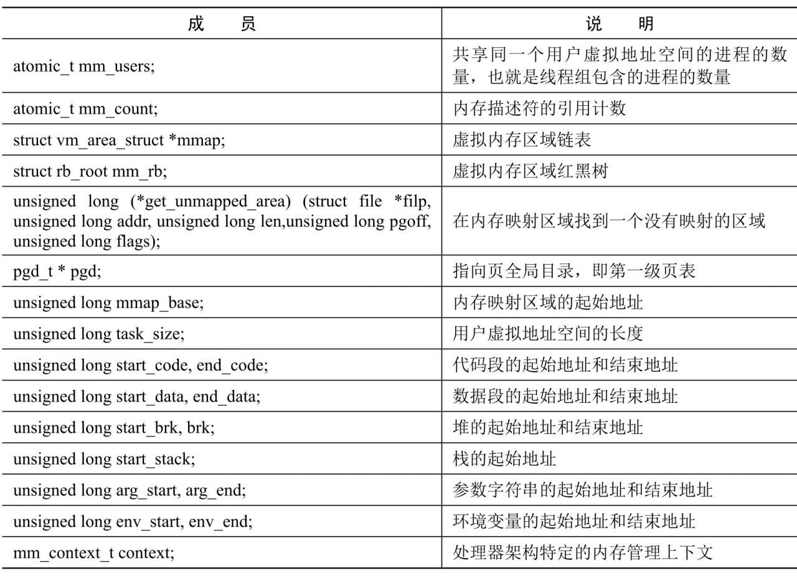
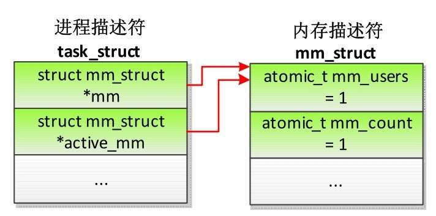
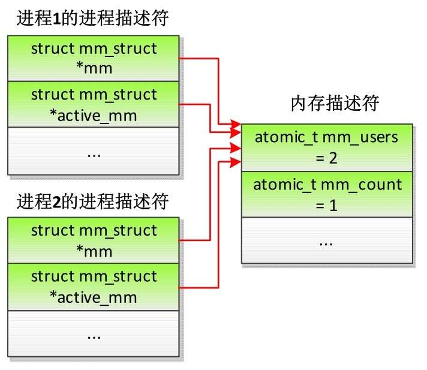
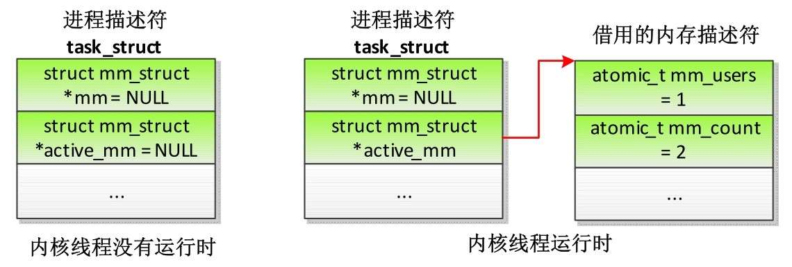
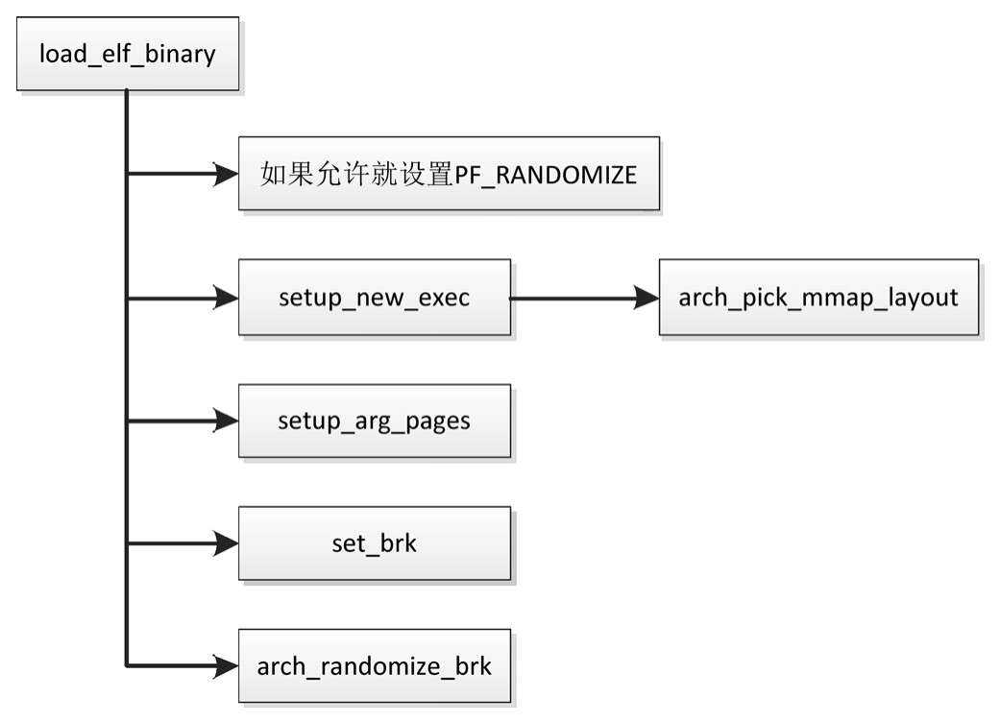

进程的用户虚拟地址空间的起始地址是0, 长度是TASK_SIZE, 由每种处理器架构定义自己的宏TASK_SIZE. ARM64架构定义的宏TASK_SIZE如下所示. 

(1) 32位用户空间程序: TASK_SIZE的值是TASK_SIZE_32, 即0x100000000, 等于4GB. 

(2) 64位用户空间程序: TASK_SIZE的值是TASK_SIZE_64, 即2VA_BITS字节, VA_BITS是编译内核时选择的虚拟地址位数. 

```cpp
// arch/arm64/include/asm/memory.h
#define VA_BITS          (CONFIG_ARM64_VA_BITS)
#define TASK_SIZE_64     (UL(1) << VA_BITS)
#ifdef CONFIG_COMPAT    /* 支持执行32位用户空间程序 */
#define TASK_SIZE_32     UL(0x100000000)
/* test_thread_flag(TIF_32BIT)判断用户空间程序是不是32位 */
#define TASK_SIZE       (test_thread_flag(TIF_32BIT) ? \
		TASK_SIZE_32 : TASK_SIZE_64)
#define TASK_SIZE_OF(tsk)  (test_tsk_thread_flag(tsk, TIF_32BIT) ? \
		TASK_SIZE_32 : TASK_SIZE_64)
#else
#define TASK_SIZE    TASK_SIZE_64
#endif /* CONFIG_COMPAT */
```

进程的用户虚拟地址空间包含以下区域. 

(1) 代码段、数据段和未初始化数据段. 

(2) 动态库的代码段、数据段和未初始化数据段. 

(3) 存放动态生成的数据的堆. 

(4) 存放局部变量和实现函数调用的栈. 

(5) 存放在栈底部的环境变量和参数字符串. 

(6) 把文件区间映射到虚拟地址空间的内存映射区域. 

内核使用内存描述符 mm_struct 描述进程的用户虚拟地址空间, 内存描述符的主要成员如表3.1所示. 

内存描述符的主要成员:



进程描述符(task_struct) 中和内存描述符相关的成员如表3.2所示. 

表3.2 进程描述符中和内存描述符相关的成员:


如果进程不属于线程组, 那么进程描述符和内存描述符的关系如图3.3所示, 进程描述符的成员mm和active_mm都指向同一个内存描述符, 内存描述符的成员mm_users是1、成员mm_count是1. 

图3.3 进程的进程描述符和内存描述符的关系



如果两个进程属于同一个线程组, 那么进程描述符和内存描述符的关系如图3.4所示, 每个进程的进程描述符的成员mm和active_mm都指向同一个内存描述符, 内存描述符的成员mm_users是2、成员mm_count是1. 

图3.4 线程组的进程描述符和内存描述符的关系



内核线程的进程描述符和内存描述符的关系如图3.5所示, 内核线程没有用户虚拟地址空间, 当内核线程没有运行的时候, 进程描述符的成员mm和active_mm都是空指针; 当内核线程运行的时候, 借用上一个进程的内存描述符, 在被借用进程的用户虚拟地址空间的上方运行, 进程描述符的成员active_mm指向借用的内存描述符, 假设被借用的内存描述符所属的进程不属于线程组, 那么内存描述符的成员mm_users不变, 仍然是1, 成员mm_count加1变成2. 

图3.5 内核线程的进程描述符和内存描述符的关系



为了使缓冲区溢出攻击更加困难, 内核支持为内存映射区域、栈和堆选择随机的起始地址. 进程是否使用虚拟地址空间随机化的功能, 由以下两个因素共同决定. 

(1) 进程描述符的成员personality(个性化) 是否设置ADDR_NO_RANDOMIZE. 

(2) 全局变量randomize_va_space:0表示关闭虚拟地址空间随机化, 1表示使内存映射区域和栈的起始地址随机化, 2表示使内存映射区域、栈和堆的起始地址随机化. 可以通过文件 “`/proc/sys/kernel/randomize_va_space`” 修改. 

```cpp
// mm/memory.c
int randomize_va_space __read_mostly =
#ifdef CONFIG_COMPAT_BRK
		1;
#else
		2;
#endif
```

为了使旧的应用程序(基于libc5) 正常运行, 默认打开配置宏CONFIG_COMPAT_BRK, 禁止堆随机化. 所以默认配置是使内存映射区域和栈的起始地址随机化. 

栈通常自顶向下增长, 当前只有惠普公司的PA-RISC处理器的栈是自底向上增长. 栈的起始地址是STACK_TOP, 默认启用栈随机化, 需要把起始地址减去一个随机值. STACK_TOP是每种处理器架构自定义的宏, ARM64架构定义的STACK_TOP如下所示: 如果是64位用户空间程序, STACK_TOP的值是TASK_SIZE_64; 如果是32位用户空间程序, STACK_TOP的值是异常向量的基准地址0xFFFF0000. 

```cpp
// arch/arm64/include/asm/processor.h
#define STACK_TOP_MAX         TASK_SIZE_64
#ifdef CONFIG_COMPAT  /* 支持执行32位用户空间程序 */
#define AARCH32_VECTORS_BASE  0xffff0000
#define STACK_TOP   (test_thread_flag(TIF_32BIT) ? \
		AARCH32_VECTORS_BASE : STACK_TOP_MAX)
#else
#define STACK_TOP    STACK_TOP_MAX
#endif /* CONFIG_COMPAT */
```

内存映射区域的起始地址是内存描述符的成员mmap_base. 如图3.6所示, 用户虚拟地址空间有两种布局, 区别是内存映射区域的起始位置和增长方向不同. 

图3.6 用户虚拟地址空间的两种布局:


(1) 传统布局: 内存映射区域自底向上增长, 起始地址是TASK_UNMAPPED_BASE, 每种处理器架构都要定义这个宏, ARM64架构定义为TASK_SIZE/4. 默认启用内存映射区域随机化, 需要把起始地址加上一个随机值. 传统布局的缺点是堆的最大长度受到限制, 在32位系统中影响比较大, 但是在64位系统中这不是问题. 

(2) 新布局: 内存映射区域自顶向下增长, 起始地址是(STACK_TOP − 栈的最大长度 − 间隙) . 默认启用内存映射区域随机化, 需要把起始地址减去一个随机值. 

当进程调用execve以装载ELF文件的时候, 函数load_elf_binary将会创建进程的用户虚拟地址空间. 函数load_elf_binary创建用户虚拟地址空间的过程如图3.7所示. 

图3.7 装载ELF文件时创建虚拟地址空间



如果没有给进程描述符的成员personality设置标志位ADDR_NO_RANDOMIZE(该标志位表示禁止虚拟地址空间随机化) , 并且全局变量randomize_va_space是非零值, 那么给进程设置标志PF_RANDOMIZE, 允许虚拟地址空间随机化. 

各种处理器架构自定义的函数 `arch_pick_mmap_layout` 负责选择内存映射区域的布局. ARM64架构定义的函数 `arch_pick_mmap_layout` 如下: 

```cpp
// arch/arm64/mm/mmap.c
1   void arch_pick_mmap_layout(struct mm_struct *mm)
2   {
3    unsigned long random_factor = 0UL;
4
5    if (current->flags & PF_RANDOMIZE)
6         random_factor = arch_mmap_rnd();
7
8    if (mmap_is_legacy()) {
9         mm->mmap_base = TASK_UNMAPPED_BASE + random_factor;
10        mm->get_unmapped_area = arch_get_unmapped_area;
11    } else {
12        mm->mmap_base = mmap_base(random_factor);
13        mm->get_unmapped_area = arch_get_unmapped_area_topdown;
14    }
15   }
16
17   static int mmap_is_legacy(void)
18   {
19    if (current->personality & ADDR_COMPAT_LAYOUT)
20         return 1;
21
22    if (rlimit(RLIMIT_STACK) == RLIM_INFINITY)
23         return 1;
24
25    return sysctl_legacy_va_layout;
26   }
```

第8～10行代码, 如果给进程描述符的成员personality设置标志位ADDR_COMPAT_LAYOUT表示使用传统的虚拟地址空间布局, 或者用户栈可以无限增长, 或者通过文件“/proc/sys/vm/legacy_va_layout”指定, 那么使用传统的自底向上增长的布局, 内存映射区域的起始地址是TASK_UNMAPPED_BASE加上随机值, 分配未映射区域的函数是arch_get_unmapped_area. 

第11～13行代码, 如果使用自顶向下增长的布局, 那么分配未映射区域的函数是arch_get_unmapped_area_topdown, 内存映射区域的起始地址的计算方法如下: 

```cpp
// arch/arm64/include/asm/elf.h
#ifdef CONFIG_COMPAT
#define STACK_RND_MASK         (test_thread_flag(TIF_32BIT) ? \
				0x7ff >> (PAGE_SHIFT - 12) : \
				0x3ffff >> (PAGE_SHIFT - 12))
#else
#define STACK_RND_MASK         (0x3ffff >> (PAGE_SHIFT - 12))
#endif
arch/arm64/mm/mmap.c
#define MIN_GAP (SZ_128M + ((STACK_RND_MASK << PAGE_SHIFT) + 1))
#define MAX_GAP (STACK_TOP/6*5)
static unsigned long mmap_base(unsigned long rnd)
{
	unsigned long gap = rlimit(RLIMIT_STACK);
	if (gap < MIN_GAP)
	gap = MIN_GAP;
	else if (gap > MAX_GAP)
	gap = MAX_GAP;
	return PAGE_ALIGN(STACK_TOP - gap - rnd);
}
```

先计算内存映射区域的起始地址和栈顶的间隙: 初始值取用户栈的最大长度, 限定不能小于“128MB + 栈的最大随机偏移值+ 1”, 确保用户栈最大可以达到128MB; 限定不能超过STACK_TOP的5/6. 内存映射区域的起始地址等于“STACK_TOP−间隙−随机值”, 然后向下对齐到页长度. 

回到函数load_elf_binary: 函数setup_arg_pages把栈顶设置为STACK_TOP减去随机值, 然后把环境变量和参数从临时栈移到最终的用户栈; 函数set_brk设置堆的起始地址, 如果启用堆随机化, 把堆的起始地址加上随机值. 

```cpp
// fs/binfmt_elf.c
static int load_elf_binary(struct linux_binprm *bprm)
{
	…
	retval = setup_arg_pages(bprm, randomize_stack_top(STACK_TOP),
			executable_stack);
	…
	retval = set_brk(elf_bss, elf_brk, bss_prot);
	…
	if ((current->flags & PF_RANDOMIZE) && (randomize_va_space > 1)) {
	current->mm->brk = current->mm->start_brk =
		arch_randomize_brk(current->mm);
	}
	…
}
```